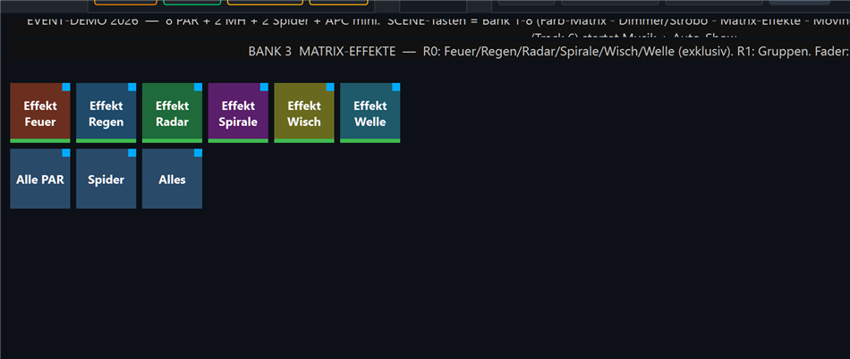
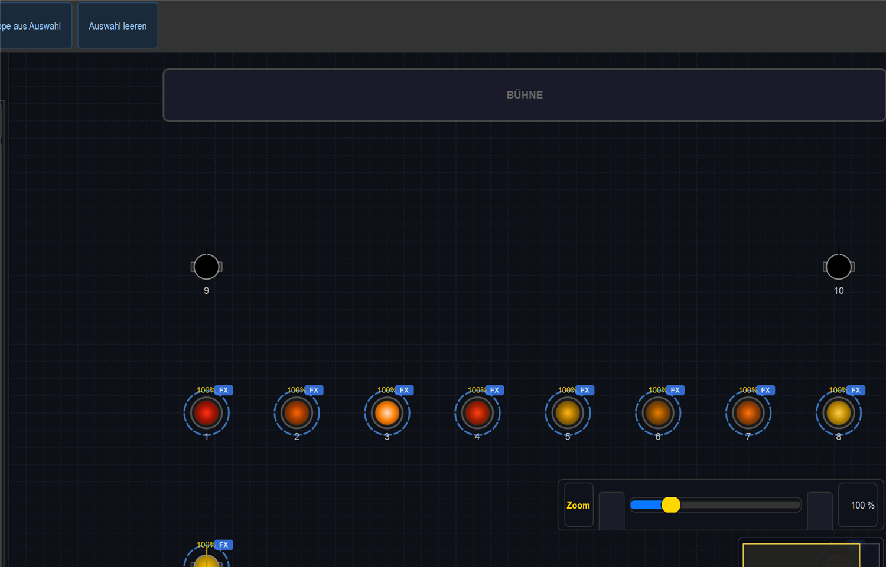

# Anleitung: Matrix-Effekte (Feuer · Regen · Radar · Spirale · Wisch · Welle)

> **Lernziel:** Die ausgefallenen **Matrix-Effekte** über die ganze Lichtreihe
> (8 PAR + 2 Spider) einsetzen — animierte Farb-Looks, die sich übers Raster bewegen.
>
> Show: `shows/Event_Demo_2026.lshow`, **Bank 3 „Matrix-Effekte"** (SCENE-Taste 3).

---

## Was sind Matrix-Effekte?

Eine RGB-Matrix legt die Geräte als **Raster** an und spielt einen Algorithmus darüber ab.
Diese Bank nutzt die „fancy" Algorithmen (im Gegensatz zu den ruhigen Farbverläufen in Bank 1).
Sie schreiben **nur Farbe** (`drive_intensity=False`) — die Grundhelligkeit kommt aus den
PAR-/Spider-Grundwerten, sodass die Effekte sofort sichtbar sind. Wirken auf **PAR + Spider**
(die Moving Heads haben kein RGB und bleiben hier unberührt).

## 1. Die sechs Effekte (Reihe 0, exklusiv)

| Taste | Look |
|---|---|
| **Effekt Feuer** | flackernder Flammen-Look (Rot→Gelb) |
| **Effekt Regen** | fallende Tropfen je Spalte (Cyan) |
| **Effekt Radar** | rotierender Radar-Strahl mit Schweif (Grün) |
| **Effekt Spirale** | rotierende Spirale (Magenta) |
| **Effekt Wisch** | Wisch-Balken hin und her (Weiß über Blau) |
| **Effekt Welle** | radiale Welle (Blau↔Weiß) |

**Exklusiv:** Es läuft immer nur ein Effekt — eine neue Taste löst die vorige ab.
„Effekt Feuer" z. B. färbt die PAR-Reihe live in rot-orangem Flackern:

## 2. Gruppen wählen (Reihe 1)

**Alle PAR · Spider · Alles** — selektiert die Zielgruppe (z. B. für die Programmer-Fader
oder um einen Effekt nur auf eine Gruppe wirken zu lassen).

## 3. Die Fader

| Fader | Funktion |
|---|---|
| **FX-Master** | Helligkeit/Intensität des laufenden Effekts |
| **FX-Speed** | Tempo des Effekts |
| **PAR-Dim** | Gruppen-Dimmer der PAR-Reihe |

---

## Tipps

- **Layern:** Lege über den Farb-Effekt zusätzlich eine **Dimmer-Matrix** aus Bank 2
  (Atmen/Welle/Blitz) — die wirkt nur auf die Helligkeit und mischt sauber dazu.
- **Tempo zur Musik:** Über **FX-Speed** von Hand, oder das globale Tempo in der
  Sektion **„BPM"** (`Strg+8`). In der Top-Bar gibt es dafür ein klickbares
  **BPM**-Feld (Klick = Wert eingeben) und daneben einen separaten **TAP**-Knopf
  (4× antippen). Für taktgenaue Synchronität siehe [Speed/BPM-Anleitung](../anleitung_speed_bpm/ANLEITUNG_SPEED_BPM.md).
- **Reset:** „Effekt" nochmal drücken schaltet ihn aus; **Stop All** stoppt alles.
