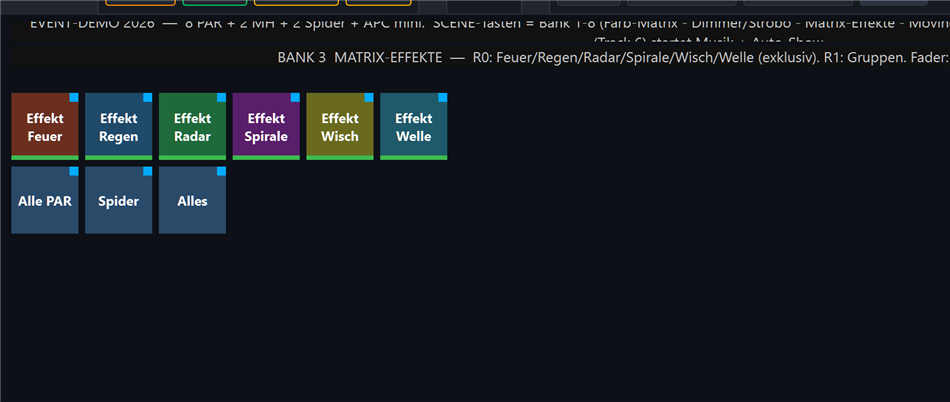
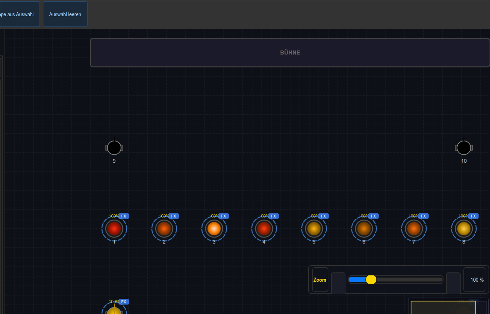

# Anleitung: Matrix-Effekte (Feuer · Regen · Radar · Spirale · Wisch · Welle)

> **Lernziel:** Die ausgefallenen **Matrix-Effekte** über die ganze Lichtreihe
> (8 PAR + 2 Spider) einsetzen — animierte Farb-Looks, die sich übers Raster bewegen.
>
> Show: `shows/Event_Demo_2026.lshow`, **Bank 3 „Matrix-Effekte"** (SCENE-Taste 3). Die Datei
> liegt nicht im Repo — sie entsteht mit `venv/bin/python tools/build_event_demo_2026.py`.

---

## Was sind Matrix-Effekte?

Eine RGB-Matrix legt die Geräte als **Raster** an und spielt einen Algorithmus darüber ab.
Diese Bank nutzt die „fancy" Algorithmen (im Gegensatz zu den ruhigen Farbverläufen in Bank 1).
Sie schreiben **nur Farbe** (`drive_intensity=False`) — die Grundhelligkeit kommt aus den
PAR-/Spider-Grundwerten, sodass die Effekte sofort sichtbar sind. Wirken auf **PAR + Spider**
(die Moving Heads haben kein RGB und bleiben hier unberührt).

## 1. Die sechs Effekte (Reihe 0, exklusiv)

| Taste | Look |
|---|---|
| **Effekt Feuer** | flackernder Flammen-Look (Rot→Gelb) |
| **Effekt Regen** | Cyan-Puls — auf der einreihigen Lichtreihe pulsen alle Geräte gleichzeitig; fallende Tropfen je Spalte gibt es erst bei mehreren Reihen |
| **Effekt Radar** | grüner Strahl — auf der einreihigen Lichtreihe überstreicht er abwechselnd linke und rechte Hälfte |
| **Effekt Spirale** | rotierende Spirale (Magenta) |
| **Effekt Wisch** | Wisch-Balken hin und her (Weiß über Blau) |
| **Effekt Welle** | radiale Welle (Blau↔Weiß) |

**Exklusiv:** Eine Effekt-Taste stoppt beim Einschalten **alle** laufenden Funktionen (auch
Farb- und Dimmer-Matrizen aus Bank 1/2, Bewegungen) und leert den Programmer — es läuft also
immer nur ein Effekt, die vorige Taste wird abgelöst.
„Effekt Feuer" z. B. färbt die PAR-Reihe live in rot-orangem Flackern:

## 2. Gruppen wählen (Reihe 1)

**Alle PAR · Spider · Alles** — wählt die Gruppe im Programmer aus (für manuelles
Programmieren, z. B. mit den Programmer-Fadern). Die Effekte dieser Bank wirken davon
unabhängig immer auf alle PAR + Spider.

## 3. Die Fader

| Fader | Funktion |
|---|---|
| **FX-Master** | Helligkeit/Intensität des zuletzt gestarteten Effekts |
| **FX-Speed** | Tempo des zuletzt gestarteten Effekts — wirkt nur, solange **keine BPM** läuft (Top-Bar „BPM: --"); „Effekt Feuer" flackert ohnehin unabhängig vom Tempo |
| **PAR-Dim** | Gruppen-Dimmer der PAR-Reihe |

---

## Tipps

- **Layern:** Lege über den Farb-Effekt zusätzlich eine **Dimmer-Matrix** aus Bank 2
  (Atmen/Welle/Blitz) — die wirkt nur auf die Helligkeit und mischt sauber dazu. Reihenfolge:
  **erst** den Effekt (Bank 3), **dann** die Dimmer-Matrix starten — umgekehrt stoppt die
  exklusive Effekt-Taste die Dimmer-Matrix wieder. FX-Master/FX-Speed wirken danach auf die
  zuletzt gestartete Funktion, also die Dimmer-Matrix.
- **Tempo zur Musik:** Die Effekte hängen am Tempo-Bus **Global**: Sobald eine BPM läuft,
  folgen sie ihr, und **FX-Speed** ist wirkungslos. Ohne BPM stellst du das Tempo über
  **FX-Speed** von Hand ein. Das globale Tempo steht in der
  Sektion **„BPM"** (`Strg+8`). In der Top-Bar gibt es dafür ein klickbares
  **BPM**-Feld (Klick = Wert eingeben) und daneben einen separaten **TAP**-Knopf
  (4× antippen). Für taktgenaue Synchronität siehe [Speed/BPM-Anleitung](../anleitung_speed_bpm/ANLEITUNG_SPEED_BPM.md).
- **Reset:** „Effekt" nochmal drücken schaltet ihn aus; **Stop All** stoppt alles.
