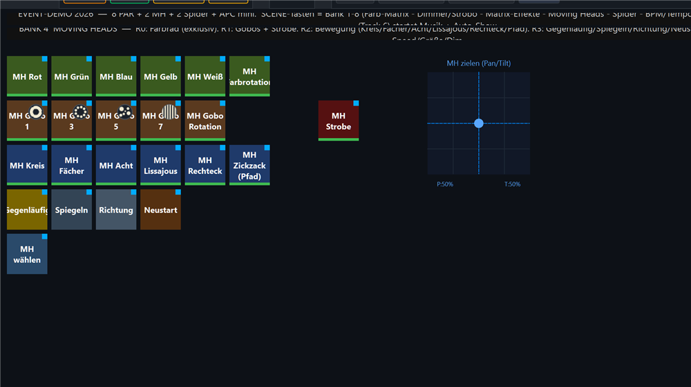
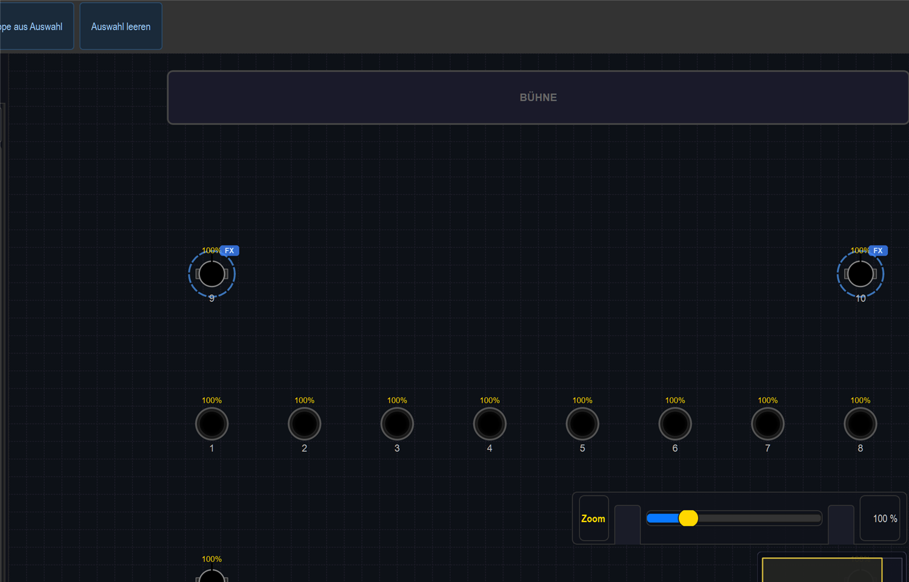

# Anleitung: Moving Heads steuern (Farbe · Gobo · Bewegung)

> **Lernziel:** Die beiden Moving Heads (U King **ZQ02001**, 11-Kanal) komplett über die
> Virtual Console steuern — **Farbrad**, **Gobo**, **Bewegung (EFX)**, **gezieltes Pan/Tilt**
> per XY-Pad und die **MH-Fader** (Tempo/Größe/Dimmer).
>
> Show: `shows/Event_Demo_2026.lshow`, **Bank 4 „Moving Heads"** (SCENE-Taste 4 am APC,
> bzw. Strg+Bild↓ bis „Moving Heads"). Rig: MH Links @ DMX 65, MH Rechts @ 76 — hinter
> PAR 1 und PAR 8.

> ⚠ **Wichtig zum ZQ02001:** Der Moving Head hat **kein RGB** — Farbe kommt über das
> **Farbrad** (feste Farb-Slots), nicht über Farb-Kacheln. Eine RGB-Matrix oder eine
> Farb-Kachel „auf alles" lässt den MH deshalb dunkel/unverändert. Für MH-Farbe immer die
> Farbrad-Tasten in Bank 4 nehmen.

---

## 1. Farbe (Reihe 0)

Die obere Tastenreihe setzt das **Farbrad** beider MH (exklusiv — immer nur eine Farbe):

| Taste | Wirkung (Farbrad-DMX) |
|---|---|
| **MH Rot / Grün / Blau / Gelb / Weiß** | feste Farb-Slots (14 / 24 / 34 / 44 / 4) |
| **MH Farbrotation** | Farbrad dreht langsam durch (Slot 150) |

Jede Farb-Taste öffnet außerdem den Shutter (offen) und setzt den Dimmer auf 255 — der MH
leuchtet also sofort. Exklusiv heißt: eine neue Farbe ersetzt die vorige.

## 2. Gobo (Reihe 1)

Die zweite Reihe legt ein **Gobo** auf (mit passender Farbe kombiniert):

| Taste | Gobo |
|---|---|
| **MH Gobo 1 / 3 / 5 / 7** | Ring · Kreis-aus-Kreisen · Punkte · Zebra (DMX 11 / 27 / 43 / 59) |
| **MH Gobo Rotation** | Gobo rotiert (DMX 190) |
| **MH Strobe** (rote Taste, Flash) | Blitz, solange gehalten |

> Gobos sind nur als scharfer Strahl im Nebel/an der Wand sichtbar — in der 2D-Live-View
> wird der MH nur als Strahl-Symbol gezeigt.

## 3. Bewegung / EFX (Reihe 2)

Die dritte Reihe startet **Bewegungs-Figuren** (Pan/Tilt-EFX) auf beiden MH. Sie laufen, bis
man sie wieder ausschaltet, und öffnen automatisch den Strahl (Dimmer 255 + Shutter offen):

| Taste | Figur |
|---|---|
| **MH Kreis** | Kreis, beide synchron |
| **MH Fächer** | Kreis gefächert + gegenläufig (Köpfe versetzt) |
| **MH Acht** | liegende Acht |
| **MH Lissajous** | Lissajous-Figur (x_freq 3 / y_freq 2) |
| **MH Rechteck** | rechteckige Bahn |
| **MH Zickzack (Pfad)** | selbst gezeichnete Custom-Path-Bahn |

In der Live View werden die MH dabei als **aktive Strahl-Symbole** mit Richtung gezeigt
(echte Schwenks am besten am Gerät oder im EFX-Editor-Preview ansehen):

## 4. Bewegung anpassen (Reihe 3)

Diese Tasten wirken **live** auf die gerade laufende MH-Bewegung:

| Taste | Wirkung |
|---|---|
| **Gegenläufig** | jeder 2. Kopf läuft die Figur rückwärts |
| **Spiegeln** | jeder 2. Kopf wird in Pan gespiegelt |
| **Richtung** | Laufrichtung umkehren |
| **Neustart** | Figur neu starten (Phase auf 0) |

## 5. Gezielt richten — XY-Pad

> **Tipp:** Die Taste **„MH wählen"** (links unten, Reihe 4) selektiert beide Moving Heads
> als Gruppe — praktisch direkt vor dem Zielen per XY-Pad oder vor dem Zugriff im Programmer.

Rechts liegt das **XY-Pad „MH zielen (Pan/Tilt)"**. Mit der Maus/dem Finger im Feld ziehen =
Pan (links/rechts) und Tilt (auf/ab) der MH direkt setzen (16-bit fein). Ideal, um die Köpfe
von Hand auf eine Stelle zu fahren, bevor/statt eine EFX-Figur läuft.

## 6. Die MH-Fader

| Fader | Funktion |
|---|---|
| **MH-Speed** | Tempo aller MH-Bewegungen (wirkt auf alle EFX dieser Bank) |
| **MH-Größe** | Größe der Figur (Pan/Tilt-Hub) |
| **MH-Dim** | Helligkeit der Gruppe „Moving Heads" (Gruppen-Dimmer) |

---

## Typischer Ablauf

1. **Farbe** wählen (Reihe 0) – z. B. „MH Blau".
2. Optional ein **Gobo** dazu (Reihe 1) – z. B. „MH Gobo 3".
3. Eine **Bewegung** starten (Reihe 2) – z. B. „MH Fächer".
4. Mit **MH-Speed / MH-Größe** das Tempo und die Auslenkung anpassen.
5. Mit **Gegenläufig / Spiegeln** die Optik variieren.
6. Zum Stillstellen die Bewegungs-Taste wieder ausschalten und ggf. per **XY-Pad** zielen.

> **Tempo-Sync:** Soll die MH-Bewegung **taktgenau zur Musik** laufen, siehe
> [Anleitung Speed/BPM/Tempo](../anleitung_speed_bpm/ANLEITUNG_SPEED_BPM.md) — dort gibt es
> in Bank 6 einen MH-Kreis, der fest auf **Tempo-Bus A** läuft.
