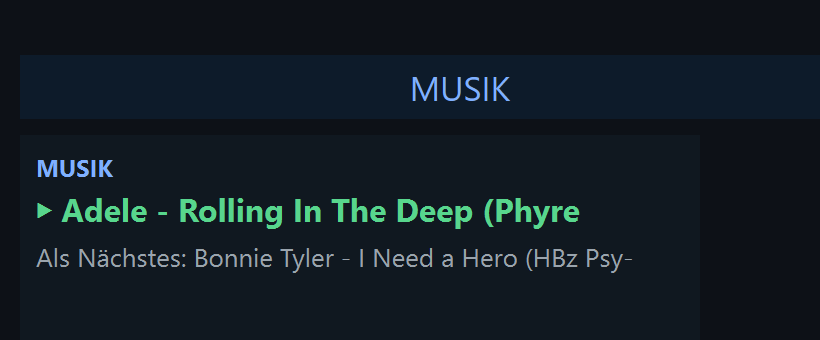
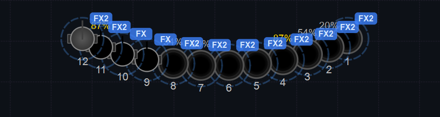

# Anleitung: Musik-Sync & automatische Live-Show

> Ziel: Die Lichtshow läuft **automatisch zur Musik** — beim **Play** startet die hinterlegte
> Auto-Show, das Tempo folgt der Musik (BPM-Erkennung), und in der Virtuellen Konsole zeigen
> Widgets **Now-Playing** und **BPM** an. Genutzt wird der interne Player + `music_autoshow`
> (alles vorhanden, kein Code).

---

> Navigation: Sektion **Eingabe / Ausgabe** (Strg+7) → Tab **„Musik"**. Den BPM-Takt stellst du in
> der eigenen Sektion **BPM** (Strg+8) ein.

## 1. Playlist laden

Im **Musik-Tab** (Sektion *Eingabe / Ausgabe* → Tab „Musik", bzw. das eigene Fenster *Musik-Fenster
(Now Playing)*) deine Titel hinzufügen — die Pfade werden **mit
der Show** gespeichert. Für die Hardstyle-Show liegen z. B. Hardstyle-/Frenchcore-/Bounce-Remixe
in der Playlist (Adele *Rolling In The Deep (Hardstyle)*, Bonnie Tyler *I Need a Hero*, Toto
*Africa (Frenchcore)* …).

> Wichtig: Es werden **absolute Dateipfade** gespeichert. Verschiebt man die mp3s, müssen die Pfade
> neu verknüpft werden.

## 2. Auto-Show zuweisen (`music_autoshow`)

Lege fest, **welche Funktionen** beim Abspielen automatisch starten. Im Musik-Tab gibt es dafür zwei
Bedienelemente:

- **Globaler Schalter** (Checkbox unten): **🎬 Lichtshow automatisch zur Musik starten** — startet
  beim ▶ die Auto-Show der Show und taktet sie zur BPM. Eine *globale* Funktions-IDs-Liste hat
  **keine** eigene Bedienoberfläche; ob die globale Auto-Show überhaupt läuft, steuert nur diese
  Checkbox.
- **Pro-Lied-Zuweisung** über den Button **„Auto-Show für Lied…"**: markiere zuerst einen Track in
  der Playlist, dann wählst du im Dialog die **Funktionen** an, die beim Abspielen *dieses* Lieds
  automatisch starten (in dieser Show z. B. *MH-Bewegung* + *Farb-Chase* + *Dimmer 2×* = der
  komplette Look). Der Button setzt die Funktions-IDs des markierten Tracks; in der Spalte
  **„Auto-Show"** der Tabelle steht dann z. B. *„3 Funktion(en)"*.
- Beides wird in der `.lshow` gespeichert und beim Laden übernommen.

  > 📷 *Screenshot folgt: Dialog „Auto-Show für Lied…" (Funktionen pro Lied zuweisen).*
  <!--  -->

## 3. Play → die Show startet von selbst

Drückst du **Play** (im Player **oder** über die **Media-Taste ▶/❙❙** in der VC, in dieser Show auf
der Bank „Strobe/Musik" — Bank-Namen sind show-spezifisch, in deiner Show können sie anders heißen),
passiert automatisch:
1. Die Musik beginnt — das **Now-Playing-Widget** wird grün (▶):

   

2. Die **Auto-Show startet** die zugewiesenen Funktionen — alle Geräte laufen los (Farb-Chase +
   Dimmer + Moving-Head-Bewegung; „FX2" = zwei Effekte je Gerät, die Helligkeits-% wandern):

   

3. Beim **Trackwechsel** läuft die Playlist selbsttätig weiter; die Auto-Show bleibt aktiv.

## 4. Tempo / BPM folgt der Musik

- In der **BPM**-Sektion (Strg+8) unter **Einstellungen** bei **BPM-Quelle** „Live-Audio" und als **Audio-Eingang**
  **PC-Audio (Player/Spotify)** wählen — dann erkennt LightOS das Tempo aus der laufenden Musik (den Modus setzt LightOS dabei automatisch auf AUTO)
  (im **Monitor** oben springt die große **BPM-Zahl** mit, z. B. ~150 BPM bei Hardstyle).
- Am **taktgenausten** läuft es über **OS2L (VirtualDJ)**: als Quelle **OS2L (VirtualDJ)** wählen
  und in VirtualDJ den OS2L-Versand aktivieren (in LightOS Menü *Ausgabe → OS2L-Server (Port 1234)*
  aktivieren) —
  dann liefert der DJ-Player den exakten Takt statt der Audio-Schätzung.
- Alternativ **MANUAL** mit **Tap-Tempo** (TAP), den **Nudge-Tasten** (±1/±5/±10) oder dem
  **BPM-Fader** in der VC.
- Alle **Beat-Effekte** (Farb-Chase, Dimmer …) folgen taktgenau. Über einen **Tempo-Bus** laufen
  gekoppelte Effekte relativ zueinander (z. B. der **Dimmer doppelt so schnell** wie der Farb-Chase,
  phasen-gekoppelt) — siehe Anleitung *Virtuelle Konsole* (Dimmer 2×).

## 5. Bedienen aus der Virtuellen Konsole

In dieser Show liegen auf der Bank **„Strobe/Musik"** die Media-Tasten **◄◄ / ▶❙❙ / ►►** und die
**MUSIK**-Anzeige; auf der Bank **„Tempo/BPM"** die **BPM-Anzeige** (live) plus
**TAP / AUTO-MAN / Musik-BPM / BPM ±** und die Fader **BPM** + **FX-Tempo**. *(Die Bank-Namen sind
show-spezifisch — in deiner eigenen Show können diese Widgets anders verteilt oder benannt sein.)*
So steuerst du Wiedergabe und Tempo komplett aus der VC (und per APC mini, s. *APC-Anleitung*).

---

**Kurz:** Playlist laden → globalen Schalter „Lichtshow automatisch zur Musik starten" setzen
(und/oder pro Lied über „Auto-Show für Lied…" Funktionen zuweisen) → **Play** startet Musik **und**
Show automatisch → BPM-Sektion auf **BPM-Quelle „Live-Audio" / Audio-Eingang PC-Audio (Player/Spotify)** (oder **OS2L (VirtualDJ)** für
exakten Takt) → die Effekte folgen taktgenau der Musik. Bedienung über die (show-spezifischen)
VC-Bänke *Strobe/Musik* + *Tempo/BPM* (optional APC mini).
