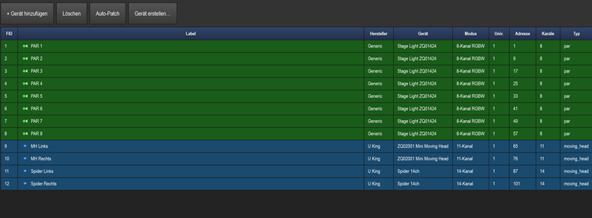
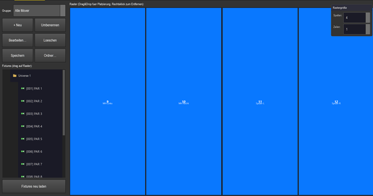

# Anleitung: Patchen & Fixture-Gruppen

> **Patchen** = jedes Gerät auf seine **DMX-Adresse** legen (damit LightOS weiß, welche Kanäle
> welches Gerät steuern). **Gruppen** fassen Geräte zusammen und legen über ein **Raster** ihre
> Reihenfolge fest — die Basis für Matrix-/EFX-Effekte (die folgen der Gruppen-Auswahl).

---

## 1. Geräte patchen

Sektion **Patchen** → Tab **Patch**. Mit **+ Gerät hinzufügen** öffnet sich der Dialog
*Gerät hinzufügen*: links das Profil im Baum wählen, rechts unter *Patch-Optionen* den
**Modus** (= Kanal-Layout), **Universe:** und die **DMX-Adresse:** setzen (unter dem Feld
schlägt LightOS automatisch den nächsten freien Bereich vor), dann **Hinzufügen**.

Mehrere gleiche Geräte auf einmal: Feld **Anzahl:** hochzählen und mit **Adress-Offset:**
den Abstand zwischen den Adressen festlegen (0 = dicht hintereinander). Reicht das Universe
nicht aus, rollt LightOS automatisch ins nächste.

Das Rig dieser Show (Universe 1):
- **PAR 1–8** — `Stage Light ZQ01424`, **8-Kanal RGBW**, Adressen **1 · 9 · 17 · 25 · 33 · 41 · 49 · 57**
- **MH Links / Rechts** — `ZQ02001 Mini Moving Head`, **11-Kanal**, Adressen **65 / 76**
- **Spider Links / Rechts** — `Spider 14ch`, **14-Kanal**, Adressen **87 / 101**

Hilfen:
- **Auto-Patch** vergibt automatisch fortlaufende, kollisionsfreie Adressen (mit Rückfrage/Undo).
- **Gerät erstellen…** baut ein eigenes Profil (Kanäle/Attribute), falls dein Gerät nicht in der
  Datenbank ist.
- **Löschen** entfernt die markierten Zeilen (mit Rückfrage). Doppelklick auf eine Zeile öffnet
  *Gerät bearbeiten* (Label, Modus, Universe, DMX-Adresse, bei Movern auch Pan/Tilt invertieren/tauschen).
- Die Leiste **„Belegte DMX-Kanäle — Universe:"** unten (mit der Universe-Auswahl direkt daneben)
  zeigt pro Universe als farbige Blöcke, welche Kanäle belegt sind. **Adresskonflikte** erkennst du
  direkt in der **Tabelle**: betroffene Zeilen werden rot eingefärbt und die FID mit **⚠** markiert;
  oben rechts zählt der Hinweis **„⚠ N Adresskonflikt(e)!"** mit.

## 2. Fixture-Gruppen anlegen

Tab **Fixture-Gruppen** → **+ Neu** → benennen (z. B. *Alle PAR*, *Farb-Matrix*, *Moving Heads*,
*Spider*, *Alle Mover*). Dann links unter *Fixtures (drag auf Raster):* die **Geräte auf das Raster
ziehen** (Drag&Drop); Rechtsklick entfernt eine Zelle, und ein platziertes Gerät lässt sich per
Drag auf eine andere Zelle verschieben oder tauschen. Über das schwebende Panel **Rastergröße**
oben rechts (Felder **Spalten:** und **Zeilen:**) bestimmst du die Anordnung.

**Wichtig — Speichern:** Geänderte Platzierungen und Rastergröße werden **nicht** automatisch
persistiert. Klick zum Sichern auf **Speichern** (LightOS bestätigt mit *„Gruppe … gespeichert."*).

Die weiteren Buttons über der Geräteliste:
- **+ Neu** — neue (leere) Gruppe anlegen · **Umbenennen** — Name der gewählten Gruppe ändern.
- **Bearbeiten…** — Mitglieder, Name und Reihenfolge über einen **touch-tauglichen Dialog ohne
  Drag&Drop** anpassen (gut am Touchscreen). · **Löschen** — Gruppe entfernen (mit Rückfrage).
- **Speichern** — aktuelles Raster sichern (siehe oben). · **Ordner…** — Gruppe einem
  (verschachtelten) Ordner zuordnen, z. B. *Front/Wash*.

Die Gruppen dieser Show:
- **Alle PAR (8)** · **PAR Links (1–4)** · **PAR Rechts (5–8)**
- **Moving Heads (2)** · **Spider (2)** · **Alle Mover (4)** (MH + Spider, für EFX)
- **Farb-Matrix (10)** — alle RGB(W)-Geräte (PAR + Spider), für den Farb-Chase.

## 3. Warum das Raster wichtig ist

Matrix- und EFX-Effekte **folgen der Gruppen-Auswahl**, und das **Raster bestimmt die
Reihenfolge/Position**: Ein Chase läuft genau in der Raster-Reihenfolge über die Geräte, eine
2D-Matrix nutzt Spalten×Zeilen als Fläche. Deshalb lohnt es sich, die Gruppen sauber anzulegen
(z. B. PAR-Reihe als 8×1, alle Mover als 4×1).

→ Weiter mit: [Farb-Matrix](../anleitung_farbmatrix/ANLEITUNG_FARBMATRIX.md) ·
[Dimmer-Matrix](../anleitung_dimmermatrix/ANLEITUNG_DIMMERMATRIX.md) ·
[EFX](../anleitung_efx/ANLEITUNG_EFX.md).

---

**Kurz:** Patchen → **+ Gerät hinzufügen** (Profil + Universe + DMX-Adresse) bzw. **Auto-Patch** →
Tab **Fixture-Gruppen** → **+ Neu** → Geräte aufs **Raster** ziehen (Spalten×Zeilen = Reihenfolge)
→ **Speichern**. Matrix/EFX folgen dann dieser Gruppe.
