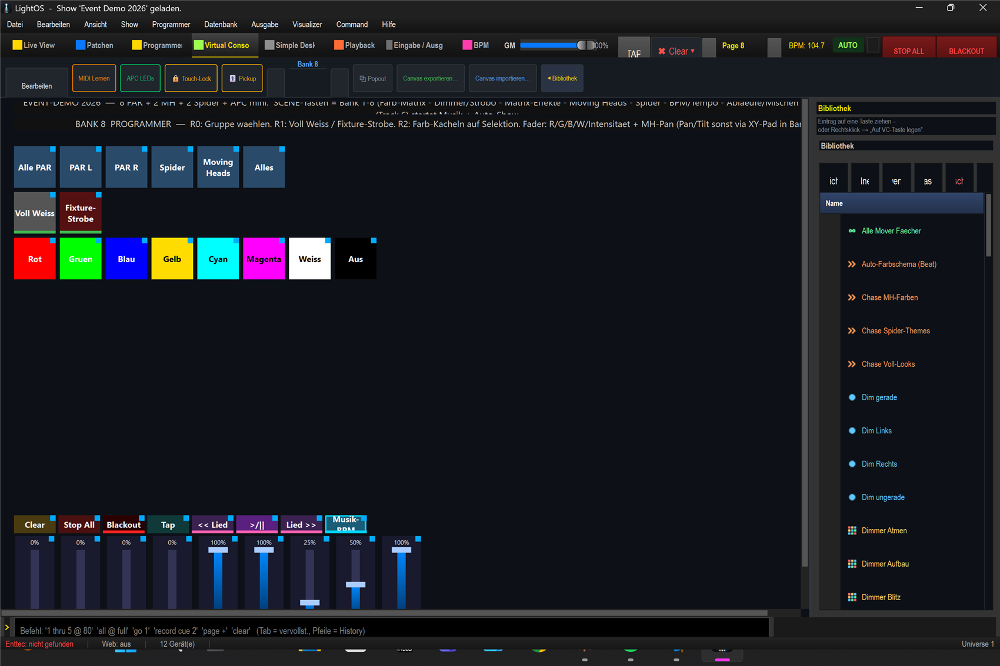

# Anleitung: Programmer (manuell mischen — RGBW · Gruppen · Pan)

> **Lernziel:** Farben und Werte **von Hand** setzen — per Farb-Kacheln oder RGBW-Fadern mischen.
> Das ist die „manuelle Mischpult"-Ebene neben den Effekten. (In dieser Bank wirken Kacheln und
> Fader auf **alle** Fixtures — siehe „Reichweite beachten" unten.)
>
> Show: `shows/Event_Demo_2026.lshow`, **Bank 8 „Programmer"** (SCENE-Taste 8).
>
> **Wichtig:** Gemeint ist die **vorgebaute VC-Bank** namens „Programmer" (die 8. Seite der
> Virtual Console dieser Show) — **nicht** die App-Sektion „Programmer" oben in der Reiter-Leiste.
>
> **Reichweite beachten:** In *dieser* Bank wirken die Fader **Rot/Grün/Blau/Weiß/Intensität**
> auf **alle gepatchten Fixtures** (Reichweite „Alle Geräte"), und die **Farb-Kacheln** fallen bei
> leerem Programmer ebenfalls auf **alle Fixtures** zurück. „Gruppe wählen" (Reihe 0) setzt nur die
> **Auswahl** und befüllt den Programmer **nicht** — die Farb-/RGBW-Bedienung trifft also **nicht**
> nur die Auswahl. Einzig **„MH Pan"** ist auf die Gruppe „Moving Heads" beschränkt.

---

## So funktioniert der Programmer

Die **Farb-Kacheln** und die **RGBW-/Intensitäts-Fader** dieser Bank wirken auf **alle gepatchten
Fixtures** (die Fader fest mit Reichweite „Alle Geräte", die Kacheln über den Programmer mit Rückfall
auf alle Fixtures, wenn der Programmer leer ist). „Gruppe wählen" (Reihe 0) setzt nur die **Auswahl**
für andere Werkzeuge und befüllt den Programmer **nicht** — die Bedienung hier trifft daher nicht nur
die gewählte Gruppe. Die einzige gruppen-gebundene Bedienung ist **„MH Pan"** (Gruppe „Moving Heads").
Der Programmer hat Vorrang vor den Grundwerten — was du hier setzt, „überschreibt" live.

## 1. Gruppe wählen (Reihe 0)

| Taste | Auswahl |
|---|---|
| **Alle PAR** | alle 8 PAR |
| **PAR L / PAR R** | linke / rechte vier PAR |
| **Spider** | beide Spider |
| **Moving Heads** | beide MH |
| **Alles** | alle 12 Geräte |

> Setzt nur die **Auswahl** (für andere Werkzeuge wie die App-Sektion „Programmer"). Die Farb-Kacheln
> und RGBW-/Intensitäts-Fader dieser Bank werden davon **nicht** eingegrenzt.

## 2. Schnell-Funktionen (Reihe 1)

| Taste | Wirkung |
|---|---|
| **Voll Weiß** | PAR + Spider auf Weiß/voll (Szene; Moving Heads bleiben außen vor) |
| **Fixture-Strobe** (rot, Flash) | geräteeigenes Strobe, solange gehalten |

## 3. Farb-Kacheln (Reihe 2)

**Rot · Grün · Blau · Gelb · Cyan · Magenta · Weiß · Aus** — setzen die Farbe (Ziel = die
Fixtures **im Programmer**; die „Gruppe wählen"-Auswahl grenzt sie **nicht** ein). Bei leerem
Programmer wirken sie auf **alle** Fixtures. „Aus" nimmt die Farbe wieder weg.

## 4. Die Fader

| Fader | Funktion |
|---|---|
| **Rot / Grün / Blau / Weiß** | RGBW-Mischung **aller** Fixtures (0–255 je Kanal; Reichweite „Alle Geräte") |
| **Intensität** | Helligkeit **aller** Fixtures (Fader-Beschriftung „Intensität"; Reichweite „Alle Geräte") |
| **MH Pan** | Pan der Gruppe „Moving Heads" (zum Schwenken von Hand; Tilt/Pan fein über das XY-Pad in Bank 4) |

---

## Typischer Ablauf

1. Farbe für **alle** Fixtures setzen – per **Farb-Kachel** (schnell) oder fein mit den **RGBW-Fadern**.
2. **Intensität** anpassen.
3. **MH Pan** schwenkt nur die Moving Heads (Tilt/Pan fein über das XY-Pad in Bank 4).

> **Hinweis – getrennte Hälften:** „linke Hälfte rot, rechte Hälfte blau" lässt sich mit den Fadern
> dieser Bank **nicht** von Hand bauen (sie wirken immer auf alle Fixtures). Nutze dafür die fertigen
> **Split-Szenen** der Show (z. B. „Grün links / Blau rechts", „Rot links / Weiß rechts") oder die
> App-Sektion **„Programmer"** in der Reiter-Leiste: dort eine Gruppe auswählen und gezielt nur die
> Auswahl einfärben.

> **Speichern als Look:** Was im Programmer steht, lässt sich als Szene/Snap in die Bibliothek
> übernehmen (Knopf **„Programmer → Szene"**). Geleert wird der Programmer über den Knopf
> **„✖ Clear ▾"** in der oberen Leiste (Lösch-Symbol ✖ + Aufklapp-Pfeil ▾). Ein Klick öffnet
> ein kleines Menü mit **„Programmer leeren (N)"**, **„Simple Desk leeren (N)"** und
> **„Alle Nicht-VC-Werte leeren (N)"** — die Zahl in Klammern zeigt jeweils die Anzahl aktiver
> Werte. Gelöscht werden nur die aktiven Werte, nie gespeicherte Daten.
