# Programmer-Grundlagen: Geräte wählen und von Hand einstellen

> **Worum geht's:** Im **Programmer** stellst du Licht von Hand ein. Du wählst
> Geräte aus, ziehst Helligkeit, Farbe und Position auf und siehst das Ergebnis
> sofort. Was hier steht, hat Vorrang vor laufenden Szenen und Cues, bis du es
> wieder löschst. Diese Seite erklärt die Bedienung Schritt für Schritt. Welche
> Knöpfe und Regler ein bestimmtes Gerät zusätzlich bekommt (Strobe, Programme,
> Mehrkopf, Nebel, Laser), steht in der Vertiefung
> [Programmer: jedes Gerät richtig bedienen](../anleitung_geraete_bedienen/ANLEITUNG_GERAETE_BEDIENEN.md).

Aus dem Programmer-Stand machst du danach Szenen, Snaps und Cues. Wie das geht,
steht in [Szenen, Snaps & Cue-Listen](../anleitung_szenen_cues/ANLEITUNG.md).

---

## Was du brauchst

- Eine Show mit gepatchten Geräten und ein paar Gruppen. Wie das geht, steht in
  [Patchen & Fixture-Gruppen](../anleitung_patch_gruppen/ANLEITUNG_PATCH_GRUPPEN.md).
- Die Bilder zeigen eine kleine Übungs-Show. Sie besteht nur aus den mitgelieferten
  Profilen des Herstellers **Generic**. Wer sie nachbauen will, patcht in
  **Patchen → Patch** mit **+ Gerät hinzufügen**:

  | Geräte | Profil (Generic) | Modus | Adressen |
  |---|---|---|---|
  | PAR 1–8 | LED PAR Dimmer+RGB 4ch | 4-Kanal Dimmer+RGB | 1, 5, 9 … 29 |
  | Wash 1–2 | Moving Head Wash RGB 7ch | 7-Kanal | 41, 48 |
  | Spot 1–2 | Moving Head Spot 8ch | 8-Kanal | 61, 69 |
  | LED-Leiste | LED Bar 12ch | 12-Kanal (4x RGB) | 81 |

  Dazu die Gruppen **Alle PAR**, **PAR links** (PAR 1–4), **PAR rechts** (PAR 5–8)
  und **Moving Heads** (Wash 1–2, Spot 1–2) unter **Patchen → Fixture-Gruppen**.
  Eine fertige Datei dieser Show liefert LightOS derzeit nicht mit. Mit deinen
  eigenen Geräten geht alles genauso.
- Ohne angeschlossenes Interface siehst du das Ergebnis in der **Lampen-Vorschau**
  unten im Programmer und in der Sektion **Bühne**.

---

## 1. Der Programmer auf einen Blick

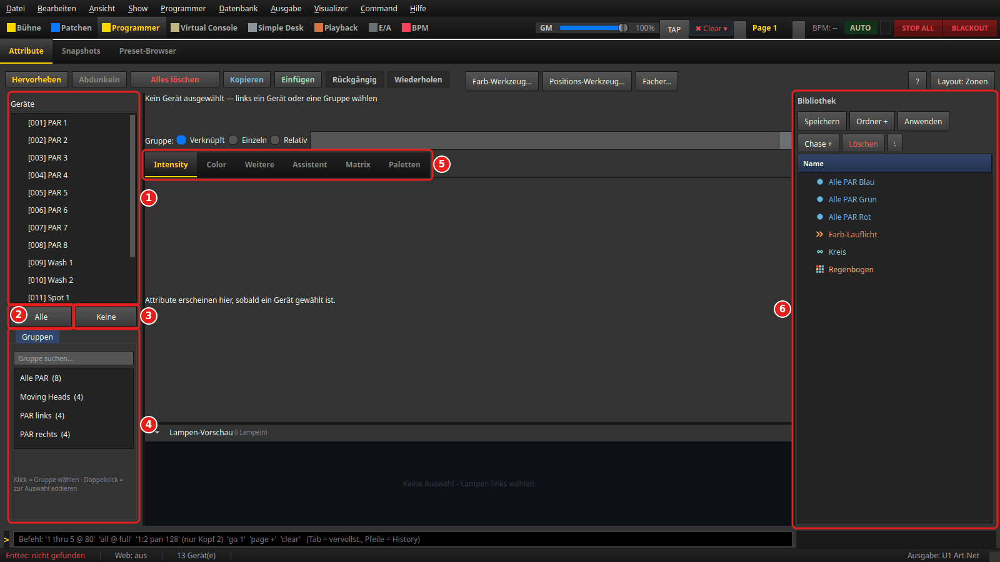

Oben in der Sektionsleiste auf **Programmer** klicken, dann auf den Reiter
**Attribute**. Das Fenster hat drei Spalten:

1. **Geräte**: alle gepatchten Geräte, `[001] PAR 1` usw.
2. **Alle**: wählt alle Geräte der Liste aus.
3. **Keine**: hebt die Auswahl auf.
4. **Gruppen**: deine Fixture-Gruppen, mit Suchfeld „Gruppe suchen…“.
5. **Die Reiterleiste** in der Mitte: Solange nichts gewählt ist, steht darüber
   „Kein Gerät ausgewählt — links ein Gerät oder eine Gruppe wählen“. Welche
   Reiter es gibt, hängt von der Auswahl ab (Schritt 6).
6. **Bibliothek** rechts: gespeicherte Snaps und Funktionen (Szenen, Chaser,
   Matrix, EFX). Dazu mehr in [Szenen, Snaps & Cue-Listen](../anleitung_szenen_cues/ANLEITUNG.md).

Darüber liegt die Werkzeugleiste mit **Hervorheben**, **Abdunkeln**, **Löschen**,
**Kopieren**, **Einfügen**, **Rückgängig**, **Wiederholen** und den drei Werkzeugen
**Farb-Werkzeug...**, **Positions-Werkzeug...** und **Fächer...**. Rechts oben
schaltet **Layout: Zonen** auf das klassische Layout um (dann heißt der Knopf
**Layout: Klassisch**). Mit **?** startest du den Hilfe-Modus: Der nächste Klick auf
einen Knopf zeigt dessen Erklärung, statt ihn auszulösen. **Esc** beendet ihn.

## 2. Geräte wählen: Liste und Gruppen

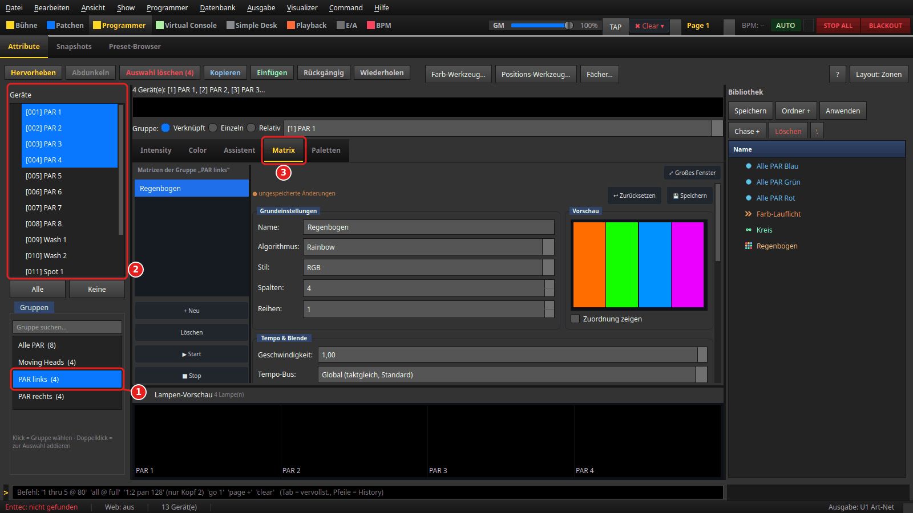

- **In der Liste** klickst du ein Gerät an. Mit **Strg** kommen weitere dazu, mit
  **Umschalt** ein ganzer Bereich. Geräte mit mehreren Köpfen haben einen Pfeil:
  Aufgeklappt kannst du einzelne Köpfe wählen.
- **Gruppe anklicken (1)**: Die Auswahl wird durch die Geräte der Gruppe ersetzt (2),
  in der Reihenfolge der Gruppe. Gleichzeitig springt der Programmer auf den
  Reiter **Matrix** (3) und zeigt die Matrizen dieser Gruppe. Für Farbe oder
  Helligkeit klickst du danach auf **Color** bzw. **Intensity**.
- **Gruppe doppelt anklicken**: Die Geräte der Gruppe kommen *zusätzlich* zur
  bisherigen Auswahl dazu. Der Hinweis unter der Liste sagt dasselbe: „Klick = Gruppe
  wählen · Doppelklick = zur Auswahl addieren“.

Die Reihenfolge der Auswahl ist später wichtig, zum Beispiel beim Fächer (Schritt 10).

## 3. Helligkeit: Reiter Intensity

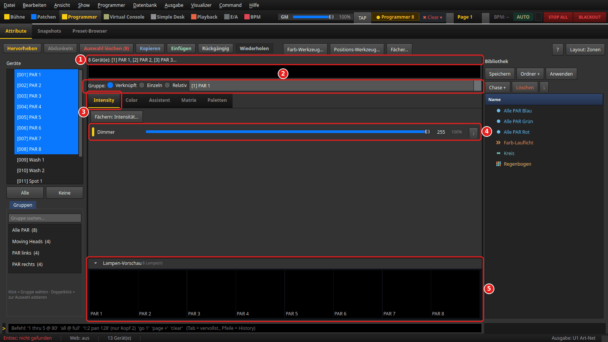

Wähle **Alle PAR**, dann den Reiter **Intensity**.

1. Die Zeile oben nennt die Auswahl, hier „8 Gerät(e): [1] PAR 1, [2] PAR 2 …“.
   Darunter zeigt ein Farbbalken die aktuelle Mischfarbe.
2. **Gruppe:** legt fest, wie ein Regler auf mehrere Geräte wirkt:
   - **Verknüpft**: Alle Geräte bekommen denselben Wert.
   - **Einzeln**: Nur das Gerät im Auswahlfeld rechts daneben ändert sich.
   - **Relativ**: Alle Werte verschieben sich um denselben Betrag, die Unterschiede
     zwischen den Geräten bleiben erhalten.
3. **Intensity**: der Reiter für Helligkeit (und Shutter/Strobe, falls das Gerät
   so einen Kanal hat).
4. **Dimmer**: Regler von 0 bis 255, daneben Wert und Prozent. Der kleine Knopf ganz
   rechts am Regler (Tooltip „Auf Standard zurücksetzen“) stellt den Standardwert des
   Profils her.
5. **Lampen-Vorschau**: eine Kachel je gewähltem Gerät in der Farbe, die es gerade
   ausgibt. Ein RGB-PAR mit vollem Dimmer, aber ohne Farbe bleibt hier dunkel wie
   das echte Gerät; nur Geräte ohne Farbkanal (reine Dimmer) leuchten weiß. Mit dem
   Pfeil klappst du sie ein und aus.

Sobald ein Wert im Programmer steht, zeigt die Kopfleiste ganz oben
„● Programmer *n*“: So viele Werte (Gerät × Kanal) hält der Programmer gerade, im
Bild 8 Dimmerwerte.

## 4. Farbe: Reiter Color

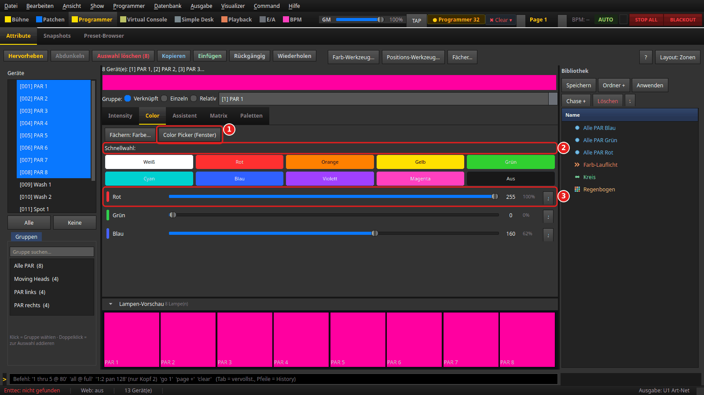

1. **Color Picker (Fenster)** öffnet den Farbwähler als eigenes, frei verschiebbares
   Fenster. Der Programmer bleibt daneben bedienbar.
2. **Schnellwahl**: Ein Klick auf **Weiß**, **Rot**, **Orange**, **Gelb**, **Grün**,
   **Cyan**, **Blau**, **Violett** oder **Magenta** setzt diese Farbe auf allen
   gewählten Geräten. **Aus** nimmt die Farbe weg (alle Farbkanäle auf 0).
3. **Rot**, **Grün**, **Blau**: ein Regler je Farbkanal. Weitere Kanäle wie Weiß,
   Amber oder UV erscheinen, wenn die Geräte sie haben.

**Fächern: Farbe...** (links neben 1) öffnet das Fächer-Werkzeug mit „Rot“ als
Voreinstellung (Schritt 10). Jeder Attribut-Reiter hat so einen Knopf.

## 5. Bewegung: Reiter Position

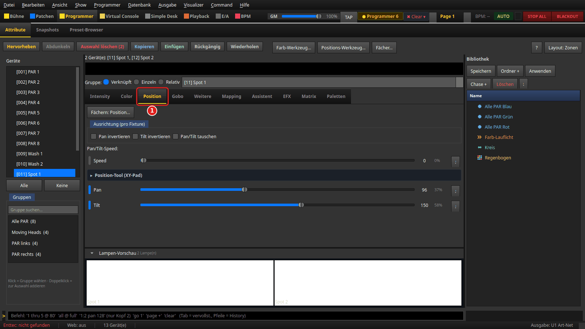

Den Reiter **Position (1)** gibt es nur, wenn die Auswahl Pan/Tilt hat, also bei
Moving Heads. Hier wählst du **Spot 1** und **Spot 2**. Im Reiter stehen:

- **Ausrichtung (pro Fixture)** mit **Pan invertieren**, **Tilt invertieren** und
  **Pan/Tilt tauschen**. Diese Haken ändern das Gerät im Patch, nicht den
  Programmer. Zurücknehmen lassen sie sich deshalb nur über **Bearbeiten →
  Rückgängig** (**Strg+Z**), nicht mit dem Knopf **Rückgängig** im Programmer.
- **Pan/Tilt-Speed:** mit dem Regler **Speed**, falls das Gerät so einen Kanal hat.
- **Position-Tool (XY-Pad)**: ein aufklappbares Pad zum Ziehen.
- Die Regler **Pan** und **Tilt**.

Mit Moving Heads in der Auswahl erscheinen außerdem die Reiter **Mapping** und
**EFX** (Bewegungseffekte, siehe [EFX](../anleitung_efx/ANLEITUNG_EFX.md)).

## 6. Die übrigen Reiter

Die Reiterleiste zeigt nur, was zur Auswahl passt. Ohne Auswahl stehen dort
**Intensity**, **Color**, **Weitere**, **Assistent**, **Matrix** und **Paletten**.

| Reiter | Wann sichtbar | Inhalt |
|---|---|---|
| **Intensity** | immer | Dimmer, Shutter/Strobe |
| **Color** | Auswahl hat Farbkanäle | Schnellwahl, Farbregler |
| **Position** | Auswahl hat Pan/Tilt | siehe Schritt 5 |
| **Gobo** | Auswahl hat ein Goborad | Gobo-Kacheln, Rotation |
| **Weitere** | Auswahl hat weitere Kanäle | Optik (Zoom, Fokus, Prisma, Iris), Effekt, Programme, alles Übrige |
| **Mapping** | Auswahl hat Pan/Tilt | eine Position auf andere Kanäle abbilden |
| **Assistent** | immer | Effekt-Assistent, **+ Szene**, **+ Chaser**, **Programmer → Szene**, Liste aller Funktionen mit **Start**/**Stop** |
| **EFX** | Auswahl hat Pan/Tilt | Bewegungseffekte |
| **Matrix** | immer | Farb- und Dimmer-Matrizen der Auswahl ([Matrix-Effekte](../anleitung_matrix_effekte/ANLEITUNG_MATRIX_EFFEKTE.md)) |
| **Laser** | Auswahl enthält einen Laser | siehe [Laser bedienen](../anleitung_laser/ANLEITUNG_LASER.md) |
| **Paletten** | immer | gespeicherte Farben, Positionen … zum Abrufen |

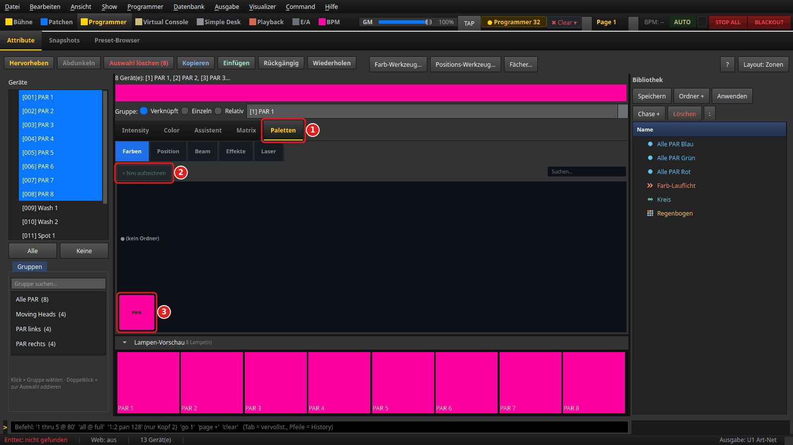

**Paletten (1)** sind gespeicherte Werte zum schnellen Abrufen, getrennt nach
**Farben**, **Position**, **Beam**, **Effekte** und **Laser**. So legst du eine an:

1. Geräte wählen und die gewünschte Farbe einstellen (hier Pink auf den PARs).
2. Im Unterreiter **Farben** auf **+ Neu aufzeichnen (2)** klicken und einen Namen
   eingeben.
3. Die Palette erscheint als Kachel **(3)**. Ein Klick darauf überträgt ihre Werte
   auf die aktuelle Auswahl. Ist nichts gewählt, passiert nichts außer dem Hinweis
   „Keine Geräte ausgewählt“. Rechtsklick auf die Kachel öffnet ein Menü mit
   **Anwenden**, **Überschreiben (Programmer)**, **In Ordner verschieben…** und
   **Löschen**.

Beim Aufzeichnen ohne Auswahl nimmt LightOS den ganzen Programmer-Inhalt.

Paletten werden mit der Show gespeichert.

## 7. Hervorheben und Abdunkeln

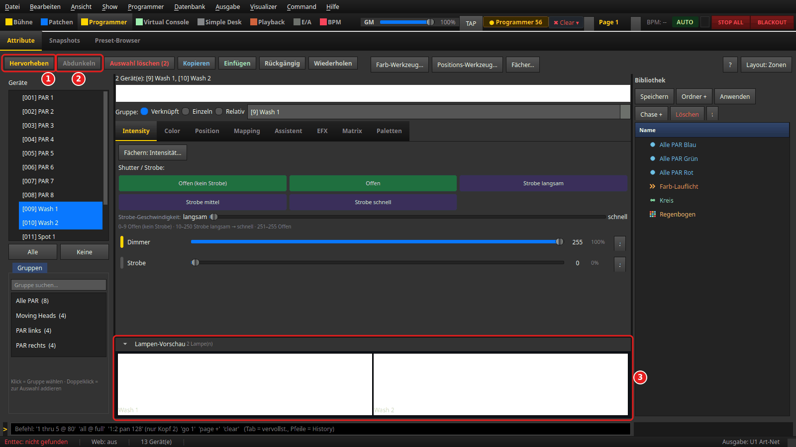

Damit findest du Geräte auf der Bühne wieder:

1. **Hervorheben** setzt die gewählten Geräte auf volle Helligkeit, Weiß und
   Pan/Tilt in die Mitte (Tastenkürzel **H**).
2. **Abdunkeln** dimmt alle *nicht* gewählten Geräte auf etwa 30 %
   (Tastenkürzel **Umschalt+H**).
3. In der **Lampen-Vorschau** leuchten die gewählten Wash-Lampen weiß.

Beide Knöpfe schreiben echte Werte in den Programmer — nicht nur vorübergehend. Die
bleiben stehen, bis du sie löschst (Schritt 11) oder **Rückgängig** drückst.
**Abdunkeln** betrifft dabei *alle anderen* Geräte: Zum Aufräumen erst **Keine** und
dann **Alles löschen** drücken.

## 8. Farb-Werkzeug

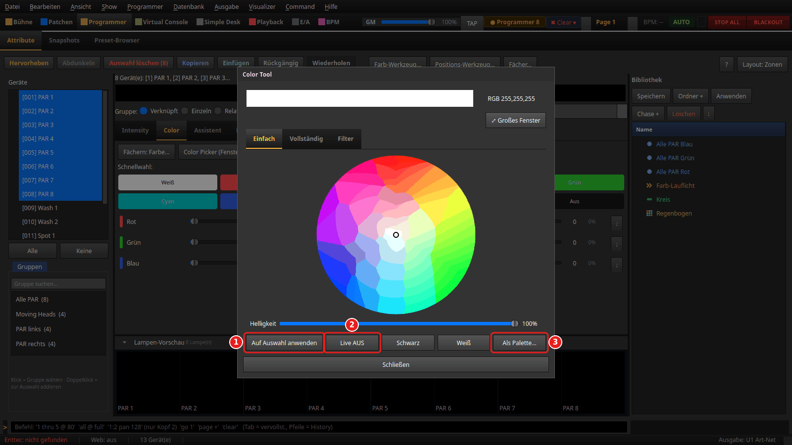

**Farb-Werkzeug...** öffnet das Fenster **Color Tool** mit drei Reitern:
**Einfach** (Farbkreis und **Helligkeit**), **Vollständig** (RGB, HSB, CMY, Weiß/UV/Amber)
und **Filter** (Lee/Rosco-Farbfilter zum Anklicken).

1. **Auf Auswahl anwenden** schreibt die eingestellte Farbe auf die gewählten Geräte.
2. **Live AUS** / **Live EIN**: Mit „Live EIN“ wirkt jede Änderung sofort.
3. **Als Palette…** speichert die Farbe als Farb-Palette (siehe Schritt 6).

**Schwarz** und **Weiß** stellen den Farbwähler auf diese Farben. **Schließen** beendet
das Fenster. Ist nichts gewählt, wirkt das Werkzeug nur auf Geräte, die schon Werte im
Programmer haben, nie auf die ganze Anlage.

## 9. Positions-Werkzeug

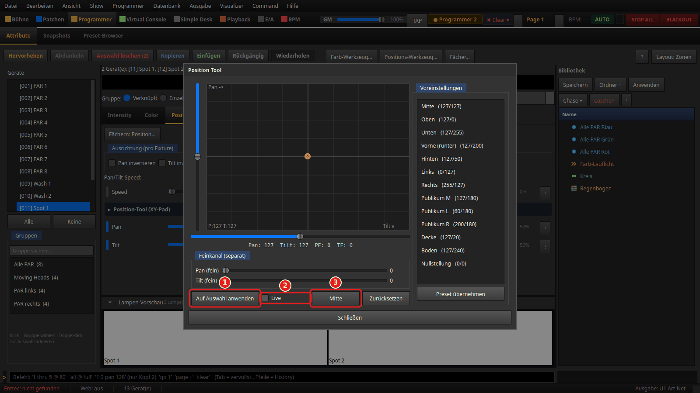

**Positions-Werkzeug...** öffnet das Fenster **Position Tool**: links ein Pad (Pan nach
rechts, Tilt nach unten), darunter die Regler **Pan (fein)** und **Tilt (fein)** für
die Feinkanäle, rechts **Voreinstellungen** wie „Mitte (127/127)“ oder „Publikum M“.

1. **Auf Auswahl anwenden** schreibt Pan, Tilt und die Feinwerte auf die Auswahl.
2. **Live**: Mit Haken wirkt jede Bewegung am Pad sofort.
3. **Mitte** setzt das Pad auf 127/127, **Zurücksetzen** auf 0/0. Ohne **Live** musst
   du danach noch **Auf Auswahl anwenden** drücken.

**Preset übernehmen** setzt die markierte Voreinstellung aufs Pad. Ist nichts
gewählt, nimmt das Werkzeug die Geräte, die schon Werte im Programmer haben, und
wenn es davon keine gibt, alle Geräte.

## 10. Fächer

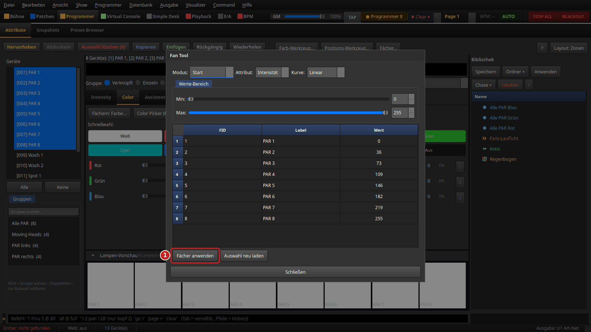

**Fächer...** verteilt einen Wert als Verlauf über die Auswahl, zum Beispiel eine
Helligkeitsrampe über acht PARs oder einen Pan-Fächer über Moving Heads.

- **Modus:** **Symmetrisch** (Mitte = Min, außen = Max), **Asymmetrisch**
  (Mitte = Max), **Start** (steigt vom ersten zum letzten Gerät), **Ende** (fällt).
- **Attribut:** z. B. **Intensität**, **Pan**, **Tilt**, **Rot**.
- **Kurve:** **Linear**, **Sinus**, **Rechteck**, **Dreieck**, **Exponential**.
- **Werte-Bereich** mit **Min:** und **Max:**.
- Die Tabelle zeigt vorab, welcher Wert auf welches Gerät kommt. Die Reihenfolge ist
  die Reihenfolge deiner Auswahl.

1. **Fächer anwenden** schreibt die Werte. **Auswahl neu laden** übernimmt eine
   inzwischen geänderte Auswahl.

## 11. Löschen, Rückgängig, Kopieren

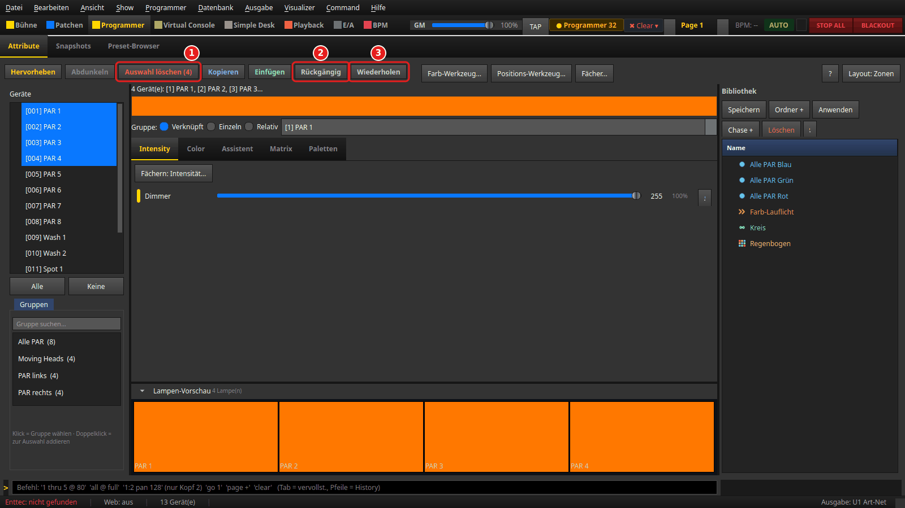

1. **Löschen** ändert seine Beschriftung mit der Auswahl:
   - **Auswahl löschen (4)**: Mit Auswahl leert der Knopf nur die Werte dieser vier
     Geräte. Die übrigen bleiben stehen.
   - **Alles löschen**: Ohne Auswahl leert er den ganzen Programmer.

   Gespeicherte Szenen, Cues und Snapshots bleiben in beiden Fällen unberührt.
   **Esc** leert immer den ganzen Programmer (Menü **Programmer → Programmer leeren**).
   Das Menü **✖ Clear ▾** oben in der Kopfleiste leert außerdem Simple-Desk-Werte.
2. **Rückgängig** und 3. **Wiederholen** haben einen **eigenen Programmer-Verlauf**.
   Darin steht jede Änderung an Programmer-Werten, egal woher sie kommt: Regler,
   Schnellwahl-Kachel, Palette, **Hervorheben**, **Abdunkeln**, **Einfügen**,
   **Löschen** oder die Befehlszeile. Ein Regler-Zug vom Drücken bis zum Loslassen ist
   **ein** Schritt, ebenso ein Knopfdruck, auch wenn er viele Geräte trifft.
   **Rückgängig** stellt den Stand vor diesem Schritt wieder her, **Wiederholen** holt
   ihn zurück. Beide Knöpfe sind nur aktiv, wenn es etwas zurückzunehmen bzw.
   wiederherzustellen gibt; der Tooltip nennt den Schritt.

   Änderungen am Patch und an den Geräte-Einstellungen, etwa die Ausrichtungs-Haken
   aus Schritt 5 (**Pan invertieren** …), stehen **nicht** in diesem Verlauf. Die nimmst
   du über **Bearbeiten → Rückgängig** (**Strg+Z**) zurück und über **Bearbeiten →
   Wiederherstellen** wieder her. **Neue Show** und **Show öffnen** leeren beide
   Verläufe.

**Kopieren** merkt sich die Programmer-Werte der gewählten Geräte, **Einfügen** legt
sie auf die aktuelle Auswahl. Bei mehreren Geräten geht das reihum: der erste kopierte
Wert auf das erste gewählte Gerät usw. (Tastenkürzel **Strg+C** / **Strg+V**).

---

## Wenn etwas nicht passt

| Beobachtung | Ursache | Was tun |
|---|---|---|
| Eine Szene oder Cue wirkt nicht | Der Programmer hat Vorrang und überdeckt sie | **Keine**, dann **Alles löschen** (oder **Esc**) |
| Nach dem Gruppenklick sind keine Regler zu sehen | Der Gruppenklick springt auf den Reiter **Matrix** | Reiter **Intensity** oder **Color** anklicken |
| Der Reiter **Position** fehlt | In der Auswahl ist kein Gerät mit Pan/Tilt | Moving Heads mitwählen |
| **Rückgängig** im Programmer nimmt einen **Pan invertieren**-Haken nicht zurück | Geräte- und Patch-Einstellungen stehen im Verlauf von **Bearbeiten**, nicht im Programmer-Verlauf | **Bearbeiten → Rückgängig** (**Strg+Z**) |
| Nach **Abdunkeln** bleiben andere Geräte dunkel | Die 30 % stehen im Programmer | **Keine**, dann **Alles löschen** |
| Ein Gerät zeigt Knöpfe, die hier nicht erklärt sind | Gerätespezifische Bedienelemente | [Programmer: jedes Gerät richtig bedienen](../anleitung_geraete_bedienen/ANLEITUNG_GERAETE_BEDIENEN.md) |

---

*Bilder: erzeugt mit `venv/bin/python tools/anleitungsbilder.py programmer_grundlagen`
aus der Übungs-Show oben (siehe [Anleitungsbilder aus dem Code erzeugen](../ANLEITUNGSBILDER.md)).*
