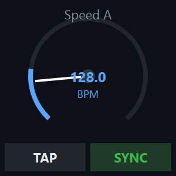
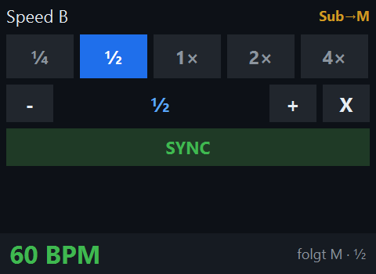
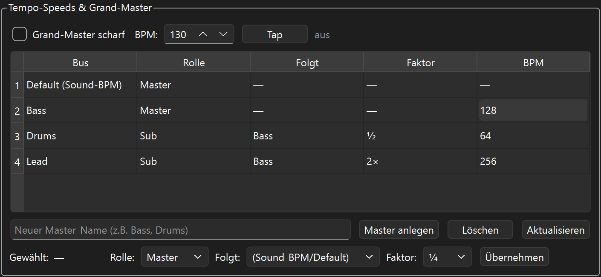
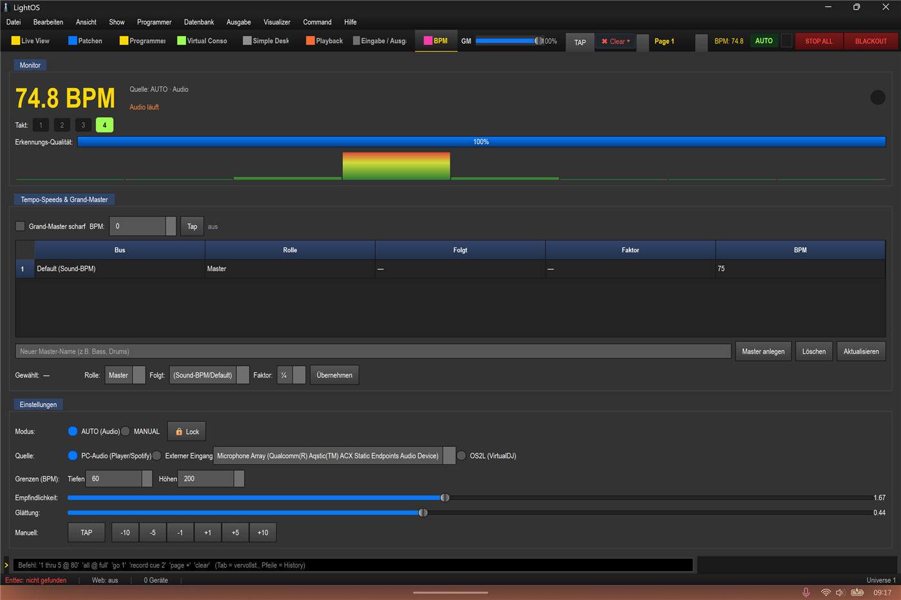

# Speed-Dial, Master/Sub & Grand-Master (bebildert)

Geschwindigkeit wie an einem großen Pult (QLC+-Stil): Tempo direkt aus der
**Virtuellen Konsole** regeln, mehrere Tempi **synchron** koppeln und bei Bedarf
alles mit einem **Grand-Master** übertrumpfen. Die gewohnte digitale BPM-Anzeige
bleibt erhalten.

> Kurzfassung & Hintergrund: [EFFEKTE.md, Abschnitt 9](../EFFEKTE.md) ·
> Tab-Übersicht: [ANLEITUNG.md, Abschnitt 8](../ANLEITUNG.md)

---

## 1. Die Idee: Master, Sub, Grand-Master

- **Master-Speed** — ein eigenständiges Tempo (per Tap, Zahlenfeld oder Audio).
- **Sub-Speed** — folgt einem Master, läuft **phasen-gekoppelt** mit, aber mit
  einem **Faktor**: `½` = halb so schnell, `×2` = doppelt so schnell. So bleibt
  alles im Verhältnis sauber zusammen (nie „aus dem Takt").
- **Grand-Master** — ein übergeordneter Schalter, der — wenn scharf — **alle**
  Master auf seinen Takt zwingt (Subs behalten ihr Verhältnis).

---

## 2. Der Speed-Dial in der Virtuellen Konsole

Einen **Speed-Dial** in die VC ziehen, in den Bearbeiten-Modus wechseln, per
Rechtsklick → **„Einstellungen..."** (der Dialog heißt **„Speed Dial
Einstellungen"**) das Ziel **„Speed-Knoten (Master/Sub)"** wählen. Je nach
Rolle sieht der Regler anders aus:

### Master (eigenes Tempo)

Rad + **Tap** setzen die eigene BPM; unten die digitale BPM-Anzeige.

### Sub (folgt einem Master × Faktor)

Das **Faktor-Gitter** `¼ ½ 1× 2× 4×` wählt das Verhältnis (aktiver Faktor blau),
`-` / `+` schrittweise, `X` zurück auf `1×`, **SYNC** setzt den Downbeat neu.
Die Anzeige zeigt die **abgeleitete** BPM („folgt Sound-BPM · ½").

Im Dialog **„Speed Dial Einstellungen"** einstellbar: **Speed-Rolle (Master/Sub)**,
der **Master, dem gefolgt wird** (Auswahl „Folgt Master"), das **Faktor-Set
(Sub)** und welche Teile sichtbar sind (Rad / Tap / Faktor-Gitter / Sync /
BPM-Anzeige — das entspricht dem „Erscheinungsbild" in QLC+).

---

## 3. Mehrere Tempo-Master + Grand-Master verwalten (BPM-Tab, Strg+8)

Im **BPM**-Tab gibt es das Panel **„Tempo-Speeds & Grand-Master"**:

- **Grand-Master-Zeile** (oben): **scharf** schalten, **BPM** setzen, **Tap** —
  der Status rechts zeigt `aus` / `scharf`.
- **Bus-Tabelle:** zeigt alle Speeds (Default/Sound-BPM zuerst) mit
  **Rolle / Folgt / Faktor / BPM**. Im Bild: `Bass` (Master 128),
  `Drums` (Sub von Bass, `½` → 64), `Lead` (Sub von Bass, `×2` → 256).
- **Master anlegen / Löschen / Aktualisieren** (Name eingeben → „Master
  anlegen"). Es lassen sich beliebig viele Tap-Master anlegen.
- **Editor-Zeile:** den gewählten Bus auf **Master/Sub** stellen, den **Master,
  dem gefolgt wird**, und den **Faktor** wählen → **Übernehmen**.

So läuft es live im Programm (der Default-Bus folgt hier dem Sound):

> Der Grand-Master-Zustand wird in der Show gespeichert — eine neu geladene Show
> kommt nie versehentlich „scharf" hoch.

---

## 4. Mehrere Effekte auf einen Speed koppeln

Effekte einfach **auf den Speed-Dial ziehen**:

- **Erster Effekt auf einen leeren Speed-Dial** → der Regler wird **direkt**
  daran gebunden (keine Rückfrage, keine Karte).
- **Weiterer Effekt auf einen bereits belegten Dial** → es erscheint die
  Konflikt-Karte **„Regler ist schon belegt"** mit drei klaren Wegen:
  - **Ersetzen** — der Regler steuert dann **nur noch** den neuen Effekt.
  - **Dazu koppeln** — beide Effekte hängen am **selben Regler** (eine Gruppe,
    **ein gemeinsames Tempo**). So koppelt man mehrere Effekte an EINEN Speed.
  - **Neues Widget daneben** — lässt den Regler in Ruhe und legt ein eigenes
    Bedien-Element daneben an.

  

Im Dialog **„Speed Dial Einstellungen"** lässt sich unter **„Gekoppelte
Effekte"** je Effekt wählen, **welcher Parameter** gesteuert wird (wie die
„Funktionen"-Tabelle in QLC+).

---

## 5. Typische Rezepte

| Ziel | Vorgehen |
|------|----------|
| Zwei Matrizen exakt im Verhältnis 1:2 | Farb-Matrix = **Master**, Dimmer-Matrix = **Sub ×2** |
| Alles kurz auf einen festen Takt zwingen | **Grand-Master** scharf + Tap/BPM |
| Eigener Tap-Takt nur für die Strobes | neuen **Master** „Strobe" anlegen, Strobe-Effekte auf dessen Speed-Dial |
| Sub wieder eigenständig machen | Editor-Zeile → Rolle **Master** → Übernehmen |

---

### Siehe auch
- [EFFEKTE.md](../EFFEKTE.md) – Effekte + Geschwindigkeit (Abschnitt 9)
- [ANLEITUNG.md](../ANLEITUNG.md) – Oberfläche, BPM-Tab (Abschnitt 8)
- [Übersicht bebilderte Anleitungen](../ANLEITUNGEN.md)
