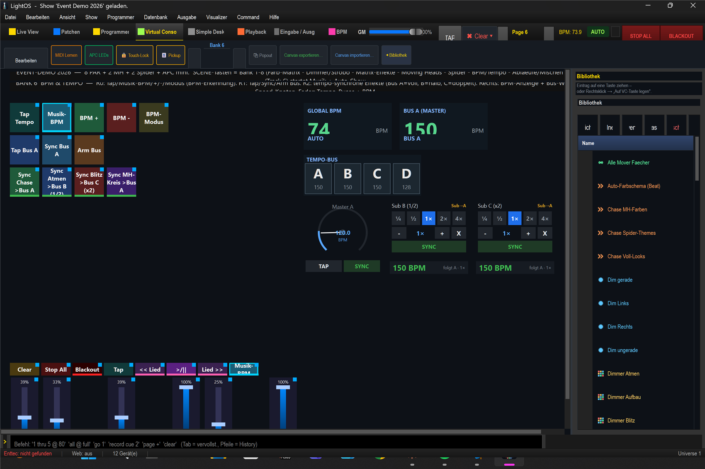

# Anleitung: Tempo steuern — Speed · BPM · Master/Sub · Tempo-Buses

> **Lernziel:** Alles rund ums **Tempo** verstehen und bedienen — den globalen
> **Speed-Fader**, die **BPM-Erkennung** (Tap/Musik/Nudge), die **Tempo-Buses A–D**,
> die **Master/Sub-Geschwindigkeiten** (ein Master-Takt, abgeleitete Sub-Tempi) und wie
> **mehrere Effekte auf derselben BPM** laufen.
>
> Show: `shows/Event_Demo_2026.lshow`, **Bank 6 „BPM & Tempo"** (SCENE-Taste 6).



---

## Das 3-Ebenen-Tempo-Modell (kurz)

```
  Grand-Master-Takt  ─►  Master-Bus (A, D…)  ─►  Sub-Bus (B=½, C=×2 …)  ─►  Effekt
        (BPM)               (eigene BPM)          (Parent × Faktor)
```

- **Grand-Master**: ein übergeordneter Takt, der (wenn „scharf") alle Master-Buses treibt.
- **Master-Bus**: hat eine eigene BPM (Tap/Sync/Zahl).
- **Sub-Bus**: hat **keine** eigene BPM — er folgt seinem Parent-Master **× Faktor**
  (¼ ½ 1 2 4). In dieser Show: **Bus B = ½ × A**, **Bus C = 2 × A**.
- Jeder **Effekt** kann an einen Bus gebunden werden (`Tempo-Bus`-Feld) → läuft dann
  exakt im Bus-Takt, phasensynchron mit allen anderen Effekten am selben Bus.

Daneben gibt es den **globalen Speed-Fader** (im **Alle-Banks-Frame** der Virtual Console,
also immer sichtbar): er skaliert schlicht das Tempo **aller** laufenden zeitbasierten
Effekte — unabhängig von den Buses. Der Modus heißt im Editor **„Speed (alle Effekte)"**
und ist stufenlos (0,1×…4×); das Faktor-Gitter (¼ ½ 1 2 4) gehört dagegen zum
SpeedDial bzw. zum Sub-Bus.

---

## 1. BPM-Erkennung & -Eingabe (Reihe 0)

| Taste | Funktion |
|---|---|
| **Tap Tempo** | mehrfach im Takt tippen → BPM wird aus dem Mittel der Schläge berechnet |
| **Musik-BPM** | BPM-Erkennung aus dem Audio-Eingang an/aus (Auto-Modus) |
| **BPM +** / **BPM -** | BPM um 1 nach oben/unten nudgen (Feinkorrektur) |
| **BPM-Modus** | zwischen AUTO (Audio) und MANUAL umschalten |

Die aktuelle globale BPM steht rechts oben in der Anzeige **„GLOBAL BPM"**.

## 2. Tempo-Buses bedienen (Reihe 1)

| Taste | Funktion |
|---|---|
| **Tap Bus A** | Tap-Tempo **nur** für Bus A |
| **Sync Bus A** | Bus A auf den nächsten Downbeat re-synchronisieren |
| **Arm Bus** | einen Bus „scharf" schalten (der dann von tempo-losen Reglern als Ziel genutzt wird) |

Rechts daneben:
- **Bus-Wähler (A B C D)** — Chips, um den aktiven/scharfen Bus zu wählen (`VCBusSelector`).
- **BPM-Anzeige „BUS A (Master)"** — zeigt live die BPM von Bus A (hier 150).

## 3. Master/Sub-Geschwindigkeiten (Speed-Knoten, rechts)

Drei **Speed-Dials** zeigen die Hierarchie direkt:

| Dial | Rolle |
|---|---|
| **Master A** | Master-Knoten auf Bus A — zeigt ein Dreh-Rad mit eigener BPM und Tap (keine Faktor-Tasten) |
| **Sub B (½)** | Sub-Knoten, Parent = A, läuft mit **halbem** Tempo |
| **Sub C (×2)** | Sub-Knoten, Parent = A, läuft mit **doppeltem** Tempo |

Drehst du **Master A**, ziehen **B und C automatisch mit** (halb bzw. doppelt) — das ist das
Master/Sub-Prinzip. Das Faktor-Gitter (¼ ½ 1 2 4) sitzt nur an den **Sub-Dials (B/C)**; dort
schaltest du das Verhältnis zum Master um.

## 4. Mehrere Effekte auf einer BPM (Reihe 2)

Diese vier Tasten starten Effekte, die **fest an einen Bus gebunden** sind — so siehst/hörst
du die Synchronität sofort:

| Taste | Effekt | Bus |
|---|---|---|
| **Sync Chase >Bus A** | Farb-Lauflicht | Bus A (voll) |
| **Sync Atmen >Bus B (1/2)** | Dimmer-Puls | Bus B (½ → halb so schnell) |
| **Sync Blitz >Bus C (x2)** | Strobe | Bus C (×2 → doppelt so schnell) |
| **Sync MH-Kreis >Bus A** | MH-Bewegung | Bus A (voll) |

> Die Tastennamen tragen den Bus-Suffix (z. B. **„>Bus A"**), damit du die Bindung direkt
> auf der Taste siehst.

Starte mehrere davon gleichzeitig: alle laufen **im selben Grund-Takt**, B halb, C doppelt —
und bleiben phasensynchron. Änderst du Bus A (Tap/Fader), folgen alle.

> **Eigene Effekte an einen Bus hängen:** Effekt aus der Bibliothek auf die VC **ziehen** und
> in der Drop-Karte den Aspekt **„Tempo-Bus zuweisen…"** ankreuzen — **oder** per **Rechtsklick**
> auf ein schon gebundenes Widget → **„⚡ Live-Parameter…"** das Feld **„Tempo-Bus"** auf den
> gewünschten Bus (z. B. A) stellen. (Ein eigenes „Tempo-Bus"-Feld im EFX-/Matrix-Editor gibt
> es nicht.) Den Bus selbst regelst du per VC-Fader im Modus **„Tempo-Bus (BPM)"** (siehe
> [VC-Workflow-Anleitung](../anleitung_vc_workflow/ANLEITUNG_VC_WORKFLOW.md), Abschnitt 6).

## 5. Die Tempo-Fader & der Alle-Banks-Frame

In **Bank 6** liegen die bank-eigenen Tempo-Fader:

| Fader | Funktion |
|---|---|
| **Tempo Bus A** | regelt die BPM von Bus A (Modus „Tempo-Bus (BPM)") |
| **Tempo Bus D** | regelt Bus D (zweiter freier Master, hier 128 BPM) |
| **BPM global** | regelt die globale Leader-BPM |

Darunter liegen die **immer sichtbaren** Fader des **Alle-Banks-Frames** (sie bleiben in
jeder Bank stehen):

| Fader | Funktion |
|---|---|
| **Speed** | skaliert **alle** laufenden Effekte direkt — stufenlos (0,1×…4×) |
| **Dimmer** | Submaster (Gesamthelligkeit) |
| **Master** | Grand-Master (Gesamthelligkeit, Override) |

> Den globalen Takt steuerst du außerdem oben in der **Section-Bar**: der **GM**-Regler
> (Grand-Master), die **TAP**-Taste und die **BPM**-Anzeige sitzen dort und sind immer
> erreichbar.

---

## Typische Abläufe

**A) Auf die Musik einrasten (ohne Audio-Erkennung):**
1. „BPM-Modus" auf MANUAL.
2. Im Takt auf **Tap Tempo** tippen → globale BPM steht.
3. Bus-gebundene Effekte starten (Reihe 2) – sie laufen jetzt im getappten Takt.

**B) Master/Sub vorführen:**
1. „Sync Chase >Bus A", „Sync Atmen >Bus B (1/2)", „Sync Blitz >Bus C (x2)" gleichzeitig starten.
2. **Master A**-Dial drehen → Chase folgt 1:1, Atmen halb, Blitz doppelt — alles im Lock.

**C) Schnell global beschleunigen:**
- Einfach den **Speed-Fader** (im Alle-Banks-Frame) hochziehen → alle Effekte werden schneller, egal welcher Bus.

> **Hinweis Audio-BPM:** Die echte Audio-Erkennung braucht ein anliegendes Eingangssignal.
> Beim ▶ im Musik-Player wird die BPM des Tracks automatisch als Takt übernommen.
