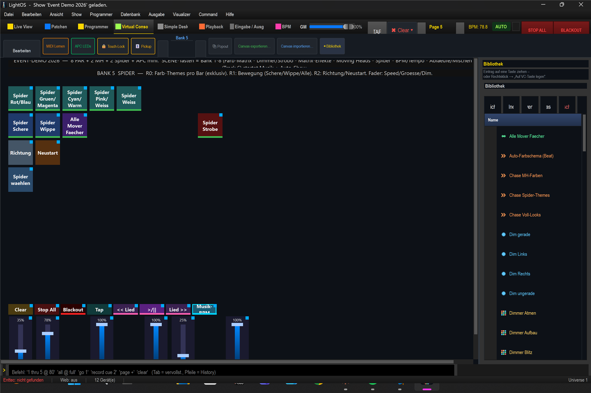

# Anleitung: Spider steuern (Farb-Themes · Tilt-Bewegung)

> **Lernziel:** Die beiden Spider (U King **SPIDER14**, 14-Kanal) bedienen — **Farb-Themes
> pro Bar**, **Tilt-Bewegung (Scheren/Wippe)** und die Spider-Fader.
>
> Show: `shows/Event_Demo_2026.lshow`, **Bank 5 „Spider"** (SCENE-Taste 5). Rig: Spider Links
> @ DMX 87, Spider Rechts @ 101 — vorne vor PAR 1 und PAR 8.

> **Zum SPIDER14:** Jeder Spider hat **zwei LED-Leisten** (Bar Links = Bank 1, Bar Rechts =
> Bank 2, je eigenes RGBW) und **zwei Tilt-Motoren** (die Leisten schwenken zu-/voneinander
> weg). Kein Pan. „Bewegung" heißt hier also die Scheren-/Wipp-Bewegung der zwei Bars.

---

## 1. Farb-Themes (Reihe 0)

Ein **Theme** färbt die linke und rechte Bar **unterschiedlich** (exklusiv):

| Taste | Bar Links | Bar Rechts |
|---|---|---|
| **Spider Rot/Blau** | Rot | Blau |
| **Spider Grün/Magenta** | Grün | Magenta |
| **Spider Cyan/Warm** | Cyan | Warmamber |
| **Spider Pink/Weiß** | Pink | Weiß |
| **Spider Weiß** | Weiß | Weiß |

Jedes Theme öffnet den Shutter (Wert 8 = offen) und setzt den Dimmer — die Spider leuchten
sofort. Die zweifarbigen Themes geben den klassischen „Spider-Flower"-Look.

## 2. Bewegung (Reihe 1)

| Taste | Wirkung |
|---|---|
| **Spider Schere** | beide Bars schwenken gegenphasig auf/zu (Scheren-Effekt) |
| **Spider Wippe** | versetzte Tilt-Wippe |
| **Alle Mover Fächer** | EFX über **alle** Mover (MH + Spider) gemeinsam |
| **Spider Strobe** (rote Taste, Flash) | Blitz, solange gehalten |

> Beim Schwenken wird der zweite Tilt-Kopf automatisch gegenphasig gesetzt (255 − Tilt) —
> deshalb fahren die Bars sauber auf- und zueinander.

## 3. Bewegung anpassen (Reihe 2) & Gruppe (Reihe 3)

| Taste | Wirkung |
|---|---|
| **Richtung** | Laufrichtung der Spider-Bewegung umkehren |
| **Neustart** | Bewegung neu starten |
| **Spider wählen** | Gruppe „Spider" selektieren (für Programmer/Fader) |

## 4. Die Spider-Fader

| Fader | Funktion |
|---|---|
| **Spider-Speed** | Tempo der Tilt-Bewegung |
| **Spider-Größe** | Auslenkung (Tilt-Hub) |
| **Spider-Dim** | Helligkeit der Gruppe „Spider" |

---

## Typischer Ablauf

1. **Theme** wählen (Reihe 0) – z. B. „Spider Rot/Blau".
2. **Spider Schere** starten (Reihe 1).
3. Mit **Spider-Speed / Spider-Größe** Tempo und Weite einstellen.
4. Für harte Akzente die **Spider Strobe**-Taste gedrückt halten.

> **Farbe live umfärben:** Die RGB-Matrizen (Bank 1/3) und Farb-Kacheln „auf alles" wirken
> auch auf die Spider (beide Bars), weil Spider echtes RGBW hat — anders als die Moving Heads.
