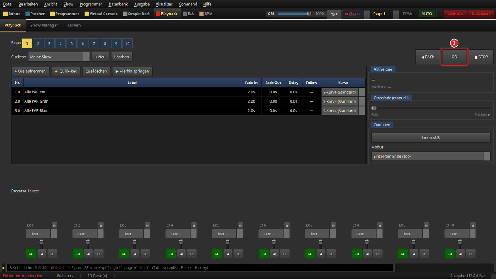

# Scenes, snaps & cue lists: store and recall looks

> **English version** of [Szenen, Snaps & Cue-Listen](ANLEITUNG.md). LightOS itself speaks
> German: every button, tab and field is quoted here **exactly as it appears on screen**,
> with an English translation in brackets the first time it shows up. The screenshots are
> the same as in the German guide.

> **What it is about:** a look you have set in the Programmer should later be repeatable
> with one click or play back in a fixed order. LightOS offers four ways to do that: the
> **snap** in the library, the **snapshots** with 48 quick-access slots, the **scene** as a
> function and the **cue** in a **cue list**. This page shows all four and, at the end,
> how to start a cue list from the Virtual Console.

How to select fixtures and set values is described in
[Programmer-Grundlagen](../anleitung_programmer_grundlagen/ANLEITUNG.md) (Programmer
basics, German).

---

## Which way for what?

| | Snap | Snapshot | Scene | Cue |
|---|---|---|---|---|
| Where | Programmer → **Bibliothek** (library) | Programmer → **Snapshots** | Programmer → **Assistent** (assistant) | **Playback** |
| Stores | chosen channel groups of the selected fixtures | chosen channel groups of the selected fixtures | chosen channel groups of the selected fixtures | the **whole** Programmer |
| Recall | values go **into the Programmer** | values go **into the Programmer** | runs as a function (**Start**/**Stop**) | runs on an **executor** (**GO**) |
| Good for | building blocks ("only colour red") | quick switching back and forth | looks for VC buttons, chasers | fixed sequences with fade time |

Important for everything that follows: **the Programmer has priority.** Whatever is in it
covers running scenes and cues. A recalled snap or snapshot stays in the Programmer until
you clear it (**Alles löschen** = clear all, or **Esc**).

All four are saved with the show (**Datei → Speichern**, File → Save).

## What you need

- A show with patched fixtures and groups. The pictures show the same practice show as
  [Programmer-Grundlagen](../anleitung_programmer_grundlagen/ANLEITUNG.md#was-du-brauchst):
  eight PARs, two washes, two spots, one LED bar. The pictures also already contain the
  scenes „Alle PAR Rot“, „Alle PAR Grün“, „Alle PAR Blau“ (all PARs red/green/blue) and a
  few effects. In your show you create scenes yourself in step 4. Everything works the
  same with your own fixtures.
- For the last step: the Virtual Console in edit mode, see
  [VC-Bau-Elemente](../anleitung_vc_widgets/README.md) (German).

---

## 1. Set a look in the Programmer

Section **Programmer**, tab **Attribute**: select the group **Alle PAR**, in the **Color**
tab the quick select **Rot** (red), and in the **Intensity** tab drag the **Dimmer** to
255. The lamp preview shows eight red tiles.

1. **Speichern** (save) in the **Bibliothek** (library) on the right creates a snap from it
   (step 2).
2. **Ordner +** (folder +) creates a folder first. A new snap lands in the folder that is
   currently marked in the library.

## 2. Choose channels and name the snap

After **Speichern**, the window **Kanäle auswählen** (choose channels) asks what goes into
the snap. The line „Nur aktive Auswahl: 8 von 8 Gerät(en)“ (active selection only: 8 of 8
fixtures) means: only the currently selected fixtures are saved, even if the Programmer
still holds values of other fixtures.

1. **Intensity (8 Werte)** (8 values): the dimmer of the eight PARs.
2. **Color (24 Werte)**: red, green and blue of the eight PARs. **Kanäle ▾** (channels)
   expands the individual channels.
3. **OK**, then enter a name in the window **Snap speichern** (save snap), e.g.
   „PAR Rot“.

If you only take **Color**, you get a pure colour building block. You can later put it on
fixtures without changing their brightness.

## 3. Recall snap and scene

In the picture the Programmer is empty (**Alles löschen**), the PARs are dark.

1. **The snap** „PAR Rot“ is in the list with a yellow dot.
2. **Anwenden** (apply), or double-clicking the snap, writes its values back into the
   Programmer. The PARs are red again.
3. **The scene** „Alle PAR Rot“ (blue dot) is a function. A double-click starts it, a
   second double-click stops it. Right-click offers **Start**/**Stop**,
   **Bearbeiten...** (edit) and **🎹 MIDI lernen (Pad/Fader drücken)** (MIDI learn: press
   pad/fader).

Right-clicking a snap offers, among other things, **Chase aus Auswahl erstellen** (create a
chase from several marked snaps) and **Als Szene(n) übernehmen** (turn the snap into a
scene).

## 4. Save the Programmer as a scene

You create a scene in the **Assistent** (assistant) tab:

1. **Programmer → Szene** asks for the channels as in step 2 and then for the
   „Name der Szene:“ (name of the scene). The channels of all selected fixtures are saved.
2. **The list** shows all functions of the show. The new scene appears here and in the
   library. A double-click switches a function on or off; running ones are marked with
   „▶“.
3. **Start** starts the marked function.
4. **Stop** stops it.

Next to it: **+ Szene** creates an empty scene and opens it for editing, **+ Chaser** does
the same for a chaser, **Effekt-Assistent...** (effect assistant) builds effects with a
wizard.

A running scene lies *under* the Programmer: if the Programmer still holds values for the
same channels, you only see the scene after **Alles löschen**.

## 5. Snapshots: 48 slots for quick switching

Tab **Snapshots** at the top next to **Attribute**.

1. **A used slot** shows the name and the number of fixtures, here „PAR Rot (8 FX)“. A
   click writes the values into the Programmer.
2. **An empty slot** („(leer)“ = empty): a click stores the current Programmer. It first
   asks for the name („Name für Snapshot 2:“), then for the channels as in step 2.

Right-clicking a used slot: **Apply**, **Umbenennen...** (rename), **Exportieren...**
(export), **Kanäle ignorieren...** (ignore channels — these channels are skipped on recall)
and **Löschen** (delete). **Alle leeren** (empty all) empties all 48 slots after
confirmation. **Programmer → Snapshot aufnehmen** (record snapshot, **Strg+Umschalt+S** =
Ctrl+Shift+S) stores into the next free slot. On the right is the same library as in the
**Attribute** tab.

## 6. Preset browser: search palettes and groups

Tab **Preset-Browser** („Paletten & Gruppen“, palettes & groups). Scenes and snaps are not
listed here, only **palettes** and **fixture groups**.

1. **Search field** („Suchen … (Name, Typ, Ordner, Tag)“ = search: name, type, folder,
   tag): filters while you type.
2. **Result**: a double-click or **Enter** applies it. A group is selected (like a click in
   the Programmer's group list). A palette goes onto the current selection, or onto all
   fixtures if nothing is selected.
3. **Status line**: number of results; after applying, e.g. „Gruppe ausgewählt: Alle PAR“
   (group selected).

How to create palettes is described in
[Programmer-Grundlagen, step 6](../anleitung_programmer_grundlagen/ANLEITUNG.md#6-die-übrigen-reiter)
(German).

## 7. Create a cue list

Section **Playback**, tab **Playback**.

1. **+ Neu** (new) asks for the name of the cue list, here „Meine Show“ (my show). It is
   selected in the field **Cueliste:** (cue list). **Löschen** (delete) next to it removes
   the selected cue list.
2. **+ Cue aufnehmen** (record cue) stores the **whole** Programmer as a new cue. It asks
   for **Cue-Nummer:** (cue number; suggested: last + 1) and **Label:**.
3. **⚡ Quick-Rec** does the same without asking, label „Cue 1“, „Cue 2“ …

This is how you record three colours:

1. Programmer: **Alle PAR**, dimmer 255, colour red, then **+ Cue aufnehmen** → number 1,
   label „Alle PAR Rot“.
2. **Alles löschen** (or **Esc**), then set green and record it as cue 2.
3. Blue as cue 3 in the same way.

A cue stores all values that are currently in the Programmer, regardless of the
selection. If you do not clear between the cues, the next cue carries the old values
along.

Via the menu **Show → Cue aufnehmen** (key **R**) this also works without the Playback
page. It records into the cue list selected on the Playback page. If none is selected, the
cue lands in the **first** cue list of the show.

## 8. Put the cue list on an executor

1. **The cue table**: **Nr.** (no.), **Label**, **Fade In** (default 2.0 s),
   **Fade Out**, **Delay**, **Follow** and **Kurve** (curve). A double-click on a cell
   changes the value. Enter a time under **Follow** and the next cue follows by itself.
   **Kurve** chooses the shape of the fade.
2. **Executor 1** in the **executor bar**: in the selection box „— Leer —“ (empty) choose
   the cue list „Meine Show“. The executor is then named like the cue list.

**Only a cue list that is on an executor puts out light.** If you forget this step,
**GO** (and also **◀ BACK** and **▶ Hierhin springen** = jump here) on the Playback page
helps you: the selected cue list is automatically put on the first free executor of the
current page, and **Aktive Cue** (active cue) says where:

1. **GO** on the cue list „Meine Show“, which was not on an executor yet.
2. The hint: *„Meine Show“ liegt jetzt auf Ex 1* ("Meine Show" is now on Ex 1). The same
   message shows briefly in the status bar.
3. **Executor 1** now carries the cue list, cue 1 is running.

The whole sequence with **GO** pressed twice — first without an executor, then cue 1 on
Ex 1, then cue 2:

1. **GO** — the button that is pressed next.
2. The running cue under **Aktive Cue**: first cue 1.0, after the second **GO** cue 2.0.
3. The hint *„Meine Show“ liegt jetzt auf Ex 1*.
4. **Executor 1** with the cue list.

An executor that is in use is never overwritten. Executors with their own name (**⚙**,
label) and those whose fader is at 0 are left alone too — no light would come out there,
and when you pushed the fader up the list would start unexpectedly. If only such an
executor is free, **GO** does nothing and the hint says what to do:

1. „Freier Executor Ex 1 hat den Fader auf 0 % — Liste zuweisen und Fader hochziehen“
   (free executor Ex 1 has its fader at 0 % — assign the list and push the fader up).
2. **Executor 1** with its fader all the way down.

If there is no free executor at all, it says „Kein freier Executor — Liste zuerst einem
Executor zuweisen“ (no free executor — assign the list to an executor first). The hint
disappears as soon as you select another cue list or change the page. The space bar, the
command line (`go`), the web remote and OSC never put a list on an executor
automatically.

On the executor: the fader controls the brightness of the cue list. The green button is
**GO**, **◀** goes back, **FL** flashes the cue list as long as you hold it. **⚙** opens
„Executor konfigurieren (Label, Fader-Funktion, Tasten)“ (configure executor: label, fader
function, buttons): there the fader can become a manual crossfade and the three buttons
can be reassigned. Executors belong to a **page** (**1** to **10** at the top). Each page
has its own.

## 9. Play back: GO, BACK, STOP

Before the first **GO**, clear the Programmer (**Esc**), otherwise it covers the cues.

1. **GO** fades into the next cue, on the first press into cue 1. The active row gets a
   green background.
2. **◀ BACK** goes back one cue.
3. **■ STOP** ends the cue list; the light of the cues goes out.
4. **Aktive Cue** shows „▶ Cue 1.0 — Alle PAR Rot“ and the next cue below it.

Also: **▶ Hierhin springen** (jump here) fades directly into the marked cue.
**Crossfade (manuell)** (manual crossfade) fades to the next cue by hand. **Optionen**
(options) sets **Loop: AUS**/**AN** (off/on) and the **Modus:** (mode):
**Einzel (am Ende stop)** (single, stop at the end), **Loop**, **Bounce**, **Ping-Pong**.

## 10. Trigger cues from the Virtual Console

Section **Virtual Console**: switch on **Bearbeiten** (edit) and click **Cueliste** (cue
list) in the toolbar. The element appears in the middle of the area. A double-click opens
**Cueliste-Einstellungen** (cue list settings) with **Beschriftung:** (caption) and
**Executor-Slot:**. Then switch **Bearbeiten** off again.

1. **The cue list** shows the cues of the chosen executor; the active cue is marked.
2. **GO ►** triggers the next cue, **◄◄** goes back, **■** stops.

**Careful when counting:** the **Executor-Slot** counts from **0**. Slot 0 is the executor
that is called **Ex 1** in Playback, slot 1 is **Ex 2** and so on, each on the current
page. The picture shows slot 0, i.e. „Meine Show“ from step 8.

Instead of the cue list, a single **Button** with the action
**Executor: Umschalten (Go)** (executor: toggle/go) works too. Then enter the slot under
**Erweitert (Roh-ID / Executor-Slot)** (advanced: raw ID / executor slot) in the field
**Executor-Slot / Function-ID:**, again counted from 0. With **Executor: Flash** the button
flashes the cue list while it is held. Scenes go on a button with **Funktion an/aus**
(function on/off), snapshots with **Snapshot abrufen** (recall snapshot). All settings in
detail: [Button](../anleitung_vc_widgets/01_button.md) and
[Cue-Liste](../anleitung_vc_widgets/08_cue_liste.md) (German).

---

## If something does not fit

| Observation | Cause | What to do |
|---|---|---|
| **GO** on the Playback page does nothing, hint „Kein freier Executor …“ or „… Fader auf 0 %“ | No free executor, or the free one has its fader down | Step 8: assign the cue list to an executor by hand, push the fader up |
| Space bar, `go`, tablet or OSC: no light | The cue list is not on an executor (these ways never put it there automatically) | Step 8: choose the cue list in the executor's „— Leer —“, or press **GO** once on the Playback page |
| The cues have no effect, the light stays as set | The Programmer has priority | **Esc** or **Alles löschen** |
| Cue 2 still contains values from cue 1 | Not cleared between the recordings | **Alles löschen** before each recording, then record again |
| **R** recorded into the wrong cue list | **Show → Cue aufnehmen** records into the cue list selected on the Playback page (without a selection: the first one) | first choose the right one in **Playback**, field **Cueliste:** |
| The VC cue list stays empty | Wrong **Executor-Slot** (counts from 0) or another page | slot = Ex number − 1, check the page |
| A snap stores too little | Only the **selected** fixtures go into it | select all affected fixtures before **Speichern** |
| The scene is running but cannot be seen | Programmer values lie on top of it | **Alles löschen** |

---

*Pictures: the same as the German guide, created with
`venv/bin/python tools/anleitungsbilder.py szenen_cues` from the practice show (see
[Anleitungsbilder aus dem Code erzeugen](../ANLEITUNGSBILDER.md), German).*
