# Szenen, Snaps & Cue-Listen: Looks speichern und abrufen

> **Worum geht's:** Einen Look, den du im Programmer eingestellt hast, willst du
> später mit einem Klick wiederholen oder in einer festen Reihenfolge abfahren.
> LightOS bietet dafür vier Wege: den **Snap** in der Bibliothek, die **Snapshots**
> mit 48 Schnellzugriff-Plätzen, die **Szene** als Funktion und die **Cue** in einer
> **Cueliste**. Diese Seite zeigt alle vier und am Ende, wie du eine Cueliste aus der
> Virtual Console startest.

Wie du Geräte wählst und Werte einstellst, steht in den
[Programmer-Grundlagen](../anleitung_programmer_grundlagen/ANLEITUNG.md).

---

## Welcher Weg wofür?

| | Snap | Snapshot | Szene | Cue |
|---|---|---|---|---|
| Wo | Programmer → **Bibliothek** | Programmer → **Snapshots** | Programmer → **Assistent** | **Playback** |
| Speichert | gewählte Kanalgruppen der gewählten Geräte | gewählte Kanalgruppen der gewählten Geräte | gewählte Kanalgruppen der gewählten Geräte | den **ganzen** Programmer |
| Abrufen | Werte gehen **in den Programmer** | Werte gehen **in den Programmer** | läuft als Funktion (**Start**/**Stop**) | läuft über einen **Executor** (**GO**) |
| Gut für | Bausteine („nur Farbe Rot“) | schnelles Hin- und Herschalten | Looks für VC-Tasten, Chaser | feste Abfolgen mit Überblendzeit |

Wichtig für alles Folgende: **Der Programmer hat Vorrang.** Was dort steht, überdeckt
laufende Szenen und Cues. Ein abgerufener Snap oder Snapshot bleibt im Programmer
stehen, bis du ihn löschst (**Alles löschen** oder **Esc**).

Alle vier werden mit der Show gespeichert (**Datei → Speichern**).

## Was du brauchst

- Eine Show mit gepatchten Geräten und Gruppen. Die Bilder zeigen dieselbe Übungs-Show
  wie die [Programmer-Grundlagen](../anleitung_programmer_grundlagen/ANLEITUNG.md#was-du-brauchst):
  acht PARs, zwei Wash, zwei Spots, eine LED-Leiste. In den Bildern gibt es außerdem
  schon die Szenen „Alle PAR Rot“, „Alle PAR Grün“, „Alle PAR Blau“ und ein paar
  Effekte. In deiner Show legst du Szenen in Schritt 4 selbst an. Mit eigenen Geräten
  geht alles genauso.
- Für den letzten Schritt: die Virtual Console im Bearbeiten-Modus, siehe
  [VC-Bau-Elemente](../anleitung_vc_widgets/README.md).

---

## 1. Einen Look im Programmer einstellen

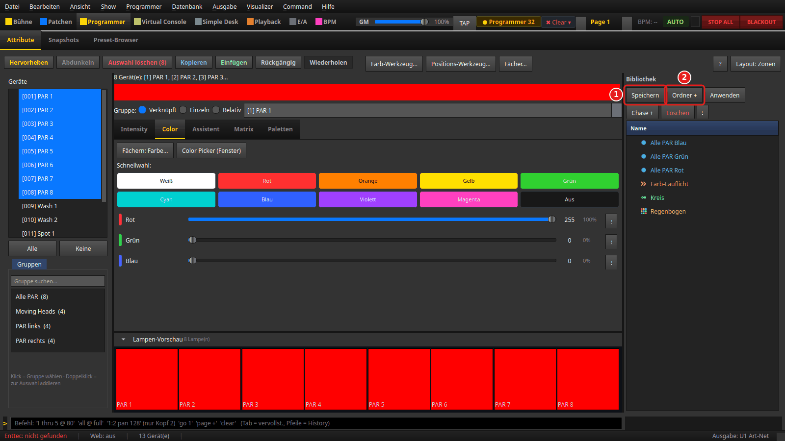

Sektion **Programmer**, Reiter **Attribute**: Gruppe **Alle PAR** wählen, im Reiter
**Color** die Schnellwahl **Rot** und im Reiter **Intensity** den **Dimmer** auf
255 ziehen. Die Lampen-Vorschau zeigt acht rote Kacheln.

1. **Speichern** in der **Bibliothek** rechts legt daraus einen Snap an (Schritt 2).
2. **Ordner +** legt vorher einen Ordner an. Ein neuer Snap landet in dem Ordner, der
   in der Bibliothek gerade markiert ist.

## 2. Kanäle auswählen und den Snap benennen

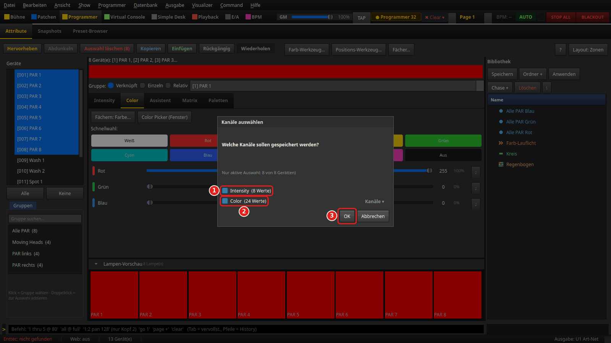

Nach **Speichern** fragt das Fenster **Kanäle auswählen**, was in den Snap soll. Die
Zeile „Nur aktive Auswahl: 8 von 8 Gerät(en)“ sagt: Gespeichert werden nur die gerade
gewählten Geräte, auch wenn im Programmer noch Werte anderer Geräte stehen.

1. **Intensity (8 Werte)**: der Dimmer der acht PARs.
2. **Color (24 Werte)**: Rot, Grün und Blau der acht PARs. **Kanäle ▾** klappt die
   einzelnen Kanäle auf.
3. **OK** und danach im Fenster **Snap speichern** einen Namen eingeben, z. B.
   „PAR Rot“.

Nimmst du nur **Color** mit, entsteht ein reiner Farb-Baustein. Den kannst du später
auf Geräte legen, ohne ihre Helligkeit zu ändern.

## 3. Snap und Szene abrufen

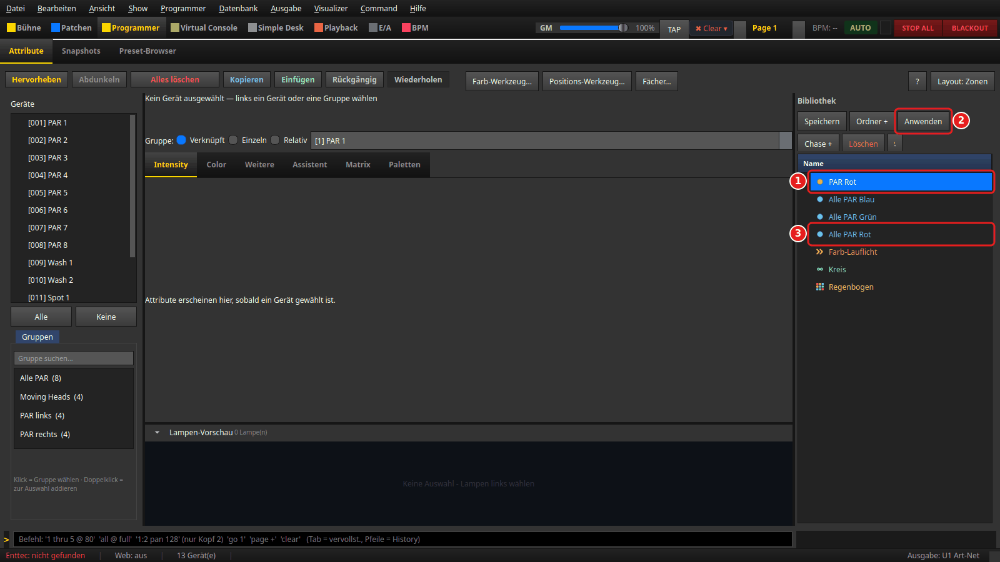

Im Bild ist der Programmer leer (**Alles löschen**), die PARs sind dunkel.

1. **Der Snap** „PAR Rot“ steht mit gelbem Punkt in der Liste.
2. **Anwenden** (oder Doppelklick auf den Snap) schreibt seine Werte zurück in den
   Programmer. Die PARs sind wieder rot.
3. **Die Szene** „Alle PAR Rot“ (blauer Punkt) ist eine Funktion. Doppelklick startet
   sie, ein zweiter Doppelklick stoppt sie. Rechtsklick bietet **Start**/**Stop**,
   **Bearbeiten...** und **🎹 MIDI lernen (Pad/Fader drücken)**.

Rechtsklick auf einen Snap bietet u. a. **Chase aus Auswahl erstellen** (aus mehreren
markierten Snaps) und **Als Szene(n) übernehmen** (macht aus dem Snap eine Szene).

## 4. Den Programmer als Szene speichern

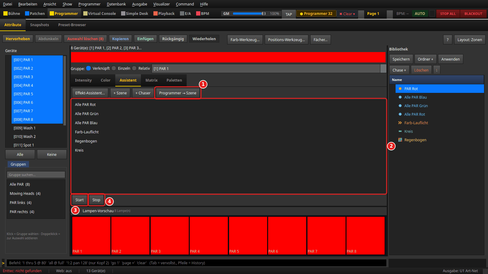

Eine Szene legst du im Reiter **Assistent** an:

1. **Programmer → Szene** fragt wie in Schritt 2 nach den Kanälen und dann nach dem
   „Name der Szene:“. Gespeichert werden die Kanäle aller gewählten Geräte.
2. **Die Liste** zeigt alle Funktionen der Show. Die neue Szene erscheint hier und in
   der Bibliothek. Doppelklick schaltet eine Funktion an oder aus, laufende sind
   mit „▶“ markiert.
3. **Start** startet die markierte Funktion.
4. **Stop** hält sie an.

Daneben: **+ Szene** legt eine leere Szene an und öffnet sie zum Bearbeiten,
**+ Chaser** ebenso einen Chaser, **Effekt-Assistent...** baut Effekte mit einem
Assistenten.

Eine laufende Szene liegt *unter* dem Programmer: Stehen dort noch Werte für dieselben
Kanäle, siehst du die Szene erst nach **Alles löschen**.

## 5. Snapshots: 48 Plätze zum schnellen Umschalten

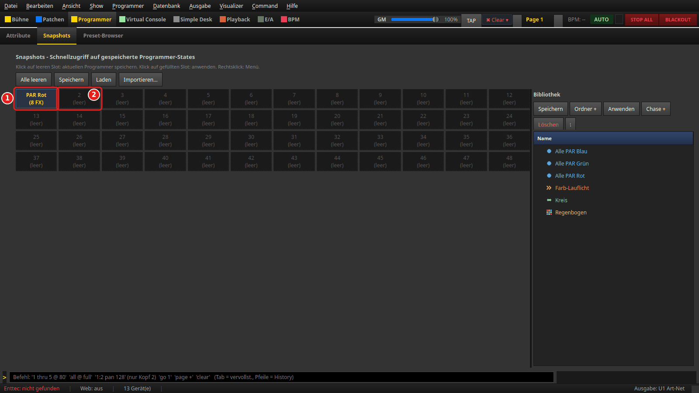

Reiter **Snapshots** oben neben **Attribute**.

1. **Ein belegter Platz** zeigt Namen und Geräteanzahl, hier „PAR Rot (8 FX)“. Ein
   Klick schreibt die Werte in den Programmer.
2. **Ein leerer Platz** („(leer)“): Ein Klick speichert den aktuellen Programmer. Es
   fragt erst nach dem Namen („Name für Snapshot 2:“), dann nach den Kanälen wie in
   Schritt 2.

Rechtsklick auf einen belegten Platz: **Apply**, **Umbenennen...**, **Exportieren...**,
**Kanäle ignorieren...** (diese Kanäle werden beim Abrufen übersprungen) und
**Löschen**. **Alle leeren** leert alle 48 Plätze nach einer Rückfrage.
**Programmer → Snapshot aufnehmen** (**Strg+Umschalt+S**) speichert in den nächsten
freien Platz. Rechts steht dieselbe Bibliothek wie im Reiter **Attribute**.

## 6. Preset-Browser: Paletten und Gruppen suchen

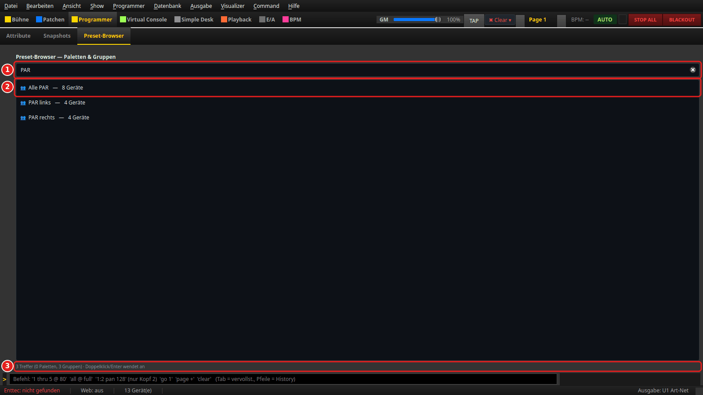

Reiter **Preset-Browser** („Paletten & Gruppen“). Szenen und Snaps stehen hier nicht,
nur **Paletten** und **Fixture-Gruppen**.

1. **Suchfeld** („Suchen … (Name, Typ, Ordner, Tag)“): filtert beim Tippen.
2. **Treffer**: Doppelklick oder **Enter** wendet ihn an. Eine Gruppe wird gewählt
   (wie ein Klick in der Gruppenliste des Programmers). Eine Palette geht auf die
   aktuelle Auswahl, ohne Auswahl auf alle Geräte.
3. **Statuszeile**: Zahl der Treffer, nach dem Anwenden z. B. „Gruppe ausgewählt: Alle PAR“.

Wie du Paletten anlegst, steht in den
[Programmer-Grundlagen, Schritt 6](../anleitung_programmer_grundlagen/ANLEITUNG.md#6-die-übrigen-reiter).

## 7. Eine Cueliste anlegen

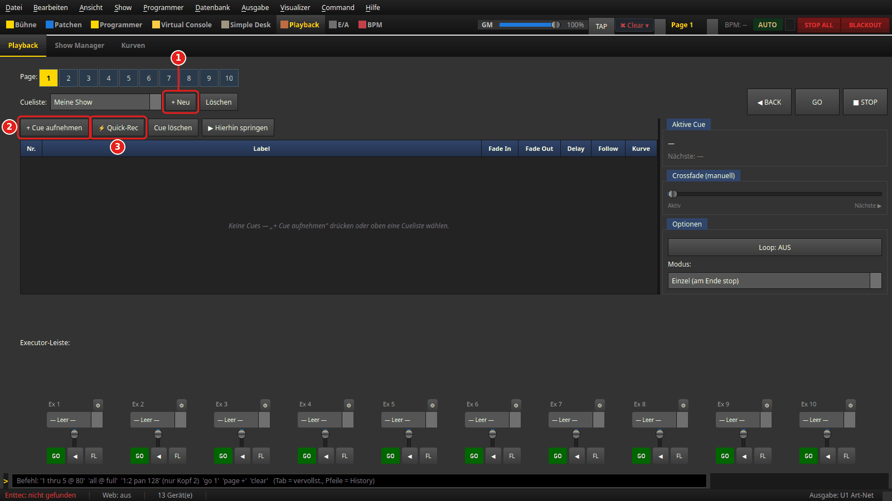

Sektion **Playback**, Reiter **Playback**.

1. **+ Neu** fragt nach dem Namen der Cueliste, hier „Meine Show“. Sie wird im Feld
   **Cueliste:** gewählt. **Löschen** daneben entfernt die gewählte Cueliste.
2. **+ Cue aufnehmen** speichert den **ganzen** Programmer als neue Cue. Es fragt nach
   **Cue-Nummer:** (vorgeschlagen: letzte + 1) und **Label:**.
3. **⚡ Quick-Rec** macht dasselbe ohne Rückfrage, Label „Cue 1“, „Cue 2“ …

So nimmst du drei Farben auf:

1. Programmer: **Alle PAR**, Dimmer 255, Farbe Rot, dann **+ Cue aufnehmen** →
   Nummer 1, Label „Alle PAR Rot“.
2. **Alles löschen** (oder **Esc**), dann Grün einstellen und als Cue 2 aufnehmen.
3. Genauso Blau als Cue 3.

Eine Cue speichert alle Werte, die gerade im Programmer stehen, unabhängig von der
Auswahl. Löschst du zwischen den Cues nicht, trägt die nächste Cue die alten Werte mit.

Über das Menü **Show → Cue aufnehmen** (Taste **R**) geht es auch ohne Playback-Seite.
Das nimmt in die Cueliste auf, die auf der Playback-Seite gewählt ist. Ist keine
gewählt, landet die Cue in der **ersten** Cueliste der Show.

## 8. Die Cueliste auf einen Executor legen

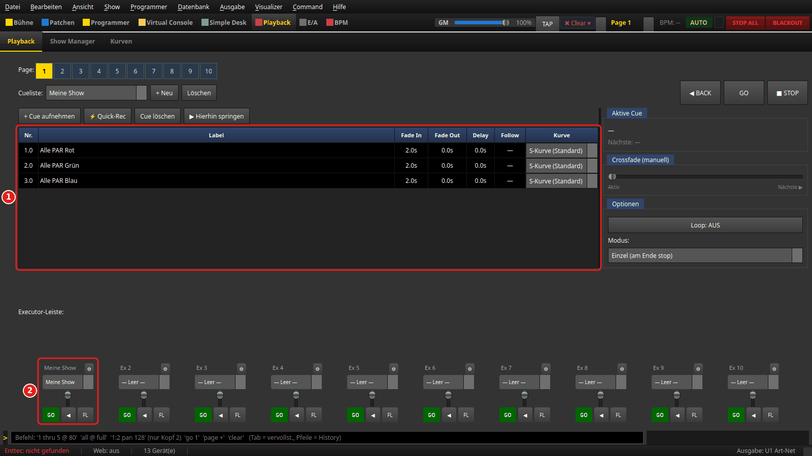

1. **Die Cue-Tabelle**: **Nr.**, **Label**, **Fade In** (Standard 2,0 s),
   **Fade Out**, **Delay**, **Follow** und **Kurve**. Ein Doppelklick auf eine Zelle
   ändert den Wert. Bei **Follow** eine Zeit eintragen, dann folgt die nächste Cue
   von selbst. **Kurve** wählt den Verlauf der Überblendung.
2. **Executor 1** in der **Executor-Leiste**: Im Auswahlfeld „— Leer —“ die
   Cueliste „Meine Show“ wählen. Der Executor heißt dann wie die Cueliste.

**Nur eine Cueliste, die auf einem Executor liegt, gibt Licht aus.** Vergisst du diesen
Schritt, hilft dir **GO** (ebenso **◀ BACK** und **▶ Hierhin springen**) auf der
Playback-Seite: Die gewählte Cueliste wird automatisch auf den ersten freien Executor
der aktuellen Page gelegt, und unter **Aktive Cue** steht, wohin:

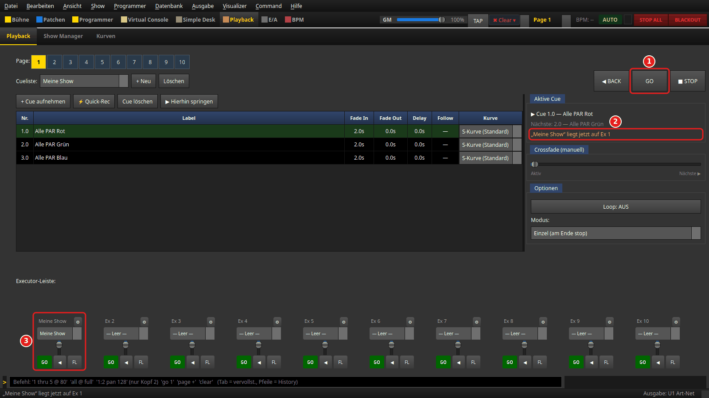

1. **GO** auf der Cueliste „Meine Show“, die noch auf keinem Executor lag.
2. Der Hinweis: *„Meine Show“ liegt jetzt auf Ex 1*. Dieselbe Meldung steht kurz in der
   Statusleiste.
3. **Executor 1** trägt jetzt die Cueliste, Cue 1 läuft.

Ein belegter Executor wird dabei nie überschrieben. Auch Executoren mit eigenem Namen
(**⚙**, Label) und solche, deren Fader auf 0 steht, bleiben frei — dort käme kein Licht,
und beim Hochziehen spränge die Liste unerwartet an. Ist nur noch so ein Executor frei,
passiert bei **GO** nichts, und der Hinweis sagt, was zu tun ist:

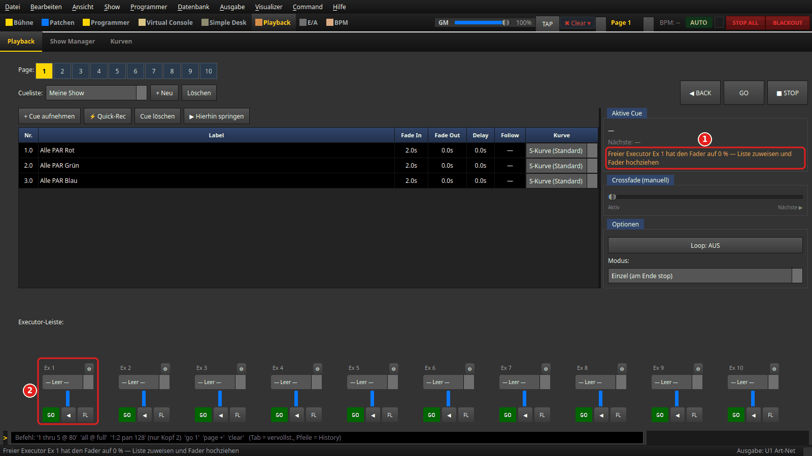

1. „Freier Executor Ex 1 hat den Fader auf 0 % — Liste zuweisen und Fader hochziehen“.
2. **Executor 1** mit Fader ganz unten.

Gibt es gar keinen freien Executor, steht dort „Kein freier Executor — Liste zuerst
einem Executor zuweisen“. Der Hinweis verschwindet, sobald du eine andere Cueliste
wählst oder die Page wechselst. Leertaste, Befehlszeile (`go`), Web-Remote und OSC legen
keine Liste automatisch auf einen Executor.

Am Executor: Der Fader regelt die Helligkeit der Cueliste. Die grüne Taste ist **GO**,
**◀** geht zurück, **FL** blitzt die Cueliste, solange du drückst. **⚙** öffnet
„Executor konfigurieren (Label, Fader-Funktion, Tasten)“: Dort wird der Fader zum
manuellen Crossfade und die drei Tasten lassen sich neu belegen. Die Executoren
gehören zur **Page** (oben **1** bis **10**). Jede Page hat ihre eigenen.

## 9. Abfahren: GO, BACK, STOP

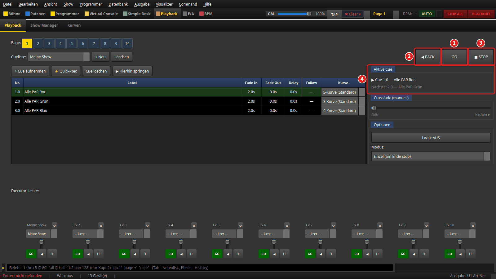

Vor dem ersten **GO** den Programmer leeren (**Esc**), sonst überdeckt er die Cues.

1. **GO** blendet in die nächste Cue über, beim ersten Druck in Cue 1. Die aktive Zeile
   wird grün hinterlegt.
2. **◀ BACK** geht eine Cue zurück.
3. **■ STOP** beendet die Cueliste, das Licht der Cues geht aus.
4. **Aktive Cue** zeigt „▶ Cue 1.0 — Alle PAR Rot“ und darunter die nächste Cue.

Außerdem: **▶ Hierhin springen** blendet direkt in die markierte Cue.
**Crossfade (manuell)** blendet von Hand zur nächsten Cue. **Optionen** legt
**Loop: AUS**/**AN** und den **Modus:** fest: **Einzel (am Ende stop)**, **Loop**,
**Bounce**, **Ping-Pong**.

## 10. Cues aus der Virtual Console auslösen

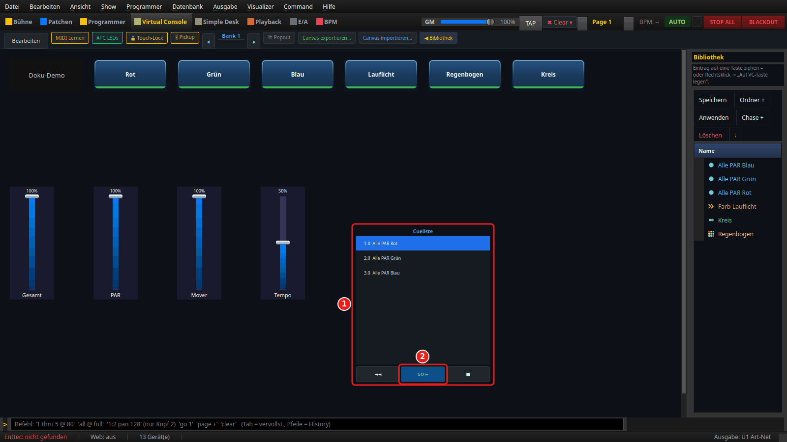

Sektion **Virtual Console**, **Bearbeiten** einschalten und in der Werkzeugleiste auf
**Cueliste** klicken. Das Element erscheint in der Mitte der Fläche. Doppelklick öffnet
**Cueliste-Einstellungen** mit **Beschriftung:** und **Executor-Slot:**. Danach
**Bearbeiten** wieder ausschalten.

1. **Die Cueliste** zeigt die Cues des gewählten Executors, die aktive Cue ist markiert.
2. **GO ►** löst die nächste Cue aus, **◄◄** geht zurück, **■** stoppt.

**Achtung beim Zählen:** Der **Executor-Slot** zählt ab **0**. Slot 0 ist der Executor,
der im Playback **Ex 1** heißt, Slot 1 ist **Ex 2** usw., jeweils auf der aktuellen
Page. Das Bild zeigt Slot 0, also „Meine Show“ aus Schritt 8.

Statt der Cueliste geht auch ein einzelner **Button** mit der Aktion
**Executor: Umschalten (Go)**. Dann den Slot unter **Erweitert (Roh-ID / Executor-Slot)**
im Feld **Executor-Slot / Function-ID:** eintragen, ebenfalls ab 0 gezählt. Mit
**Executor: Flash** blitzt die Taste die Cueliste, solange sie gedrückt ist. Szenen
legst du mit **Funktion an/aus** auf eine Taste, Snapshots mit **Snapshot abrufen**.
Alle Einstellungen im Detail:
[Button](../anleitung_vc_widgets/01_button.md) und
[Cue-Liste](../anleitung_vc_widgets/08_cue_liste.md).

---

## Wenn etwas nicht passt

| Beobachtung | Ursache | Was tun |
|---|---|---|
| **GO** auf der Playback-Seite tut nichts, Hinweis „Kein freier Executor …“ bzw. „… Fader auf 0 %“ | Kein freier Executor, oder der freie hat den Fader unten | Schritt 8: Cueliste von Hand einem Executor zuweisen, Fader hochziehen |
| Leertaste, `go`, Tablet oder OSC: kein Licht | Die Cueliste liegt auf keinem Executor (diese Wege legen sie nicht automatisch hin) | Schritt 8: im Executor „— Leer —“ die Cueliste wählen oder einmal **GO** auf der Playback-Seite |
| Die Cues wirken nicht, das Licht bleibt wie eingestellt | Der Programmer hat Vorrang | **Esc** bzw. **Alles löschen** |
| Cue 2 enthält noch Werte aus Cue 1 | Zwischen den Aufnahmen nicht gelöscht | vor jeder Aufnahme **Alles löschen**, dann neu aufnehmen |
| **R** hat in die falsche Cueliste aufgenommen | **Show → Cue aufnehmen** nimmt in die auf der Playback-Seite gewählte Cueliste auf (ohne Wahl: die erste) | vorher in **Playback** im Feld **Cueliste:** die richtige wählen |
| Die VC-Cueliste bleibt leer | Falscher **Executor-Slot** (zählt ab 0) oder andere Page | Slot = Ex-Nummer − 1, Page prüfen |
| Ein Snap speichert zu wenig | Nur die **gewählten** Geräte kommen hinein | vor **Speichern** alle betroffenen Geräte wählen |
| Die Szene läuft, ist aber nicht zu sehen | Programmer-Werte liegen darüber | **Alles löschen** |

---

*Bilder: erzeugt mit `venv/bin/python tools/anleitungsbilder.py szenen_cues` aus der
Übungs-Show (siehe [Anleitungsbilder aus dem Code erzeugen](../ANLEITUNGSBILDER.md)).*
