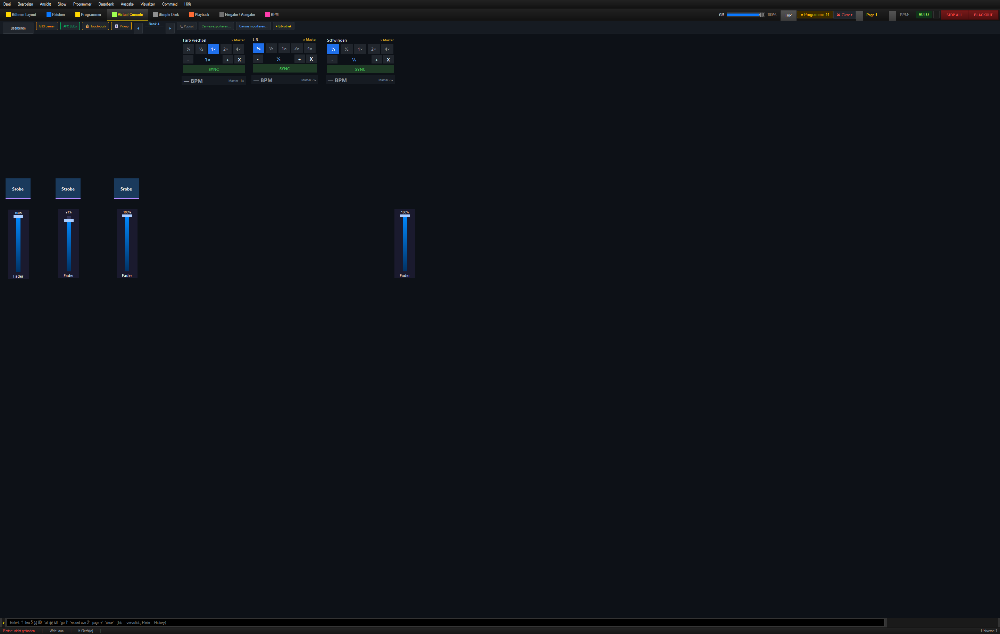
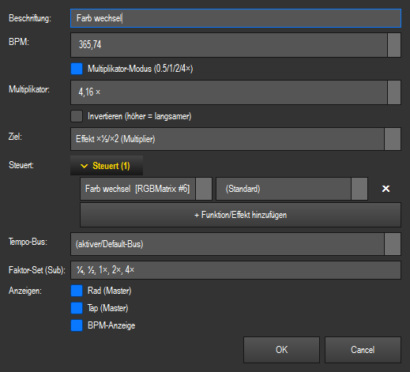
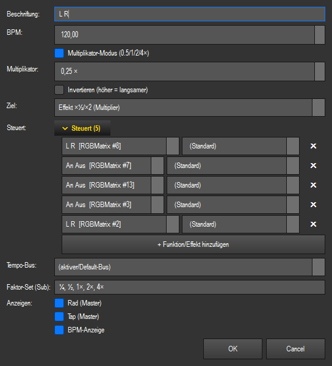
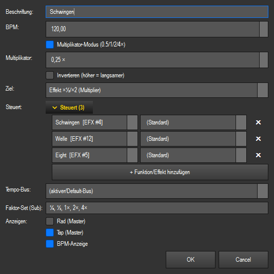
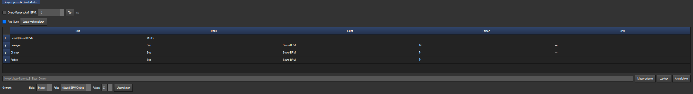
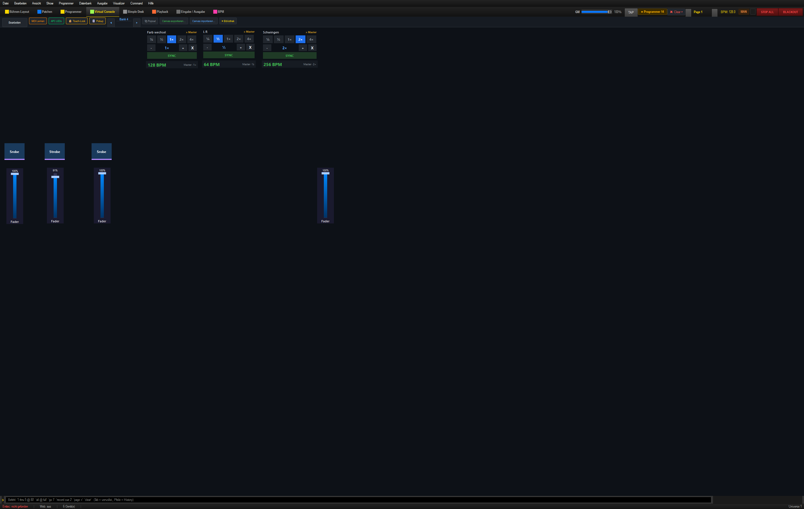

# Test123 Lightshow: drei Geschwindigkeiten aus einer Master-BPM

Diese Anleitung richtet die drei Multiplikator-Fenster auf **Bank 4** so ein, dass:

- der **Farbwechsel** eine eigene relative Geschwindigkeit erhält,
- alle **Dimmer-Effekte** gemeinsam eine zweite Geschwindigkeit verwenden,
- alle **Moving-Head-/Spider-Bewegungen** gemeinsam eine dritte Geschwindigkeit verwenden,
- alle drei Gruppen von derselben **Master-BPM** abhängen,
- unterschiedliche Faktoren wie `½`, `1×` und `2×` trotzdem auf demselben Schlag starten.

Verwendete Show: `shows/test123.lshow`.

> Hinweis: In der Datei heißt die Show intern noch „Neue Show“. Das ändert nichts an der
> Einrichtung.

## 1. Der vorhandene Aufbau

Auf Bank 4 liegen bereits die drei richtigen Multiplikator-Fenster:

| Fenster | Aufgabe | Gekoppelte Effekte |
|---|---|---|
| **Farb wechsel** | Geschwindigkeit des Farbwechsels | `Farb wechsel` |
| **L R** | gemeinsame Dimmergeschwindigkeit | fünf `An Aus`-/`L R`-Effekte |
| **Schwingen** | gemeinsame Bewegungsgeschwindigkeit | `Schwingen`, `Welle`, `Eight` |

Der noch fehlende entscheidende Schritt ist die **Tempo-Bus-Zuweisung der Effekte**.
Momentan stehen die Effekte auf freiem Lauf. Dadurch verändern die Fenster zwar die
Geschwindigkeit, aber sie laufen noch nicht wirklich phasengenau an der Master-BPM.

## 2. Erstes Fenster: Farbe

1. **Virtual Console → Bank 4** öffnen.
2. **Bearbeiten** einschalten.
3. Rechtsklick auf **Farb wechsel** → **Einstellungen…**.
4. Prüfen:
   - **Ziel:** `Effekt ×½/×2 (Multiplier)`
   - **Multiplikator-Modus:** eingeschaltet
   - **Steuert:** `Farb wechsel`
   - **Faktor-Set:** `¼, ½, 1×, 2×, 4×`

## 3. Zweites Fenster: alle Dimmer-Effekte

Rechtsklick auf **L R** → **Einstellungen…**.

Unter **Steuert (5)** müssen diese fünf Dimmer-Effekte stehen:

- `Straler/Dimmer – L R`
- `Straler/Dimmer – An Aus`
- `Spider/Dimmer – An Aus`
- `Moving Head/Dimmer – An Aus`
- `Moving Head/Dimmer – L R`

Damit laufen „an/aus“ und „links/rechts“ sämtlicher Gerätegruppen über denselben
Dimmer-Multiplikator.

## 4. Drittes Fenster: Bewegungen

Rechtsklick auf **Schwingen** → **Einstellungen…**.

Unter **Steuert (3)** müssen stehen:

- `Schwingen`
- `Welle`
- `Eight`

## 5. Alle Ziel-Effekte an die Master-BPM hängen

Dieser Schritt muss bei **jedem der neun Effekte** einmal durchgeführt werden.

1. Auf Bank 1, 2 oder 3 den jeweiligen Effekt-Button suchen.
2. **Bearbeiten** einschalten.
3. Rechtsklick auf den Effekt-Button → **⚡ Live-Parameter…**.
4. Folgende Werte setzen:
   - **Geschwindigkeit:** `1,00`
   - **Tempo-Bus:** `Global`
   - **Tempo ×:** `1,00`
   - **Tempo-Versatz (Beats):** `0,00`
5. **Anwenden** klicken.

Das wird wiederholt für:

- Bank 1: `Farb wechsel`
- Bank 2: alle fünf Dimmer-Effekte
- Bank 3: `Schwingen`, `Welle`, `Eight`

> Wichtig: Das Feld **Tempo-Bus** im Eigenschaften-Dialog des Multiplikator-Fensters
> weist den Ziel-Effekten nicht automatisch einen Bus zu. Entscheidend ist
> **Tempo-Bus = Global im Live-Parameter-Dialog jedes Effekts**.

## 6. Master-BPM und gemeinsame Phase aktivieren

1. Die Sektion **BPM** öffnen, am schnellsten mit **Strg+8**.
2. Oben die gewünschte Master-BPM festlegen:
   - automatisch aus Audio,
   - per **TAP**,
   - oder manuell als BPM-Zahl.
3. Im Panel **Tempo-Speeds & Grand-Master** **Auto-Sync** einschalten.
4. Einmal **Jetzt synchronisieren** drücken.

**Auto-Sync** sorgt dafür, dass später gestartete Effekte in dasselbe Beat-Raster
einsteigen. **Jetzt synchronisieren** setzt alle bereits laufenden Gruppen gemeinsam
auf eine neue Eins.

## 7. Drei verschiedene Geschwindigkeiten wählen

Zurück auf Bank 4 kann nun jede Gruppe ihren eigenen Faktor bekommen. Beispiel bei
einer Master-BPM von **128**:

| Gruppe | Faktor | Ergebnis |
|---|---:|---:|
| Farbe | `1×` | 128 BPM |
| Dimmer | `½` | 64 BPM |
| Bewegung | `2×` | 256 BPM |

Für ruhigere Bewegungen ist als Startwert häufig `¼` oder `½` angenehmer. Die Faktoren
können während der Show jederzeit umgeschaltet werden, ohne dass die gemeinsame
Master-BPM verloren geht.

## 8. Welchen Sync-Knopf verwenden?

- **SYNC in einem Multiplikator-Fenster:** synchronisiert nur die Effekte dieses Fensters.
- **Jetzt synchronisieren im BPM-Tab:** synchronisiert Farbe, Dimmer und Bewegung
  gemeinsam. Das ist der richtige Knopf, wenn alle drei Gruppen auf demselben Schlag
  neu beginnen sollen.
- **Auto-Sync:** eingeschaltet lassen, damit später zugeschaltete Effekte automatisch
  in das gemeinsame Raster fallen.

## Fehlerprüfung

Wenn ein Fenster zwar den Faktor anzeigt, der Effekt aber nicht sauber zur Musik läuft:

1. Beim Effekt kontrollieren: **Tempo-Bus = Global**.
2. **Tempo-Versatz = 0,00** kontrollieren.
3. **Auto-Sync** einschalten.
4. **Jetzt synchronisieren** drücken.
5. Prüfen, ob im richtigen Multiplikator-Fenster wirklich alle gewünschten Effekte
   unter **Steuert** eingetragen sind.

Die in der Show vorhandenen benannten Busse `Farben`, `Dimmer` und `Bewegen` werden für
diese einfache Variante nicht benötigt. Die drei getrennten Geschwindigkeiten entstehen
durch die drei Effekt-Multiplikatoren, während alle Effekte gemeinsam dem Bus
**Global** folgen.
