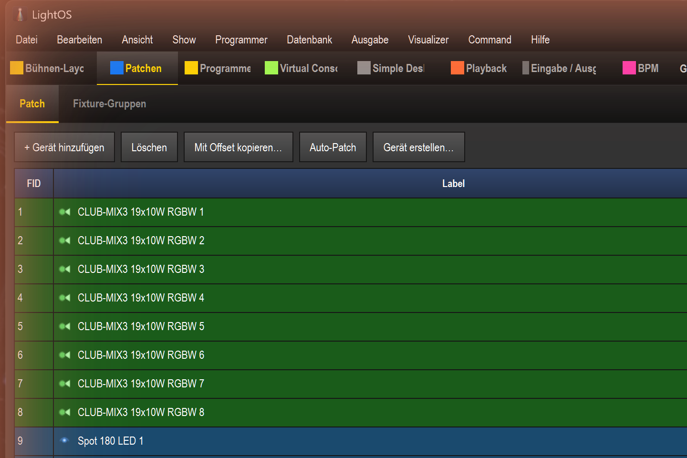
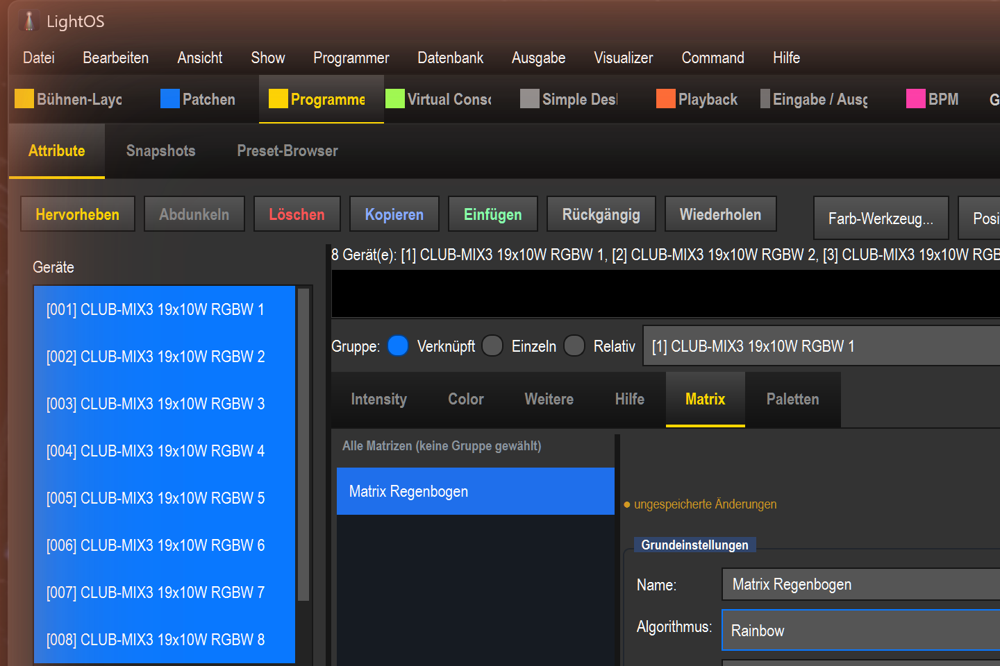
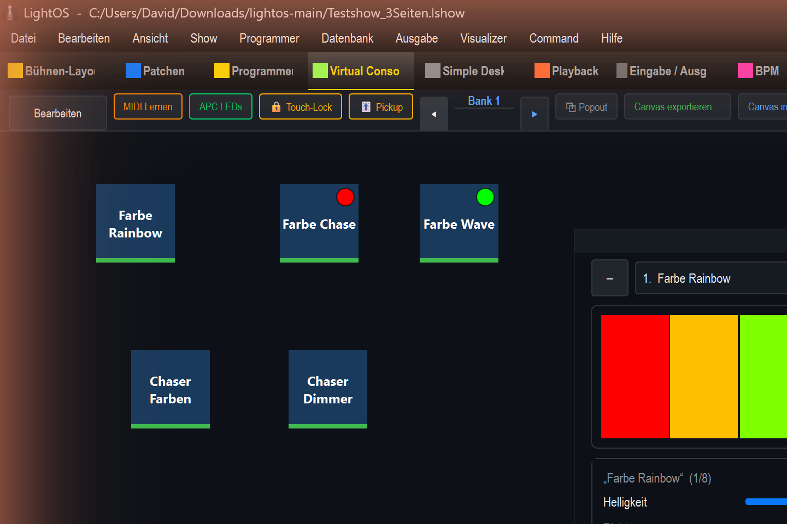
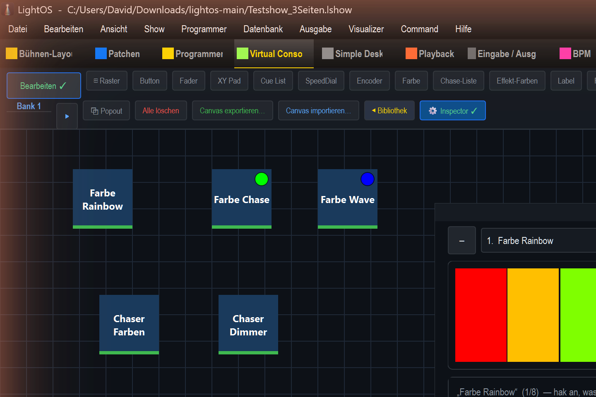
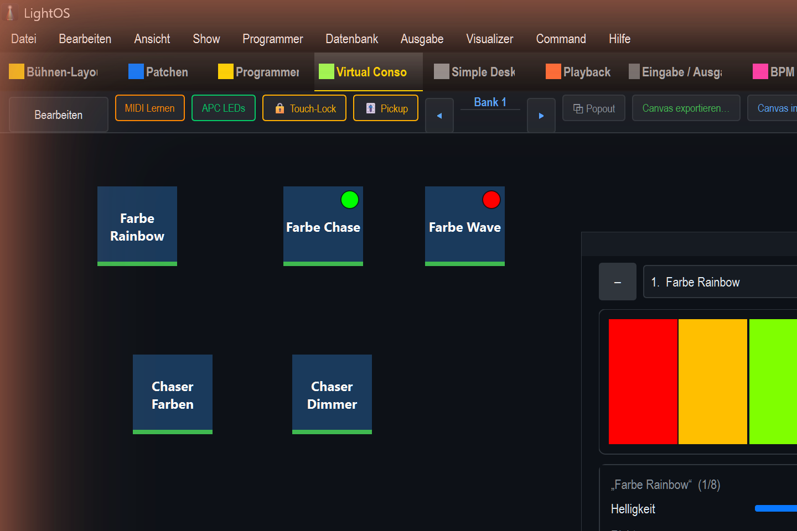
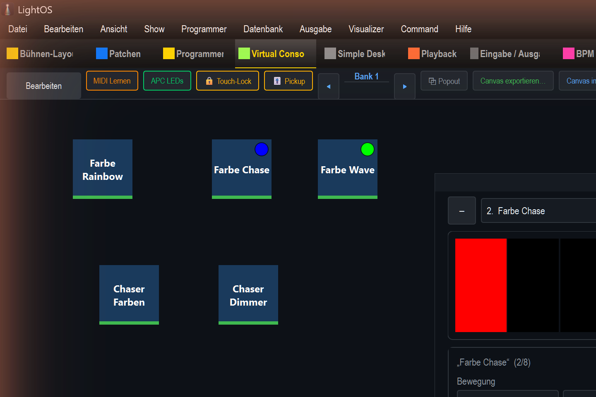
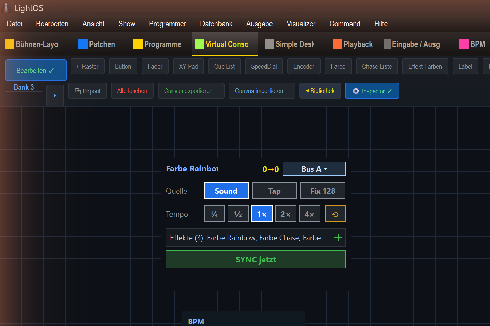

# Testshow bauen + mit dem Live-Edit-Widget bedienen

Diese Anleitung baut Schritt für Schritt eine komplette **Test-Show** auf und zeigt, wie du deine Effekte über die virtuelle Konsole startest und im **Live-Edit-Widget** live feintunst — auf **drei Seiten** (Farbe, Dimmer, Tempo).

Am Ende hast du:

- **11 Effekte** — 6 Farb-Matrixeffekte, 3 Dimmer-Matrixeffekte, 2 Chaser
- eine **virtuelle Konsole mit 3 Seiten (Banks)**:
  - **Seite 1 – Farbe:** Start-Buttons + ein Live-Edit-Widget mit allen Farb- und Chaser-Effekten
  - **Seite 2 – Dimmer:** Start-Buttons + ein eigenes Live-Edit-Widget für die Dimmer-Effekte
  - **Seite 3 – BPM/Tempo:** ein Tempo-Bus-Controller mit Multiplikator (×½, ×2 …) für die gesyncten Effekte

---

## 1. Neue Show anlegen

`Datei → Neue Show` (oder `Strg + N`) und mit **Ja** bestätigen. Die aktuelle Show wird verworfen und du startest leer.

## 2. Fixtures patchen

Tab **Patchen → + Gerät hinzufügen**. Im Dialog das Fixture wählen, bei **Anzahl** die Stückzahl setzen (die DMX-Adresse wird automatisch fortgezählt) und **Hinzufügen**.

Für diese Show: **8× CLUB-MIX3 19x10W RGBW** (die Matrix-/Dimmer-Effekte laufen auf diesen PARs).

## 3. Effekte anlegen

### Farb-Matrixeffekte

Tab **Programmer → Attribute**. Links die PARs auswählen (auf das erste klicken, mit **Shift** auf das letzte). Dann den Attribut-Tab **Matrix** öffnen und **+ Neu**. Rechts einstellen:

- **Name** (z. B. „Farbe Rainbow")
- **Algorithmus** (Rainbow, Chase, Wave, Fill, Gradient, Random …) — am schnellsten: Dropdown anklicken, Namen tippen, Enter
- **Stil: RGB** (für Farbe)

Die **Vorschau** rechts zeigt den Effekt sofort. Mit **Speichern** landet er in der Bibliothek. So legst du 6 Farbeffekte an.

### Dimmer-Matrixeffekte

Genau gleich, aber **Stil: Dimmer** (die Vorschau wird weiß/grau statt farbig). So entstehen z. B. Dimmer Chase, Dimmer Wave, Dimmer Fill.

### Chaser

Rechts in der Bibliothek **Chase +**. Im Chase-Editor Name setzen, unten unter **Funktionen zum Chase hinzufügen** die gewünschten Effekte auswählen und **In Chase übernehmen** — sie werden zu Schritten. Fenster schließen = gespeichert. So entstehen „Chaser Farben" (durch die Farbeffekte) und „Chaser Dimmer" (durch die Dimmer-Effekte).

---

## 4. Virtuelle Konsole — Seite 1 (Farbe)

Tab **Virtual Console → Bearbeiten**. Rechts steht die **Bibliothek** mit allen Effekten.

**Start-Buttons:** einen Effekt aus der Bibliothek auf die Fläche ziehen → im Dialog „Effekt einrichten" ist **An/Aus (Toggle)** schon gewählt → **Erstellen**. Das ergibt einen Button, der den Effekt startet/stoppt.

**Live-Edit-Widget:** in der Werkzeugleiste **Live-Edit** klicken → das Panel erscheint auf der Fläche (verschiebbar/skalierbar wie jedes VC-Widget). Dann die Effekte aus der Bibliothek **in das Panel ziehen** — oben blätterst du mit Dropdown / – / + durch die zugewiesenen Effekte.

So sieht Seite 1 im laufenden Betrieb aus — links die Start-Buttons, rechts das Live-Edit-Widget:

## 5. Live-Edit bedienen — Bearbeiten vs. Betrieb

Der Live-Edit hängt am **Bearbeiten-Modus der Konsole**:

**Bearbeiten an** → du bekommst die **Häkchen-Auswahl**: pro Effekt hakst du an, *was* du live steuern willst (Helligkeit, Richtung, Läufer-Anzahl …). Die Auswahl wird **mit der Show gespeichert**.

**Bearbeiten aus (Betrieb)** → nur noch die **angehakten Regler**, aufgeräumt, ohne die Häkchen-Liste. Die Regler sind **visuell** und passen zum Parameter:

- **Helligkeit / Ein-/Ausblenden** → Slider
- **Richtung** → Pfeil-Buttons (`→ vorwärts`, `← rückwärts`, `↔ Ping-Pong`)

- **Bewegung** → Segment-Buttons (normal · Ping-Pong · Mitte→außen · außen→Mitte)
- **Läufer-Anzahl / Läufer-Breite** → **−/+ ‑Stepper**

Brauchst du später einen Regler mehr (z. B. „Läufer-Breite"), gehst du kurz auf **Bearbeiten**, hakst ihn an, und gehst wieder raus — der Regler ist dann für diesen Effekt da.

**Tempo pro Effekt** (unten im Panel): **Aus** = eigener Geschwindigkeits-Slider (direkt), **BPM** = folgt der Master-BPM mit einem Tempo-×-Faktor, **Tap** = eigener getappter Takt auf einem festen Bus (A–D).

## 6. Seite 2 (Dimmer)

Mit **►** neben „Bank 1" auf **Bank 2** wechseln. Genau wie Seite 1: die **Dimmer-Effekte** als Start-Buttons und ein eigenes **Live-Edit-Widget**, in das du die 3 Dimmer-Effekte ziehst.

## 7. Seite 3 (BPM/Tempo + Multiplikator)

Auf **Bank 3** in der Werkzeugleiste **Tempo-Controller** hinzufügen. Der Controller steuert einen **Tempo-Bus**:

- **Quelle:** Sound / Tap / Fix (feste BPM)
- **Multiplikator:** ¼ · ½ · **1× · 2× · 4×**
- Effekte in den Bereich **„Effekt hierher ziehen"** ziehen → sie folgen ab jetzt diesem Bus und Multiplikator.

Dazu passt ein **BPM-Anzeige**-Widget für die Master-BPM.

**Typischer Ablauf:** Effekt 1+2 folgen der BPM (×1), Effekt 3+4 laufen doppelt so schnell (×2) — den Multiplikator setzt du pro Bus hier auf Seite 3, oder pro Effekt direkt im Live-Edit (BPM-Modus, Tempo ×).

---

## Was gespeichert wird — und was flüchtig bleibt

- **Gespeichert:** Show, Fixtures, Effekte, die virtuelle Konsole samt Widgets, **welche Effekte** einem Live-Edit-Widget zugewiesen sind und **welche Regler** pro Effekt angehakt sind.
- **Flüchtig:** die konkret im Live-Edit **gedrehten Werte** (Helligkeit, Richtung, Tempo …). Sie wirken sofort live, werden beim Speichern der Show aber **nicht** übernommen — beim Neuladen fällt der Effekt auf seinen Preset-Stand zurück. Willst du eine Änderung dauerhaft, bearbeite den Effekt im **Programmer**.

Die Beispiel-Show dieser Anleitung liegt als `Testshow_3Seiten.lshow` vor.
