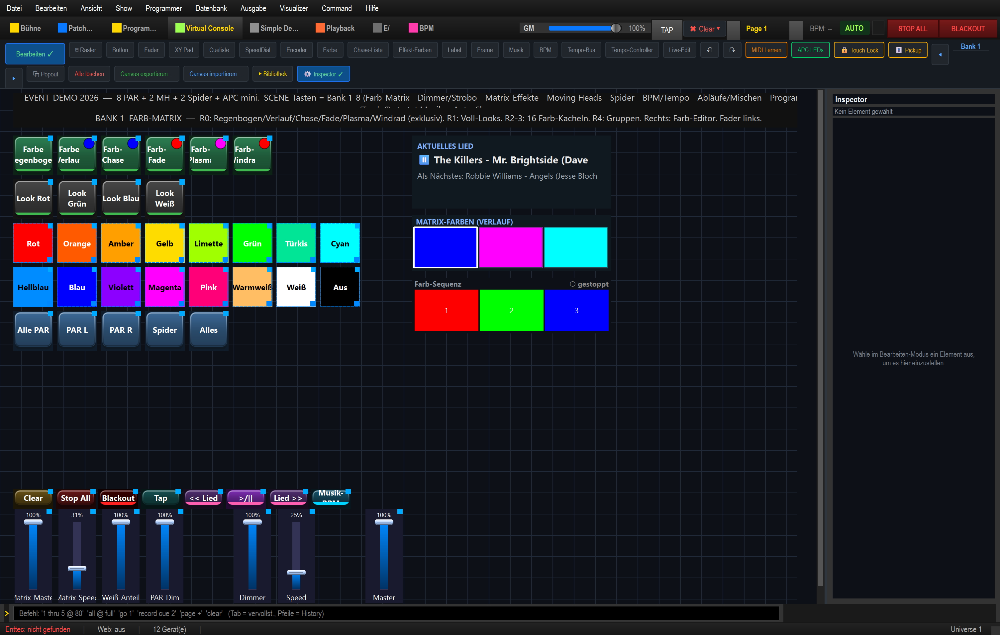
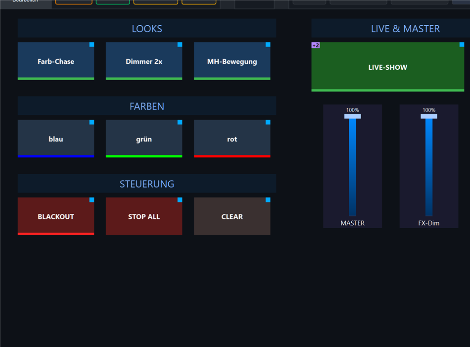
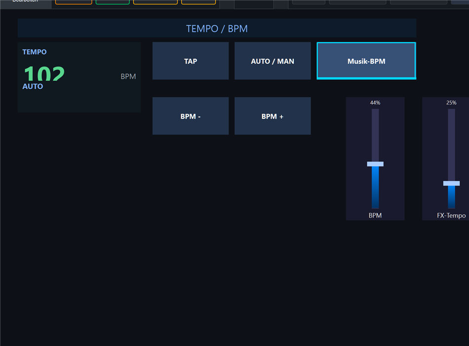
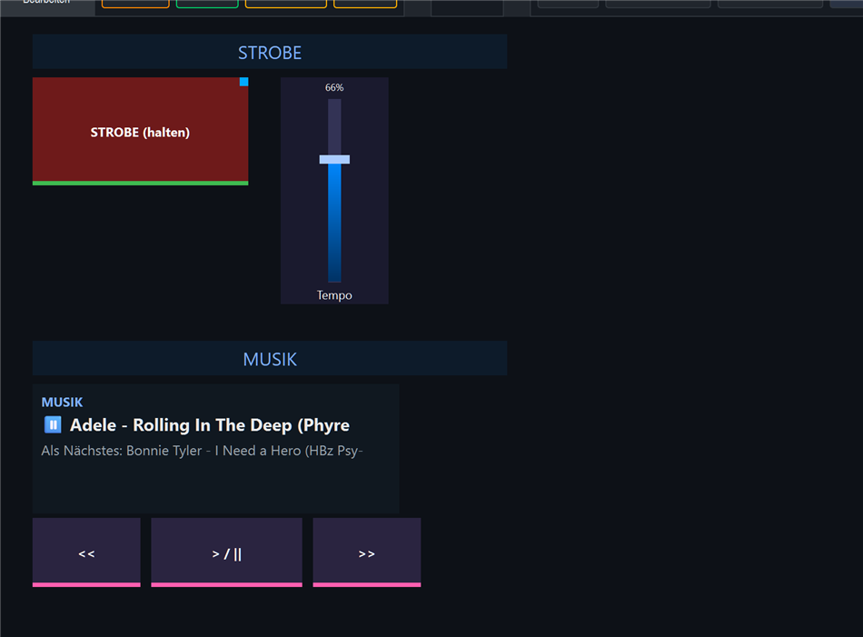
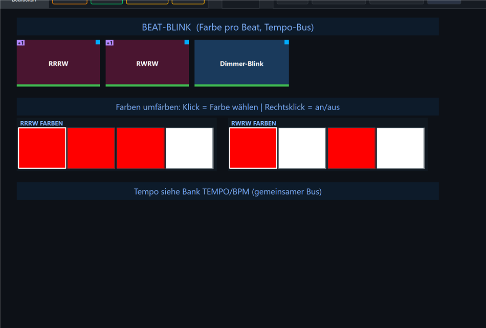
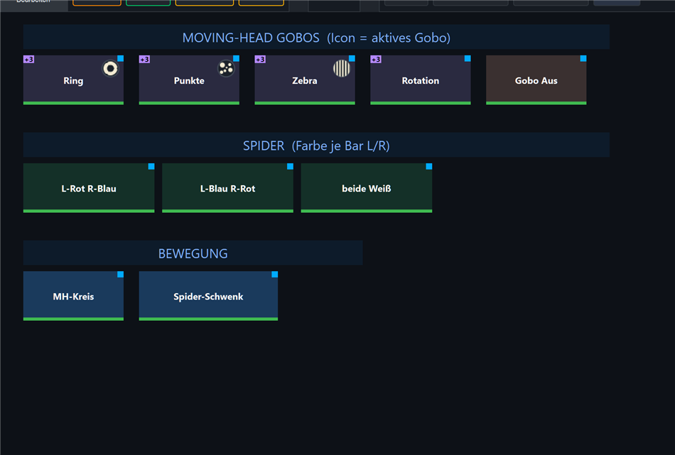
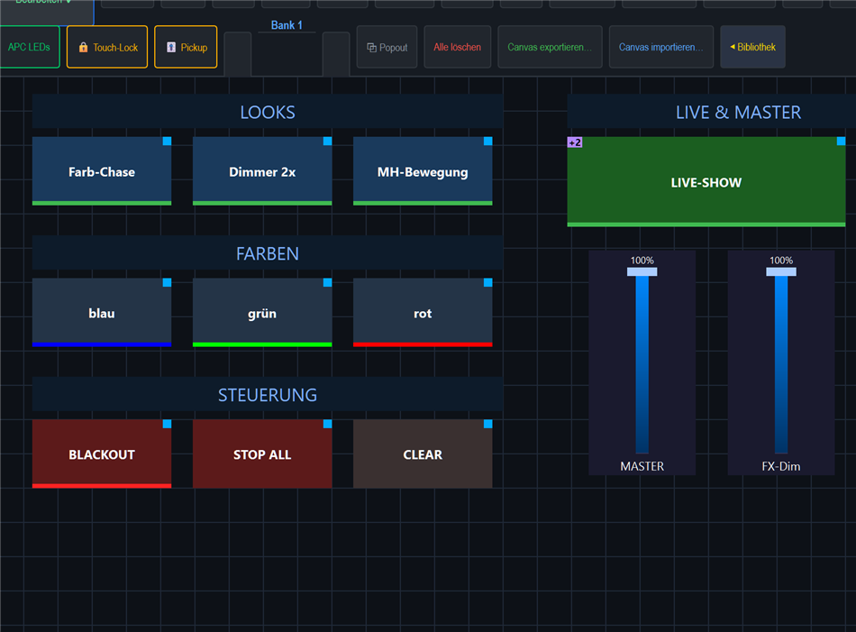
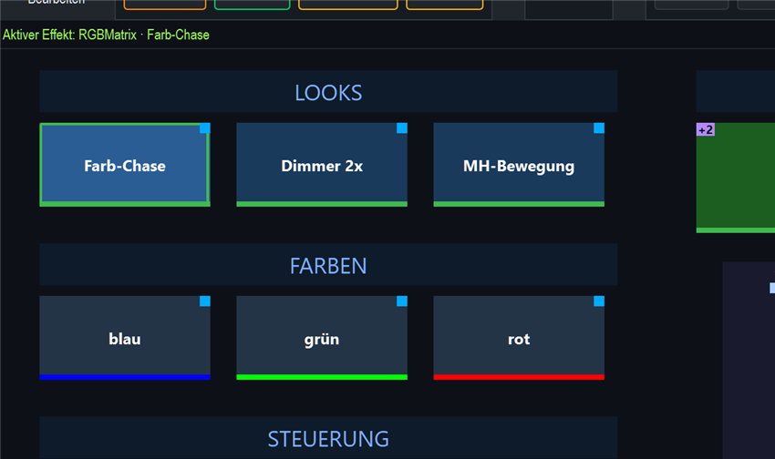
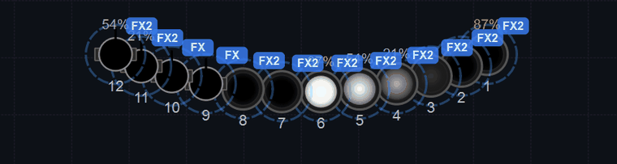
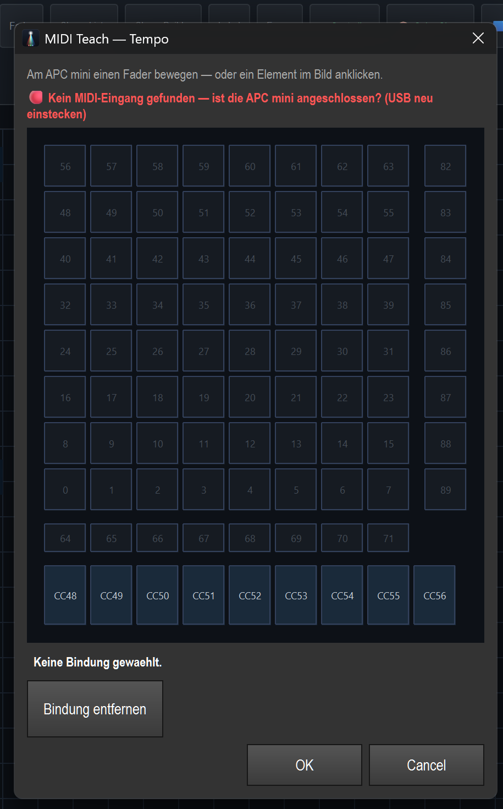

# Anleitung: Virtuelle Konsole (VC) bauen & designen

> Die **Virtuelle Konsole** ist deine eigene Bedienoberfläche: Buttons, Fader und Farb-Kacheln,
> frei platziert, optional auf den **APC mini** gemappt. Hier baust du sie Schritt für Schritt —
> alles in der Oberfläche, ohne Code.

---

## 1. VC öffnen & Bearbeiten-Modus

Oben in der Toolbar **Virtual Console** wählen. Anfangs ist der Canvas leer (Raster). Rechts ist die
**Bibliothek** mit deinen Funktionen und Farb-Snaps.

Klick oben links auf **Bearbeiten** (Schalter wird grün, Beschriftung „Bearbeiten ✓"). Jetzt erscheinen
die Widget-Werkzeugleiste und das Raster zum Platzieren. Die Werkzeugleiste hat **16 Schnell-Anlegen-
Knöpfe** für je einen Widget-Typ:

**Button**, **Fader**, **XY Pad**, **Cueliste**, **SpeedDial**, **Encoder**, **Farbe**,
**Chase-Liste**, **Effekt-Farben**, **Label**, **Frame**, **Musik**, **BPM**, **Tempo-Bus**,
**Tempo-Controller**, **Live-Edit**.

Rechts daneben **↶ / ↷** (Rückgängig/Wiederholen, Strg+Z / Strg+Y). Fertige Vorlagen — etwa eine
**Controller-Vorlage** für ein komplettes APC-mini-Layout — lassen sich zusätzlich über die Funktion
**„Controller-Vorlage einfügen"** einsetzen (siehe *APC mini mappen*).

## 2. Widgets anlegen

**Schnellster Weg — Effekt aus der Bibliothek ziehen → Drop-Karte:** Eine **Funktion/einen Effekt**
(z. B. `Matrix 1`) aus der rechten Bibliothek **auf eine freie Stelle des Rasters ziehen** → es öffnet
sich die Drop-Karte **„Effekt einrichten"**. Statt einer starren Dialog-Kette zeigt sie **eine Zeile je
steuerbarem Aspekt** als Häkchen — du kreuzt an, was der Effekt können soll. **„An/Aus (Toggle)"** ist
vorangekreuzt: ein Klick auf **Erstellen** liefert den klassischen Toggle-Button. Setzt du **mehrere
Häkchen**, entstehen **mehrere fertig verdrahtete Widgets in EINEM Schritt** (ein einziges **Strg+Z**
macht alles rückgängig). Die Karte ist intelligent — sie zeigt nur Aspekte, die für genau diesen Effekt
sinnvoll sind (eine Dimmer-Matrix hat z. B. keine „Farben"-Zeile). Selten gebrauchte Parameter liegen
aufgeklappt unter **„Mehr Parameter"**.

Gibt es für einen Aspekt **mehrere passende Bedien-Elemente** (z. B. Tempo = Speed-Rad **oder** Fader),
steht in der Zeile **„Widget: … ▸ ändern"**. Ein Klick öffnet die **grafische Widget-Galerie**
(„Widget wählen") als eigenes Fenster — du siehst die Möglichkeiten als Kacheln und tippst eine an:

**Drop auf einen schon belegten Regler:** Ziehst du einen Effekt auf ein **bereits belegtes**
Bedien-Element (z. B. einen Speed-Regler oder Fader), wird *nicht* mehr stumm gekoppelt — es erscheint
die Konflikt-Karte **„Regler ist schon belegt"** mit drei Wegen:
- **Ersetzen** — der Regler steuert dann nur noch den neuen Effekt.
- **Dazu koppeln** — beide Effekte hängen am selben Regler (eine Gruppe, ein Tempo).
- **Neues Widget daneben** — der Regler bleibt unberührt, ein eigenes Element entsteht.

**Widget-Typ nachträglich tauschen:** auf jedem vorhandenen Widget **Rechtsklick → „↔ Widget ändern…"** →
dieselbe Galerie. Der Typ wird getauscht, die Effekt-Bindung (Effekt, Beschriftung, Position) bleibt.

**Farb-Snap aus der Bibliothek:** Ein **Farb-Snap** (`blau`) erzeugt beim Ziehen weiterhin **DIREKT eine
Farb-Kachel** (farbiger Strich) — ohne Drop-Karte. Alternativ **Rechtsklick auf einen Bibliothek-Eintrag
→ „➡ Auf VC-Taste legen"** (Klick-Alternative zum Ziehen).

So ist hier **Bank 1** entstanden — Reihe 1 die drei Looks (Matrix 1 = Farb-Chase, Matrix 2 = Dimmer,
EFX 1 = Moving-Head-Bewegung), Reihe 2 die Farb-Kacheln blau/grün/rot:

**Alternativweg — manuell über die Werkzeugleiste** (für Bedienelemente ohne Funktion): Werkzeugleiste →
**Button** / **Fader** / **Farbe** anklicken → das Widget landet auf dem Raster → **Doppelklick** öffnet
die Eigenschaften (im Rechtsklick-Menü heißt dieser Eintrag **„Einstellungen..."**):
- **Button → Aktion:** Funktion an/aus, Flash, Snapshot, Tap-Tempo, Musik-BPM, BPM ±, Blackout, Stop All …
- **Fader → Modus:** Grand Master, Effekt-Tempo, Effekt-Helligkeit, BPM (30–300), Programmer (z. B. Dimmer) …
- **Farbe → Ziel:** „Programmer/Selektion" / „Alle Fixtures" / „Effekt (aktive Farbe)".

## 3. Das fertige Layout — 5 Bänke mit Labels

Oben über **◀ / Bank X / ▶** (oder Tastatur **Strg + Bild↑ / Bild↓**) zwischen Bänken wechseln.
Ein neu angelegtes Widget landet auf der **gerade sichtbaren** Bank. Mit **Label-Widgets** als
Zonen-Überschriften wird die Konsole übersichtlich. Die Hardstyle-Show nutzt **fünf Bänke**:

### Bank 1 — Performance

- **LOOKS:** `Farb-Chase` / `Dimmer 2x` / `MH-Bewegung` — Funktions-Toggles (grüner Strich unten).
- **FARBEN:** `blau` / `grün` / `rot` — Farb-Kacheln (farbiger Strich).
- **STEUERUNG:** `BLACKOUT` / `STOP ALL` / `CLEAR`.
- **LIVE & MASTER:** der große grüne **LIVE-SHOW**-Knopf startet den kompletten farbigen
  Auto-Look (MH-Bewegung + Farb-Chase + Dimmer, alle als **Mehrfach-Aktion** `an` — das
  **„+2"**-Abzeichen = zwei Zusatzaktionen). Darunter die Fader **MASTER** (Grand Master) und
  **FX-Dim** (Effekt-Helligkeit).

### Bank 2 — Tempo / BPM

- **TEMPO**-Anzeige (live BPM + Quelle/Modus), **TAP**, **AUTO / MAN** (Umschalter),
  **Musik-BPM** (Audio-Erkennung an/aus — hier aktiv = cyan), **BPM −/+** (Nudge)
  und die Fader **BPM** (30–300) + **FX-Tempo** (Effekt-Tempo).

### Bank 3 — Strobe / Musik

- **STROBE (halten)** — gehaltener Master-Strobe über eine RGB-Matrix mit Algorithmus *Strobe*
  + **Tempo**-Fader (Strobe-Tempo). Darunter die **MUSIK**-Anzeige (Now Playing / Als Nächstes) und die
  Media-Tasten **`<<` / `> / ||` / `>>`** (Zurück / Play-Pause / Vor).

### Bank 4 — Beat-Blink / Effekt-Farben

- **BEAT-BLINK** (Farbe pro Beat, an den **Tempo-Bus** gekoppelt): eine **Effekt-Farben**-Reihe, die
  pro Beat umfärbt. **Klick = Farbe wählen, Rechtsklick = an/aus.** Das Tempo kommt vom gemeinsamen Bus
  (siehe Bank *Tempo / BPM*) — hier wird nur die Farbe gesetzt.

### Bank 5 — MH-Gobos / Spider / Bewegung

- **MOVING-HEAD GOBOS** — Tasten je Gobo (Icon = aktives Gobo).
- **SPIDER** — Farbe je Bar (links/rechts) als eigene Farb-Kacheln.
- **BEWEGUNG** — Bewegungs-Effekte/EFX für Moving Heads und Spider.

## 4. Fertig & testen

**Bearbeiten** wieder ausschalten → Run-Modus. Jetzt sind die Widgets bedienbar. Im
Bearbeiten-Modus sieht dieselbe Bank so aus (Raster + Werkzeugleiste sichtbar):

Ein Klick auf **Farb-Chase** startet den Chase — der Button leuchtet aktiv (heller Rahmen):

Ein Klick auf **LIVE-SHOW** startet den **kompletten Look** (MH-Bewegung + Farb-Chase +
Dimmer 2x). In der **Live-Ansicht** läuft die Show dann musik-/BPM-synchron — der Farb-Chase
über alle Geräte (inkl. Moving Heads) und der **Dimmer doppelt so schnell** (Helligkeits-%
wandert):

## 5. APC mini anbinden

Es gibt **zwei Wege**, ein VC-Widget auf eine APC-mini-Taste/-Fader zu legen:

**A — Schnell per „MIDI Lernen":** Toolbar **MIDI Lernen** aktivieren (orange) → das gewünschte
VC-Widget anklicken → am APC mini die Taste **drücken** bzw. den Fader **bewegen** → Bindung wird
gespeichert (Pads = Note, Fader = CC).

**B — Per MIDI-Teach-Dialog (mit APC-Abbild):** im **Bearbeiten**-Modus das Widget **rechtsklicken**
→ **🎹 MIDI Teach...**. Es öffnet sich ein Abbild der APC mini — entweder am Gerät die Taste/den Fader
betätigen **oder** das Element im Bild direkt anklicken (geht auch **ohne** angeschlossene APC):

**APC-mini-Belegung** (Original): **Pad-Grid Note 0–63** (Reihe×Spalte), **Track-Tasten 64–71**
(unter dem Grid), **Scene-Tasten 82–89** (rechte Spalte), **Fader CC 48–56** (CC56 = Master). Der
**mk2** hat dasselbe Eingangs-Layout (RGB-LED-Ausgabe abweichend, wird automatisch erkannt).

**LED-Feedback:** Toolbar **APC LEDs** einschalten → die Pads spiegeln den Zustand zurück (aktiv,
gedrückt, Farbe der Farb-Kachel; beim mk2 auch Beat-Blitzen am TAP-Pad). Bindungen werden **mit der
Show** gespeichert (auf dem Widget: `midi_data1`/`midi_type` bzw. `midi_cc`). Ohne angeschlossene
APC funktioniert die Bedienung weiter per Touch/Tastatur — nur ohne LED-Rückmeldung.

→ **Ausführlich** (Belegung, LED-Feedback, mk2): [APC mini mappen](../anleitung_apc_mapping/ANLEITUNG_APC.md).

## 6. Tempo / BPM-Bedienelemente (Bank 2)

LightOS bringt fertige BPM-Bausteine mit — einfach als Button/Fader/Widget anlegen und die Aktion wählen:
- **Tap-Tempo** (TAP), **Musik-BPM** (AUTO-Audio-Erkennung an/aus), **BPM +/−** (Nudge),
  **AUTO/MANUAL-Umschalter**, **BPM-Fader** (30–300) und ein **BPM-Anzeige-Widget** (zeigt Tempo + Quelle).
- AUTO-Audio aktivierst du in der **Sektion BPM** (Navigations-Button **BPM** → BPM-Tab / BPM-Manager,
  Quelle: PC-Audio/Loopback) — dann folgen alle
  Beat-Effekte taktgenau der Musik. Die TEMPO-Anzeige auf Bank 2 zeigt die Live-BPM grün an.

## 7. Musik-Player (Bank 3)

Es gibt ein **Song-Anzeige-Widget** (zeigt „Now Playing"/nächstes Lied) sowie Media-Buttons
(**`> / ||`** = Play/Pause, **`<<`** = Zurück, **`>>`** = Vor) — als Button mit der jeweiligen
Media-Aktion. So steuerst du den
internen Player direkt aus der VC (siehe Bank 3 oben). Ohne geladene Playlist steht dort
„— (keine Playlist)".

→ **Ausführlich** (Playlist, Auto-Show, BPM-Sync): [Musik-Sync & Auto-Show](../anleitung_musik_sync/ANLEITUNG_MUSIK_SYNC.md).

## 8. Strobe (Bank 3)

Der **STROBE**-Knopf ist ein **gehaltener** Master-Strobe: Aktion **Funktion-Flash** auf eine
RGB-Matrix mit Algorithmus **Strobe** (treibt alle PAR + Spider weiß an/aus). Der **Tempo**-
Fader daneben (Modus **Effekt-Tempo**, fest auf die Strobe-Matrix gebunden) regelt die Blitzrate —
ideal für Hardstyle-Drops: Knopf halten, Tempo nachziehen.

## 9. Speichern

Die VC wird **mit der Show** gespeichert (Datei → Speichern bzw. Strg+S). Optional lässt sich ein
Layout über **Canvas exportieren…** als Datei sichern und später wieder **importieren**.

---

**Kurz:** Virtual Console → Bearbeiten → Effekt aus der Bibliothek aufs Raster ziehen → in der Karte
„Effekt einrichten" ankreuzen → Erstellen (Farb-Snaps werden direkt zur Kachel; manuell geht es auch über
die Werkzeugleiste + Doppelklick→Einstellungen) → 5 Bänke füllen → Bearbeiten aus → testen → optional APC
mini per „MIDI Lernen" mappen → mit der Show speichern.
