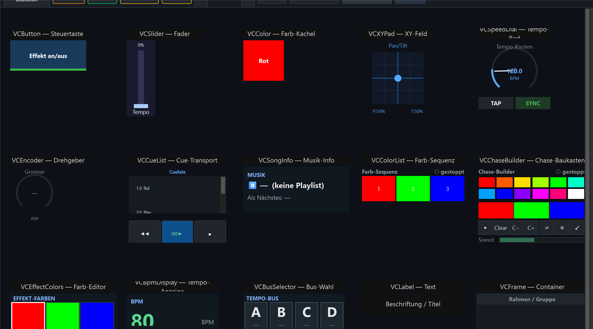
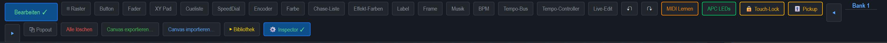
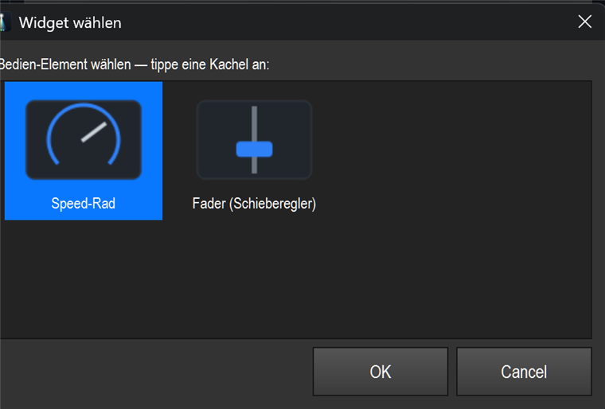
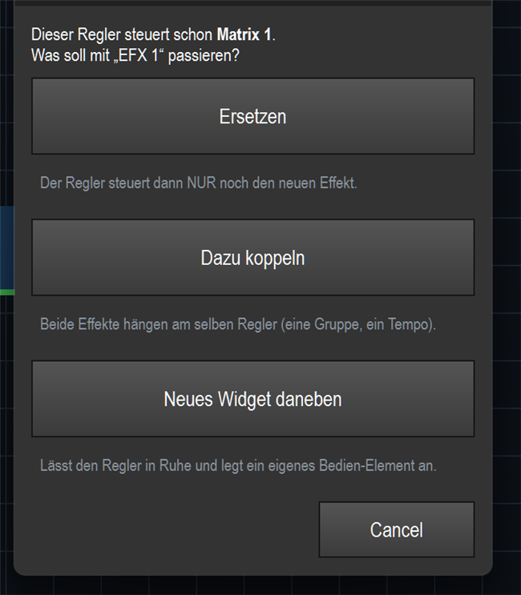
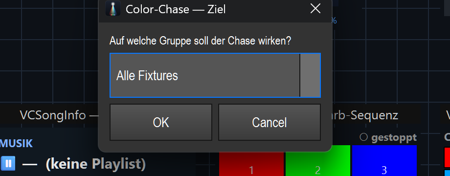

# Referenz: Alle VC-Elemente (Virtual Console)

> **Überblick aller 15 Bau-Elemente** der Virtual Console — was sie sind, wie man sie
> bedient und was man einstellen kann. Plus die **Baukasten-Knöpfe** (komplette Blöcke)
> und die neue **Gruppenwahl** beim Color-Chase.
>
> Vorlage zum Anschauen: `shows/VC_Elemente_Showcase.lshow` (Generator
> `tools/build_vc_elements_showcase.py`) — legt jeden Typ einmal beschriftet ab.

---

## So legt man ein Element an

Es gibt **zwei Wege**:

### Weg A — über die Toolbar

1. In der VC oben **„Bearbeiten"** anklicken (→ „Bearbeiten ✓").
2. In der Toolbar den gewünschten **Knopf** klicken → das Element erscheint in der
   Canvas-Mitte und kann an seinen Platz gezogen werden.
3. **Doppelklick** auf das Element → **Einstellungen**-Dialog.
4. **Rechtsklick** → Kontextmenü (siehe unten).

> **Neu:** Die Toolbar bietet jetzt **alle 15 Typen** als Knopf an — auch die früher nur
> intern verfügbaren **Effekt-Farben, Musik, BPM, Tempo-Bus**. Passt nicht alles in eine
> Zeile, bricht die Toolbar automatisch in eine zweite Zeile um.

### Weg B — Effekt aus der Bibliothek auf die Canvas ziehen

Du kannst auch einen **Effekt aus der Bibliothek direkt auf die Canvas ziehen** — LightOS
baut dir dann das passende Bedien-Element praktisch von selbst.

- **Drop auf eine freie Stelle** → es öffnet sich die Karte **„Effekt einrichten"**
  (Fenster). Sie fragt *„… — was soll dieser Effekt können?"* und zeigt **je Aspekt eine
  ankreuzbare Zeile** („An/Aus (Toggle)", „Tempo (Geschwindigkeit)", „Helligkeit",
  „Farben ändern…", „Bewegung (XY-Feld)…", „Tempo-Bus zuweisen…",
  „Tempo-Multiplikator (×½ ×2)…" …). „An/Aus (Toggle)" ist vorangekreuzt. Pro Zeile gibt es — wo mehrere Bedien-Typen
  passen — den Knopf **„Widget: … ▸ ändern"**, der die **grafische Widget-Galerie** öffnet
  (Element per Bild wählen statt aus einer Liste). Selten gebrauchte Parameter stecken unter
  **„Mehr Parameter"**. Ein Klick auf **„Erstellen"** legt für jedes Häkchen ein fertig
  verdrahtetes Widget an — alles in **einem** Undo-Schritt.

  

  

- **Drop auf einen schon belegten Regler** → es erscheint die **Konflikt-Karte**
  „Regler ist schon belegt". Sie sagt dir, was der Regler bereits steuert, und bietet drei
  klare Wege: **„Ersetzen"** (Regler steuert nur noch den neuen Effekt), **„Dazu koppeln"**
  (beide Effekte am selben Regler, eine Gruppe / ein Tempo) oder **„Neues Widget daneben"**
  (lässt den Regler in Ruhe, legt ein eigenes Element an). Abbrechen lässt alles unverändert.

  

### Rechtsklick-Menü (Kontextmenü)

Rechtsklick auf ein Element (im Bearbeiten-Modus) öffnet:

- **Einstellungen…** — derselbe Dialog wie beim Doppelklick.
- **↔ Widget ändern…** — tauscht den Bedien-Typ bindungserhaltend über die grafische
  **Widget-Galerie** (nur wenn für den Aspekt mehrere Typen passen, z. B. Tempo →
  Speed-Rad *oder* Fader).
- **⚡ Live-Parameter…** — nur bei effektgebundenen Elementen mit Live-Parametern.
- **🎹 MIDI Teach…** / **⌨ Taste zuweisen…** — MIDI- bzw. Tastatur-Bindung lernen
  (je nach Element-Typ).
- **Bank** (Untermenü) — Element einer Bank zuordnen: **„Alle Banks"** oder **Bank 1…10**.
- **Löschen** / **Vordergrund-Farbe** / **Hintergrund-Farbe**.

---

## Die 14 Elemente im Detail

| Element | Was es ist | Bedienung (Betrieb) | Wichtigste Einstellungen (Doppelklick) |
|---|---|---|---|
| **Button** (VCButton) | Steuertaste | Klick löst die Aktion aus | **Aktion** (Funktion an/aus, Flash, Effekt-Aktion, Snapshot, Gruppe wählen, Tap, Musik …), **Funktion/Chase**, Beschriftung, Pad-Stil, Exklusiv/Solo, MIDI |
| **Fader** (VCSlider) | Schieberegler | Hoch/runter ziehen (0–255) | **Modus** (Level, Submaster, Grand-Master, Programmer, BPM, Speed, Effekt-Tempo/-Intensität/-Param, Gruppen-Dimmer, **Tempo-Bus**), Tempo-Bus, Wert min/max, Invertieren, Effekt-ID, MIDI-CC |
| **Farbe** (VCColor) | Farb-Kachel | Klick setzt die Farbe | RGB/W/A/UV, mit Helligkeit, **Ziel** (Programmer/Alle/Effekt-Farbe …), Effekt-ID, MIDI |
| **XY Pad** (VCXYPad) | 2D-Feld für Pan/Tilt | Im Feld ziehen = Pan/Tilt (Position) bzw. Bereich/Bahn aufziehen | **Modus** (Position / Feld / Pfad), Pan/Tilt-Attribut, 16-bit, Fixtures, Effekt-ID (Feld/Pfad), MIDI-CC Pan/Tilt |
| **SpeedDial** (VCSpeedDial) | Tempo-Drehrad | Drehen = BPM; Tap/Sync/Faktor-Tasten | **Ziel** (Executor / Funktion·Effekt / Tempo-Bus / **Effekt ×½·×2 Multiplier** / Speed-Knoten), Rolle **Master/Sub**, Tempo-Bus, Parent-Bus, Faktor-Set |
| **Encoder** (VCEncoder) | Relativ-Drehgeber | Drehen = Effekt-Parameter ±  | **Param-Key** (size/hold/speed …), Effekt-ID, Schrittweite, MIDI-Modus |
| **Cue List** (VCCueList) | Cue-Transport | GO / BACK / STOP schaltet Cues | **Executor-Slot** (welche Cueliste) |
| **Musik** (VCSongInfo) | Musik-Info-Anzeige | nur Anzeige (aktuelles + nächstes Lied) | Beschriftung, Schriftgröße |
| **Chase-Liste** (VCColorList) | Live-Farb-Sequenz | Klick = Farbe an/aus, Rechtsklick = entfernen | **Effekt-ID** (zeigt dessen Farb-Sequenz) |
| **Effekt-Farben** (VCEffectColors) | Farb-Sequenz-Editor | Feld klicken = Farbwähler, Rechtsklick = aktiv | **Effekt-ID**, Edit-Slot |
| **BPM** (VCBpmDisplay) | Live-Tempo-Anzeige | nur Anzeige (BPM + Quelle) | **Tempo-Bus** (leer = global), Schriftgröße |
| **Tempo-Bus** (VCBusSelector) | Bus-Auswahl (A/B/C/D) | Chip klicken = aktiven Bus schärfen | Bus-Liste |
| **Text** (VCLabel) | Beschriftung/Titel | nur Anzeige | Text, Schriftgröße |
| **Container** (VCFrame) | Rahmen/Gruppe | nimmt Kind-Widgets auf, optional Tabs | Seiten-Anzahl, Header anzeigen, Solo |

> **Hinweis „braucht eine Bindung":** **Chase-Liste, Effekt-Farben** zeigen
> erst etwas, wenn sie an einen Effekt gebunden sind (Effekt-ID im Dialog). Frisch und
> ungebunden zeigen sie nur einen Platzhalter — sie stürzen aber nicht ab.

---

## Baukasten-Knöpfe (komplette Blöcke)

Drei Knöpfe setzen **nicht** nur ein Einzel-Widget, sondern einen **ganzen Block** inkl.
eigener Effekt-Funktion:

- **⌗ Controller** — legt ein beschriftetes Pad-/Fader-Raster passend zu einem MIDI-Controller
  (APC mini/mk2 …) an. Pads danach per Rechtsklick belegen.
- **🎨 Color-Chase** — legt eine **COLORFADE-Funktion + kompletten Chase-Baukasten**
  (Palette, Farb-Liste, Speed/Hold-Fader, Aktions-Tasten) an, alles aneinander gebunden.
- **🟦 Chase-Bereich** — wie Color-Chase, aber du **ziehst** zuerst einen Bereich auf der
  Canvas auf; der Block wird hineingelegt.

### Neu: Chase auf eine **Gruppe**

Beim **🎨 Color-Chase** / **🟦 Chase-Bereich** fragt LightOS jetzt zuerst, **auf welche
Fixture-Gruppe** der Chase wirken soll:

- **„Alle Fixtures"** → Chase über alles (wie bisher).
- oder eine **Gruppe** (z. B. *Alle PAR* / *Strahler*, *Spider*, *Moving Heads*) → der
  komplette Chase-Block steuert **nur diese Gruppe**. Genau so bekommst du „einen
  Chase-Builder auf die Gruppe Strahler".

> Die Liste enthält automatisch alle in der Show angelegten Fixture-Gruppen. (Im
> Schaukasten oben gibt es keine Gruppen, daher nur „Alle Fixtures"; in der Event-Demo
> erscheinen *Alle PAR · PAR Links/Rechts · Moving Heads · Spider · Alle Mover · Alles*.)

---

## Stand / Nutzbarkeit (Kurz)

- **Alle 14 Typen** sind über die Toolbar anlegbar (der frühere „Chase Builder"/VCChaseBuilder
  wurde 2026-07 komplett entfernt, PR #116).
- **Sofort nutzbar ohne Bindung:** Button, Fader, Farbe, XY Pad, SpeedDial, Encoder, Musik,
  BPM, Tempo-Bus, Text, Container, Cue List (mit Executor-Slot).
- **Erst mit Effekt-Bindung sinnvoll:** Chase-Liste, Effekt-Farben — am
  bequemsten über den **🎨 Color-Chase**-Baukasten (legt Effekt + Bindung in einem Rutsch an,
  jetzt wahlweise auf eine Gruppe).
