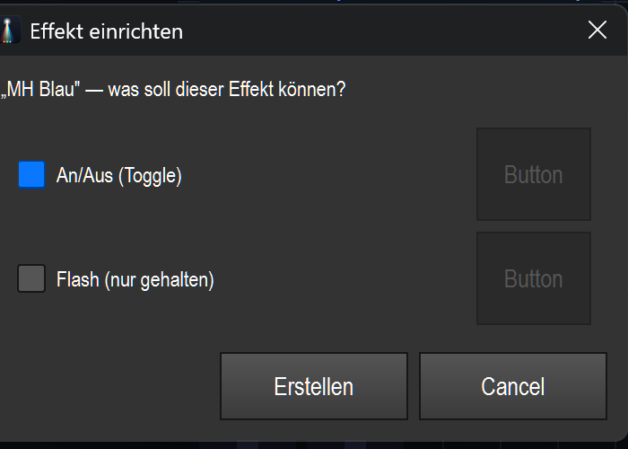
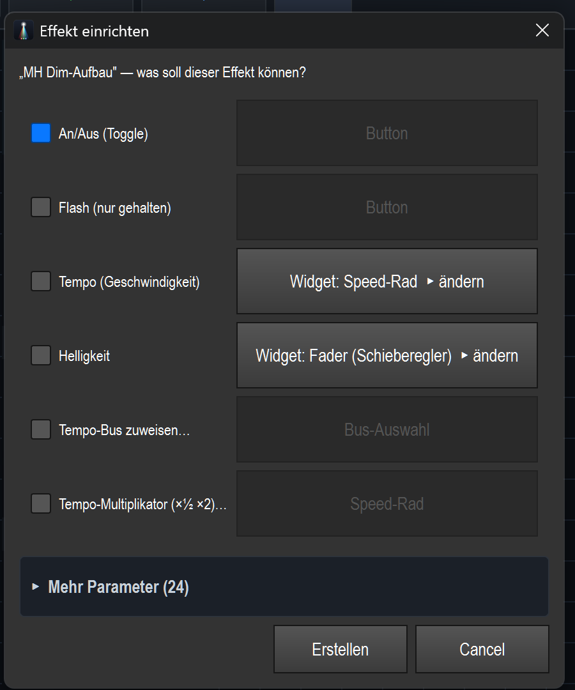
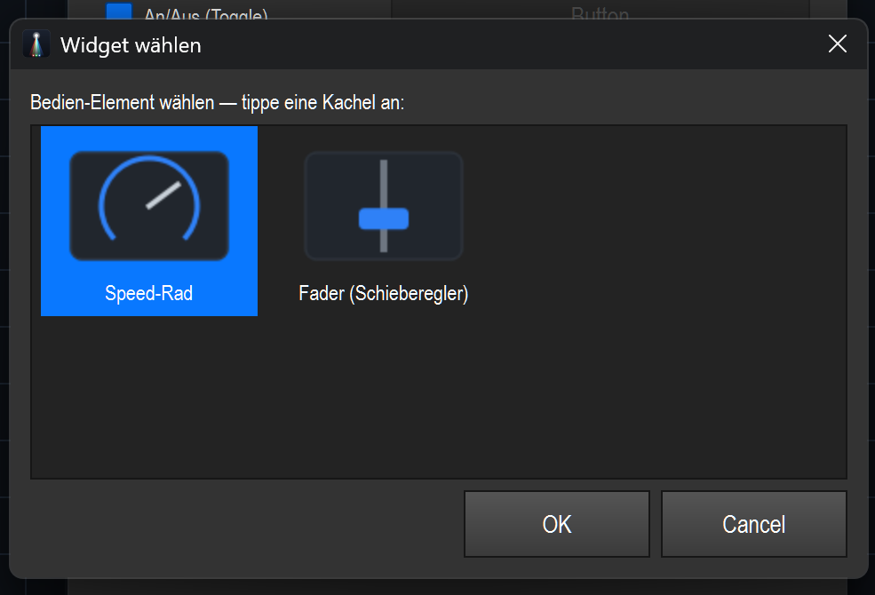
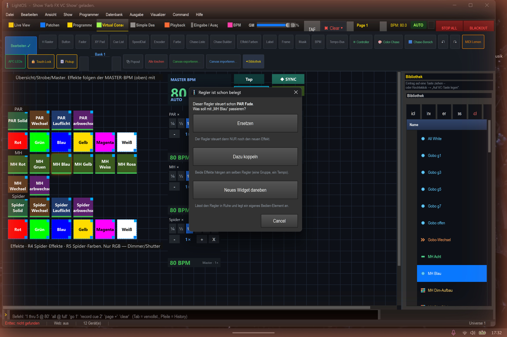
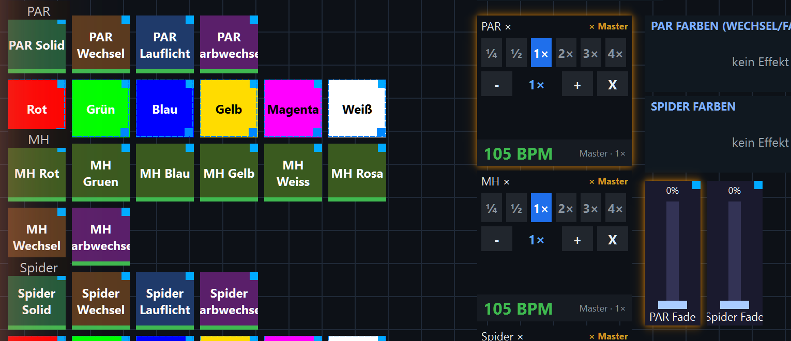
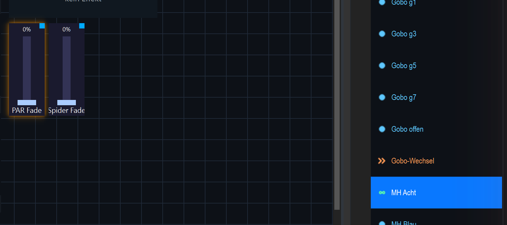

# Virtuelle Konsole — Effekte einfach aufbauen

> Neuer, anfängerfreundlicher Aufbau-Workflow der Virtuellen Konsole:
> Effekt reinziehen → ankreuzen was er können soll → fertig. Plus grafische
> Widget-Auswahl, Schutz vor doppelter Belegung und ein Highlighting, das zeigt,
> welche Bedien-Elemente denselben Effekt steuern.
>
> Alle Screenshots stammen aus der Demo-Show **Farb FX VC Show** (live aufgenommen).

---

## 1. Effekt reinziehen → die „Effekt einrichten"-Karte

Im **Bearbeiten**-Modus einen Effekt aus der **Bibliothek** (rechts) auf eine freie
Stelle des Canvas ziehen. Statt einer starren Dialog-Kette öffnet sich **eine Karte
mit Checkboxen** — du kreuzt an, was der Effekt können soll, und bestätigst mit
**„Erstellen"**. Pro Häkchen entsteht **ein fertig verdrahtetes Bedien-Element**,
alles in **einem** Schritt (ein Strg+Z macht es komplett rückgängig).

Die Karte ist **intelligent**: sie zeigt nur Optionen, die für genau diesen Effekt
sinnvoll sind.

**Einfacher Effekt** (z. B. eine Szene ohne Live-Parameter) → nur An/Aus + Flash:

**Reicher Effekt** (z. B. eine Dimmer-Matrix) → zusätzlich Tempo, Helligkeit und die
**Tempo-Unterformen** als eigene Zeilen. Beachte: Bei einer **Dimmer**-Matrix gibt es
**keine „Farben"-Zeile** (sie nutzt keine Farben) — genau das meint „intelligent".

Die Tempo-Steuerung ist in **eigene Auswahl-Einträge** aufgeteilt, damit du nichts
nachträglich umstellen musst:

| Zeile | erzeugt |
|---|---|
| **Tempo (Geschwindigkeit)** | Speed-Rad / Fader für die direkte Effekt-Geschwindigkeit |
| **Tempo-Bus zuweisen…** | Bus-Auswahl (A/B/C/D) |
| **Tempo-Multiplikator (×½ ×2)…** | Speed-Rad direkt im Multiplikator-Modus (relativ zum Bus) |

Selten gebrauchte Parameter liegen aufgeklappt unter **„Mehr Parameter"**.

---

## 2. „Widget wählen" → grafische Galerie

Hat ein Aspekt mehrere passende Bedien-Elemente (z. B. **Tempo** = Speed-Rad **oder**
Fader), steht in der Zeile **„Widget: … ▸ ändern"**. Ein Klick öffnet die **grafische
Galerie als eigenes Fenster** — du siehst die Möglichkeiten als Kacheln und tippst
eine an:

Dieselbe Galerie erreichst du auf **jedem vorhandenen Widget** per **Rechtsklick →
„↔ Widget ändern…"**. Der Typ wird getauscht, die Effekt-Bindung (Effekt, Beschriftung,
Position) bleibt erhalten.

---

## 3. Effekt auf einen belegten Regler → Schutz vor Doppelbelegung

Ziehst du einen Effekt auf ein **bereits belegtes** Bedien-Element (z. B. einen
Speed-Regler oder Fader), wird **nicht mehr stumm** ein zweiter Effekt angehängt.
Stattdessen fragt eine kleine Karte, was passieren soll:

- **Ersetzen** — der Regler steuert dann **nur noch** den neuen Effekt.
- **Dazu koppeln** — beide Effekte hängen am selben Regler (eine Gruppe, ein Tempo).
- **Neues Widget daneben** — der Regler bleibt unberührt, ein eigenes Element entsteht.

---

## 4. Highlighting — „was beeinflusst diesen Effekt?"

Nur im **Bearbeiten**-Modus. Tippst du ein Bedien-Element an, leuchten **alle anderen
Widgets orange**, die denselben Effekt steuern. So siehst du auf einen Blick, was
zusammengehört.

Im Beispiel ist **„PAR Solid"** angetippt → der **PAR-×-Multiplikator** und der
**PAR-Fade-Fader** (beide steuern den PAR-Effekt) leuchten; MH/Spider bleiben dunkel:

Das Highlighting geht auch von der **Bibliothek** aus: wählst du dort einen Effekt aus,
leuchten alle VC-Widgets, die ihn beeinflussen.

**Auch gekoppelte Effekte zählen mit.** Im Beispiel wurde „MH Acht" per
*Dazu koppeln* auf den **PAR-Fade-Fader** gelegt. Wählt man danach „MH Acht" in der
Bibliothek, leuchtet der PAR-Fade-Fader auf — obwohl er ursprünglich nur den
PAR-Effekt steuerte:

**Hervorhebung aufheben:** ins Leere klicken oder den Bearbeiten-Modus verlassen.

---

## Kurz-Referenz

- **Aufbauen:** Effekt auf leeres Canvas ziehen → ankreuzen → *Erstellen*.
- **Widget-Typ ändern:** in der Karte „▸ ändern" oder Rechtsklick → „↔ Widget ändern…".
- **Doppelbelegung:** Effekt auf belegten Regler ziehen → Ersetzen / Dazu koppeln / Neues Widget.
- **Zusammengehörige Elemente sehen:** im Bearbeiten-Modus Widget antippen **oder** Effekt in der Bibliothek wählen → orange Hervorhebung.
