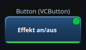
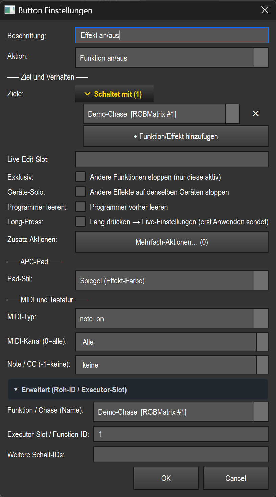
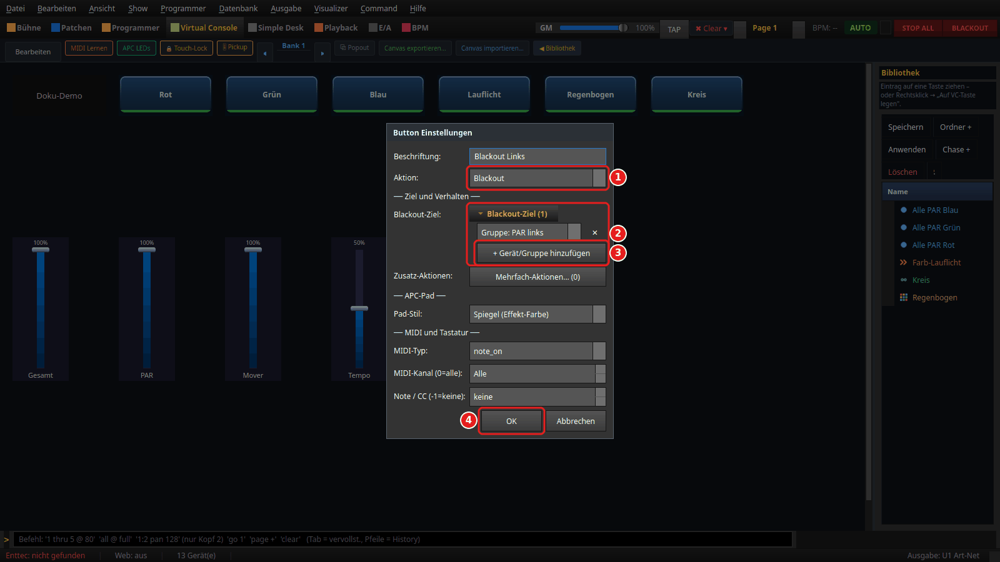
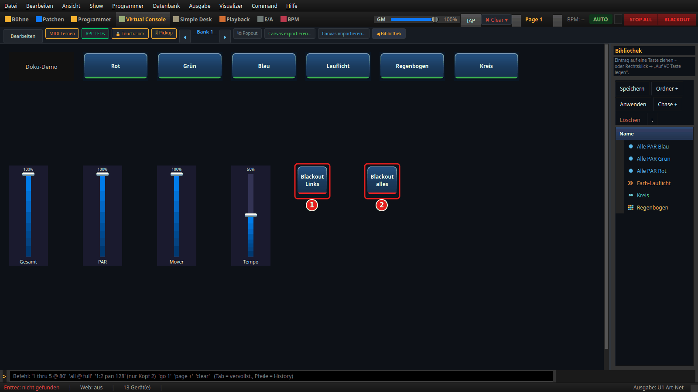
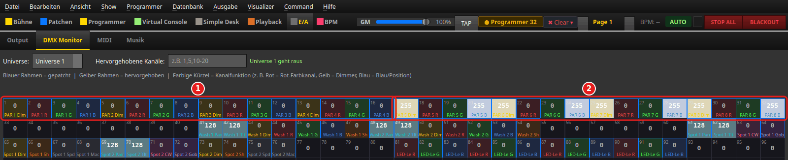
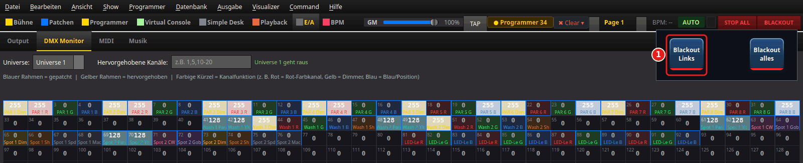
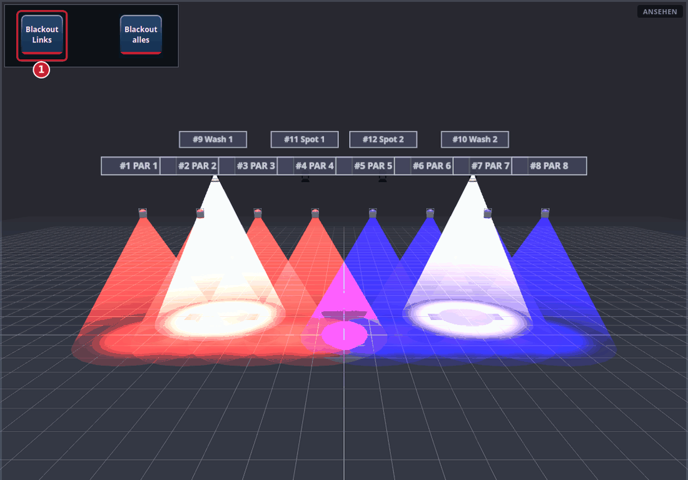

# Button (`VCButton`)

> **English version** of [Button (`VCButton`)](01_button.md). LightOS itself speaks German: every button, menu and field is quoted here **exactly as it appears on screen**, with an English translation in brackets the first time it shows up. The screenshots are the same as in the German page.

> A push button for the Virtual Console: pressing it triggers an action — from „Effekt an/aus" (effect on/off) through blackout and snapshot to tap tempo and music control.

## What it is for & what it controls

The button is the universal trigger element of the VC. Depending on the **Aktion** (action) you set, it toggles a function/effect, flashes a scene, clears the programmer, recalls a snapshot, controls tempo/BPM and tempo buses, selects a fixture group, triggers a live effect action or controls the music player. Several buttons together form a pad wall (APC-ready as well). A button can additionally be bound to an effect and remote-controlled via MIDI or keyboard.

The VC basics (edit mode, creating widgets, banks, Touch-Lock) are described in the overview — see the overview (README.en.md).

## What it looks like & how to use it during operation

The visible element is a rectangular tile with a centered, multi-line **Beschriftung** (label) (in the picture „Effekt an/aus"). Default size 120 × 60 px, dark blue background (`#1a3a5c`), white text. You can change the foreground and background colors via the right-click menu.

Visual indicators on the tile:

- **Color bar at the bottom (4 px)** depending on the action: orange = Flash · green = Funktion an/aus (function on/off) / Funktion (nur gehalten) (function (held only)) · red = Blackout · gold = Snapshot · the snap's own color = Bibliothek-Farbe/Snap (library color/snap) · cyan = Musik-BPM (music BPM) · pink = music player. The example picture shows the green bar of a „Funktion an/aus" action.
- **Snapshot number**: with a snapshot action, `[Snap N]` appears below the label.
- **Gobo icon** at the top right if the button sets a gobo (via a snap or a scene).
- **Blue square** at the top right = a MIDI note/CC is assigned.
- **`⌨` text** at the top left = a keyboard hotkey is assigned.
- **Purple `+N` badge** at the top left = N additional actions are stored.

State feedback while pressed/running:

- **Pressed** (mouse or MIDI/key): the tile gets brighter, plus a light yellow border.
- **Function running** (toggle pad): green border — stays on as long as the effect runs, not just while pressed.
- **Snap toggle active**: subtle green border.
- **Music BPM active**: cyan border.
- **MIDI learn armed**: orange border.

How to use it (only during operation, i.e. „Bearbeiten" (edit) OFF):

- **Press (hold) the left mouse button** = trigger the action with `press = True`. For hold actions (Flash, „nur gehalten" (held only), snap mode „Halten" (hold), „Alles Weiß" (all white)) it only takes effect while pressed.
- **Release the left mouse button** = `press = False` (ends flash/hold; no effect for toggle).
- **Long press (approx. 500 ms)** = with the action „Funktion an/aus" or „Effekt-Aktion (Live)" (effect action (live)) and a bound effect, opens the **Live-Mini-Editor** (values are only sent when you click „Anwenden" (apply)). Only active if the option **Long-Press** is set; a short tap cancels the timer. Deliberately not available for „Flash" (it clashes with holding).
- If **Touch-Lock** is active, the button ignores mouse/touch (display only); MIDI/APC keeps controlling it.

In **edit mode** the left mouse button moves/resizes the button; a double-click opens the settings; a right-click opens the context menu (Einstellungen (settings), MIDI Teach, Taste zuweisen (assign key), Bank, Löschen (delete), Farben (colors)).

## Settings

Depending on the selected **Aktion**, the dialog only shows the fields that apply. Beschriftung, Aktion, MIDI binding and APC pad display are always visible.

| Setting | Meaning | Values/options |
| --- | --- | --- |
| Beschriftung | Text on the tile | Free text |
| Aktion | What the button does when pressed | see the action table below |
| Executor-Slot / Function-ID | Target ID: function ID (effect/chase/scene) or, for the executor actions, the **0-based executor index of the active playback page** (0 = Ex 1, 9 = Ex 10 – not the playback page) | Number, empty = none |
| Funktion/Chase (Name) (function/chase (name)) | Select a function by name; fills the ID field automatically | Dropdown of all functions `Name [Typ #ID]` (name [type #ID]); `(nach ID/Slot oben)` (by ID/slot above) = manual |
| Weitere Ziel-IDs (further target IDs) | Additional function IDs that are toggled/flashed along with it (as a group) | Comma-separated IDs (only Funktion an/aus & nur gehalten) |
| Steuert (controls) | Readable list of the controlled functions by name; takes precedence when saving. First line → main ID, the rest → further IDs | Pick lines from the dropdown, remove them with `✕`, `+ Funktion/Effekt hinzufügen` (+ add function/effect) |
| Snapshot | Which saved snapshot is recalled | Dropdown `N: Name`, `(keiner)` (none) |
| Bibliothek-Farbe/Snap | Which snap (color/look) from the show library is set | Dropdown `Ordner/Name` (folder/name), `(keiner)` |
| Tasten-Modus (Snap) (key mode (snap)) | Behavior of the library snap | `Umschalten (an/aus)` (toggle (on/off)) · `Setzen (bleibt)` (set (stays)) · `Halten (nur gedrückt)` (hold (only while pressed)) |
| Effekt-Aktion (EffectAction) (effect action) | Which live action the bound effect performs | see the effect actions below; with a bound effect, also its own actions |
| Gruppe (SelectGroup) (group) | Fixture group that is selected into the programmer | Dropdown of existing groups, editable |
| Laser-Muster (Palette) (laser pattern (palette)) | **Required field for the action `Laser-Muster abrufen`** (recall laser pattern) — which saved pattern the button recalls. Without a selection the button does **nothing** when pressed (silent no-op). You create patterns in the programmer tab „Laser" with *Muster speichern* (save pattern), see [Laser-Anleitung](../anleitung_laser/ANLEITUNG_LASER.md) (German) | Dropdown of the saved laser patterns, editable (name can be typed) |
| Tempo-Bus | Which named tempo bus tap/sync/arming acts on | `(aktiver/Default-Bus)` (active/default bus) · `Bus A` · `Bus B` · `Bus C` · `Bus D` |
| Live-Edit-Slot | Free-text name; the started effect becomes the editing target of this slot. Faders/color tiles with the same slot edit it (exclusive per quadrant) | Free text (e.g. `MH`, `MX`) |
| Exklusiv (exclusive) | On start, stop all other running functions (solo) | Checkbox (function actions only) |
| Geräte-Solo (fixture solo) | On start, only stop effects that use the SAME fixtures (also from another bank); other fixtures keep running | Checkbox (function actions only) |
| Programmer leeren (clear programmer) | Clear the programmer before starting (otherwise manual colors/snaps take precedence and cover the effect) | Checkbox (function actions only) |
| MIDI-Typ (MIDI type) | Kind of MIDI message | `note_on` · `cc` |
| MIDI-Kanal (0=alle) (MIDI channel (0=all)) | MIDI channel | 0–16 (0 = `Alle` (all)) |
| Note / CC (-1=keine) (note / CC (-1=none)) | Note or CC number | -1–127 (-1 = `keine` (none)) |
| Pad-Stil (pad style) | Appearance on an APC pad grid | `Spiegel (Effekt-Farbe)` (mirror (effect color)) · `Feste Farbe` (fixed color) · `Pulsieren` (pulse) · `Zwei Farben im Wechsel` (two colors alternating) · `Dauer-Welle` (continuous wave) |
| 2. Pad-Farbe (Wechsel) (2nd pad color (alternating)) | Second color for the pad style „Zwei Farben im Wechsel" | Color picker (RGB) |
| Zusatz-Aktionen (additional actions) | Further actions that are executed on press after the primary action (with optional delay) | `Mehrfach-Aktionen… (N)` (multiple actions… (N)) opens the editor |
| Long-Press | A long press opens the effect editor in live mode (deferred apply) | Checkbox (only Funktion an/aus & Effekt-Aktion) |

### All actions (in plain words)

| Action (dropdown) | What happens |
| --- | --- |
| Funktion an/aus | Toggles the bound function(s): if any of them is running, all are stopped, otherwise all are started. Respects Exklusiv / Geräte-Solo / Programmer leeren / Live-Edit-Slot |
| Funktion (nur gehalten) | Starts the function(s) on press and stops them on release (flash at effect level) |
| Effekt-Aktion (Live) | Triggers a live action on the bound or the active effect (see the effect actions) |
| Gruppe auswählen (select group) | Selects the fixtures of the given group into the programmer (live selection via pad/MIDI) |
| Bibliothek-Farbe/Snap | Sets a snap (color/look) from the show library into the programmer; the behavior depends on the key mode (Umschalten/Setzen/Halten) |
| Snapshot abrufen (recall snapshot) | Writes the values of the selected snapshot into the programmer |
| Programmer leeren (Clear) | Clears the programmer (releases manual colors/snaps) |
| Alles stoppen (stop all) | Stops all executors/playbacks (`stop_all`) |
| Effekte stoppen (Tempo bleibt) (stop effects (tempo stays)) | Stops all running effect functions; tempo/BPM stay unchanged (pause/effect stop) |
| Blackout | Switches blackout on while pressed (momentary override) — everything to 0, only position/gobo/optics of moving heads with a dimmer stay where they are; lasers/fog completely off. With **Blackout-Ziel** (blackout target), only the selected fixtures/groups (see below) |
| Laser scharf/unscharf (laser armed/disarmed) | Arms/disarms the network laser output (disarmed = output blanked) — LAS-10 |
| Laser NOT-AUS (laser EMERGENCY STOP) | Laser emergency stop: dark immediately + disarm |
| Laser-Muster abrufen | Recalls a saved laser pattern (pattern palette) — LAS-18 |
| Alles Weiß (gehalten) (all white (held)) | Flashes the bound (high-priority) white scene while pressed; back on release |
| Freeze (BPM einfrieren) (freeze (freeze BPM)) | Freezes the tempo — all buses + the global leader to 0 (toggle); bus-coupled effects hold their position |
| Auto-Sync an/aus (auto sync on/off) | Toggles auto sync: newly starting bus-coupled effects start in phase on the shared beat grid |
| Tap-Tempo | Taps the global tempo (tap tempo); beat-based effects follow the BPM set this way |
| Musik-BPM | Switches listening on/off — exactly like a selection in the **Quelle** (source) list of the BPM manager; the list follows along. **On:** the most recently selected audio source (PC audio or an input, otherwise PC audio system default) and **Auto**; a running OS2L server goes off. **Off:** back to the most recently selected other source (OS2L, song analysis or off) |
| BPM +1 (Nudge) | Nudges the tempo by +1 BPM (switches to MANUAL) |
| BPM -1 (Nudge) | Nudges the tempo by -1 BPM (switches to MANUAL) |
| BPM-Modus AUTO/MANUAL (BPM mode AUTO/MANUAL) | Switches the operating mode between AUTO and MANUAL |
| Tap-Tempo (Bus) | Tap tempo on the selected named tempo bus |
| Sync (Bus) | Re-anchors the bus and sets the downbeat (“now is beat one”) |
| Bus scharf schalten (arm bus) | Arms the selected bus (`armed_bus_id`) for pads/MIDI |
| Musik: Play/Pause (music: play/pause) | Toggles playback of the music player |
| Musik: Nächstes Lied (music: next song) | Next track in the music player |
| Musik: Voriges Lied (music: previous song) | Previous track in the music player |
| Executor: Umschalten (Go) (executor: toggle (Go)) | Presses „Go" on the executor in the given slot of the active page (slot 0 = Ex 1) |
| Executor: Flash | Holds „Flash" on the executor slot while pressed |

### Effect actions (for „Effekt-Aktion (Live)")

| Action | Meaning |
| --- | --- |
| Nächste Farbe (next color) | Go to the next color of the effect palette |
| Vorherige Farbe (previous color) | Go to the previous color |
| Farbe hinzufügen (add color) | Add a color to the palette |
| Farbe entfernen (remove color) | Remove a color from the palette |
| Farbe an/aus (color on/off) | Switch the current color on/off |
| Richtung umkehren (reverse direction) | Reverse the running direction |
| Bounce an/aus (bounce on/off) | Toggle bounce mode |
| Einfrieren an/aus (freeze on/off) | Freeze/release the effect |
| Zufall neu würfeln (Random/EFX) (re-roll random (Random/EFX)) | Re-seed the random values |
| Live-Overrides löschen (clear live overrides) | Reset manual live overrides |
| Live-Werte übernehmen (apply live values) | Commit the live values permanently |
| Tap-Tempo | Effect-internal tap tempo |

> Multiple actions, pad styles (APC), Exklusiv/Geräte-Solo and Long-Press can be combined freely — this turns a button into a pad that does several things at once.

## Blackout with target (VCB-11)

With the action **Blackout**, the dialog shows the **Blackout-Ziel** list. If it stays empty, the button is the global blackout as before. With **+ Gerät/Gruppe hinzufügen** (+ add fixture/group) you can enter individual fixtures and/or fixture groups — then, while pressed, the button blacks out **only these**; everything else keeps running. The same rule applies as for the global blackout: dimmer, color and intensity go to 0, pan/tilt/gobo/optics of lamps with a dimmer stay where they are, lamps without a dimmer as well as lasers and fog go completely off.

**How to set it up** (the pictures show the documentation demo show from [Anleitungsbilder aus dem Code erzeugen](../ANLEITUNGSBILDER.md) (German) with the group „PAR links“ (PAR left) = PAR 1–4): switch on **Bearbeiten**, create a button and double-click it.

1. **Aktion:** set it to **Blackout**. Only then does the **Blackout-Ziel** list appear.
2. The **Blackout-Ziel** list — here with the group „PAR links“ and the single fixture „Wash 1“ (followed by the fixture number `[#9]`). Use **×** to take an entry out again.
3. **+ Gerät/Gruppe hinzufügen** appends a line; the selection box first lists all groups („Gruppe: …“ (group: …)), then all patched fixtures („Gerät: …“ (fixture: …)). You can mix groups and individual fixtures.
4. **OK** applies the setting.

Two buttons side by side — one with a target, one without:

1. **Blackout Links** (blackout left) — target „PAR links“ + „Wash 1“: only PAR 1–4 and Wash 1 go dark while you press.
2. **Blackout alles** (blackout all) — target empty: the global blackout, like the **BLACKOUT** button at the top right, but only while pressed.

Both carry the red bar of the blackout action at the bottom. What „Blackout Links“ does is shown by the DMX monitor (section **E/A** (I/O), tab **DMX Monitor**) while the button is pressed — PAR 1–4 were red before, PAR 5–8 blue, all at full:

1. PAR 1–4 (channels 1–16): dimmer and color at 0.
2. PAR 5–8 (channels 17–32): keep shining unchanged.

Wash 1 (from channel 41) was off in the picture anyway; for it, only the dimmer would go to 0, pan and tilt (128) stay where they are.

As a sequence — before, pressed, released; here the dimmer of both washes is at full as well, with the Virtual Console excerpt at the top right:

1. The **Blackout Links** button — pressed in the middle frame.
2. PAR 1–4 (channels 1–16) go to 0 while the button is held and are bright again immediately after release.
3. The same goes for the dimmer of Wash 1 (channel 43); Wash 2 (channel 50) stays lit throughout.

The same sequence in the 3D visualizer, looking at the stage from the front — PAR 1–4 red on the left, PAR 5–8 blue on the right, the two washes above them:

1. The **Blackout Links** button — pressed in the middle frame: PAR 1–4 and Wash 1 go dark, PAR 5–8 and Wash 2 stay lit. Wash 1 keeps its position; only the light goes out.

- **Groups** are resolved at runtime: if the group is changed (group view or Live View), a button that is currently held follows as well. If the group contains only individual **heads** of a multi-head fixture (e.g. heads 2 and 3 of a pixel bar), only these heads go dark; shared channels such as a master dimmer stay — just like the per-head submaster. All heads together count as the whole fixture.
- **Several buttons** stack: if you release one, the fixtures of the others stay dark.
- **Releasing, deleting the button, switching banks, loading a show** release the partial blackout — nothing gets stuck. If only the main view changes or the window is minimized while a MIDI pad is held, it stays dark (as with the global blackout).
- The DMX monitor and the visualizer show the partial blackout just like the global one. Regardless of this, the laser NOT-AUS (emergency stop) remains the last layer.
- The target is saved in the show (`blackout_fids`, `blackout_groups`); older layouts without these fields load as a global blackout.

## Binding to an effect

With the actions **Funktion an/aus**, **Funktion (nur gehalten)** and **Effekt-Aktion (Live)**, the button counts as effect-bound. You bind it via the **Executor-Slot / Function-ID** field, the **Funktion/Chase (Name)** dropdown or the **Steuert** list (which takes precedence when it is filled). Only the `function_id` is saved (plus optional further IDs); the actual live effect runs through the shared seam `src/core/engine/effect_live.py` (`do_action` for „Effekt-Aktion", `start`/`stop` for the toggle/flash actions). MIDI uses the same binding.

Without a valid binding nothing happens: with „Funktion an/aus"/„nur gehalten" and no target ID, pressing has no effect; „Effekt-Aktion (Live)" without a `function_id` falls back to the effect of the **Live-Edit-Slot**, if one is set.

Via **Live-Edit-Slot**, the started effect becomes the active editing target of this slot — faders and color tiles with the same slot then edit exactly this effect (exclusive per quadrant, without a global stop-all).

## MIDI & keyboard

The button supports both MIDI and keyboard assignment (both teach functions return `True`).

**MIDI** (context menu „MIDI Teach…" or the fields in the dialog):

- **Typ** (type) `note_on`: note pressed (`data2 > 0`) = press, note released (`note_off` or `data2 = 0`) = release — so toggle AND flash work exactly as with the mouse.
- **Typ** `cc`: evaluated absolutely — value > 63 = pressed, otherwise released.
- **Kanal** (channel) 0 = all channels. **Note/CC** -1 = no binding.
- APC buttons are interpreted as `note_on`, faders as `cc`.

**Keyboard** (context menu „Taste zuweisen…"): a hotkey (e.g. `Ctrl+F5`) is treated like a MIDI note — key press = `note_on`, release = `note_off`. This makes toggle and flash work exactly as with MIDI control.

## Tips & pitfalls

- **Effect invisible?** Manual colors/snaps in the programmer take precedence and cover the effect. Set **Programmer leeren** so the effect comes through.
- **An effect from another bank keeps overriding:** use **Geräte-Solo** instead of **Exklusiv** — then only the old effect on the same lights is replaced; other fixtures keep running.
- **„Funktion (nur gehalten)" vs. „Effekt-Aktion (Live)":** with flash, long press is deliberately left out because holding clashes with the flash. For the live editor, use „Funktion an/aus" or „Effekt-Aktion" and enable **Long-Press**.
- **Toggle feedback:** a „Funktion an/aus" pad keeps its green border as long as its effect runs — even without being pressed. That way you can see the real running state.
- **The library snap mode** determines how the button behaves: „Setzen" stays active (no undoing), „Halten" only works while pressed, „Umschalten" remembers the previous programmer values and restores them when switched off.
- **An unknown saved action** (e.g. from a newer version) safely falls back to „Toggle" on load instead of losing the widget.
- **Tap-Tempo/Musik-BPM** act globally; **Tap-Tempo (Bus)/Sync (Bus)/Bus scharf** act only on the selected named bus.
