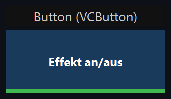
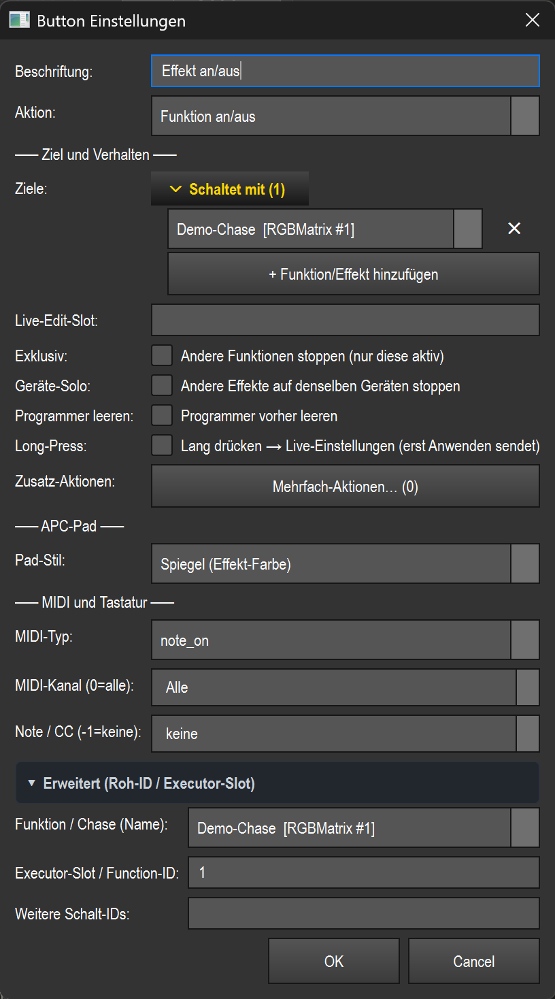

# Button (`VCButton`)

> Ein Drucktaster für die Virtuelle Konsole: löst beim Drücken eine Aktion aus — von „Effekt an/aus" über Blackout und Snapshot bis Tap-Tempo und Musik-Steuerung.

## Wozu & was es steuert

Der Button ist das universelle Auslöse-Element der VC. Je nach eingestellter **Aktion** schaltet er eine Funktion/einen Effekt, blitzt eine Szene, leert den Programmer, ruft einen Snapshot ab, steuert Tempo/BPM und Tempo-Buses, wählt eine Fixture-Gruppe, löst eine Live-Effekt-Aktion aus oder steuert den Musik-Player. Mehrere Buttons bilden so eine Pad-Wand (auch APC-tauglich). Ein Button kann zusätzlich an einen Effekt gebunden werden und per MIDI oder Tastatur ferngesteuert werden.

Die VC-Grundlagen (Bearbeiten-Modus, Anlegen, Banks, Touch-Lock) sind in der Übersicht beschrieben — siehe Übersicht (README.md).

## So sieht es aus & Bedienung im Betrieb

Das sichtbare Element ist eine rechteckige Kachel mit zentrierter, mehrzeiliger **Beschriftung** (im Bild „Effekt an/aus"). Standardgröße 120 × 60 px, Hintergrund dunkelblau (`#1a3a5c`), Schrift weiß. Vorder- und Hintergrundfarbe lassen sich per Rechtsklick-Menü ändern.

Optische Hinweise auf der Kachel:

- **Farbbalken unten (4 px)** je nach Aktion: orange = Flash · grün = Funktion an/aus / Funktion (nur gehalten) · rot = Blackout · gold = Snapshot · Snap-Farbe = Bibliothek-Farbe/Snap · cyan = Musik-BPM · pink = Musik-Player. Im Beispielbild ist der grüne Balken einer „Funktion an/aus"-Aktion zu sehen.
- **Snapshot-Nummer**: bei Snapshot-Aktion erscheint unter der Beschriftung `[Snap N]`.
- **Gobo-Icon** oben rechts, wenn der Button (über Snap oder Szene) ein Gobo setzt.
- **Blaues Quadrat** oben rechts = eine MIDI-Note/CC ist zugewiesen.
- **`⌨`-Text** oben links = ein Tastatur-Hotkey ist zugewiesen.
- **Lila `+N`-Badge** oben links = N Zusatz-Aktionen sind hinterlegt.

Zustands-Rückmeldung beim Drücken/Laufen:

- **Gedrückt** (Maus oder MIDI/Taste): Kachel wird heller, dazu ein heller gelber Rahmen.
- **Funktion läuft** (Toggle-Pad): grüner Rahmen — bleibt an, solange der Effekt läuft, nicht nur während des Drucks.
- **Snap-Toggle aktiv**: dezent grüner Rahmen.
- **Musik-BPM aktiv**: cyaner Rahmen.
- **MIDI-Learn scharf**: orange Rahmen.

Bedienung (nur im Betrieb, d. h. „Bearbeiten" AUS):

- **Linke Maustaste drücken (halten)** = Aktion auslösen mit `press = True`. Bei Halte-Aktionen (Flash, „nur gehalten", Snap-Modus „Halten", „Alles Weiß") wirkt es nur, solange gedrückt.
- **Linke Maustaste loslassen** = `press = False` (beendet Flash/Hold; bei Toggle ohne Wirkung).
- **Lang gedrückt halten (ca. 500 ms)** = öffnet bei Aktion „Funktion an/aus" oder „Effekt-Aktion (Live)" mit gebundenem Effekt den **Live-Mini-Editor** (Werte werden erst beim Klick auf „Anwenden" gesendet). Nur aktiv, wenn die Option **Long-Press** gesetzt ist; kurzer Tap bricht den Timer ab. Bei „Flash" bewusst nicht verfügbar (kollidiert mit dem Halten).
- Ist **Touch-Lock** aktiv, ignoriert der Button Maus/Touch (reine Anzeige); MIDI/APC steuert weiter.

Im **Bearbeiten-Modus** dient die linke Maustaste zum Verschieben/Skalieren; Doppelklick öffnet die Einstellungen; Rechtsklick öffnet das Kontextmenü (Einstellungen, MIDI Teach, Taste zuweisen, Bank, Löschen, Farben).

## Einstellungen

Der Dialog blendet je nach gewählter **Aktion** nur die passenden Felder ein. Beschriftung, Aktion, MIDI-Bindung und APC-Pad-Anzeige sind immer sichtbar.

| Einstellung | Bedeutung | Werte/Optionen |
| --- | --- | --- |
| Beschriftung | Text auf der Kachel | Freitext |
| Aktion | Was der Button beim Drücken tut | siehe Aktions-Tabelle unten |
| Executor-Slot / Function-ID | Ziel-ID: Funktions-ID (Effekt/Chase/Szene) bzw. Executor-Slot-Nummer | Zahl, leer = keins |
| Funktion/Chase (Name) | Funktion per Name wählen; füllt das ID-Feld automatisch | Dropdown aller Funktionen `Name [Typ #ID]`; `(nach ID/Slot oben)` = manuell |
| Weitere Ziel-IDs | Zusätzliche Funktions-IDs, die mit umgeschaltet/geflasht werden (als Gruppe) | Komma-getrennte IDs (nur Funktion an/aus & nur gehalten) |
| Steuert | Lesbare Liste der gesteuerten Funktionen nach Namen; hat beim Speichern Vorrang. Erste Zeile → Haupt-ID, Rest → weitere IDs | Zeilen per Dropdown wählen, mit `✕` entfernen, `+ Funktion/Effekt hinzufügen` |
| Snapshot | Welcher gespeicherte Snapshot abgerufen wird | Dropdown `N: Name`, `(keiner)` |
| Bibliothek-Farbe/Snap | Welcher Snap (Farbe/Look) aus der Show-Bibliothek gesetzt wird | Dropdown `Ordner/Name`, `(keiner)` |
| Tasten-Modus (Snap) | Verhalten des Bibliothek-Snaps | `Umschalten (an/aus)` · `Setzen (bleibt)` · `Halten (nur gedrückt)` |
| Effekt-Aktion (EffectAction) | Welche Live-Aktion der gebundene Effekt ausführt | siehe Effekt-Aktionen unten; bei gebundenem Effekt zusätzlich dessen eigene Aktionen |
| Gruppe (SelectGroup) | Fixture-Gruppe, die in den Programmer gewählt wird | Dropdown vorhandener Gruppen, editierbar |
| Tempo-Bus | Auf welchen benannten Tempo-Bus Tap/Sync/Scharfschalten wirkt | `(aktiver/Default-Bus)` · `Bus A` · `Bus B` · `Bus C` · `Bus D` |
| Live-Edit-Slot | Freitext-Name; der gestartete Effekt wird zum Bearbeitungsziel dieses Slots. Fader/Farb-Kacheln mit gleichem Slot bearbeiten ihn (quadrantenweise exklusiv) | Freitext (z. B. `MH`, `MX`) |
| Exklusiv | Beim Start alle anderen laufenden Funktionen stoppen (Solo) | Checkbox (nur Funktions-Aktionen) |
| Geräte-Solo | Beim Start nur Effekte stoppen, die DIESELBEN Geräte benutzen (auch aus anderer Bank); andere Geräte laufen weiter | Checkbox (nur Funktions-Aktionen) |
| Programmer leeren | Vor dem Start den Programmer leeren (manuelle Farben/Snaps haben sonst Vorrang und überdecken den Effekt) | Checkbox (nur Funktions-Aktionen) |
| MIDI-Typ | Art der MIDI-Nachricht | `note_on` · `cc` |
| MIDI-Kanal (0=alle) | MIDI-Kanal | 0–16 (0 = `Alle`) |
| Note / CC (-1=keine) | Note- bzw. CC-Nummer | -1–127 (-1 = `keine`) |
| Pad-Stil | Darstellung auf einer APC-Pad-Matte | `Spiegel (Effekt-Farbe)` · `Feste Farbe` · `Pulsieren` · `Zwei Farben im Wechsel` · `Dauer-Welle` |
| 2. Pad-Farbe (Wechsel) | Zweite Farbe für Pad-Stil „Zwei Farben im Wechsel" | Farb-Picker (RGB) |
| Zusatz-Aktionen | Weitere Aktionen, die beim Druck nach der Primär-Aktion ausgeführt werden (mit optionaler Verzögerung) | `Mehrfach-Aktionen… (N)` öffnet den Editor |
| Long-Press | Lang drücken öffnet im Live-Modus den Effekt-Editor (deferred apply) | Checkbox (nur Funktion an/aus & Effekt-Aktion) |

### Alle Aktionen (Klartext)

| Aktion (Dropdown) | Was passiert |
| --- | --- |
| Funktion an/aus | Schaltet die gebundene(n) Funktion(en) um: läuft irgendeine, werden alle gestoppt, sonst alle gestartet. Beachtet Exklusiv / Geräte-Solo / Programmer leeren / Live-Edit-Slot |
| Funktion (nur gehalten) | Startet die Funktion(en) beim Drücken, stoppt sie beim Loslassen (Flash auf Effekt-Ebene) |
| Effekt-Aktion (Live) | Löst eine Live-Aktion auf dem gebundenen bzw. aktiven Effekt aus (siehe Effekt-Aktionen) |
| Gruppe auswählen | Wählt die Fixtures der angegebenen Gruppe in den Programmer (Live-Auswahl per Pad/MIDI) |
| Bibliothek-Farbe/Snap | Setzt einen Snap (Farbe/Look) aus der Show-Bibliothek in den Programmer; Verhalten je nach Tasten-Modus (Umschalten/Setzen/Halten) |
| Snapshot abrufen | Schreibt die Werte des gewählten Snapshots in den Programmer |
| Programmer leeren (Clear) | Leert den Programmer (gibt manuelle Farben/Snaps frei) |
| Alles stoppen | Stoppt alle Executors/Playbacks (`stop_all`) |
| Effekte stoppen (Tempo bleibt) | Stoppt alle laufenden Effekt-Funktionen; Tempo/BPM bleiben unverändert (Pause/Effekt-Stop) |
| Blackout | Schaltet Blackout an, solange gedrückt (Moment-Override) |
| Laser scharf/unscharf | Schaltet den Netzwerk-Laser-Ausgang scharf/unscharf (unscharf = Ausgabe geblankt) — LAS-10 |
| Laser NOT-AUS | Laser-Not-Aus: sofort dunkel + entwaffnen |
| Laser-Muster abrufen | Ruft ein gespeichertes Laser-Muster (Muster-Palette) ab — LAS-18 |
| Alles Weiß (gehalten) | Blitzt die gebundene (hochpriore) Weiß-Szene, solange gedrückt; beim Loslassen zurück |
| Freeze (BPM einfrieren) | Friert das Tempo ein — alle Buses + globaler Leader auf 0 (Toggle); bus-gekoppelte Effekte halten ihre Position |
| Auto-Sync an/aus | Schaltet Auto-Sync um: neu startende bus-gekoppelte Effekte starten phasengleich am gemeinsamen Beat-Raster |
| Tap-Tempo | Tippt das globale Tempo (Tap-Tempo); beat-basierte Effekte folgen der so gesetzten BPM |
| Musik-BPM | Schaltet den Musik-Modus um: BPM kommt aus dem Audio-Eingang (an/aus) |
| BPM +1 (Nudge) | Zieht das Tempo um +1 BPM nach (wechselt zu MANUAL) |
| BPM -1 (Nudge) | Zieht das Tempo um -1 BPM nach (wechselt zu MANUAL) |
| BPM-Modus AUTO/MANUAL | Schaltet die Betriebsart zwischen AUTO und MANUAL um |
| Tap-Tempo (Bus) | Tap-Tempo auf den gewählten benannten Tempo-Bus |
| Sync (Bus) | Re-ankert den Bus und setzt den Downbeat („jetzt ist die Eins") |
| Bus scharf schalten | Schaltet den gewählten Bus scharf (`armed_bus_id`) für Pads/MIDI |
| Musik: Play/Pause | Wiedergabe des Musik-Players umschalten |
| Musik: Nächstes Lied | Nächster Titel im Musik-Player |
| Musik: Voriges Lied | Vorheriger Titel im Musik-Player |
| Executor: Umschalten (Go) | Drückt „Go" auf dem Executor im angegebenen Slot |
| Executor: Flash | Hält „Flash" auf dem Executor-Slot, solange gedrückt |

### Effekt-Aktionen (für „Effekt-Aktion (Live)")

| Aktion | Bedeutung |
| --- | --- |
| Nächste Farbe | Zur nächsten Farbe der Effekt-Palette |
| Vorherige Farbe | Zur vorherigen Farbe |
| Farbe hinzufügen | Eine Farbe zur Palette hinzufügen |
| Farbe entfernen | Eine Farbe aus der Palette entfernen |
| Farbe an/aus | Aktuelle Farbe ein-/ausschalten |
| Richtung umkehren | Laufrichtung umkehren |
| Bounce an/aus | Bounce-Modus umschalten |
| Einfrieren an/aus | Effekt einfrieren/freigeben |
| Zufall neu würfeln (Random/EFX) | Zufallswerte neu seeden |
| Live-Overrides löschen | Manuelle Live-Übersteuerungen zurücksetzen |
| Live-Werte übernehmen | Live-Werte fest übernehmen |
| Tap-Tempo | Effekt-internes Tap-Tempo |

> Mehrfach-Aktionen, Pad-Stile (APC), Exklusiv/Geräte-Solo und Long-Press lassen sich beliebig kombinieren — so wird ein Button zum Pad mit mehreren Wirkungen.

## Bindung an einen Effekt

Bei den Aktionen **Funktion an/aus**, **Funktion (nur gehalten)** und **Effekt-Aktion (Live)** gilt der Button als effektgebunden. Gebunden wird über das Feld **Executor-Slot / Function-ID**, das Dropdown **Funktion/Chase (Name)** oder die **Steuert**-Liste (die bei Befüllung Vorrang hat). Gespeichert wird nur die `function_id` (plus optional weitere IDs); die eigentliche Live-Wirkung läuft über die gemeinsame Naht `src/core/engine/effect_live.py` (`do_action` für „Effekt-Aktion", `start`/`stop` für die Toggle-/Flash-Aktionen). Dieselbe Bindung nutzt auch MIDI.

Ohne gültige Bindung passiert nichts: Bei „Funktion an/aus"/„nur gehalten" ohne Ziel-ID bleibt der Druck wirkungslos; „Effekt-Aktion (Live)" ohne `function_id` greift auf den Effekt des **Live-Edit-Slots** zurück, sofern einer gesetzt ist.

Über **Live-Edit-Slot** wird der gestartete Effekt zum aktiven Bearbeitungsziel dieses Slots — Fader und Farb-Kacheln mit demselben Slot bearbeiten dann genau diesen Effekt (pro Quadrant exklusiv, ohne globales Stop-All).

## MIDI & Tastatur

Der Button unterstützt sowohl MIDI- als auch Tastatur-Zuweisung (beide Teach-Funktionen liefern `True`).

**MIDI** (Kontextmenü „MIDI Teach…" oder die Felder im Dialog):

- **Typ** `note_on`: Note gedrückt (`data2 > 0`) = Druck, Note los (`note_off` oder `data2 = 0`) = Loslassen — so funktionieren Toggle UND Flash exakt wie an der Maus.
- **Typ** `cc`: absolut ausgewertet — Wert > 63 = gedrückt, sonst losgelassen.
- **Kanal** 0 = alle Kanäle. **Note/CC** -1 = keine Bindung.
- APC-Tasten werden als `note_on`, Fader als `cc` interpretiert.

**Tastatur** (Kontextmenü „Taste zuweisen…"): Ein Hotkey (z. B. `Ctrl+F5`) wird wie eine MIDI-Note behandelt — Tastendruck = `note_on`, Loslassen = `note_off`. Damit arbeiten Toggle und Flash identisch zur MIDI-Steuerung.

## Tipps & Fallen

- **Effekt unsichtbar?** Manuelle Farben/Snaps im Programmer haben Vorrang und überdecken den Effekt. Setze **Programmer leeren**, damit der Effekt durchkommt.
- **Effekt aus einer anderen Bank überschreibt mit:** Nutze **Geräte-Solo** statt **Exklusiv** — dann wird nur der alte Effekt auf denselben Strahlern abgelöst, andere Geräte laufen weiter.
- **„Funktion (nur gehalten)" vs. „Effekt-Aktion (Live)":** Bei Flash entfällt Long-Press bewusst, weil Halten mit dem Flash kollidiert. Für den Live-Editor „Funktion an/aus" oder „Effekt-Aktion" verwenden und **Long-Press** aktivieren.
- **Toggle-Rückmeldung:** Ein „Funktion an/aus"-Pad bleibt grün umrandet, solange sein Effekt läuft — auch ohne Druck. So erkennst du den echten Laufzustand.
- **Bibliothek-Snap-Modus** bestimmt das Tastenverhalten: „Setzen" bleibt aktiv (kein Zurücknehmen), „Halten" wirkt nur gedrückt, „Umschalten" merkt sich die vorherigen Programmer-Werte und stellt sie beim Aus wieder her.
- **Unbekannte gespeicherte Aktion** (z. B. aus einer neueren Version) fällt beim Laden sicher auf „Toggle" zurück, statt das Widget zu verlieren.
- **Tap-Tempo/Musik-BPM** wirken global; **Tap-Tempo (Bus)/Sync (Bus)/Bus scharf** wirken nur auf den gewählten benannten Bus.
