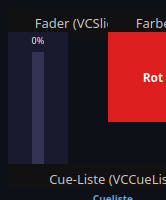
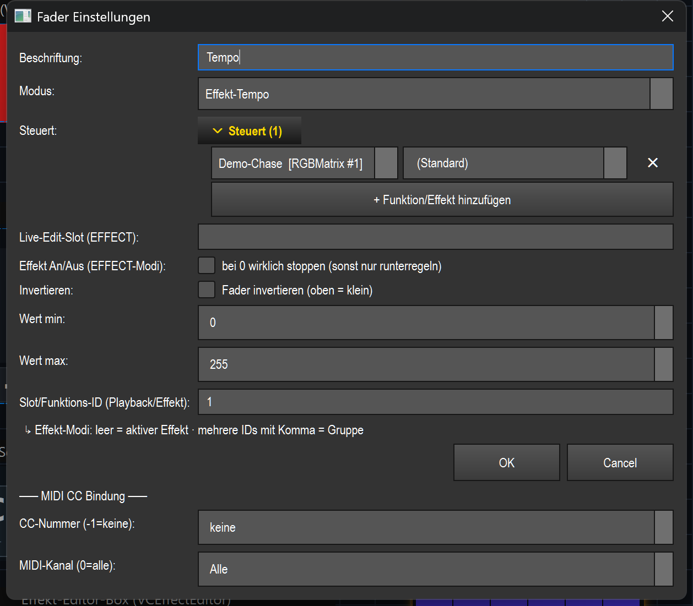

# Fader (slider) (`VCSlider`)

> **English version** of [Fader (Schieberegler) (`VCSlider`)](02_fader.md). LightOS itself speaks German: every button, menu and field is quoted here **exactly as it appears on screen**, with an English translation in brackets the first time it shows up. The screenshots are the same as in the German page.

> A vertical slider that controls a value from 0–100 % live – depending on the mode, e.g. a DMX channel, a submaster, the grand master, the tempo (BPM) or the brightness/tempo of an effect.

## What it is for & what it controls

The fader is the classic control for continuously adjusting a single value. What exactly it controls is set by the **Modus** (mode) (see the table under [Settings](#settings)): from a single DMX channel through submaster and grand master to tempo faders and effect masters (brightness, tempo, any effect parameter). Its internal travel is always 0–255; with **Min/Max** and **Invertieren** (invert) you can limit or reverse the range that is actually output.

## What it looks like & how to use it during operation

The element shows a vertical track with a light handle (knob). The area below the handle is filled blue (level display). At the top is the current output value in **percent** (`0%` in the screenshot), at the bottom the **Beschriftung** (label) (`Tempo` in the screenshot). The percentage is always the *actual* output value – so a min/max limit or an inversion you have set can be read off directly.

How to use it (only outside edit mode, i.e. during operation):

| Gesture | Effect |
|---|---|
| **Left-click + drag** (up/down) | Sets the value. Dragging up increases, dragging down decreases – relative to the click position. The value changes in proportion to the track length. |
| **Mouse wheel** | One notch = 5 points (out of 255). Wheel up = more, wheel down = less. |
| **Click alone (release)** | Only sets the starting point for dragging; nothing changes without movement. |

There is **no** special double-click function during operation – a double-click in edit mode opens the settings (see the overview in [README.en.md](README.en.md)).

Small status markers in the element:

- **Yellow `⇅` or `▯` at the top left** – `⇅` = the fader is inverted, `▯` = a partial range (min/max) is set. The percentage at the top already reflects this.
- **Cyan dot at the top right** – a MIDI CC binding is active.
- **Yellow dashed line + `⊘▲`/`⊘▼` (soft takeover)** – only when „Pickup" is active and the fader, after a bank/page change, is waiting for the physical fader to pass through (see [MIDI & keyboard](#midi--keyboard)). The dashed line marks the target (VC) value, the second yellow line the current physical fader position, the arrow the direction in which you have to move the physical fader.

If „Touch-Lock" is active for the VC, the fader ignores mouse/touch (display only); MIDI/APC keeps controlling it (see [README.en.md](README.en.md)).

## Settings

A double-click (in edit mode) opens the „Fader Einstellungen" (fader settings) dialog. Depending on the context, the dialog only shows the fields that match the selected **Modus**; Beschriftung, Modus and the value guard rails (Invertieren/Min/Max) are always visible.

| Setting | Meaning | Values/options |
|---|---|---|
| **Beschriftung** | Text at the bottom of the fader. | Free text |
| **Modus** | What the fader controls (details below). | `Effekt-Helligkeit` (effect brightness), `Effekt-Tempo` (effect tempo), `Effekt-Parameter` (effect parameter), `Programmer-Attribut` (programmer attribute), `Gruppen-Dimmer` (group dimmer), `Feature-Dimmer (Gruppe)` (feature dimmer (group)), `Submaster`, `Grand Master`, `Speed (alle Effekte)` (speed (all effects)), `Tempo (BPM)`, `Tempo-Bus (BPM)`, `Playback (Executor)`, `DMX-Kanal (Level)` (DMX channel (level)) |
| **Parameter (Effekt-Parameter)** (parameter (effect parameter)) | Only mode *Effekt-Parameter*: which parameter of the bound effect is controlled. The list shows the effect's real parameters (label + key); you can type your own key. | Selection/free text (e.g. `speed`) |
| **Steuert** (controls) | Expandable list of the effects/functions the fader controls (by name). A separate parameter can be chosen per line, lines can be removed with ✕, „+ Funktion/Effekt hinzufügen" (+ add function/effect). Decisive in the effect modes (overrides the slot field) – allows a group submaster across several effects. | Effect/function list + a parameter per line |
| **Reichweite (Programmer/Submaster)** (scope (programmer/submaster)) | Modes *Programmer-Attribut* and *Submaster*: which fixtures the fader acts on. For the submaster, *Alle Geräte* (all fixtures) is the previous global submaster. **Multi-head fixtures:** if the scope refers to individual **heads** instead of whole fixtures, the submaster dims exactly those heads – see [Submaster per head](#submaster-per-head). | `Alle Geräte` (all patched), `Nur Auswahl` (selection only) (the current programmer selection; in programmer mode → all if the selection is empty, for the submaster → no effect), `Feste Gruppe` (fixed group) (a fixed group, independent of the live selection) |
| **Feste Gruppe** | Fixture group for scope = *Feste Gruppe* (programmer/submaster) or for the modes *Gruppen-Dimmer* and *Feature-Dimmer (Gruppe)*. | Selection of existing groups / free text |
| **Feature (Feature-Dimmer)** | Only mode *Feature-Dimmer (Gruppe)*: which feature group the dimmer scales. | `Intensity`, `Color`, `Gobo`, `Beam`, `Position`, `Effect` |
| **Attribut (Programmer)** (attribute (programmer)) | Only mode *Programmer-Attribut*: which attribute the fader sets on the fixtures (default `intensity`). List = known attributes (label + key), you can type your own key – this way you can build e.g. a LAS speed fader on `gobo_rotation`. | Selection/free text (e.g. `intensity`, `gobo_rotation`) |
| **Wert bei 0 % (Programmer)** (value at 0 % (programmer)) | Only mode *Programmer-Attribut*: the channel value the fader outputs at 0 %. Maps the fader onto a sub-band of the channel (e.g. laser speed start `192`). | 0–255 |
| **Wert bei 100 % (Programmer)** (value at 100 % (programmer)) | Only mode *Programmer-Attribut*: the channel value the fader outputs at 100 % (end of the sub-band, e.g. `223`). Together with *Wert bei 0 %* this is the actual dynamic range – independent of the guard rails *Wert min/max* (value min/max). | 0–255 |
| **Live-Edit-Slot (EFFECT)** | Effect modes only: without a fixed function ID, the effect from this named slot is edited (set by an effect pad) instead of the globally active one. | Free text (e.g. `MH`, `MX`) |
| **Tempo-Bus** | Only mode *Tempo-Bus (BPM)*: which tempo bus is set. | `(aktiver/Default-Bus)` (active/default bus), `Bus A`, `Bus B`, `Bus C`, `Bus D` |
| **Effekt An/Aus (EFFECT-Modi)** (effect on/off (EFFECT modes)) | Effect modes only: behavior at the bottom end. On = the fader controls on/off (value > 0 starts the target effect, value 0 really stops it). Off = the fader only adjusts; start the effect separately with a button. | Checkbox „bei 0 wirklich stoppen (sonst nur runterregeln)" (really stop at 0 (otherwise only turn down)) |
| **Invertieren** | Reverses the direction: all the way up = min, all the way down = max. Applies to **all** modes. | Checkbox „Fader invertieren (oben = klein)" (invert fader (top = small)) |
| **Wert min** | Lower output value (guard rail). The fader never goes below it (e.g. a dimmer that never goes fully off). Applies to all modes. | 0–255 |
| **Wert max** | Upper output value (guard rail). The fader never goes above it (e.g. a speed fader that caps at 70 %). Applies to all modes. | 0–255 |
| **DMX-Universe (Level-Modus)** (DMX universe (level mode)) | Only mode *DMX-Kanal (Level)*: target universe. Created if needed. | Integer (1-based) |
| **DMX-Kanal (Level-Modus)** (DMX channel (level mode)) | Only mode *DMX-Kanal (Level)*: target channel in the universe. | Integer |
| **Playback Executor-Slot** | Only mode *Playback (Executor)*: the executor slot index (0-based) whose fader this control drives. A separate field – „nicht gesetzt" (not set) = no slot (the fader then has no effect). | Integer ≥ 0 or „nicht gesetzt" |
| **Slot/Funktions-ID (Playback/Effekt)** (slot/function ID (playback/effect)) | Only visible in the **effect modes** (under „Erweitert" (advanced)): effect function ID(s). Several IDs separated by commas = group. Empty = active effect. The „Steuert" list overrides this field. Does **not** set the playback slot – the separate field *Playback Executor-Slot* is for that; in playback mode this field is not shown at all. | Integer(s), comma-separated |
| **CC-Nummer (-1=keine)** (CC number (-1=none)) | MIDI controller number for the CC binding. | -1 (none) to 127 |
| **MIDI-Kanal (0=alle)** (MIDI channel (0=all)) | MIDI channel of the binding. | 0 (all) to 16 |

### The modes in plain words

| Mode | Effect |
|---|---|
| **DMX-Kanal (Level)** | Writes the value directly to a fixed DMX channel in the selected universe (0–255). The universe is created automatically if needed. |
| **Playback (Executor)** | Sets the fader value (0–100 %) of a playback executor. The slot number is the executor index. |
| **Submaster** | Sets an output submaster (0–100 %) – multiplicative, combines cleanly with the grand master and group dimmer. Each fader has its **own** submaster slot; two submaster faders on the same fixtures therefore multiply instead of overwriting each other. Which fixtures (or heads) it acts on is set by the *Reichweite*. |
| **Grand Master** | Controls the global overall brightness of the entire output (0–100 %). |
| **Programmer-Attribut** | Sets a programmer attribute (default `intensity`) on the affected fixtures. Which fixtures: see *Reichweite*. |
| **Tempo (BPM)** | Controls the global tempo from 30 to 300 BPM. Beat effects follow. Dragging forces manual tempo mode (the fader becomes the tempo source). |
| **Speed (alle Effekte)** | Scales the speed of **all running** time-based effects (chaser, sequence, carousel, RGB matrix, EFX) from 0.1× to 4.0×. |
| **Effekt-Helligkeit** | Brightness master of an effect or an effect group (0–100 %). Empty = active effect. |
| **Effekt-Tempo** | Tempo master of an effect or a group (0.1× to 4.0×). Empty = active effect. |
| **Effekt-Parameter** | Maps the fader (0–255) onto the value range of any effect parameter (key in the *Parameter* field). With several targets, a separate parameter can apply per effect (column in the „Steuert" list). |
| **Gruppen-Dimmer** | Multiplicative dimmer for a fixed fixture group (*Feste Gruppe*) – scales its brightness (0–100 %). |
| **Feature-Dimmer (Gruppe)** | Multiplicative dimmer for a SELECTABLE feature group (Intensity/Color/Gobo/Beam/Position/Effect) of a fixed fixture group – scales only this feature (0–100 %). |
| **Tempo-Bus (BPM)** | Controls the BPM of a named tempo bus (A/B/C/D) from 30 to 300, independent of the global leader. Empty = active/default bus. |

## Submaster per head

A multi-head fixture (Hydrabeam 4000, LED Moving Bar 4×, Spider …) can be dimmed **head by head** with a submaster fader – not just as a whole fixture. No new field on the fader is needed for this: all that matters is whether the configured **Reichweite** refers to heads or to whole fixtures.

**Two ways:**

| Way | Scope | Where the heads come from |
|---|---|---|
| **Fixed (recommended)** | `Feste Gruppe` | The group contains head cells – created in the fixture group editor via **„Köpfe einzeln → Raster"** (heads individually → grid) (as a row / as a column). This assignment is stored in the show, so the fader works unchanged after reloading. |
| **Live** | `Nur Auswahl` | The current programmer selection – if individual heads are selected there, the fader follows them. |

With scope `Alle Geräte` there is no head restriction (global submaster).

**Important – “all heads” is the whole fixture.** If the scope covers *all* heads of a fixture, the fader behaves like a perfectly normal fixture submaster (so it also dims the shared master dimmer). This especially concerns the **group „… · Köpfe" (… · heads) that is created automatically** during patching and contains all heads: a fader on it does exactly what it always did. It only becomes per-head when you target **a subset** of the heads.

**What the head fader touches – and what it doesn't:**

- It only scales channels that **really exist per head**: the head's own dimmer, if the profile has one – otherwise its own color channels (the common case: a fixture with one master dimmer and four RGB banks is dimmed head by head via the color).
- A channel type only counts as “per head” if it occurs in the profile **exactly as often** as the fixture has heads. Some profiles have **zone dimmers** – e.g. `Frost FX Bar W` with 14 pixels but only two dimmers (one for all white pixels, one for all colored pixels). Such zone channels are not head channels and are left untouched.
- A **master dimmer shared** by all heads **is left untouched**. This is intentional: if „Kopf 2" (head 2) pulled it down, the whole fixture would go dark.
- If a fixture has **no** per-head brightness or color channels **at all**, the fader honestly has no effect there – it does *not* dim the whole fixture as a substitute.
- Pan/tilt/gobo are never dimmed (as with the grand master).
- If you later switch a fixture to a different **channel mode**, head references that no longer exist there are discarded – the fader then falls back to “whole fixture” instead of silently dimming the wrong head.

Head, fixture and global submasters **multiply**: a fixture at 50 % and its head 2 additionally at 50 % gives 25 % for that head and 50 % for the other heads.

> This refers to the head order of the profile (Nth channel occurrence = Nth head). Which physical lamp that is on the real rig is the subject of hardware check HW-1.

## Binding to an effect

In the modes **Effekt-Helligkeit**, **Effekt-Tempo** and **Effekt-Parameter**, the fader acts live on an effect. It is bound via the **„Steuert" list** (decisive) or, as a fallback, via the **function ID** in the slot field:

- **Fixed binding:** add effect(s) to the „Steuert" list (button „+ Funktion/Effekt hinzufügen"). Several effects = group submaster: the fader controls them together. In mode *Effekt-Parameter* you can choose a separate parameter per effect (the default parameter if none is set).
- **Without a fixed binding (empty):** the currently *active* effect is used – or, if a **Live-Edit-Slot** is set, the effect that an effect pad has placed into this slot.

The actual live effect runs through the shared seam `src/core/engine/effect_live.py` (`list_params`/`set_param`/`do_action`); the widget only stores the effect ID. MIDI uses the same binding (see [README.en.md](README.en.md)). With **Effekt An/Aus (EFFECT-Modi)** the fader can additionally start/stop: on = value > 0 starts the target effect (if it isn't running), value 0 stops it; off = the fader only adjusts, the effect must be started separately (at 0 it keeps running with value 0).

## MIDI & keyboard

The fader supports **MIDI teach** (CC only, no note); there is **no key assignment** (a fader needs a continuous value, not a key press).

- **Assign:** in the dialog, enter the **CC-Nummer** (0–127) and optionally the **MIDI-Kanal** (0 = all) – or learn the next incoming CC via right-click „MIDI Teach…". Active binding = cyan dot at the top right.
- **Effect:** incoming CC values (0–127) are mapped absolutely to 0–255 (0–100 %). Only the number bound as CC on the matching channel counts.
- **Soft takeover / „Pickup":** a global VC switch for non-motorized controllers (e.g. APC mini). After a bank/page change, the physical fader is usually somewhere other than the VC value. With pickup active, the fader only takes over once the physical fader **passes through** the current VC value **once** – so there is no jump. Until then the element shows the yellow pickup hint (target line + ghost position + `⊘▲`/`⊘▼` direction arrow) and ignores MIDI.

## Tips & pitfalls

- **Percentage display = output value, not fader position.** With min/max or inversion set, the value at the top shows the actual output. If the fader is all the way down and still shows e.g. 30 %, a min limit is set.
- **Min/max and Invertieren apply in ALL modes**, not just for DMX. Swapped limits (min > max) are tolerated.
- **The „Steuert" list beats the slot field.** In the effect modes, a filled „Steuert" list overrides the ID entered in the slot field. If the list is empty, the slot field counts (or the active effect / Live-Edit-Slot).
- **Effect modes only adjust by default** – without „Effekt An/Aus" the effect doesn't stop at 0 but keeps running with value 0. If the fader should really switch the effect on/off, enable the option (only works with a fixed target ID, not with the mere “active effect”).
- **Pickup only works when it is active globally.** Without the global soft takeover switch, the fader takes over every CC immediately (possible jump on bank change).
- **Banks/Touch-Lock:** via right-click you can assign the fader to a bank (playback page) or to „Alle Banks" (all banks) (always visible) – details in [README.en.md](README.en.md).
