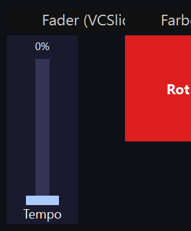
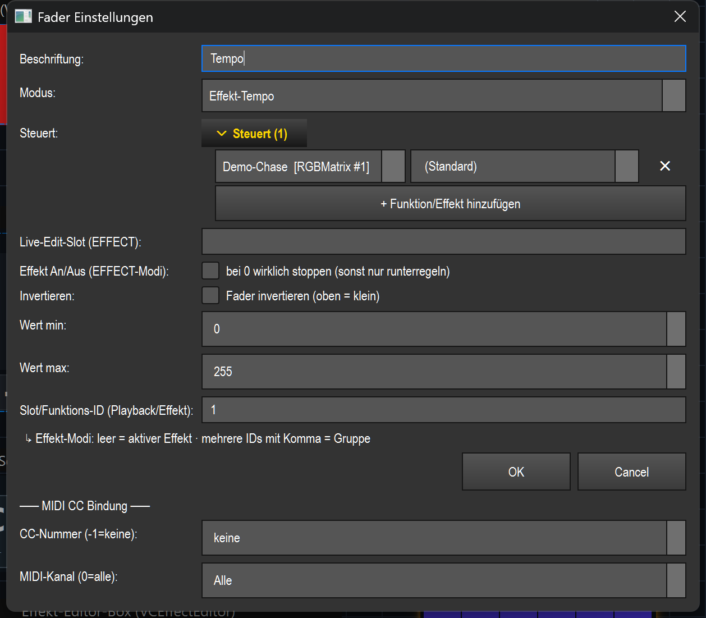

# Fader (Schieberegler) (`VCSlider`)

> Ein vertikaler Schieberegler, der einen Wert von 0–100 % live regelt – je nach Modus z. B. einen DMX-Kanal, einen Submaster, den Grand Master, das Tempo (BPM) oder die Helligkeit/das Tempo eines Effekts.

## Wozu & was es steuert

Der Fader ist das klassische Bedien-Element zum stufenlosen Regeln eines einzelnen Werts. Was genau er regelt, legt der **Modus** fest (siehe Tabelle unter [Einstellungen](#einstellungen)): vom einzelnen DMX-Kanal über Submaster und Grand Master bis hin zu Tempo-Faders und Effekt-Mastern (Helligkeit, Tempo, beliebiger Effekt-Parameter). Sein interner Hub ist immer 0–255; über **Min/Max** und **Invertieren** kann der tatsächlich ausgegebene Bereich eingeschränkt oder umgedreht werden.

## So sieht es aus & Bedienung im Betrieb

Das Element zeigt eine senkrechte Schiene mit einem hellen Griff (Knob). Der Bereich unter dem Griff ist blau gefüllt (Pegelanzeige). Oben steht der aktuelle Ausgabewert in **Prozent** (im Screenshot `0%`), unten die **Beschriftung** (im Screenshot `Tempo`). Der Prozentwert ist immer der *tatsächliche* Ausgabewert – eine gesetzte Min/Max-Grenze oder Invertierung ist also direkt ablesbar.

Bedienung (nur außerhalb des Bearbeiten-Modus, also im Betrieb):

| Geste | Wirkung |
|---|---|
| **Linksklick + Ziehen** (nach oben/unten) | Setzt den Wert. Hochziehen erhöht, runterziehen verringert – relativ zur Klickposition. Der Wert ändert sich proportional zur Schienenlänge. |
| **Mausrad** | Eine Rasterstufe = 5 Punkte (von 255). Rad hoch = mehr, Rad runter = weniger. |
| **Klick allein (loslassen)** | Setzt nur den Startpunkt fürs Ziehen; ohne Bewegung ändert sich nichts. |

Es gibt **keine** Doppelklick-Sonderfunktion im Betrieb – Doppelklick im Bearbeiten-Modus öffnet die Einstellungen (siehe Übersicht in der [README.md](README.md)).

Kleine Status-Marker im Element:

- **Gelbes `⇅` oder `▯` oben links** – `⇅` = Fader ist invertiert, `▯` = ein Teilbereich (Min/Max) ist gesetzt. Der Prozentwert oben spiegelt das bereits wider.
- **Cyan-Punkt oben rechts** – eine MIDI-CC-Bindung ist aktiv.
- **Gelbe Strich-Linie + `⊘▲`/`⊘▼` (Soft-Takeover)** – nur wenn „Pickup" aktiv ist und der Fader nach einem Bank-/Seitenwechsel auf das Durchfahren des physischen Reglers wartet (siehe [MIDI & Tastatur](#midi--tastatur)). Die gestrichelte Linie markiert den Ziel-(VC-)Wert, der zweite gelbe Strich die aktuelle physische Reglerposition, der Pfeil die Richtung, in die der physische Regler bewegt werden muss.

Ist „Touch-Lock" für die VC aktiv, ignoriert der Fader Maus/Touch (reine Anzeige); MIDI/APC regelt weiter (siehe [README.md](README.md)).

## Einstellungen

Doppelklick (im Bearbeiten-Modus) öffnet den Dialog „Fader Einstellungen". Der Dialog blendet kontextabhängig nur die zum gewählten **Modus** passenden Felder ein; Beschriftung, Modus und die Wert-Leitplanken (Invertieren/Min/Max) sind immer sichtbar.

| Einstellung | Bedeutung | Werte/Optionen |
|---|---|---|
| **Beschriftung** | Text unten am Fader. | Freitext |
| **Modus** | Was der Fader regelt (Details unten). | `Effekt-Helligkeit`, `Effekt-Tempo`, `Effekt-Parameter`, `Programmer-Attribut`, `Gruppen-Dimmer`, `Feature-Dimmer (Gruppe)`, `Submaster`, `Grand Master`, `Speed (alle Effekte)`, `Tempo (BPM)`, `Tempo-Bus (BPM)`, `Playback (Executor)`, `DMX-Kanal (Level)` |
| **Parameter (Effekt-Parameter)** | Nur Modus *Effekt-Parameter*: welcher Parameter des gebundenen Effekts geregelt wird. Die Liste zeigt die echten Parameter des Effekts (Label + Key); eigener Key tippbar. | Auswahl/Freitext (z. B. `speed`) |
| **Steuert** | Aufklappbare Liste der Effekte/Funktionen, die der Fader steuert (nach Namen). Je Zeile ein eigener Parameter wählbar, mit ✕ entfernbar, „+ Funktion/Effekt hinzufügen". Maßgeblich bei den Effekt-Modi (überschreibt das Slot-Feld) – ermöglicht einen Gruppen-Submaster über mehrere Effekte. | Effekt-/Funktionsliste + je Zeile Parameter |
| **Reichweite (Programmer/Submaster)** | Modi *Programmer-Attribut* und *Submaster*: auf welche Fixtures der Fader wirkt. Beim Submaster = *Alle Geräte* ist es der bisherige globale Submaster. | `Alle Geräte` (alle gepatchten), `Nur Auswahl` (aktuelle Programmer-Auswahl; im Programmer-Modus → alle bei leerer Auswahl, beim Submaster → keine Wirkung), `Feste Gruppe` (eine fest gewählte Gruppe, unabhängig von der Live-Auswahl) |
| **Feste Gruppe** | Fixture-Gruppe für Reichweite = *Feste Gruppe* (Programmer/Submaster) bzw. für die Modi *Gruppen-Dimmer* und *Feature-Dimmer (Gruppe)*. | Auswahl vorhandener Gruppen / Freitext |
| **Feature (Feature-Dimmer)** | Nur Modus *Feature-Dimmer (Gruppe)*: welche Feature-Gruppe der Dimmer skaliert. | `Intensity`, `Color`, `Gobo`, `Beam`, `Position`, `Effect` |
| **Attribut (Programmer)** | Nur Modus *Programmer-Attribut*: welches Attribut der Fader auf den Fixtures setzt (Standard `intensity`). Liste = bekannte Attribute (Label + Key), eigener Key tippbar – so wird z. B. ein LAS-Speed-Fader auf `gobo_rotation` baubar. | Auswahl/Freitext (z. B. `intensity`, `gobo_rotation`) |
| **Wert bei 0 % (Programmer)** | Nur Modus *Programmer-Attribut*: Kanalwert, den der Fader bei 0 % ausgibt. Bildet den Fader auf ein Kanal-Teilband ab (z. B. Laser-Speed-Anfang `192`). | 0–255 |
| **Wert bei 100 % (Programmer)** | Nur Modus *Programmer-Attribut*: Kanalwert, den der Fader bei 100 % ausgibt (Ende des Teilbands, z. B. `223`). Zusammen mit *Wert bei 0 %* der eigentliche Dynamik-Bereich – unabhängig von den Leitplanken *Wert min/max*. | 0–255 |
| **Live-Edit-Slot (EFFECT)** | Nur Effekt-Modi: ohne feste Funktions-ID wird der Effekt aus diesem benannten Slot bearbeitet (von einem Effekt-Pad gesetzt) statt des global aktiven. | Freitext (z. B. `MH`, `MX`) |
| **Tempo-Bus** | Nur Modus *Tempo-Bus (BPM)*: welcher Tempo-Bus gesetzt wird. | `(aktiver/Default-Bus)`, `Bus A`, `Bus B`, `Bus C`, `Bus D` |
| **Effekt An/Aus (EFFECT-Modi)** | Nur Effekt-Modi: Verhalten am unteren Anschlag. An = Fader steuert An/Aus (Wert > 0 startet den Ziel-Effekt, Wert 0 stoppt ihn wirklich). Aus = Fader regelt nur; den Effekt separat per Taste starten. | Checkbox „bei 0 wirklich stoppen (sonst nur runterregeln)" |
| **Invertieren** | Dreht die Wirkrichtung um: ganz oben = Min, ganz unten = Max. Gilt für **alle** Modi. | Checkbox „Fader invertieren (oben = klein)" |
| **Wert min** | Unterer Ausgabewert (Leitplanke). Der Fader regelt nie darunter (z. B. Dimmer, der nie ganz aus geht). Gilt für alle Modi. | 0–255 |
| **Wert max** | Oberer Ausgabewert (Leitplanke). Der Fader regelt nie darüber (z. B. Speed-Fader, der bei 70 % deckelt). Gilt für alle Modi. | 0–255 |
| **DMX-Universe (Level-Modus)** | Nur Modus *DMX-Kanal (Level)*: Ziel-Universe. Wird bei Bedarf angelegt. | Ganzzahl (1-basiert) |
| **DMX-Kanal (Level-Modus)** | Nur Modus *DMX-Kanal (Level)*: Ziel-Kanal im Universe. | Ganzzahl |
| **Playback Executor-Slot** | Nur Modus *Playback (Executor)*: der Executor-Slot-Index (0-basiert), dessen Fader dieser Regler steuert. Eigenes Feld – „nicht gesetzt" = kein Slot (der Fader wirkt dann nicht). | Ganzzahl ≥ 0 oder „nicht gesetzt" |
| **Slot/Funktions-ID (Playback/Effekt)** | Nur in den **Effekt-Modi** sichtbar (unter „Erweitert"): Effekt-Funktions-ID(s). Mehrere IDs mit Komma = Gruppe. Leer = aktiver Effekt. Die „Steuert"-Liste überschreibt dieses Feld. Setzt **nicht** den Playback-Slot – dafür dient das eigene Feld *Playback Executor-Slot*; in Playback-Mode wird dieses Feld gar nicht angezeigt. | Ganzzahl(en), kommagetrennt |
| **CC-Nummer (-1=keine)** | MIDI-Controller-Nummer für die CC-Bindung. | -1 (keine) bis 127 |
| **MIDI-Kanal (0=alle)** | MIDI-Kanal der Bindung. | 0 (Alle) bis 16 |

### Die Modi im Klartext

| Modus | Wirkung |
|---|---|
| **DMX-Kanal (Level)** | Schreibt den Wert direkt auf einen festen DMX-Kanal im gewählten Universe (0–255). Das Universe wird bei Bedarf automatisch angelegt. |
| **Playback (Executor)** | Setzt den Fader-Wert (0–100 %) eines Playback-Executors. Die Slot-Nummer ist der Executor-Index. |
| **Submaster** | Setzt einen Output-Submaster (0–100 %). Die Slot-Nummer ist die Submaster-Nummer (leer = 0). |
| **Grand Master** | Steuert die globale Gesamthelligkeit der gesamten Ausgabe (0–100 %). |
| **Programmer-Attribut** | Setzt ein Programmer-Attribut (Standard `intensity`) auf den betroffenen Fixtures. Welche Fixtures: siehe *Reichweite*. |
| **Tempo (BPM)** | Steuert das globale Tempo von 30 bis 300 BPM. Beat-Effekte folgen. Das Ziehen erzwingt den manuellen Tempo-Modus (der Fader wird zur Tempo-Quelle). |
| **Speed (alle Effekte)** | Skaliert die Geschwindigkeit **aller laufenden** zeitbasierten Effekte (Chaser, Sequence, Carousel, RGB-Matrix, EFX) von 0,1× bis 4,0×. |
| **Effekt-Helligkeit** | Helligkeits-Master eines Effekts oder einer Effekt-Gruppe (0–100 %). Leer = aktiver Effekt. |
| **Effekt-Tempo** | Tempo-Master eines Effekts oder einer Gruppe (0,1× bis 4,0×). Leer = aktiver Effekt. |
| **Effekt-Parameter** | Bildet den Fader (0–255) auf den Wertebereich eines beliebigen Effekt-Parameters ab (Key im Feld *Parameter*). Bei mehreren Zielen kann je Effekt ein eigener Parameter gelten (Spalte in der „Steuert"-Liste). |
| **Gruppen-Dimmer** | Multiplikativer Dimmer für eine feste Fixture-Gruppe (*Feste Gruppe*) – skaliert deren Helligkeit (0–100 %). |
| **Feature-Dimmer (Gruppe)** | Multiplikativer Dimmer für eine WÄHLBARE Feature-Gruppe (Intensity/Color/Gobo/Beam/Position/Effect) einer festen Fixture-Gruppe – skaliert nur dieses Feature (0–100 %). |
| **Tempo-Bus (BPM)** | Steuert die BPM eines benannten Tempo-Bus (A/B/C/D) von 30 bis 300, unabhängig vom globalen Leader. Leer = aktiver/Default-Bus. |

## Bindung an einen Effekt

In den Modi **Effekt-Helligkeit**, **Effekt-Tempo** und **Effekt-Parameter** wirkt der Fader live auf einen Effekt. Gebunden wird über die **„Steuert"-Liste** (maßgeblich) bzw. ersatzweise über die **Funktions-ID** im Slot-Feld:

- **Feste Bindung:** Effekt(e) in der „Steuert"-Liste hinzufügen (Button „+ Funktion/Effekt hinzufügen"). Mehrere Effekte = Gruppen-Submaster: der Fader regelt sie gemeinsam. Im Modus *Effekt-Parameter* lässt sich je Effekt ein eigener Parameter wählen (Standard-Parameter, falls keiner gesetzt).
- **Ohne feste Bindung (leer):** Es wirkt der gerade *aktive* Effekt – oder, wenn ein **Live-Edit-Slot** gesetzt ist, der von einem Effekt-Pad in diesen Slot gelegte Effekt.

Die eigentliche Live-Wirkung läuft über die gemeinsame Naht `src/core/engine/effect_live.py` (`list_params`/`set_param`/`do_action`); das Widget speichert nur die Effekt-ID. Dieselbe Bindung nutzt auch MIDI (siehe [README.md](README.md)). Über **Effekt An/Aus (EFFECT-Modi)** kann der Fader zusätzlich starten/stoppen: An = Wert > 0 startet den Ziel-Effekt (falls nicht laufend), Wert 0 stoppt ihn; Aus = der Fader regelt nur, der Effekt muss separat gestartet werden (bei 0 läuft er mit Wert 0 weiter).

## MIDI & Tastatur

Der Fader unterstützt **MIDI-Teach** (nur CC, kein Note); eine **Tasten-Zuweisung gibt es nicht** (ein Fader braucht einen kontinuierlichen Wert, keinen Tastendruck).

- **Zuweisen:** Im Dialog die **CC-Nummer** (0–127) und optional den **MIDI-Kanal** (0 = alle) eintragen – oder per Rechtsklick „MIDI Teach…" den nächsten eingehenden CC lernen. Aktive Bindung = Cyan-Punkt oben rechts.
- **Wirkung:** Eingehende CC-Werte (0–127) werden absolut auf 0–255 (0–100 %) abgebildet. Es zählt nur die als CC gebundene Nummer auf dem passenden Kanal.
- **Soft-Takeover / „Pickup":** Ein globaler VC-Schalter für nicht-motorisierte Controller (z. B. APC mini). Nach einem Bank-/Seitenwechsel steht der physische Regler meist woanders als der VC-Wert. Bei aktivem Pickup übernimmt der Fader erst, wenn der physische Regler den aktuellen VC-Wert **einmal durchfährt** – so gibt es keinen Sprung. Bis dahin zeigt das Element den gelben Pickup-Hinweis (Ziel-Linie + Geist-Position + `⊘▲`/`⊘▼`-Richtungspfeil) und ignoriert MIDI.

## Tipps & Fallen

- **Prozentanzeige = Ausgabewert, nicht Reglerposition.** Bei gesetztem Min/Max oder Invertierung zeigt der Wert oben den tatsächlichen Ausgang. Steht der Regler ganz unten und es erscheinen trotzdem z. B. 30 %, ist eine Min-Grenze gesetzt.
- **Min/Max und Invertieren gelten in ALLEN Modi**, nicht nur bei DMX. Vertauschte Grenzen (Min > Max) werden toleriert.
- **„Steuert"-Liste schlägt das Slot-Feld.** In den Effekt-Modi überschreibt eine befüllte „Steuert"-Liste die im Slot-Feld eingetragene ID. Ist die Liste leer, zählt das Slot-Feld (bzw. der aktive Effekt / Live-Edit-Slot).
- **Effekt-Modi regeln per Default nur** – ohne „Effekt An/Aus" stoppt der Effekt bei 0 nicht, sondern läuft mit Wert 0 weiter. Soll der Fader den Effekt wirklich an-/ausschalten, die Option aktivieren (greift nur bei fester Ziel-ID, nicht beim bloßen „aktiven Effekt").
- **Pickup wirkt nur, wenn global aktiv.** Ohne den globalen Soft-Takeover-Schalter übernimmt der Fader jeden CC sofort (möglicher Sprung beim Bankwechsel).
- **Banks/Touch-Lock:** Über Rechtsklick lässt sich der Fader einer Bank (Playback-Seite) zuordnen oder „Alle Banks" (immer sichtbar) – Details in der [README.md](README.md).
