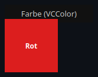
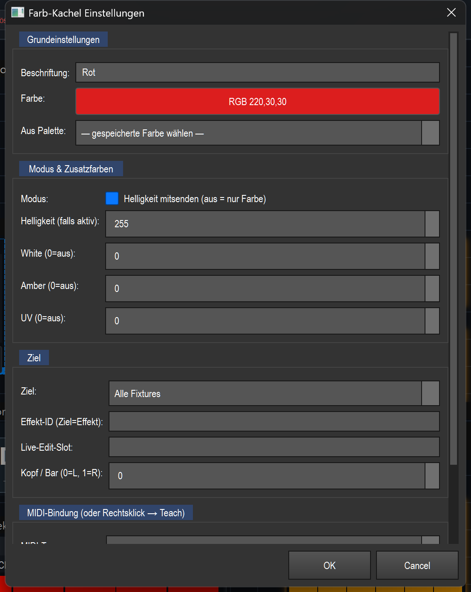

# Color (color tile) (`VCColor`)

> **English version** of [Farbe (Farb-Kachel) (`VCColor`)](03_farbe.md). LightOS itself speaks German: every button, menu and field is quoted here **exactly as it appears on screen**, with an English translation in brackets the first time it shows up. The screenshots are the same as in the German page.

> A colored tile that, with one click, puts a fixed color (RGB plus optional W/A/UV) on the target fixtures or on a running effect — the quick “button for red/blue/…” on the Virtual Console.

## What it is for & what it controls

The color tile is a preset color as a clickable surface. You set one color per tile (e.g. „Rot" (red)), and pressing the tile applies this color immediately. Where it acts is determined by the **Ziel** (target) (see Settings):

- on the **fixtures** (programmer/selection or all patched fixtures), or
- directly into an **effect** (replace its active color, append a color to its color list or set the fixed color slots 1–3).

Optionally the tile also sends **brightness** (intensity) so that the color is guaranteed to be visible, and it can drive the extra channels **White / Amber / UV**. The tile itself shows its color as a preview.

Shared VC basics (edit mode, creating widgets, banks, Touch-Lock) are described in the overview — see the overview ([README.en.md](README.en.md)).

## What it looks like & how to use it during operation

The tile is completely filled with its set color; in the middle is the **Beschriftung** (label) (in the picture „Rot") in black or white text, whichever is easier to read on that color. Above the element, the running app shows the type label („Farbe (VCColor)" (color (VCColor))).

**During operation** (Bearbeiten (edit) OFF):

- **Left-click (press):** applies the color to the target immediately. While the mouse button is held, the tile is drawn slightly brighter and marked with a white border (pressed state). On release the marking disappears again — but the color stays set.
- **Double-click:** opens a **floating color picker** (non-modal, does not block operation). During operation, every color change is applied **live immediately** to the target fixtures/effects — so you can recolor live while the picker stays open. The picker has no OK/Abbrechen (cancel) buttons; changes take effect directly. Another double-click only brings an already open picker to the front.
- **Indicators in the tile:**
  - A small **blue corner** at the top right as soon as a MIDI note/CC is assigned.
  - If the target is „Programmer/Selektion" (programmer/selection) or „Alle Fixtures" (all fixtures) but a running effect currently “owns” the color channels (RGB matrix effect active), the tile is **dimmed** and shows a **lock symbol** (🔒) at the top left. This is a hint: pressing it currently has no visible result because the effect overrides the color. (Effect targets are exempt — after all, they feed the effect.)

In **edit mode** (Bearbeiten ON) you move/resize the tile; a double-click here also opens the color picker (to set the tile color, without applying it live). You reach the full settings via right-click → „Einstellungen…" (settings…).

## Settings

The dialog is divided into groups (Grundeinstellungen (basic settings) · Modus & Zusatzfarben (mode & extra colors) · Ziel · MIDI-Bindung (MIDI binding)).

| Setting | Meaning | Values/options |
|---|---|---|
| **Beschriftung** | Text shown in the center of the tile. | Free text (e.g. „Rot") |
| **Farbe** (color) | The base color (RGB) of the tile. The button opens a color chooser; the button shows the selected color and its RGB value. | Color chooser dialog, gives R/G/B 0–255 |
| **Aus Palette** (from palette) | Uses a color palette previously saved in the programmer as the tile color. The list is reloaded every time it is opened. If the label is still empty or „Farbe", the palette name is used as the label. | „— gespeicherte Farbe wählen —" (— choose saved color —) or a saved color palette |
| **Modus: Helligkeit mitsenden** (mode: also send brightness) | ON: the tile additionally sets the intensity so that the color is always visible (but this clashes with running dimmer effects). OFF: pure color layer — the brightness comes from elsewhere; recommended if the fixtures have a base brightness, so that dimmer effects keep working. | On / Off (default: On) |
| **Helligkeit (falls aktiv)** (brightness (if active)) | Intensity value that is sent when „Helligkeit mitsenden" is active (shared dimmer = head 0). | 0–255 (default: 255) |
| **White (0=aus)** (white (0=off)) | Value for the white channel. 0 switches the channel off (but it is always set as well, to clear leftover white from a previous look). | 0–255 (default: 0) |
| **Amber (0=aus)** (amber (0=off)) | Value for the amber channel. Only sent if > 0. | 0–255 (default: 0) |
| **UV (0=aus)** (UV (0=off)) | Value for the UV channel. Only sent if > 0. | 0–255 (default: 0) |
| **Ziel** | Where the color acts (see the plain-words list below). | Programmer/Selektion · Alle Fixtures · Effekt (aktive Farbe) (effect (active color)) · Effekt (Farbe hinzufügen) (effect (add color)) · Effekt Farbe 1 (effect color 1) · Effekt Farbe 2 (effect color 2) · Effekt Farbe 3 (effect color 3) |
| **Effekt-ID (Ziel=Effekt)** (effect ID (target=effect)) | Function ID of the target effect for effect targets. Empty = the currently active effect. | Number or empty |
| **Live-Edit-Slot** | Only applies to effect targets without a fixed effect ID: colors the effect whose ID is currently in this named slot (e.g. set by an effect pad). Free text. | Free text (e.g. „MX") or empty |
| **Kopf / Bar (0=L, 1=R)** (head / bar (0=L, 1=R)) | For multi-head fixtures (e.g. a Spider with 2 LED banks): which head/bar is colored. The shared dimmer always stays head 0. Only relevant for the targets Programmer/Alle. | 0–7 (0 = bar L / bank 1, 1 = bar R / bank 2 …) |
| **MIDI-Typ** (MIDI type) | Kind of MIDI binding. | `note_on` (key/pad) · `cc` (controller) |
| **MIDI-Kanal (0=alle)** (MIDI channel (0=all)) | MIDI channel the tile responds on. | 0–16 (0 = „Alle" (all)) |
| **Note / CC (-1=keine)** (note / CC (-1=none)) | Note number or CC number the tile listens to. | -1–127 (-1 = „keine" (none)) |

**Targets in plain words:**

- **Programmer/Selektion** — colors the fixtures currently selected in the programmer. If none are selected, it automatically falls back to all patched fixtures.
- **Alle Fixtures** — colors all patched fixtures.
- **Effekt (aktive Farbe)** — live-sets the currently selected color in the color sequence of the target effect (replaces it).
- **Effekt (Farbe hinzufügen)** — appends this color to the color sequence of the target effect (instead of replacing). This way you build up a color list with pad presses, which a color fade/chase effect then runs through.
- **Effekt Farbe 1 / 2 / 3** — specifically sets the fixed color slot color1, color2 or color3 of the target effect. Algorithms such as Feuer/Plasma/Windrad (fire/plasma/pinwheel) read these fixed slots (not the color sequence) — this lets you recolor them live, which „Effekt (aktive Farbe)" can't do there.

## Binding to an effect

This tile has no effect “binding” of its own like an effect button (it stores no function_id for “control this effect”). Instead it only **addresses** an effect when the **Ziel** is set to one of the effect options:

- Enter the function ID of the target effect in **Effekt-ID** → the tile always acts on exactly this effect.
- If you leave the effect ID empty, the tile acts on the **currently active** effect (or on the effect from the **Live-Edit-Slot**, if one is set).

The live effect runs through the shared seam `src/core/engine/effect_live.py`: „Effekt (aktive Farbe)" via `set_selected_color`, „Farbe hinzufügen" via the action `add_color`, and „Effekt Farbe 1–3" via `set_param` (color1/2/3). If the target is Programmer/Alle, no effect is addressed — the tile then colors the fixtures directly.

## MIDI & keyboard

The color tile supports **MIDI teach** (right-click in edit mode → „MIDI Teach…", or the fields in the settings dialog). This widget does not offer a keyboard assignment of its own.

- **Note (`note_on`):** pressing the pad/key (velocity > 0) applies the color; releasing only resets the visual pressed state.
- **CC (`cc`):** a value > 63 counts as “pressed” and applies the color, a value ≤ 63 as “released”. This also lets you switch the tile with a push-button CC.
- **Channel 0** means “respond on all channels”.
- With a MIDI binding, the blue corner appears at the top right of the tile. On an APC mk2 the bound pad lights up in exactly the tile color.

## Tips & pitfalls

- **Lock symbol = an effect overrides the color:** if the dimmed tile appears with 🔒, an effect is running that owns the RGB channels. Pressing a Programmer/Alle tile then has no visible result — stop the effect first or use an effect target.
- **“The color doesn't work” → check Helligkeit mitsenden:** if „Helligkeit mitsenden" is OFF and the fixtures have no base brightness, it stays dark. For a color that is guaranteed to be visible, leave „Helligkeit mitsenden" ON. Conversely: if a dimmer effect is supposed to work, set „Helligkeit mitsenden" OFF, otherwise the tile overrides the dimmer.
- **Recolor live by double-click:** during operation, the double-click color picker is the fastest tool for spontaneous adjustments — it acts immediately without blocking operation.
- **Color an effect live:** for algorithms such as Feuer/Plasma/Windrad use „Effekt Farbe 1/2/3" (not „Effekt aktive Farbe") — these algorithms read the fixed color slots.
- **Build color lists:** pressing several tiles with the target „Effekt (Farbe hinzufügen)" one after another fills the color sequence of a chase/fade effect.
- **Multi-head fixtures:** with a Spider or similar, choose the right „Kopf / Bar" to color only one LED bank; the dimmer stays shared (head 0).
- **White is always written:** even White=0 is sent, to clear leftover white from a previous look/effect — amber and UV, on the other hand, only when their value is > 0.
