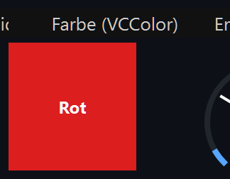
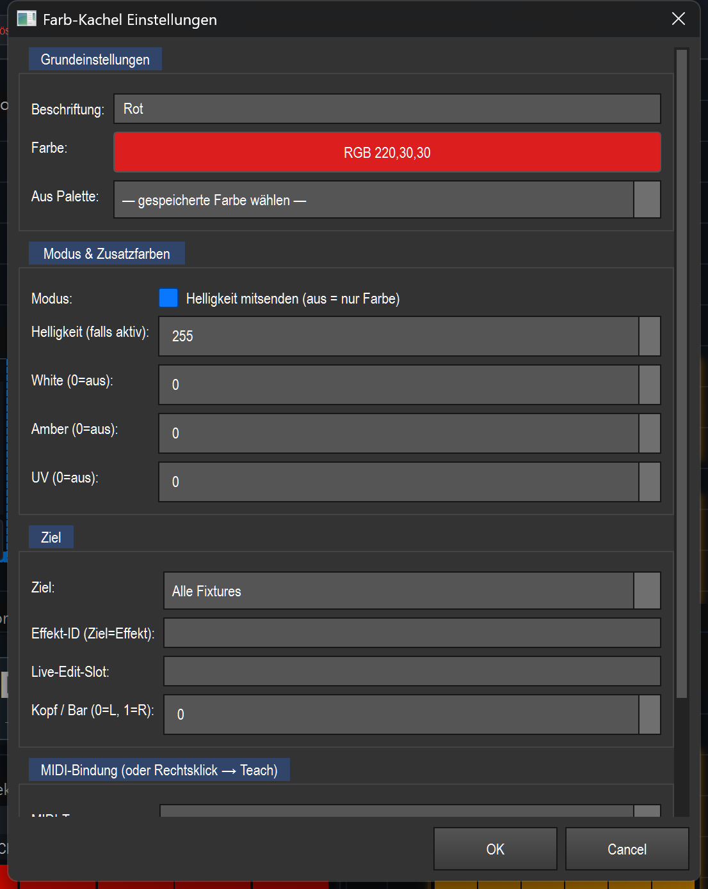

# Farbe (Farb-Kachel) (`VCColor`)

> Eine farbige Kachel, die per Klick eine feste Farbe (RGB plus optional W/A/UV) auf die Ziel-Fixtures oder auf einen laufenden Effekt legt — das schnelle „Knopf für Rot/Blau/…" auf der Virtuellen Konsole.

## Wozu & was es steuert

Die Farb-Kachel ist eine vorab eingestellte Farbe als anklickbare Fläche. Du legst pro Kachel eine Farbe fest (z. B. „Rot"), und beim Druck wird diese Farbe sofort angewendet. Wohin sie wirkt, bestimmt das **Ziel** (siehe Einstellungen):

- auf die **Fixtures** (Programmer/Selektion oder alle gepatchten Geräte), oder
- direkt in einen **Effekt** (dessen aktive Farbe ersetzen, eine Farbe an die Farbliste anhängen oder die festen Farbslots 1–3 setzen).

Optional sendet die Kachel zusätzlich **Helligkeit** (Intensität) mit, damit die Farbe garantiert sichtbar ist, und kann die Zusatzkanäle **White / Amber / UV** bedienen. Die Kachel selbst zeigt ihre Farbe als Vorschau an.

Gemeinsame VC-Grundlagen (Bearbeiten-Modus, Anlegen, Banks, Touch-Lock) sind in der Übersicht beschrieben — siehe Übersicht ([README.md](README.md)).

## So sieht es aus & Bedienung im Betrieb

Die Kachel ist komplett in ihrer eingestellten Farbe gefüllt; in der Mitte steht die **Beschriftung** (im Bild „Rot") in schwarzer oder weißer Schrift, je nachdem was auf der Farbe besser lesbar ist. Oben über dem Element steht in der laufenden App das Typ-Label („Farbe (VCColor)").

Im **Betrieb** (Bearbeiten AUS):

- **Linksklick (drücken):** wendet die Farbe sofort auf das Ziel an. Solange die Maustaste gedrückt ist, wird die Kachel etwas heller dargestellt und mit einem weißen Rahmen markiert (gedrückt-Zustand). Beim Loslassen verschwindet die Markierung wieder — die Farbe bleibt aber gesetzt.
- **Doppelklick:** öffnet einen **schwebenden Farb-Picker** (nicht-modal, blockiert die Bedienung nicht). Jede Farbänderung wird im Run-Modus **sofort live** auf die Ziel-Fixtures/-Effekte gelegt — du kannst also live umfärben, während der Picker offen bleibt. Der Picker hat keine OK/Abbrechen-Knöpfe; Änderungen wirken direkt. Ein erneuter Doppelklick holt einen bereits offenen Picker nur nach vorne.
- **Indikatoren in der Kachel:**
  - Oben rechts eine kleine **blaue Ecke**, sobald eine MIDI-Note/CC zugewiesen ist.
  - Ist das Ziel „Programmer/Selektion" oder „Alle Fixtures", aber ein laufender Effekt „besitzt" gerade die Farbkanäle (RGB-Matrix-Effekt aktiv), wird die Kachel **abgedunkelt** und zeigt ein **Schloss-Symbol** (🔒) oben links. Das ist ein Hinweis: Ein Druck bewirkt hier gerade nichts Sichtbares, weil der Effekt die Farbe übersteuert. (Effekt-Ziele sind davon ausgenommen — die füttern ja den Effekt.)

Im **Bearbeiten-Modus** (Bearbeiten AN) verschiebst/skalierst du die Kachel; ein Doppelklick öffnet hier ebenfalls den Farb-Picker (zum Einstellen der Kachelfarbe, ohne live anzuwenden). Die vollen Einstellungen erreichst du per Rechtsklick → „Einstellungen…".

## Einstellungen

Der Dialog ist in Gruppen unterteilt (Grundeinstellungen · Modus & Zusatzfarben · Ziel · MIDI-Bindung).

| Einstellung | Bedeutung | Werte/Optionen |
|---|---|---|
| **Beschriftung** | Text, der mittig auf der Kachel steht. | Freitext (z. B. „Rot") |
| **Farbe** | Die Grundfarbe (RGB) der Kachel. Knopf öffnet einen Farbwähler; der Knopf zeigt die gewählte Farbe und ihren RGB-Wert. | Farbwähler-Dialog, ergibt R/G/B 0–255 |
| **Aus Palette** | Übernimmt eine zuvor im Programmer gespeicherte Farb-Palette als Kachelfarbe. Die Liste wird bei jedem Öffnen frisch geladen. Ist die Beschriftung noch leer oder „Farbe", wird der Palettenname als Beschriftung übernommen. | „— gespeicherte Farbe wählen —" oder eine gespeicherte Farb-Palette |
| **Modus: Helligkeit mitsenden** | AN: Die Kachel setzt zusätzlich die Intensität, damit die Farbe immer sichtbar ist (kollidiert aber mit laufenden Dimmer-Effekten). AUS: reine Farb-Ebene — Helligkeit kommt von woanders; empfohlen, wenn die Fixtures eine Basis-Helligkeit haben, damit Dimmer-Effekte weiter wirken. | An / Aus (Standard: An) |
| **Helligkeit (falls aktiv)** | Intensitätswert, der bei aktivem „Helligkeit mitsenden" gesendet wird (geteilter Dimmer = Kopf 0). | 0–255 (Standard: 255) |
| **White (0=aus)** | Wert für den Weiß-Kanal. 0 schaltet den Kanal aus (wird aber immer mitgesetzt, um Restweiß eines vorigen Looks zu löschen). | 0–255 (Standard: 0) |
| **Amber (0=aus)** | Wert für den Amber-Kanal. Wird nur gesendet, wenn > 0. | 0–255 (Standard: 0) |
| **UV (0=aus)** | Wert für den UV-Kanal. Wird nur gesendet, wenn > 0. | 0–255 (Standard: 0) |
| **Ziel** | Wohin die Farbe wirkt (siehe Klartext unten). | Programmer/Selektion · Alle Fixtures · Effekt (aktive Farbe) · Effekt (Farbe hinzufügen) · Effekt Farbe 1 · Effekt Farbe 2 · Effekt Farbe 3 |
| **Effekt-ID (Ziel=Effekt)** | Funktions-ID des Ziel-Effekts bei Effekt-Zielen. Leer = der aktuell aktive Effekt. | Zahl oder leer |
| **Live-Edit-Slot** | Greift nur bei Effekt-Zielen ohne feste Effekt-ID: Färbt den Effekt, dessen ID gerade in diesem benannten Slot liegt (z. B. von einem Effekt-Pad gesetzt). Freitext. | Freitext (z. B. „MX") oder leer |
| **Kopf / Bar (0=L, 1=R)** | Bei Mehrkopf-Geräten (z. B. Spider mit 2 LED-Bänken): welcher Kopf/Bar gefärbt wird. Der geteilte Dimmer bleibt immer Kopf 0. Nur für Ziele Programmer/Alle relevant. | 0–7 (0 = Bar L / Bank 1, 1 = Bar R / Bank 2 …) |
| **MIDI-Typ** | Art der MIDI-Bindung. | `note_on` (Taste/Pad) · `cc` (Controller) |
| **MIDI-Kanal (0=alle)** | MIDI-Kanal, auf dem reagiert wird. | 0–16 (0 = „Alle") |
| **Note / CC (-1=keine)** | Notennummer bzw. CC-Nummer, auf die die Kachel hört. | -1–127 (-1 = „keine") |

**Ziele im Klartext:**

- **Programmer/Selektion** — färbt die aktuell im Programmer ausgewählten Fixtures. Sind keine ausgewählt, fällt es automatisch auf alle gepatchten Fixtures zurück.
- **Alle Fixtures** — färbt alle gepatchten Fixtures.
- **Effekt (aktive Farbe)** — setzt live die gerade ausgewählte Farbe in der Farb-Sequenz des Ziel-Effekts (ersetzt sie).
- **Effekt (Farbe hinzufügen)** — hängt diese Farbe an die Farb-Sequenz des Ziel-Effekts an (statt zu ersetzen). So baust du per Pad-Druck eine Farbliste zusammen, durch die ein Farbfade-/Chase-Effekt dann durchläuft.
- **Effekt Farbe 1 / 2 / 3** — setzt gezielt den festen Farbslot color1, color2 bzw. color3 des Ziel-Effekts. Algorithmen wie Feuer/Plasma/Windrad lesen diese festen Slots (nicht die Farb-Sequenz) — so lassen sie sich live umfärben, was „Effekt (aktive Farbe)" dort nicht kann.

## Bindung an einen Effekt

Diese Kachel hat keine eigene Effekt-„Bindung" wie ein Effekt-Button (sie speichert keine function_id für „diesen Effekt steuern"). Stattdessen **adressiert** sie einen Effekt nur, wenn das **Ziel** auf eine der Effekt-Optionen steht:

- Trage in **Effekt-ID** die Funktions-ID des Ziel-Effekts ein → die Kachel wirkt immer auf genau diesen Effekt.
- Lässt du die Effekt-ID leer, wirkt die Kachel auf den **aktuell aktiven** Effekt (bzw. auf den Effekt aus dem **Live-Edit-Slot**, falls einer gesetzt ist).

Die Live-Wirkung läuft über die gemeinsame Naht `src/core/engine/effect_live.py`: „Effekt (aktive Farbe)" über `set_selected_color`, „Farbe hinzufügen" über die Aktion `add_color`, und „Effekt Farbe 1–3" über `set_param` (color1/2/3). Steht das Ziel auf Programmer/Alle, wird kein Effekt angesprochen — dann färbt die Kachel direkt die Fixtures.

## MIDI & Tastatur

Die Farb-Kachel unterstützt **MIDI-Teach** (Rechtsklick im Bearbeiten-Modus → „MIDI Teach…", oder die Felder im Einstellungsdialog). Eine eigene Tastatur-Zuweisung bietet dieses Widget nicht.

- **Note (`note_on`):** Drücken des Pads/der Taste (Velocity > 0) wendet die Farbe an; Loslassen setzt nur den optischen Druck-Zustand zurück.
- **CC (`cc`):** Wert > 63 gilt als „gedrückt" und wendet die Farbe an, Wert ≤ 63 als „losgelassen". Damit lässt sich die Kachel auch über einen Taster-CC schalten.
- **Kanal 0** bedeutet „auf allen Kanälen reagieren".
- Bei MIDI-Bindung erscheint oben rechts in der Kachel die blaue Ecke. Auf einem APC mk2 wird das gebundene Pad in genau der Kachelfarbe beleuchtet.

## Tipps & Fallen

- **Schloss-Symbol = Effekt übersteuert die Farbe:** Wenn die abgedunkelte Kachel mit 🔒 erscheint, läuft ein Effekt, der die RGB-Kanäle besitzt. Ein Druck auf eine Programmer/Alle-Kachel bringt dann nichts Sichtbares — erst den Effekt stoppen oder ein Effekt-Ziel verwenden.
- **„Farbe geht nicht" → Helligkeit mitsenden prüfen:** Ist „Helligkeit mitsenden" AUS und die Fixtures haben keine Basis-Helligkeit, bleibt es dunkel. Für eine garantiert sichtbare Farbe „Helligkeit mitsenden" AN lassen. Umgekehrt: Wenn ein Dimmer-Effekt arbeiten soll, „Helligkeit mitsenden" AUS, sonst überschreibt die Kachel den Dimmer.
- **Live umfärben per Doppelklick:** Im Betrieb ist der Doppelklick-Farb-Picker das schnellste Werkzeug zum spontanen Anpassen — er wirkt sofort, ohne die Bedienung zu blockieren.
- **Effekt live einfärben:** Für Algorithmen wie Feuer/Plasma/Windrad „Effekt Farbe 1/2/3" nutzen (nicht „Effekt aktive Farbe") — diese Algorithmen lesen die festen Farbslots.
- **Farblisten bauen:** Mehrere Kacheln mit Ziel „Effekt (Farbe hinzufügen)" hintereinander gedrückt füllen die Farb-Sequenz eines Chase/Fade-Effekts.
- **Mehrkopf-Geräte:** Bei Spider o. Ä. den richtigen „Kopf / Bar" wählen, um nur eine LED-Bank zu färben; der Dimmer bleibt geteilt (Kopf 0).
- **White wird immer geschrieben:** Auch White=0 wird gesendet, um Restweiß eines vorigen Looks/Effekts zu löschen — Amber und UV dagegen nur, wenn ihr Wert > 0 ist.
