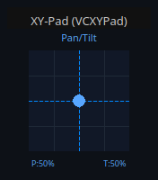
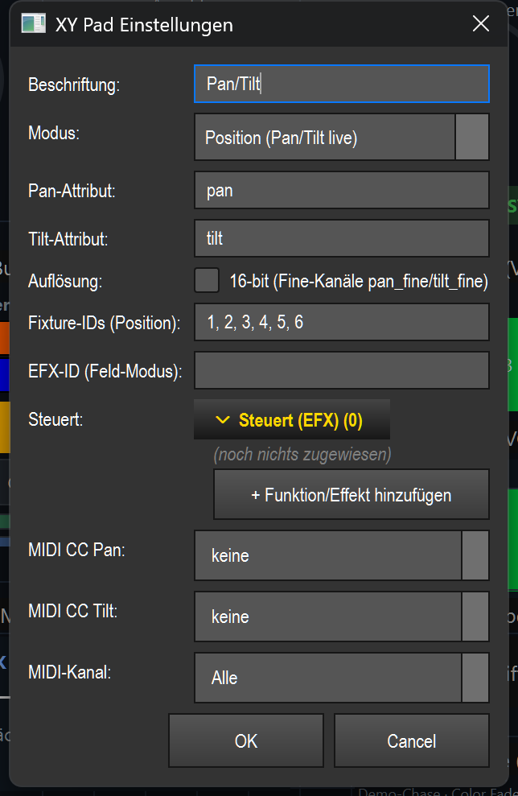

# XY pad (`VCXYPad`)

> **English version** of [XY-Pad (`VCXYPad`)](04_xy_pad.md). LightOS itself speaks German: every button, menu and field is quoted here **exactly as it appears on screen**, with an English translation in brackets the first time it shows up. The screenshots are the same as in the German page.

> A 2D control field for the pan/tilt of moving heads: you move the fixtures directly with the mouse, drag out a movement area for an effect, or draw a path that the heads follow.

## What it is for & what it controls

The XY pad controls the **horizontal (pan)** and **vertical (tilt)** position of moving heads. The X axis of the field corresponds to pan (0–100 %), the Y axis to tilt (0–100 %). The values are written into the programmer as the attributes `pan` and `tilt`.

Which fixtures the pad moves is determined in this order:

1. Fixed **fixture IDs**, if entered in the settings.
2. Otherwise the **currently selected** fixtures.
3. Otherwise **all patched** fixtures.

The pad has three modes that fundamentally change its behavior: **Position** (move pan/tilt live), **Feld** (field) (drag out the movement area of an effect) and **Pfad** (path) (draw a path that an effect follows). The default is **Position**.

## What it looks like & how to use it during operation

At the top you see the **Beschriftung** (label) („Pan/Tilt" in the screenshot; with field/path mode active, `[Feld]` or `[Pfad]` is shown after it), below it a square **pad field** with a grid (4×4). In position mode, the blue **dot** with dashed crosshair lines shows the current pan/tilt position; at the bottom left it shows `P:<x>%` (pan), at the bottom right `T:<y>%` (tilt).

How you use the pad during operation depends on the mode. A left-click/drag right at the edge is kept away from the outermost pad area by an inner margin (24 px); values are always clamped to 0–100 %.

**Mode „Position"** (default):
- **Clicking into the field** sets pan/tilt immediately to the clicked spot — the fixtures jump there.
- **Dragging** moves pan/tilt continuously along with the mouse (live movement).
- The dot and the `P:`/`T:` percentage display follow the movement.

**Mode „Feld"** (`[Feld]`):
- **Dragging out a rectangle** (press, drag, release) marks an area. On release, this sets the **center** (`x_offset`/`y_offset`) and **size** (`width`/`height`) of the target effect — the effect runs its figure (e.g. a figure eight) exactly within this field.
- While you drag, the rectangle is drawn in yellow with a dot in the center.
- A plain **click without dragging** does not create a point-sized field: a **minimum edge length** (~5 %) applies, and the field is clamped so that it stays completely within the pad.
- As long as no field has been dragged out yet, the pad shows the hint „Feld aufziehen → EFX fährt hier" (drag out a field → EFX moves here).

**Mode „Pfad"** (`[Pfad]`):
- **Drawing a path** (press, drag, release) draws a freehand line. On release, the path is placed on the target effect as a **custom effect path** (Custom-EfxPath) — the moving heads follow exactly this path.
- The path fills the whole field (center in the middle, full size), so the drawn line corresponds directly to the pan/tilt path.
- Very finely spaced sample points are thinned out (max. 48 points); a path of fewer than 2 points is discarded.
- While you draw, the line appears blue and the start point green. Without a path, the pad shows the hint „Bahn zeichnen → MH fährt sie ab" (draw a path → MH follows it).

> Note: in the VC's **edit mode** the pad does not respond to these gestures — there, dragging moves/resizes the widget. Control only happens with „Bearbeiten" (edit) switched off. If „Touch-Lock" is active, mouse/touch are locked (MIDI keeps working). For the shared basics see the overview (README.en.md).

## Settings

Double-clicking the pad (in edit mode) opens the „XY Pad Einstellungen" (XY pad settings) dialog.

| Setting | Meaning | Values/options |
| --- | --- | --- |
| **Beschriftung** | Title at the top of the pad. | Free text (empty = previous title) |
| **Modus** (mode) | Basic behavior of the pad. | **Position (Pan/Tilt live)** = move the fixtures directly · **Feld (EFX-Bereich aufziehen)** (field (drag out EFX area)) = set center/size of an effect · **Pfad zeichnen (Live, EFX)** (draw path (live, EFX)) = place the path as an effect path |
| **Pan-Attribut** (pan attribute) | Programmer attribute for the horizontal axis. | Free text, default `pan` (empty → `pan`) |
| **Tilt-Attribut** (tilt attribute) | Programmer attribute for the vertical axis. | Free text, default `tilt` (empty → `tilt`) |
| **Auflösung** (resolution) | 16-bit mode: additionally writes the fine channels `pan_fine`/`tilt_fine` for smooth movement. Fixtures without a fine channel ignore the extra value. | Checkbox „16-bit (Fine-Kanäle pan_fine/tilt_fine)" (16-bit (fine channels pan_fine/tilt_fine)); off = classic 8-bit |
| **Fixture-IDs (Position)** | Fixed target fixtures in position mode. Empty = current selection, otherwise all patched. | Comma-separated numbers (e.g. `1, 2, 3, 4, 5, 6`) |
| **EFX-ID (Feld-Modus)** (EFX ID (field mode)) | Target effect ID for field/path mode, as a number. | Number; empty = active effect |
| **Steuert** (controls) | Select the target effect for field/path mode from a dropdown instead of typing the ID. Takes precedence over „EFX-ID". | Drop-down list, one effect; empty = active effect |
| **MIDI CC Pan** | Absolute CC that remote-controls the pan axis (position mode only). | -1 (= „keine" (none)) to 127 |
| **MIDI CC Tilt** | Absolute CC that remote-controls the tilt axis (position mode only). | -1 (= „keine") to 127 |
| **MIDI-Kanal** (MIDI channel) | Shared MIDI channel for the pan and tilt CC. | 0 (= „Alle" (all)) to 16 |

## Binding to an effect

The pad is effect-bound as soon as **mode „Feld"** is active (`is_effect_bound`). In the modes **Feld** and **Pfad**, the pad does not act on the fixtures' pan/tilt but on a **target effect**:

- **Binding:** select the effect in the dialog under **„Steuert"** from the dropdown — or enter its ID in **„EFX-ID (Feld-Modus)"**. „Steuert" takes precedence; if both are empty, the pad acts on the **active effect**.
- **In field mode**, the dragged rectangle writes the effect parameters `x_offset`, `y_offset`, `width`, `height` (each 0–255) — the effect runs its figure within this field.
- **In path mode**, the drawn path is set as a custom effect path, and the effect is set to the full field size (`x_offset`/`y_offset` = 128, `width`/`height` = 255).
- **Without a valid target** (no effect found / no suitable path support) nothing happens; in field mode without a dragged field, the pad only shows the hint text.

The live effect runs through the shared seam `src/core/engine/effect_live.py` (`set_param`, `resolve_target`). The widget only stores the effect ID.

## MIDI & keyboard

The XY pad supports **MIDI** (two absolute control change axes), but **no** key teach.

- **Assign:** in the properties dialog, set **„MIDI CC Pan"** and **„MIDI CC Tilt"** to the desired CC numbers and select the **„MIDI-Kanal"** (0 = all channels). A separate „MIDI Teach…" is not needed here — the binding is done in the dialog.
- **Effect:** both CCs are **absolute** — the incoming value (0–127) is mapped directly to 0–100 % of the respective axis.
- Effective **only in position mode**: in the modes Feld/Pfad, MIDI does not control the pad.

## Tips & pitfalls

- **Choose the mode first:** in field/path mode the pad doesn't move fixtures directly but an effect. If you see “nothing happens”, check whether Feld/Pfad is accidentally active instead of Position.
- **Field mode needs a real drag:** because of the minimum size, a plain click doesn't create a tiny point-sized field — always drag out a rectangle.
- **Don't forget the effect target:** without „Steuert"/„EFX-ID", field and path act on the *active* effect. For reproducible operation, bind the target effect permanently.
- **16-bit only with suitable fixtures:** the fine channel only helps moving heads with `pan_fine`/`tilt_fine`. With 8-bit fixtures you can leave it enabled — the extra value is ignored.
- **Mind the fixture selection:** without fixed fixture IDs, the pad in position mode moves the *current selection*, otherwise *all patched* fixtures. Enter the IDs for a fixed set.
- **MIDI only absolute & only Position:** relative encoders don't fit; in field/path mode MIDI has no function.
