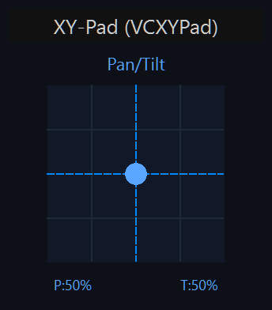
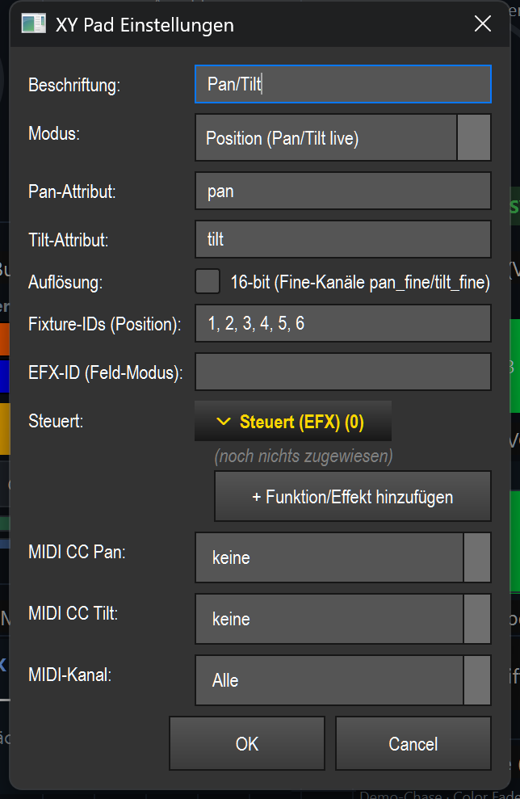

# XY-Pad (`VCXYPad`)

> Ein 2D-Steuerfeld für Pan/Tilt von Moving Heads: Du fährst die Geräte direkt mit der Maus, ziehst einen Bewegungsbereich für einen Effekt auf oder zeichnest eine Bahn, die die Köpfe abfahren.

## Wozu & was es steuert

Das XY-Pad steuert die **horizontale (Pan)** und **vertikale (Tilt)** Position von Moving Heads. Die X-Achse des Felds entspricht Pan (0–100 %), die Y-Achse Tilt (0–100 %). Geschrieben werden die Werte als Attribute `pan` und `tilt` in den Programmer.

Welche Geräte das Pad bewegt, wird in dieser Reihenfolge bestimmt:

1. Feste **Fixture-IDs**, falls in den Einstellungen eingetragen.
2. Sonst die **aktuell ausgewählten** Fixtures.
3. Sonst **alle gepatchten** Fixtures.

Das Pad hat drei Modi, die sein Verhalten grundlegend ändern: **Position** (Pan/Tilt live fahren), **Feld** (einen Bewegungsbereich eines Effekts aufziehen) und **Pfad** (eine Bahn zeichnen, die ein Effekt abfährt). Standard ist **Position**.

## So sieht es aus & Bedienung im Betrieb

Sichtbar sind oben die **Beschriftung** (im Screenshot „Pan/Tilt"; bei aktivem Feld-/Pfad-Modus steht zusätzlich `[Feld]` bzw. `[Pfad]` dahinter), darunter ein quadratisches **Pad-Feld** mit Gitternetz (4×4 Raster). Im Positions-Modus zeigt der blaue **Punkt** mit gestrichelten Fadenkreuz-Linien die aktuelle Pan/Tilt-Stellung; unten links steht `P:<x>%` (Pan), unten rechts `T:<y>%` (Tilt).

Die Bedienung im Betrieb hängt vom Modus ab. Ein Linksklick/Ziehen direkt am Rand ist durch einen inneren Rand (24 px) vom äußersten Pad-Bereich abgesetzt; Werte werden immer auf 0–100 % geklemmt.

**Modus „Position"** (Standard):
- **Klick ins Feld** setzt Pan/Tilt sofort auf die geklickte Stelle — die Geräte springen dorthin.
- **Ziehen** fährt Pan/Tilt kontinuierlich mit der Maus mit (Live-Bewegung).
- Der Punkt und die `P:`/`T:`-Prozentanzeige folgen der Bewegung.

**Modus „Feld"** (`[Feld]`):
- **Aufziehen eines Rechtecks** (drücken, ziehen, loslassen) markiert einen Bereich. Beim Loslassen wird daraus **Zentrum** (`x_offset`/`y_offset`) und **Größe** (`width`/`height`) des Ziel-Effekts gesetzt — der Effekt fährt seine Figur (z. B. eine Acht) genau in diesem Feld ab.
- Während des Ziehens wird das Rechteck gelb dargestellt, mit einem Punkt im Zentrum.
- Ein reiner **Klick ohne Ziehen** erzeugt kein Punkt-Feld: Es gilt eine **Mindest-Kantenlänge** (~5 %), und das Feld wird so geklemmt, dass es vollständig im Pad bleibt.
- Solange noch kein Feld aufgezogen ist, zeigt das Pad den Hinweis „Feld aufziehen → EFX fährt hier".

**Modus „Pfad"** (`[Pfad]`):
- **Bahn zeichnen** (drücken, ziehen, loslassen) zeichnet eine freie Linie. Beim Loslassen wird die Bahn als **eigener Effekt-Pfad** (Custom-EfxPath) auf den Ziel-Effekt gelegt — die Moving Heads fahren genau diese Bahn ab.
- Die Bahn füllt dabei das ganze Feld (Zentrum Mitte, volle Größe), sodass die gezeichnete Linie direkt der Pan/Tilt-Bahn entspricht.
- Sehr feine Stützpunkte werden ausgedünnt (max. 48 Punkte); eine Bahn aus weniger als 2 Punkten wird verworfen.
- Während des Zeichnens erscheint die Linie blau, der Startpunkt grün. Ohne Bahn zeigt das Pad den Hinweis „Bahn zeichnen → MH fährt sie ab".

> Hinweis: Im **Bearbeiten-Modus** der VC reagiert das Pad nicht auf diese Gesten — dort dient Ziehen dem Verschieben/Skalieren des Widgets. Steuerung passiert nur bei ausgeschaltetem „Bearbeiten". Ist „Touch-Lock" aktiv, sind Maus/Touch gesperrt (MIDI steuert weiter). Gemeinsame Grundlagen siehe Übersicht (README.md).

## Einstellungen

Doppelklick auf das Pad (im Bearbeiten-Modus) öffnet den Dialog „XY Pad Einstellungen".

| Einstellung | Bedeutung | Werte/Optionen |
| --- | --- | --- |
| **Beschriftung** | Titel oben auf dem Pad. | Freitext (leer = bisheriger Titel) |
| **Modus** | Grundverhalten des Pads. | **Position (Pan/Tilt live)** = Geräte direkt fahren · **Feld (EFX-Bereich aufziehen)** = Zentrum/Größe eines Effekts setzen · **Pfad zeichnen (Live, EFX)** = Bahn als Effekt-Pfad legen |
| **Pan-Attribut** | Programmer-Attribut für die horizontale Achse. | Freitext, Standard `pan` (leer → `pan`) |
| **Tilt-Attribut** | Programmer-Attribut für die vertikale Achse. | Freitext, Standard `tilt` (leer → `tilt`) |
| **Auflösung** | 16-bit-Modus: schreibt zusätzlich die Fine-Kanäle `pan_fine`/`tilt_fine` für ruckelfreie Bewegung. Geräte ohne Fine-Kanal ignorieren den Extra-Wert. | Checkbox „16-bit (Fine-Kanäle pan_fine/tilt_fine)"; aus = klassisch 8-bit |
| **Fixture-IDs (Position)** | Feste Ziel-Fixtures im Positions-Modus. Leer = aktuelle Auswahl, sonst alle gepatchten. | Komma-getrennte Zahlen (z. B. `1, 2, 3, 4, 5, 6`) |
| **EFX-ID (Feld-Modus)** | Ziel-Effekt-ID für Feld-/Pfad-Modus per Zahl. | Zahl; leer = aktiver Effekt |
| **Steuert** | Ziel-Effekt für Feld-/Pfad-Modus per Dropdown wählen statt ID tippen. Hat Vorrang vor „EFX-ID". | Aufklappbare Liste, ein Effekt; leer = aktiver Effekt |
| **MIDI CC Pan** | Absoluter CC, der die Pan-Achse fernsteuert (nur Positions-Modus). | -1 (= „keine") bis 127 |
| **MIDI CC Tilt** | Absoluter CC, der die Tilt-Achse fernsteuert (nur Positions-Modus). | -1 (= „keine") bis 127 |
| **MIDI-Kanal** | Gemeinsamer MIDI-Kanal für Pan- und Tilt-CC. | 0 (= „Alle") bis 16 |

## Bindung an einen Effekt

Das Pad ist effektgebunden, sobald der **Modus „Feld"** aktiv ist (`is_effect_bound`). In den Modi **Feld** und **Pfad** wirkt das Pad nicht auf Pan/Tilt der Fixtures, sondern auf einen **Ziel-Effekt**:

- **Binden:** Den Effekt im Dialog unter **„Steuert"** per Dropdown wählen — oder dessen ID in **„EFX-ID (Feld-Modus)"** eintragen. „Steuert" hat Vorrang; ist beides leer, wirkt das Pad auf den **aktiven Effekt**.
- **Im Feld-Modus** schreibt das aufgezogene Rechteck die Effekt-Parameter `x_offset`, `y_offset`, `width`, `height` (jeweils 0–255) — der Effekt fährt seine Figur in diesem Feld.
- **Im Pfad-Modus** wird die gezeichnete Bahn als eigener Effekt-Pfad gesetzt, und der Effekt wird auf volle Feldgröße (`x_offset`/`y_offset` = 128, `width`/`height` = 255) gestellt.
- **Ohne gültiges Ziel** (kein Effekt gefunden / kein passender Pfad-Support) passiert nichts; im Feld-Modus ohne gezogenes Feld zeigt das Pad nur den Hinweistext.

Die Live-Wirkung läuft über die gemeinsame Naht `src/core/engine/effect_live.py` (`set_param`, `resolve_target`). Das Widget speichert nur die Effekt-ID.

## MIDI & Tastatur

Das XY-Pad unterstützt **MIDI** (zwei absolute Control-Change-Achsen), aber **kein** Tasten-Teach.

- **Zuweisen:** im Eigenschaften-Dialog **„MIDI CC Pan"** und **„MIDI CC Tilt"** auf die gewünschten CC-Nummern setzen sowie den **„MIDI-Kanal"** wählen (0 = alle Kanäle). Ein separates „MIDI Teach…" ist hier nicht nötig — die Bindung läuft über den Dialog.
- **Wirkung:** Beide CCs sind **absolut** — der eingehende Wert (0–127) wird direkt auf 0–100 % der jeweiligen Achse abgebildet.
- **Nur im Positions-Modus** wirksam: In den Modi Feld/Pfad steuert MIDI das Pad nicht.

## Tipps & Fallen

- **Modus zuerst wählen:** Im Feld-/Pfad-Modus bewegt das Pad keine Fixtures direkt, sondern einen Effekt. Wer „nichts passiert" beobachtet, prüft, ob versehentlich Feld/Pfad statt Position aktiv ist.
- **Feld-Modus braucht ein echtes Ziehen:** Ein reiner Klick erzeugt wegen der Mindestgröße kein winziges Punkt-Feld — immer ein Rechteck aufziehen.
- **Effekt-Ziel nicht vergessen:** Ohne „Steuert"/„EFX-ID" wirken Feld und Pfad auf den *aktiven* Effekt. Für reproduzierbare Bedienung den Ziel-Effekt fest binden.
- **16-bit nur bei passenden Geräten:** Der Fine-Kanal hilft nur Moving Heads mit `pan_fine`/`tilt_fine`. Bei 8-bit-Geräten kannst du ihn aktiviert lassen — der Extra-Wert wird ignoriert.
- **Fixture-Auswahl beachten:** Ohne feste Fixture-IDs fährt das Pad im Positions-Modus die *aktuelle Auswahl*, sonst *alle gepatchten* Geräte. Für ein festes Set die IDs eintragen.
- **MIDI nur absolut & nur Position:** Relative Encoder passen nicht; im Feld-/Pfad-Modus ist MIDI ohne Funktion.
