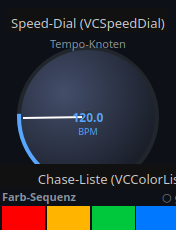
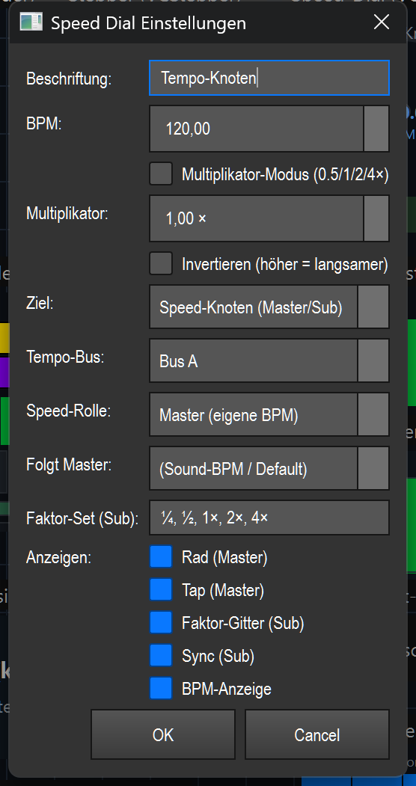

# Speed dial (tempo wheel) (`VCSpeedDial`)

> **English version** of [Speed-Dial (Tempo-Rad) (`VCSpeedDial`)](05_speed_dial.md). LightOS itself speaks German: every button, menu and field is quoted here **exactly as it appears on screen**, with an English translation in brackets the first time it shows up. The screenshots are the same as in the German page.

> A rotary wheel with tap tempo that controls the tempo (BPM or a speed factor) of an executor, an effect or a tempo bus live.

## What it is for & what it controls

The speed dial sets a speed. Depending on the selected **Ziel** (target), the same dial value acts on something different:

- the fade time of the cues of an **executor** (playback),
- the speed of a **function/effect** (e.g. matrix/EFX),
- the **BPM of a named tempo bus**,
- the **tempo multiplier** of one or more effects (×½/×2 …),
- or it is itself a **speed node** (tempo bus) — either master (its own tempo) or sub (follows a master with a factor).

You can change the value in four ways: by **Tap** (tapping in rhythm), by **dragging** with the mouse, with the **mouse wheel**, or, in sub/multiplier operation, via the **factor grid**. An auto-update (~10 Hz) keeps the display in step when the master tempo changes externally (e.g. through audio/tap elsewhere).

General VC basics (edit mode, creating widgets, banks, context menu) are not repeated here — see the overview ([README.en.md](README.en.md)).

## What it looks like & how to use it during operation

The appearance depends on the target mode. There are two views.

### Wheel view (executor, function/effect, tempo bus, speed node as master)

This is what the element looks like in the screenshot above (the type label at the top, below it the element with the label „Tempo-Knoten" (tempo node)):

- **Ring-shaped arc** (270°, from −225° to +45°): shows the current value. The dark part behind it is the scale, the blue part is the filled value.
- **Pointer (white needle)** and **center point**: mark the current position.
- **Value text in the middle**: in BPM operation the number + „BPM"; in multiplier operation the factor (e.g. `1.00×`) + „SPEED".
- **Beschriftung** (label) at the top center (in the picture „Tempo-Knoten").
- **„INV"** at the top right (orange): only appears if *Invertieren* (invert) is active.
- **„TAP"** (gray button at the bottom left) and **„SYNC"** (green button at the bottom right).

How to use it:

| Gesture / zone | Effect |
|---|---|
| Click on **TAP** | Tap tempo: registers the times of your taps and calculates the BPM from them (see below). With the target *Tempo-Bus* / *Speed-Knoten (Master)* (speed node (master)), the bus is tapped directly. |
| Click on **SYNC** | Sets a common starting point: for effects it aligns the phase of all target effects; for *Tempo-Bus* / *Speed-Knoten* it resets the downbeat to “now”. |
| **Drag** (hold the left mouse button in the wheel and move vertically) | Changes the value: up = more, down = less. BPM ±2 per pixel, multiplier ±0.02 per pixel. |
| **Mouse wheel** | BPM in steps of 5, multiplier in steps of 0.1. |

Value ranges: BPM **20–600**, multiplier **0.1–8.0**. Values are clamped to these limits.

### Grid view (speed node as sub, or effect multiplier)

In sub operation (speed node/sub) and in multiplier operation (effect ×½/×2), the widget shows no wheel but a **factor grid** instead of the needle:

- **Header row**: the label on the left, a yellow badge on the right — `× Master` (multiplier) or `Sub→<Master>` (sub, e.g. `Sub→Sound`).
- **Factor buttons** (top row, e.g. `¼ ½ 1× 2× 4×`): the active factor is highlighted in blue. A click selects that factor.
- **Step bar** below: `-` (one factor slower), factor display in the middle, `+` (one factor faster), `X` (reset to `1×`).
- **„SYNC"** (green bar): resets the downbeat of the target bus.
- **BPM display** at the very bottom: on the left the effective tempo (`… BPM`, or `— BPM` if there is none), on the right the reference, e.g. `folgt Sound-BPM · 1×` (follows sound BPM · 1×) or `Master · 2×`.

Which of these parts are visible is controlled by the *Anzeigen* (show) switches in the dialog (exception: in effect multiplier operation the factor grid is always shown, otherwise the widget would be empty).

| Zone | Effect |
|---|---|
| Click on a **factor button** | Sets this factor (sub → bus multiplier of the target bus; multiplier → `tempo_multiplier` per target effect). |
| **`-` / `+`** | One step slower / faster within the factor set. |
| **`X`** | Factor back to `1×`. |
| **SYNC** | Downbeat of the target bus reset to “now”. |

### Tap tempo explained

In classic operation (executor/function): every TAP click stores the time (the last 8 are kept). From the second tap on, LightOS averages the intervals and calculates the BPM from them (`60 / Durchschnittsabstand`, i.e. 60 / average interval). So you simply tap along with the beat — the more taps, the more stable the value. With the target *Tempo-Bus* / *Speed-Knoten (Master)*, the bus is tapped directly instead, and the wheel takes over its BPM.

## Settings

Double-clicking the element (in edit mode) opens „Speed Dial Einstellungen" (speed dial settings). Depending on the **Ziel**, the dialog only shows the matching fields; but all of them are always saved.

| Setting | Meaning | Values/options |
|---|---|---|
| Beschriftung | Text at the top of the element. | Free text |
| BPM | Start value/current value in BPM operation. | 20–600 |
| Multiplikator-Modus (multiplier mode) | When on, the dial acts as a factor on the speed instead of as absolute BPM. | Off / On |
| Multiplikator (multiplier) | Factor value in multiplier operation. | 0.1–8.0 (× ) |
| Invertieren | Higher dial value = slower (the value is mirrored within the range). Shows „INV" in the wheel. | Off / On |
| Ziel | What the dial acts on (see the list below). | 5 modes |
| Executor-Slot / Function-ID | Main target ID: executor index (mode *Executor*) or function ID (effect modes). | Integer or empty |
| Weitere Ziel-IDs (further target IDs) | Additional function IDs (comma-separated); dial/sync also act on these effects. | e.g. `5, 7, 12` |
| Funktion/Chase (Name) (function/chase (name)) | Select a function by name; fills the ID field. Coming from the default *Executor*, it automatically switches the target to *Funktion/Effekt* (function/effect). | List of all functions / „(nach ID/Slot oben)" (by ID/slot above) |
| Tempo-Bus | Target bus for the modes *Tempo-Bus* and *Speed-Knoten*. | (aktiver/Default-Bus) (active/default bus) · Bus A · Bus B · Bus C · Bus D |
| Speed-Rolle (speed role) | For *Speed-Knoten*: whether the dial is master or sub. | Master (eigene BPM) (master (own BPM)) · Sub (folgt Master × Faktor) (sub (follows master × factor)) |
| Folgt Master (follows master) | For the role *Sub*: which master/bus the sub follows. | (Sound-BPM / Default) · Bus A · Bus B · Bus C · Bus D |
| Faktor-Set (Sub) (factor set (sub)) | The factor buttons of the grid, comma-separated. | e.g. `¼, ½, 1, 2, 4` — also `0.25, 0.5, 1, 2, 4` or `1/4, 1/2, 1, 2, 4` |
| Anzeigen: Rad (Master) (show: wheel (master)) | Wheel visible (only makes sense for master). | On / Off |
| Anzeigen: Tap (Master) (show: tap (master)) | Tap button visible. | On / Off |
| Anzeigen: Faktor-Gitter (Sub) (show: factor grid (sub)) | Factor grid visible (sub only). | On / Off |
| Anzeigen: Sync (Sub) (show: sync (sub)) | Sync button visible. | On / Off |
| Anzeigen: BPM-Anzeige (show: BPM display) | Digital BPM display visible. | On / Off |
| Gekoppelte Effekte → Je Effekt steuern (coupled effects → control per effect) | For each coupled effect (in the effect modes), a controlled parameter of its own. „(Standard)" (default) = default parameter of the mode (`speed` or `tempo_multiplier`). | (Standard) or a selectable parameter key of the effect |

### The five targets (SpeedTarget)

| Target | Meaning in plain words |
|---|---|
| **Executor (Playback)** | The dial sets the cue fade times of the executor at the given slot. In BPM operation: `fade_in = 60 / BPM` (one beat per cue). In multiplier operation: `fade_in = 1 / Faktor`. |
| **Funktion / Effekt** | The dial sets the speed of the function/effect. Effects (matrix/EFX) via `set_param('speed', …)`, classic functions via their `speed` attribute. The factor is derived from the dial value (BPM/120 or the multiplier), clamped to 0.05–20. |
| **Tempo-Bus (BPM setzen)** (tempo bus (set BPM)) | The dial sets the **BPM of a named tempo bus**. All effects that follow this bus take over the tempo. TAP taps the bus, SYNC resets its downbeat. |
| **Effekt ×½/×2 (Multiplier)** (effect ×½/×2 (multiplier)) | The dial sets the **`tempo_multiplier` of the target effects** (half/double). Shows the factor grid; each target effect can have its own independent multiplier on the same master. |
| **Speed-Knoten (Master/Sub)** (speed node (master/sub)) | The dial **is itself a tempo bus** (QLC+ parity). As **master** it supplies its own BPM (via tap/wheel). As **sub** it follows a master bus and multiplies its tempo by the **factor** selected in the grid (`¼ … 4×`). The reserved default bus is never made a sub. |

#### Role master vs. sub, factor set and tempo bus (in speed node mode)

- **Master**: its own tempo. TAP/wheel set the BPM that the node writes to its tempo bus. Other subs can follow this master.
- **Sub**: no tempo of its own, but **master BPM × factor**. Via the factor grid (e.g. `¼ ½ 1× 2× 4×`) you choose the bus multiplier; `1×` = exactly the master tempo, `½` = half as fast, `2×` = double. „Folgt Master" sets which bus the sub follows; „(Sound-BPM / Default)" = the global default bus.
- **Tempo-Bus**: the bus that this node owns/controls (bus A–D or the default bus).
- **Faktor-Set**: determines which buttons appear in the grid. Freely configurable as symbols (`¼ ½ 1 2 4`), decimals (`0.25 …`) or fractions (`1/4 …`).
- **TAP/SYNC**: TAP exists for master (tap in your own tempo); SYNC exists for sub (reset the downbeat of the target bus).

## Tips & pitfalls

- **TAP needs at least two clicks** before a BPM results — nothing happens yet on the first tap.
- **Invertieren** reverses the direction (higher value = slower) and shows „INV" at the top right — easy to overlook when something reacts “the wrong way round”.
- **Multiplikator-Modus vs. target mode**: selecting a function via „Funktion/Chase (Name)" only switches to *Funktion/Effekt* if the target is still on the default *Executor* — a choice already made (multiplier/tempo bus/speed node) is not overwritten.
- In **effect multiplier operation** the factor grid is always visible, even if the „Faktor-Gitter" (factor grid) switch is off — otherwise the widget would be empty.
- The **default bus cannot be made a sub**; if you want a sub, assign it a named bus (A–D).
- With **several target effects** (Weitere Ziel-IDs), dial and SYNC act on all of them; effects without phase support are simply skipped on SYNC (no crash).
- **VC bank**: like all VC elements, the speed dial only responds during operation in the active bank (or when set to „Alle Banks" (all banks)) — see the overview ([README.en.md](README.en.md)).
