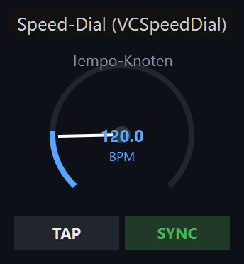
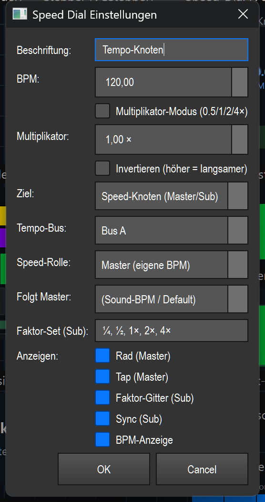

# Speed-Dial (Tempo-Rad) (`VCSpeedDial`)

> Ein Drehrad mit Tap-Tempo, das das Tempo (BPM bzw. einen Geschwindigkeits-Faktor) eines Executors, eines Effekts oder eines Tempo-Bus live steuert.

## Wozu & was es steuert

Das Speed-Dial setzt eine Geschwindigkeit. Je nach gewähltem **Ziel** wirkt derselbe Drehwert auf etwas anderes:

- die Fade-Zeit der Cues eines **Executors** (Playback),
- die Geschwindigkeit einer **Funktion/eines Effekts** (z. B. Matrix/EFX),
- die **BPM eines benannten Tempo-Bus**,
- den **Tempo-Multiplikator** eines oder mehrerer Effekte (×½/×2 …),
- oder es ist selbst ein **Speed-Knoten** (Tempo-Bus) — entweder Master (eigenes Tempo) oder Sub (folgt einem Master mit Faktor).

Der Wert lässt sich auf vier Wegen ändern: per **Tap** (rhythmisches Antippen), durch **Ziehen** mit der Maus, mit dem **Mausrad**, oder im Sub-/Multiplikator-Betrieb über das **Faktor-Gitter**. Eine Auto-Aktualisierung (~10 Hz) zieht die Anzeige nach, wenn das Master-Tempo extern wechselt (z. B. durch Audio/Tap an anderer Stelle).

Allgemeine VC-Grundlagen (Bearbeiten-Modus, Anlegen, Banks, Kontextmenü) sind hier nicht wiederholt — siehe Übersicht ([README.md](README.md)).

## So sieht es aus & Bedienung im Betrieb

Das Aussehen hängt vom Ziel-Modus ab. Es gibt zwei Darstellungen.

### Rad-Darstellung (Executor, Funktion/Effekt, Tempo-Bus, Speed-Knoten als Master)

So sieht das Element im Screenshot oben aus (oben das Typ-Label, darunter das Element mit der Beschriftung „Tempo-Knoten"):

- **Ringförmiger Bogen** (270°, von −225° bis +45°): zeigt den aktuellen Wert. Der hintere, dunkle Teil ist die Skala, der blaue Teil der gefüllte Wert.
- **Zeiger (weiße Nadel)** und **Mittelpunkt**: markieren die aktuelle Stellung.
- **Wert-Text in der Mitte**: im BPM-Betrieb die Zahl + „BPM"; im Multiplikator-Betrieb der Faktor (z. B. `1.00×`) + „SPEED".
- **Beschriftung** oben mittig (im Bild „Tempo-Knoten").
- **„INV"** oben rechts (orange): erscheint nur, wenn *Invertieren* aktiv ist.
- **„TAP"** (graue Schaltfläche unten links) und **„SYNC"** (grüne Schaltfläche unten rechts).

Bedienung:

| Geste / Zone | Wirkung |
|---|---|
| Klick auf **TAP** | Tap-Tempo: registriert die Antipp-Zeitpunkte und errechnet daraus die BPM (siehe unten). Bei Ziel *Tempo-Bus* / *Speed-Knoten (Master)* tappt direkt der Bus. |
| Klick auf **SYNC** | Setzt einen gemeinsamen Startpunkt: bei Effekten gleicht es die Phase aller Ziel-Effekte an; bei *Tempo-Bus* / *Speed-Knoten* setzt es den Downbeat neu auf „jetzt". |
| **Ziehen** (linke Maustaste, im Rad halten und vertikal bewegen) | Ändert den Wert: nach oben = mehr, nach unten = weniger. BPM ±2 pro Pixel, Multiplikator ±0,02 pro Pixel. |
| **Mausrad** | BPM in 5er-Schritten, Multiplikator in 0,1er-Schritten. |

Wertebereiche: BPM **20–600**, Multiplikator **0,1–8,0**. Werte werden in diese Grenzen geklemmt.

### Gitter-Darstellung (Speed-Knoten als Sub, oder Effekt-Multiplier)

Im Sub-Betrieb (Speed-Knoten/Sub) und im Multiplier-Betrieb (Effekt ×½/×2) zeigt das Widget kein Rad, sondern ein **Faktor-Gitter** statt der Nadel:

- **Kopfzeile**: links die Beschriftung, rechts ein gelbes Badge — `× Master` (Multiplier) bzw. `Sub→<Master>` (Sub, z. B. `Sub→Sound`).
- **Faktor-Buttons** (Reihe oben, z. B. `¼ ½ 1× 2× 4×`): der aktive Faktor ist blau hervorgehoben. Klick wählt diesen Faktor.
- **Schritt-Leiste** darunter: `-` (einen Faktor langsamer), Faktor-Anzeige in der Mitte, `+` (einen Faktor schneller), `X` (Reset auf `1×`).
- **„SYNC"** (grüner Balken): setzt den Downbeat des Ziel-Bus neu.
- **BPM-Anzeige** ganz unten: links das effektive Tempo (`… BPM` oder `— BPM`, wenn keines anliegt), rechts der Bezug, z. B. `folgt Sound-BPM · 1×` bzw. `Master · 2×`.

Welche dieser Teile sichtbar sind, steuern die *Anzeigen*-Schalter im Dialog (Ausnahme: im Effekt-Multiplier-Betrieb wird das Faktor-Gitter immer gezeigt, sonst wäre das Widget leer).

| Zone | Wirkung |
|---|---|
| Klick auf einen **Faktor-Button** | Setzt diesen Faktor (Sub → Bus-Multiplikator des Ziel-Bus; Multiplier → `tempo_multiplier` je Ziel-Effekt). |
| **`-` / `+`** | Einen Schritt im Faktor-Set langsamer / schneller. |
| **`X`** | Faktor zurück auf `1×`. |
| **SYNC** | Downbeat des Ziel-Bus neu auf „jetzt". |

### Tap-Tempo erklärt

Im klassischen Betrieb (Executor/Funktion): Jeder TAP-Klick speichert den Zeitpunkt (die letzten 8 werden behalten). Ab dem zweiten Tap bildet LightOS den Mittelwert der Abstände und rechnet daraus die BPM (`60 / Durchschnittsabstand`). Du tappst also einfach den Beat mit — je mehr Taps, desto stabiler der Wert. Bei Ziel *Tempo-Bus* / *Speed-Knoten (Master)* wird stattdessen direkt der Bus getappt, und das Rad übernimmt dessen BPM.

## Einstellungen

Doppelklick auf das Element (im Bearbeiten-Modus) öffnet „Speed Dial Einstellungen". Der Dialog blendet je nach **Ziel** nur die passenden Felder ein; gespeichert werden aber immer alle.

| Einstellung | Bedeutung | Werte/Optionen |
|---|---|---|
| Beschriftung | Text oben am Element. | Freitext |
| BPM | Startwert/aktueller Wert im BPM-Betrieb. | 20–600 |
| Multiplikator-Modus | Wenn an, wirkt der Dial als Faktor auf die Geschwindigkeit statt als absolute BPM. | Aus / An |
| Multiplikator | Faktor-Wert im Multiplikator-Betrieb. | 0,1–8,0 (× ) |
| Invertieren | Höherer Dial-Wert = langsamer (Wert wird am Bereich gespiegelt). Zeigt „INV" im Rad. | Aus / An |
| Ziel | Worauf der Dial wirkt (siehe Liste unten). | 5 Modi |
| Executor-Slot / Function-ID | Haupt-Ziel-ID: Executor-Index (Modus *Executor*) bzw. Function-ID (Effekt-Modi). | Ganzzahl oder leer |
| Weitere Ziel-IDs | Zusätzliche Function-IDs (Komma-getrennt); Dial/Sync wirken auch auf diese Effekte. | z. B. `5, 7, 12` |
| Funktion/Chase (Name) | Auswahl einer Funktion nach Namen; füllt das ID-Feld. Aus dem Default *Executor* heraus stellt das Ziel automatisch auf *Funktion/Effekt*. | Liste aller Funktionen / „(nach ID/Slot oben)" |
| Tempo-Bus | Ziel-Bus für die Modi *Tempo-Bus* und *Speed-Knoten*. | (aktiver/Default-Bus) · Bus A · Bus B · Bus C · Bus D |
| Speed-Rolle | Bei *Speed-Knoten*: ist der Dial Master oder Sub. | Master (eigene BPM) · Sub (folgt Master × Faktor) |
| Folgt Master | Bei Rolle *Sub*: welchem Master/Bus der Sub folgt. | (Sound-BPM / Default) · Bus A · Bus B · Bus C · Bus D |
| Faktor-Set (Sub) | Die Faktor-Buttons des Gitters, Komma-getrennt. | z. B. `¼, ½, 1, 2, 4` — auch `0.25, 0.5, 1, 2, 4` oder `1/4, 1/2, 1, 2, 4` |
| Anzeigen: Rad (Master) | Rad sichtbar (nur Master sinnvoll). | An / Aus |
| Anzeigen: Tap (Master) | Tap-Button sichtbar. | An / Aus |
| Anzeigen: Faktor-Gitter (Sub) | Faktor-Gitter sichtbar (nur Sub). | An / Aus |
| Anzeigen: Sync (Sub) | Sync-Button sichtbar. | An / Aus |
| Anzeigen: BPM-Anzeige | Digitale BPM-Anzeige sichtbar. | An / Aus |
| Gekoppelte Effekte → Je Effekt steuern | Pro gekoppeltem Effekt (in den Effekt-Modi) ein eigener gesteuerter Parameter. „(Standard)" = Default-Parameter des Modus (`speed` bzw. `tempo_multiplier`). | (Standard) oder ein wählbarer Parameter-Key des Effekts |

### Die fünf Ziele (SpeedTarget)

| Ziel | Klartext-Bedeutung |
|---|---|
| **Executor (Playback)** | Der Dial setzt die Cue-Fade-Zeiten des Executors am angegebenen Slot. Im BPM-Betrieb: `fade_in = 60 / BPM` (ein Beat pro Cue). Im Multiplikator-Betrieb: `fade_in = 1 / Faktor`. |
| **Funktion / Effekt** | Der Dial setzt die Geschwindigkeit der Funktion/des Effekts. Effekte (Matrix/EFX) über `set_param('speed', …)`, klassische Funktionen über ihr `speed`-Attribut. Der Faktor leitet sich aus dem Dial-Wert ab (BPM/120 bzw. der Multiplikator), geklemmt auf 0,05–20. |
| **Tempo-Bus (BPM setzen)** | Der Dial setzt die **BPM eines benannten Tempo-Bus**. Alle Effekte, die diesem Bus folgen, übernehmen das Tempo. TAP tappt den Bus, SYNC setzt dessen Downbeat neu. |
| **Effekt ×½/×2 (Multiplier)** | Der Dial setzt den **`tempo_multiplier` der Ziel-Effekte** (Half/Double). Zeigt das Faktor-Gitter; jeder Ziel-Effekt kann einen eigenen, unabhängigen Multiplikator am selben Master haben. |
| **Speed-Knoten (Master/Sub)** | Der Dial **ist selbst ein Tempo-Bus** (QLC+-Parität). Als **Master** liefert er eine eigene BPM (per Tap/Rad). Als **Sub** folgt er einem Master-Bus und multipliziert dessen Tempo mit dem gewählten **Faktor** aus dem Gitter (`¼ … 4×`). Der reservierte Default-Bus wird nie zum Sub gemacht. |

#### Rolle Master vs. Sub, Faktor-Set und Tempo-Bus (im Speed-Knoten-Modus)

- **Master**: eigenes Tempo. TAP/Rad setzen die BPM, die der Knoten auf seinen Tempo-Bus schreibt. Andere Subs können diesem Master folgen.
- **Sub**: kein eigenes Tempo, sondern **Master-BPM × Faktor**. Über das Faktor-Gitter (z. B. `¼ ½ 1× 2× 4×`) wählst du den Bus-Multiplikator; `1×` = exakt das Master-Tempo, `½` = halb so schnell, `2×` = doppelt. „Folgt Master" legt fest, welchem Bus der Sub folgt; „(Sound-BPM / Default)" = der globale Default-Bus.
- **Tempo-Bus**: der Bus, den dieser Knoten besitzt/steuert (Bus A–D oder der Default-Bus).
- **Faktor-Set**: bestimmt, welche Buttons im Gitter erscheinen. Frei konfigurierbar als Symbole (`¼ ½ 1 2 4`), Dezimalzahlen (`0.25 …`) oder Brüche (`1/4 …`).
- **TAP/SYNC**: TAP gibt es bei Master (eigenes Tempo antippen); SYNC gibt es bei Sub (Downbeat des Ziel-Bus neu setzen).

## Tipps & Fallen

- **TAP braucht mindestens zwei Klicks**, bevor eine BPM entsteht — beim ersten Tap passiert noch nichts.
- **Invertieren** kehrt die Richtung um (höherer Wert = langsamer) und zeigt „INV" oben rechts — leicht zu übersehen, wenn etwas „falsch herum" reagiert.
- **Multiplikator-Modus vs. Ziel-Modus**: Das Auswählen einer Funktion über „Funktion/Chase (Name)" stellt nur dann auf *Funktion/Effekt* um, wenn das Ziel noch auf dem Default *Executor* steht — eine bereits getroffene Wahl (Multiplier/Tempo-Bus/Speed-Knoten) wird nicht überschrieben.
- Im **Effekt-Multiplier-Betrieb** ist das Faktor-Gitter immer sichtbar, auch wenn der Schalter „Faktor-Gitter" aus ist — sonst wäre das Widget leer.
- Der **Default-Bus kann nicht zum Sub** gemacht werden; willst du einen Sub, weise ihm einen benannten Bus (A–D) zu.
- Bei **mehreren Ziel-Effekten** (Weitere Ziel-IDs) wirken Dial und SYNC auf alle; Effekte ohne Phasen-Unterstützung werden bei SYNC einfach übersprungen (kein Absturz).
- **VC-Bank**: Wie alle VC-Elemente reagiert das Speed-Dial im Betrieb nur in der aktiven Bank (bzw. wenn auf „Alle Banks" gesetzt) — siehe Übersicht ([README.md](README.md)).
