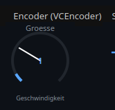
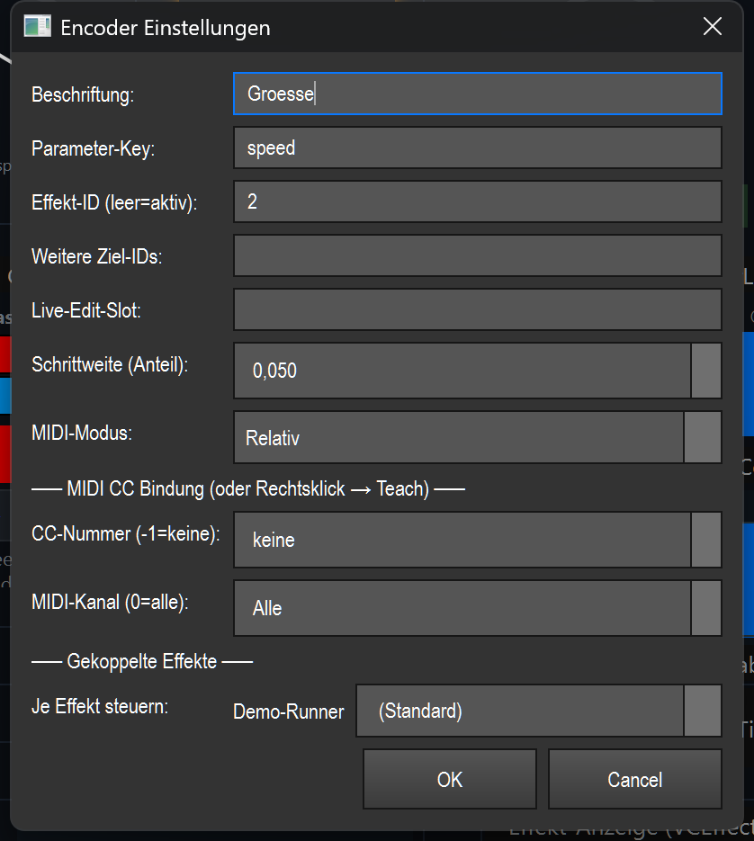

# Encoder (rotary encoder) (`VCEncoder`)

> **English version** of [Encoder (Drehgeber) (`VCEncoder`)](06_encoder.md). LightOS itself speaks German: every button, menu and field is quoted here **exactly as it appears on screen**, with an English translation in brackets the first time it shows up. The screenshots are the same as in the German page.

> A relative rotary encoder that turns a numeric effect parameter (e.g. `speed`, `size`, `hold`) up and down live, finely and without jumps.

## What it is for & what it controls

The encoder adjusts **one** parameter of an effect *relatively* — unlike a fader, which jumps to absolute values. You drag or scroll, and the value rises or falls in small steps from where it currently is. Suitable for numeric parameters (integer/decimal) such as `speed`, `size`, `hold`, `level`, `count`, `rate`, `density`, `spread`.

The encoder always shows the **real current value** of the target parameter: as a number in the middle and as a filled arc around it. If another control (or MIDI) changes the same parameter, the display follows.

## What it looks like & how to use it during operation

The element is a round rotary knob arc. From top to bottom:

- **Beschriftung** (label) (top, gray) — the freely chosen name, „Groesse" (size) in the example.
- **Arc (270°)** — a dark background arc with a blue fill arc on top that shows the current value within the parameter's value range (0–100 %). A white **pointer** in the middle points to the current position.
- **Number in the middle** — the current value in plain text. Decimals are shortened, `An`/`Aus` (on/off) for switches, `—` if there is currently no target parameter.
- **Parameter name** (bottom, small) — the German label of the controlled parameter (e.g. „Geschwindigkeit" (speed)); only without a bound effect does it show the raw key such as `speed`.
- **MIDI indicator** — a small blue square at the top right as soon as a MIDI CC binding is set.

How to use it (only outside edit mode; see the overview in [README.en.md](README.en.md)):

- **Dragging up** (hold the left mouse button and move up) → **increase** the value. **Dragging down** → **decrease** the value. The movement is fine-grained: it only kicks in after about 3 px of movement, and about 60 px of travel corresponds to the full value range (0–100 %) — so with the default step size (0.05) roughly one step per 3 px. This lets you “turn” the value continuously.
- **Mouse wheel** — one notch up/down increases or decreases by exactly **one step size** (`step`).
- **Left-click alone** (without dragging) only sets the start of the turn; releasing ends the turning. There is **no** double-click action during operation.
- If **Touch-Lock** is active, the encoder ignores mouse/touch (display only); MIDI keeps controlling it.

You open the settings with a double-click (in edit mode) or via the context menu.

## Settings

| Setting | Meaning | Values/options |
|---|---|---|
| **Beschriftung** | Display name at the top of the element. | Free text (default: `Encoder`) |
| **Parameter-Key** (parameter key) | The controlled effect parameter (numeric). | Free-text key, e.g. `speed`, `size`, `hold`, `level`, `count`, `rate`, `density`, `spread` (default: `speed`) |
| **Effekt-ID (leer=aktiv)** (effect ID (empty=active)) | Function ID of the target effect. Leave it empty = the currently active effect. | Integer or empty (default: empty = active) |
| **Weitere Ziel-IDs** (further target IDs) | Additional effects that the same encoder adjusts as well (multi-effect). | Comma-separated integers, e.g. `4, 7` (default: empty) |
| **Live-Edit-Slot** | Without a fixed effect ID, the encoder adjusts the effect from this editing slot (set by an effect pad) instead of the globally active one. | Free text, e.g. `MH`, `MX` (default: empty) |
| **Schrittweite (Anteil)** (step size (fraction)) | How much one detent/wheel step adjusts, as a fraction of the total value range. 0.05 = 5 % per step. | 0.005–1.0, step 0.01 (default: 0.05) |
| **MIDI-Modus** (MIDI mode) | How a bound MIDI CC is interpreted. | **Relativ** (relative) = a hardware encoder sends steps (CC values 1–63 = +, 65–127 = −) · **Absolut** (absolute) = a pot/fader 0–127 is mapped onto the value range (default: Relativ) |
| **CC-Nummer (-1=keine)** (CC number (-1=none)) | MIDI control change number for the binding. | -1 (none) to 127 (default: -1) |
| **MIDI-Kanal (0=alle)** (MIDI channel (0=all)) | MIDI channel of the binding. | 0 (all) to 16 (default: 0) |
| **Gekoppelte Effekte → Je Effekt steuern** (coupled effects → control per effect) | For each coupled effect (effect ID + further target IDs), a controlled parameter of its own; only appears when effects are bound. | One selection per effect: **(Standard)** (default) = the parameter key set above, otherwise a separate parameter from the list of the respective effect |

## Binding to an effect

The encoder acts via the shared live seam (`src/core/engine/effect_live.py`): relatively via `adjust_param`, absolutely via `set_param_normalized`.

- **Without a binding** (effect ID empty, no edit slot): the encoder acts on the **active effect**. If there is no matching parameter, the middle shows `—`.
- **Fixed effect ID**: enter the function ID in „Effekt-ID" — the encoder controls exactly this effect, regardless of what is currently active.
- **Live-Edit-Slot**: without a fixed ID but with a slot name, the encoder adjusts the effect that is currently being edited in this slot.
- **Several effects at once**: via „Weitere Ziel-IDs", one turn acts on all listed effects together. Under „Gekoppelte Effekte" each effect can be assigned its own parameter (otherwise the default parameter key applies).

Only the binding is saved (effect IDs, parameter keys, step size, MIDI) — not the effect itself. MIDI uses the same binding.

## MIDI & keyboard

The encoder supports **MIDI teach** (CC only), no key assignment.

- **Assign**: right-click (in edit mode) → „MIDI Teach…", then move the desired CC on your controller. Alternatively, enter the CC number and channel directly in the settings dialog.
- **Relativ** (default, for hardware encoders without an end stop): the controller sends steps around the center 64 — values 1–63 turn up, 65–127 turn down, 0/64 = no movement. Each step adjusts by the configured step size.
- **Absolut** (for pots/faders): the CC value 0–127 is mapped linearly onto the parameter's value range — the encoder then jumps to the absolute position.
- A set MIDI CC shows as a blue square at the top right of the element.

## Tips & pitfalls

- **Encoder ≠ fader**: the encoder never jumps to an absolute value (except in MIDI mode „Absolut"). For “set to a fixed value”, use a fader/slider.
- **Tune the step size**: 0.05 (5 %) is a good start. Choose it smaller for fine parameters, larger for coarse ones. The mouse wheel uses exactly this step size; dragging is finer.
- **Wrong parameter → `—` or no effect**: if the middle shows `—`, the parameter key doesn't match the (active) effect or no effect is bound. Check the key or set a fixed effect ID.
- **MIDI turns the wrong way / only in jerks**: if the MIDI mode doesn't match the hardware (encoder vs. pot), it behaves nonsensically. „Relativ" for real endless encoders, „Absolut" for pots/faders.
- **Touch-Lock**: only locks mouse/touch, not MIDI — the encoder stays operable from the controller.
- For shared VC basics (edit mode, banks, context menu) see the overview in [README.en.md](README.en.md).
