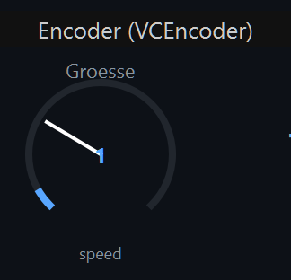
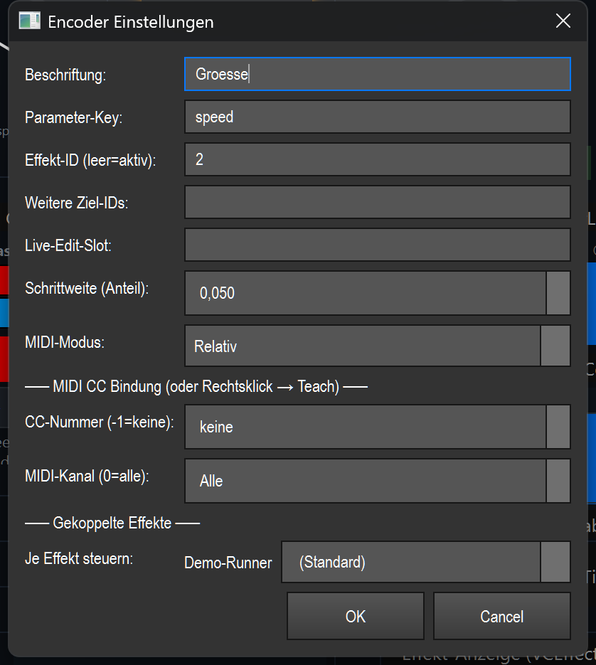

# Encoder (Drehgeber) (`VCEncoder`)

> Ein relativer Drehgeber, der einen numerischen Effekt-Parameter (z. B. `speed`, `size`, `hold`) live und ohne Sprung feinfühlig hoch- und runterdreht.

## Wozu & was es steuert

Der Encoder verstellt **einen** Parameter eines Effekts *relativ* — anders als ein Fader, der absolut springt. Du ziehst oder scrollst, und der Wert wächst bzw. fällt in kleinen Schritten ab dem aktuellen Stand. Geeignet für numerische Parameter (Ganzzahl/Kommazahl) wie `speed`, `size`, `hold`, `level`, `count`, `rate`, `density`, `spread`.

Der Encoder zeigt immer den **echten aktuellen Wert** des Zielparameters an: als Zahl in der Mitte und als gefüllter Bogen ringsum. Ändert ein anderes Bedienelement (oder MIDI) denselben Parameter, springt die Anzeige mit.

## So sieht es aus & Bedienung im Betrieb

Das Element ist ein runder Drehknopf-Bogen. Von oben nach unten:

- **Beschriftung** (oben, grau) — der frei wählbare Name, im Beispiel „Groesse".
- **Bogen (270°)** — ein dunkler Hintergrundbogen, darüber ein blauer Füllbogen, der den aktuellen Wert auf dem Wertebereich des Parameters (0–100 %) anzeigt. Ein weißer **Zeiger** in der Mitte zeigt zur aktuellen Position.
- **Zahl in der Mitte** — der aktuelle Wert in Klartext. Kommazahlen werden gekürzt, `An`/`Aus` bei Schaltern, `—` wenn gerade kein Zielparameter vorhanden ist.
- **Parameter-Name** (unten, klein) — das deutsche Label des gesteuerten Parameters (z. B. „Geschwindigkeit"); nur ohne gebundenen Effekt steht dort der rohe Key wie `speed`.
- **MIDI-Indikator** — ein kleines blaues Quadrat oben rechts, sobald eine MIDI-CC-Bindung gesetzt ist.

Bedienung (nur außerhalb des Bearbeiten-Modus; siehe Übersicht in der [README.md](README.md)):

- **Ziehen nach oben** (linke Maustaste halten und hoch) → Wert **erhöhen**. **Ziehen nach unten** → Wert **senken**. Die Bewegung ist feinfühlig: erst ab ca. 3 px Bewegung greift sie, ungefähr 60 px Zugweg entsprechen dem vollen Wertebereich (0–100 %) — bei der Standard-Schrittweite (0,05) also rund eine Schrittweite je 3 px. So lässt sich der Wert kontinuierlich „drehen".
- **Mausrad** — ein Rasterschritt nach oben/unten erhöht bzw. senkt um genau **eine Schrittweite** (`step`).
- **Linksklick allein** (ohne Ziehen) setzt nur den Drehbeginn; loslassen beendet das Drehen. Es gibt **keine** Doppelklick-Aktion im Betrieb.
- Ist **Touch-Lock** aktiv, ignoriert der Encoder Maus/Touch (reine Anzeige); MIDI steuert weiter.

Einstellungen öffnest du per Doppelklick (im Bearbeiten-Modus) oder über das Kontextmenü.

## Einstellungen

| Einstellung | Bedeutung | Werte/Optionen |
|---|---|---|
| **Beschriftung** | Anzeigename oben am Element. | Freitext (Standard: `Encoder`) |
| **Parameter-Key** | Der gesteuerte Effekt-Parameter (numerisch). | Freitext-Key, z. B. `speed`, `size`, `hold`, `level`, `count`, `rate`, `density`, `spread` (Standard: `speed`) |
| **Effekt-ID (leer=aktiv)** | Funktions-ID des Ziel-Effekts. Leer lassen = der gerade aktive Effekt. | Ganzzahl oder leer (Standard: leer = aktiv) |
| **Weitere Ziel-IDs** | Zusätzliche Effekte, die derselbe Encoder mitverstellt (Multi-Effekt). | Komma-getrennte Ganzzahlen, z. B. `4, 7` (Standard: leer) |
| **Live-Edit-Slot** | Ohne feste Effekt-ID verstellt der Encoder den Effekt aus diesem Bearbeitungs-Slot (von einem Effekt-Pad gesetzt) statt den global aktiven. | Freitext, z. B. `MH`, `MX` (Standard: leer) |
| **Schrittweite (Anteil)** | Wie viel ein Detent-/Rad-Schritt verstellt, als Anteil des gesamten Wertebereichs. 0,05 = 5 % je Schritt. | 0,005–1,0, Schritt 0,01 (Standard: 0,05) |
| **MIDI-Modus** | Wie ein gebundener MIDI-CC interpretiert wird. | **Relativ** = Hardware-Encoder sendet Schritte (CC-Werte 1–63 = +, 65–127 = −) · **Absolut** = Poti/Fader 0–127 wird auf den Wertebereich gelegt (Standard: Relativ) |
| **CC-Nummer (-1=keine)** | MIDI-Control-Change-Nummer für die Bindung. | -1 (keine) bis 127 (Standard: -1) |
| **MIDI-Kanal (0=alle)** | MIDI-Kanal der Bindung. | 0 (Alle) bis 16 (Standard: 0) |
| **Gekoppelte Effekte → Je Effekt steuern** | Pro gekoppeltem Effekt (Effekt-ID + weitere Ziel-IDs) ein eigener gesteuerter Parameter; erscheint nur, wenn Effekte gebunden sind. | Pro Effekt eine Auswahl: **(Standard)** = der oben gesetzte Parameter-Key, sonst ein eigener Parameter aus der Liste des jeweiligen Effekts |

## Bindung an einen Effekt

Der Encoder wirkt über die gemeinsame Live-Naht (`src/core/engine/effect_live.py`): relativ per `adjust_param`, absolut per `set_param_normalized`.

- **Ohne Bindung** (Effekt-ID leer, kein Edit-Slot): Der Encoder wirkt auf den **aktiven Effekt**. Gibt es keinen passenden Parameter, zeigt die Mitte `—`.
- **Feste Effekt-ID**: Trage die Funktions-ID in „Effekt-ID" ein — der Encoder steuert genau diesen Effekt, unabhängig davon, was gerade aktiv ist.
- **Live-Edit-Slot**: Ohne feste ID, aber mit Slot-Namen verstellt der Encoder den Effekt, der aktuell in diesem Slot bearbeitet wird.
- **Mehrere Effekte gleichzeitig**: Über „Weitere Ziel-IDs" wirkt eine Drehung auf alle genannten Effekte zusammen. Unter „Gekoppelte Effekte" kann jedem Effekt ein eigener Parameter zugewiesen werden (sonst gilt der Standard-Parameter-Key).

Gespeichert wird nur die Bindung (Effekt-IDs, Parameter-Keys, Schrittweite, MIDI) — nicht der Effekt selbst. Dieselbe Bindung nutzt auch MIDI.

## MIDI & Tastatur

Der Encoder unterstützt **MIDI-Teach** (nur CC), keine Tasten-Zuweisung.

- **Zuweisen**: Rechtsklick (im Bearbeiten-Modus) → „MIDI Teach…", dann am Pult den gewünschten CC bewegen. Alternativ CC-Nummer und Kanal direkt im Einstellungs-Dialog eintragen.
- **Relativ** (Standard, für Hardware-Encoder ohne Anschlag): Das Pult sendet Schritte um die Mitte 64 — Werte 1–63 drehen hoch, 65–127 drehen runter, 0/64 = keine Bewegung. Jeder Schritt verstellt um die eingestellte Schrittweite.
- **Absolut** (für Potis/Fader): Der CC-Wert 0–127 wird linear auf den Wertebereich des Parameters gelegt — der Encoder springt dann auf die absolute Position.
- Ein gesetzter MIDI-CC zeigt sich als blaues Quadrat oben rechts am Element.

## Tipps & Fallen

- **Encoder ≠ Fader**: Der Encoder springt nie auf einen absoluten Wert (außer im MIDI-Modus „Absolut"). Für „auf festen Wert setzen" nimm einen Fader/Slider.
- **Schrittweite abstimmen**: 0,05 (5 %) ist ein guter Start. Für feine Parameter kleiner wählen, für grobe größer. Mausrad nutzt exakt diese Schrittweite, das Ziehen ist feiner.
- **Falscher Parameter → `—` oder kein Effekt**: Steht in der Mitte `—`, passt der Parameter-Key nicht zum (aktiven) Effekt oder es ist kein Effekt gebunden. Key prüfen oder feste Effekt-ID setzen.
- **MIDI dreht falsch herum / nur ruckweise**: Stimmt der MIDI-Modus nicht mit der Hardware überein (Encoder vs. Poti), wirkt er unsinnig. „Relativ" für echte Endlos-Encoder, „Absolut" für Potis/Fader.
- **Touch-Lock**: Sperrt nur Maus/Touch, nicht MIDI — der Encoder bleibt per Pult bedienbar.
- Gemeinsame VC-Grundlagen (Bearbeiten-Modus, Banks, Kontextmenü) siehe Übersicht in der [README.md](README.md).
