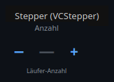
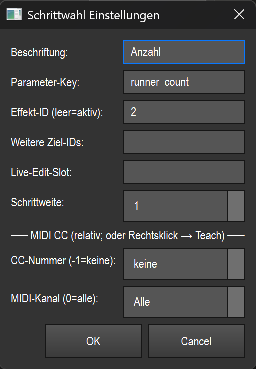

# Stepper (step counter) (`VCStepper`)

> **English version** of [Stepper (Schrittzähler) (`VCStepper`)](07_stepper.md). LightOS itself speaks German: every button, menu and field is quoted here **exactly as it appears on screen**, with an English translation in brackets the first time it shows up. The screenshots are the same as in the German page.

> A plus/minus counter that steps a **discrete** effect parameter (e.g. number of runners, direction, on/off) precisely by fixed steps at the press of a button.

## What it is for & what it controls

The stepper is meant for discrete counting parameters of an effect where a fader would be too imprecise — typically **`runner_count`** (number of runners/segments) or **`runner_width`** (width of a runner). Instead of sliding, you press `−` or `+` and the value jumps by the configured step size.

The stepper sets the value **absolutely** via the shared effect seam (`effect_live.set_param`, see the overview in [README.en.md](README.en.md)). The new value is clamped server-side to the parameter's allowed range — so you cannot count below the minimum or above the maximum.

## What it looks like & how to use it during operation

From top to bottom, the element shows:

- **Beschriftung** (label) (gray, top) — the freely assigned name, `Anzahl` (count) in the picture.
- **Three zones side by side**: on the left the large **`−`**, in the middle the **current value**, on the right the large **`+`**. If no valid value is available (no bound/active effect), the middle shows `—`.
- **Parameter-Key** (parameter key) (gray, bottom) — which effect parameter is controlled, `runner_count` in the picture.

Visual feedback:

- When the value has reached its **minimum**, the `−` is grayed out; at the **maximum** the `+` is grayed out (in the screenshot the `−` is grayed out — the value is already at the lower limit).
- If MIDI control is assigned, a small **blue square** appears at the top right.

How to use it (only outside edit mode, i.e. during operation):

| Gesture | Zone | Effect |
|---|---|---|
| Left-click | left third (`−`, approx. the left 34 %) | **Decrease** the value by **one** step |
| Left-click | right third (`+`, from approx. 66 %) | **Increase** the value by **one** step |
| Left-click | middle (value display) | no effect |

There is **no** gesture for double-click or dragging during operation. A click outside the left/right third does nothing. If „Touch-Lock" is active, the element ignores mouse/touch (display only); MIDI keeps controlling it.

> Creating it: the stepper has **no toolbar button of its own**. You create it via **Smart-Drop** (drag an effect from the library onto the canvas) or the widget gallery. A double-click in edit mode opens the settings; a right-click opens the context menu — see [README.en.md](README.en.md).

## Settings

| Setting | Meaning | Values/options |
|---|---|---|
| **Beschriftung** | Display text at the top of the element. | Free text (default: `Anzahl`) |
| **Parameter-Key** | Which integer effect parameter is counted. | Free text, e.g. `runner_count`, `runner_width` (default: `runner_count`) |
| **Effekt-ID (leer=aktiv)** (effect ID (empty=active)) | Function ID of the target effect. Empty = the currently **active** effect. | Integer or empty |
| **Weitere Ziel-IDs** (further target IDs) | Additional effect IDs that the same button press **also acts on**. | Comma-separated list of IDs (e.g. `3,4,7`) or empty |
| **Live-Edit-Slot** | Takes the target from a live edit slot if no fixed effect ID is set. | Free text (slot name) or empty |
| **Schrittweite** (step size) | How far the value jumps per button press. | Integer **1–64** (default: `1`) |
| **CC-Nummer (-1=keine)** (CC number (-1=none)) | MIDI control change number for relative control. | **−1** = none, otherwise **0–127** |
| **MIDI-Kanal (0=alle)** (MIDI channel (0=all)) | MIDI channel the stepper responds to. | **0** = all channels, otherwise **1–16** |

## Binding to an effect

The stepper only stores the **effect ID** (`function_id`); the live effect runs through the shared effect seam `effect_live` (see [README.en.md](README.en.md)). This is how you choose the target:

- Enter a **fixed effect ID** in the „Effekt-ID" field → the stepper always acts on exactly this effect.
- **Leave the field empty** → the stepper acts on whichever effect is **active** at the time.
- Set **Live-Edit-Slot** → the target is taken from this slot (only applies if no fixed effect ID is set).
- Add **Weitere Ziel-IDs** → the button press additionally acts on each of these effects; each one is clamped individually to its own value range.

When created via Smart-Drop, the stepper is already bound to the dropped effect. If **no** effect is bound and none is active either, there is no value to count: the middle shows `—` and button presses have no effect. MIDI control uses the same binding.

## MIDI & keyboard

The stepper supports **MIDI teach** (no key teach). You assign a control via right-click → „MIDI Teach…" or enter the CC number and channel directly in the settings dialog.

- **Only control change (CC)** is evaluated, namely as a **relative** encoder:
  - values **1–63** = several steps **up** (`+`), depending on the value,
  - values **65–127** = several steps **down** (`−`).
  - For each CC received, the corresponding step offset is multiplied by the configured step size and applied.
- **MIDI-Kanal**: `0` responds on all channels, otherwise only on the specified one.
- An active MIDI assignment is indicated by the **blue square** at the top right of the element.

## Tips & pitfalls

- **For discrete parameters.** The stepper suits integer parameters (e.g. `runner_count`, `runner_width`), selection parameters (`select`, e.g. `direction` — steps through the options) and boolean parameters (toggles between `Aus`/`An` (off/on), e.g. `loop`, `invert`) — for continuous values you are better off with a fader or encoder.
- **`—` as the value** means: no valid target. Check the effect ID/active effect and the parameter key.
- **A grayed-out `−`/`+`** is not an error but the limit: you are at the parameter's minimum or maximum. Going higher/lower isn't possible server-side — the value is clamped.
- **The Parameter-Key must match exactly.** A typo in the key means the stepper finds no target (`—`). Use exactly the name the effect offers (e.g. `runner_count`, `runner_width`).
- **Schrittweite** applies to both mouse and MIDI. A large step size (up to 64) is handy for coarse jumps, a step size of 1 for fine adjustment.
- **Several targets** via „Weitere Ziel-IDs" are useful for counting identical effects in sync — but each one stays within its own allowed range.
