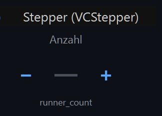
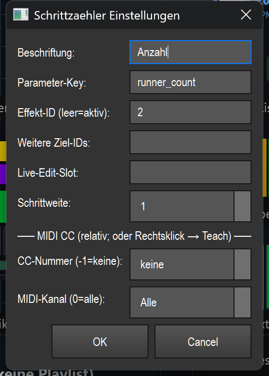

# Stepper (Schrittzähler) (`VCStepper`)

> Ein Plus/Minus-Zähler, der einen **ganzzahligen** Effekt-Parameter (z. B. Läufer-Anzahl) per Tastendruck präzise um feste Schritte hoch- und runterzählt.

## Wozu & was es steuert

Der Stepper ist für diskrete Zähl-Parameter eines Effekts gedacht, bei denen ein Fader zu ungenau wäre — typisch **`runner_count`** (Anzahl der Läufer/Segmente) oder **`runner_width`** (Breite eines Läufers). Statt zu schieben drückst du `−` oder `+` und der Wert springt um die eingestellte Schrittweite.

Der Stepper setzt den Wert **absolut** über die gemeinsame Effekt-Naht (`effect_live.set_param`, siehe Übersicht in der [README.md](README.md)). Der neue Wert wird dabei serverseitig auf den erlaubten Bereich des Parameters geklemmt — du kannst also nicht unter das Minimum oder über das Maximum hinauszählen.

## So sieht es aus & Bedienung im Betrieb

Das Element zeigt von oben nach unten:

- **Beschriftung** (grau, oben) — der frei vergebene Name, im Bild `Anzahl`.
- **Drei Zonen nebeneinander**: links das große **`−`**, in der Mitte der **aktuelle Wert**, rechts das große **`+`**. Steht kein gültiger Wert zur Verfügung (kein gebundener/aktiver Effekt), zeigt die Mitte `—`.
- **Parameter-Key** (grau, unten) — welcher Effekt-Parameter gesteuert wird, im Bild `runner_count`.

Visuelle Rückmeldung:

- Hat der Wert sein **Minimum** erreicht, wird das `−` ausgegraut; am **Maximum** wird das `+` ausgegraut (im Screenshot ist das `−` ausgegraut — der Wert ist bereits am unteren Anschlag).
- Ist eine MIDI-Steuerung zugewiesen, erscheint oben rechts ein kleines **blaues Quadrat**.

Bedienung (nur außerhalb des Bearbeiten-Modus, also im Betrieb):

| Geste | Zone | Wirkung |
|---|---|---|
| Linksklick | linkes Drittel (`−`, ca. linke 34 %) | Wert um **eine** Schrittweite **verkleinern** |
| Linksklick | rechtes Drittel (`+`, ab ca. 66 %) | Wert um **eine** Schrittweite **vergrößern** |
| Linksklick | Mitte (Wert-Anzeige) | keine Wirkung |

Es gibt **keine** Geste für Doppelklick oder Ziehen im Betrieb. Ein Klick außerhalb von linkem/rechtem Drittel tut nichts. Ist „Touch-Lock" aktiv, ignoriert das Element Maus/Touch (reine Anzeige), MIDI steuert weiter.

> Anlegen: Der Stepper hat **keinen eigenen Toolbar-Knopf**. Du erstellst ihn über **Smart-Drop** (Effekt aus der Bibliothek auf die Canvas ziehen) bzw. die Widget-Galerie. Doppelklick im Bearbeiten-Modus öffnet die Einstellungen; Rechtsklick das Kontextmenü — siehe [README.md](README.md).

## Einstellungen

| Einstellung | Bedeutung | Werte/Optionen |
|---|---|---|
| **Beschriftung** | Anzeigetext oben im Element. | Freitext (Standard: `Anzahl`) |
| **Parameter-Key** | Welcher ganzzahlige Effekt-Parameter gezählt wird. | Freitext, z. B. `runner_count`, `runner_width` (Standard: `runner_count`) |
| **Effekt-ID (leer=aktiv)** | Funktions-ID des Ziel-Effekts. Leer = der gerade **aktive** Effekt. | Ganze Zahl oder leer |
| **Weitere Ziel-IDs** | Zusätzliche Effekt-IDs, auf die derselbe Tastendruck **mit-wirkt**. | Komma-getrennte Liste von IDs (z. B. `3,4,7`) oder leer |
| **Live-Edit-Slot** | Bezieht das Ziel aus einem Live-Edit-Slot, wenn keine feste Effekt-ID gesetzt ist. | Freitext (Slot-Name) oder leer |
| **Schrittweite** | Um wie viel der Wert je Tastendruck springt. | Ganze Zahl **1–64** (Standard: `1`) |
| **CC-Nummer (-1=keine)** | MIDI-Control-Change-Nummer für die relative Steuerung. | **−1** = keine, sonst **0–127** |
| **MIDI-Kanal (0=alle)** | MIDI-Kanal, auf den reagiert wird. | **0** = alle Kanäle, sonst **1–16** |

## Bindung an einen Effekt

Der Stepper speichert nur die **Effekt-ID** (`function_id`); die Live-Wirkung läuft über die gemeinsame Effekt-Naht `effect_live` (siehe [README.md](README.md)). So wählst du das Ziel:

- **Feste Effekt-ID** im Feld „Effekt-ID" eintragen → der Stepper wirkt immer auf genau diesen Effekt.
- **Feld leer lassen** → der Stepper wirkt auf den jeweils **aktiven** Effekt.
- **Live-Edit-Slot** setzen → das Ziel wird aus diesem Slot bezogen (greift nur, wenn keine feste Effekt-ID gesetzt ist).
- **Weitere Ziel-IDs** ergänzen → der Tastendruck wirkt zusätzlich auf jeden dieser Effekte; jeder wird einzeln auf seinen eigenen Wertebereich geklemmt.

Per Smart-Drop angelegt, ist der Stepper bereits an den fallengelassenen Effekt gebunden. Ist **kein** Effekt gebunden und auch keiner aktiv, gibt es keinen Wert zu zählen: Die Mitte zeigt `—` und Tastendrücke bleiben wirkungslos. Dieselbe Bindung wird auch von der MIDI-Steuerung genutzt.

## MIDI & Tastatur

Der Stepper unterstützt **MIDI-Teach** (kein Tasten-Teach). Du weist eine Steuerung per Rechtsklick → „MIDI Teach…" zu oder trägst CC-Nummer und Kanal direkt im Einstellungs-Dialog ein.

- Es wird **nur Control Change (CC)** ausgewertet, und zwar als **relativer** Encoder:
  - Werte **1–63** = je nach Wert mehrere Schritte **hoch** (`+`),
  - Werte **65–127** = mehrere Schritte **runter** (`−`).
  - Pro empfangenem CC wird der entsprechende Schritt-Versatz mit der eingestellten Schrittweite multipliziert angewandt.
- **MIDI-Kanal**: `0` reagiert auf alle Kanäle, sonst nur auf den angegebenen.
- Eine aktive MIDI-Zuweisung wird durch das **blaue Quadrat** oben rechts im Element angezeigt.

## Tipps & Fallen

- **Nur für Ganzzahlen.** Der Stepper ist für ganzzahlige Parameter ausgelegt. Für `runner_width` oder andere diskrete Werte funktioniert er genauso wie für `runner_count` — bei kontinuierlichen Werten nimmst du besser einen Fader oder Encoder.
- **`—` als Wert** bedeutet: kein gültiges Ziel. Prüfe Effekt-ID/aktiven Effekt und den Parameter-Key.
- **Ausgegrautes `−`/`+`** ist kein Fehler, sondern der Anschlag: Du bist am Minimum bzw. Maximum des Parameters. Höher/tiefer geht serverseitig nicht — der Wert wird geklemmt.
- **Parameter-Key muss exakt passen.** Tippfehler im Key führen dazu, dass der Stepper kein Ziel findet (`—`). Verwende exakt den Namen, den der Effekt anbietet (z. B. `runner_count`, `runner_width`).
- **Schrittweite** gilt sowohl für Maus als auch MIDI. Eine große Schrittweite (bis 64) ist praktisch für grobe Sprünge, eine Schrittweite von 1 für feine Justage.
- **Mehrere Ziele** über „Weitere Ziel-IDs" sind nützlich, um identische Effekte synchron zu zählen — jeder bleibt aber in seinem eigenen erlaubten Bereich.
