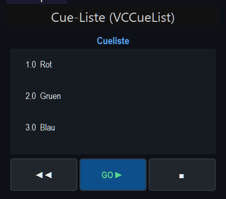
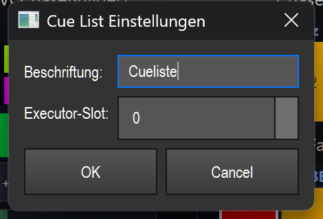

# Cue-Liste (`VCCueList`)

> Zeigt die Cue-Liste eines Executor-Slots (Cuestack) an und steuert sie mit GO / BACK / STOP — der Standard-Weg, um eine vorbereitete Szenen-Abfolge live durchzufahren.

## Wozu & was es steuert

Die Cue-Liste ist an **einen Executor-Slot** (Playback-Seite/Cuestack) gebunden. Sie zeigt die Cues dieses Slots als Liste und hebt den aktuell laufenden Cue hervor. Mit den drei Transport-Knöpfen am unteren Rand schaltest du im Betrieb durch die Liste — vor, zurück oder Stopp.

Das Element spiegelt den Zustand des Slots laufend: Es fragt den Executor etwa **5-mal pro Sekunde** (alle 200 ms) ab, übernimmt Änderungen an der Cue-Liste automatisch und markiert den gerade aktiven Cue. Du steuerst also immer denselben Cuestack, den auch das Playback selbst verwendet — das Widget ist eine Fernbedienung dafür.

## So sieht es aus & Bedienung im Betrieb

Das Element besteht von oben nach unten aus drei Teilen:

1. **Titelzeile** (blau, fett, zentriert) — zeigt die Beschriftung des Widgets (im Bild „Cueliste"). Sie wird über die Einstellungen gesetzt.
2. **Cue-Liste** (dunkler Kasten) — eine Zeile pro Cue im Format `Nummer  Beschriftung`, z. B. `1.0  Rot`, `2.0  Gruen`, `3.0  Blau`. Hat ein Cue keine Beschriftung, steht dort `---`. Der **aktuell laufende Cue** ist farbig hinterlegt markiert.
3. **Transport-Knopfreihe** (drei Knöpfe nebeneinander):

| Knopf | Beschriftung im Bild | Funktion |
|---|---|---|
| BACK | `◄◄` | Springt zum **vorherigen** Cue (sendet `back` an den Executor-Slot). |
| GO | `GO ►` (hervorgehoben, blau/grün) | Startet bzw. springt zum **nächsten** Cue (sendet `go` an den Executor-Slot). Der Hauptknopf, deutlich abgesetzt. |
| STOP | `■` | **Stoppt** das Playback des Slots (sendet `stop` an den Executor-Slot). |

**Bedienung:** Im Betrieb (Bearbeiten AUS) wirken Klicks auf die Knöpfe sofort auf den gebundenen Slot. Die Liste selbst dient nur der Anzeige des aktuellen Cues; das Anklicken einer Zeile löst keinen Sprung aus — geschaltet wird ausschließlich über die drei Transport-Knöpfe.

**Im Bearbeiten-Modus** sind Liste und alle drei Knöpfe deaktiviert (kein versehentliches Auslösen), das Widget lässt sich dann nur verschieben/skalieren. Doppelklick öffnet die Einstellungen (siehe Übersicht in der [README.md](README.md)).

## Einstellungen

| Einstellung | Bedeutung | Werte/Optionen |
|---|---|---|
| **Beschriftung** | Text in der blauen Titelzeile über der Liste. Reine Anzeige. | Freitext. Bleibt leer das Feld, wird die bisherige Beschriftung beibehalten. |
| **Executor-Slot** | Welchen Executor-Slot (Playback-Seite/Cuestack) das Widget fernsteuert und anzeigt. Slot **N** entspricht der gleichnamigen Playback-Seite. | Ganzzahl **0 bis 19** (Standard: 0). |

## Tipps & Fallen

- **Slot muss belegt sein:** Zeigt die Liste nichts an, ist auf dem eingestellten Executor-Slot kein Cuestack geladen. Lege erst einen Cuestack auf den passenden Slot, oder stelle den **Executor-Slot** auf die richtige Nummer.
- **Slot-Nummer = Playback-Seite:** Der Wert im Feld „Executor-Slot" ist dieselbe Nummerierung wie deine Playback-Seiten/Banks. Wenn ein anderer Cuestack als erwartet erscheint, stimmt die Slot-Nummer nicht.
- **Liste ist nur Anzeige:** Ein Klick in die Cue-Liste springt nicht zu diesem Cue. Zum Schalten immer GO / BACK / STOP benutzen.
- **Automatische Aktualisierung:** Die Anzeige folgt dem echten Playback-Stand (ca. alle 200 ms). Was du in der Liste markiert siehst, ist der real laufende Cue — auch wenn er von woanders (Hardware, anderes Widget) ausgelöst wurde.
- **GO ► springt weiter:** GO ist nicht nur „Start", sondern jeder Druck rückt einen Cue vor. Mehrfaches Drücken läuft die Liste Schritt für Schritt durch; BACK geht entsprechend zurück.
