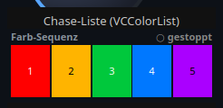
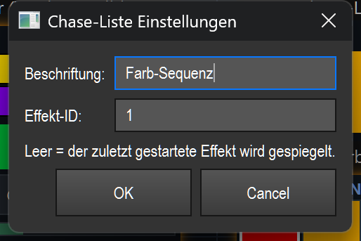

# Chase list (color sequence) (`VCColorList`)

> **English version** of [Chase-Liste (Farb-Sequenz) (`VCColorList`)](09_chase_liste.md). LightOS itself speaks German: every button, menu and field is quoted here **exactly as it appears on screen**, with an English translation in brackets the first time it shows up. The screenshots are the same as in the German page.

> Shows the color sequence of an effect live as color tiles side by side and lets you switch individual colors on/off or remove them directly during operation — intended for building and checking a color chase live.

## What it is for & what it controls

When you build a color chase live (appending colors, stepping through), you otherwise can't see which colors are already included, in which order, and which one is currently playing. The chase list mirrors exactly this color sequence of the bound (or the active) effect:

- All colors in their order, as tiles side by side.
- The color that is currently playing is highlighted (only when the effect is running).
- Disabled colors are dimmed and crossed out.
- The status is shown at the top right: no target / running / stopped.

The widget is not just a display: with a click you can switch colors on/off and remove them directly on the target effect. It updates itself (4 times per second); the refresh timer pauses automatically while the widget is hidden (other bank/tab).

## What it looks like & how to use it during operation

In the screenshot above you see the type label `Chase-Liste (VCColorList)` (chase list (VCColorList)), below it the actual element. The element itself consists of two areas:

**Title bar (top approx. 18 pixels):**
- On the left the **Beschriftung** (label) („Farb-Sequenz" (color sequence) in the picture).
- On the right the **status**:
  - `— kein Ziel —` (no target) (gray) — no effect can be resolved.
  - `● läuft` (running) (green) — the target effect is currently running.
  - `○ gestoppt` (stopped) (gray) — a target effect is present but not running (the case in the picture).

**Tile area (below):**
- Each color of the sequence is a tile in its original color, in order from left to right.
- If the tiles are wide enough (from approx. 14 px), the **position as a number** (1, 2, 3, …) is shown on the tile; the text color (black/white) depends on the brightness of the tile.
- The **active color** (the one currently playing) gets a golden-yellow border — but only when the effect is actually running.
- A **disabled color** is additionally overlaid in dark and crossed out in red.

Instead of the tiles, a hint text can also appear:
- `(leer — Farben anhängen)` (empty — append colors) — the effect has a color list but no entries yet.
- `(keine Farbliste)` (no color list) — the target effect has no color list at all (not a color chase).
- `N Schritt(e)` (N step(s)) — the target effect is a step chaser (scenes instead of colors); then only the number of steps is shown.

**Clicks during operation** (only outside edit mode, and only on a tile in the tile area — clicks in the title bar don't count):

| Gesture | Effect |
|---|---|
| **Left-click on a tile** | Switches this color on/off (toggle). A color that is switched off is skipped by the chase and crossed out in the list. |
| **Right-click on a tile** | Removes this color permanently from the sequence. |

Both actions take effect directly and immediately on the target effect. If „Touch-Lock" is active, mouse/touch are ignored here (display only). In edit mode, clicks go to moving/selecting/the context menu, not to the colors. Double-click and drag trigger no action of their own on the element itself (as usual, a double-click opens the settings; see the overview (README.en.md)).

## Settings

| Setting | Meaning | Values/options |
|---|---|---|
| **Beschriftung** | Text on the left in the element's title bar. | Any text. Empty = the previous label is kept. |
| **Effekt-ID** (effect ID) | Function ID of the target effect whose color sequence is mirrored and operated. | Integer = fixed effect with this ID. **Empty = the most recently started (active) effect** is mirrored. Non-numeric input is treated as “empty”. |

The hint text in the dialog („Leer = der zuletzt gestartete Effekt wird gespiegelt." (empty = the most recently started effect is mirrored.)) confirms the behavior of the empty effect ID. Only the `function_id` is saved in the show file (in addition to the general VC fields).

## Binding to an effect

The chase list always works on a target effect — without an effect it shows nothing meaningful. There are two ways:

- **Fixed effect:** in the settings, enter the function ID of the desired effect under **Effekt-ID**. The widget then mirrors exactly this effect.
- **Active effect:** leave Effekt-ID **empty**. The widget then automatically follows the most recently started effect.

If no effect can be resolved, the title bar shows `— kein Ziel —` and the tile area stays empty. The live actions (on/off, remove) run through the shared effect seam `src/core/engine/effect_live.py` (`do_action`) and act thread-safely directly on the effect — the same binding that other effect-bound widgets use.

## Tips & pitfalls

- **Creating it:** in edit mode, the VC toolbar has a button „Chase-Liste" that creates the widget directly on the canvas. Alternatively it is created via Smart-Drop, by dragging an effect from the library onto the canvas, or via the widget gallery — see the overview (README.en.md).
- **Golden border only while the effect is running:** the active color is only marked when the effect is really running. With `○ gestoppt` you see the list but no running marker.
- **Narrow tiles show no numbers:** with many colors or a small widget, the position numbers are hidden (tile too narrow). Make the element wider if you need the numbers.
- **A right-click removes immediately and permanently** — the color is gone from the sequence, not just disabled. To skip a color temporarily, use the left-click (toggle) instead.
- **„(keine Farbliste)" / „N Schritt(e)":** if you bind the widget to an effect without a color sequence (e.g. a real scene chaser), you can't switch colors on/off — the widget is then a pure status/step display.
- **Hidden = idle:** if the widget is on a bank that isn't visible or on another tab, the refresh timer pauses. When the widget is shown again, the timer resumes automatically.
