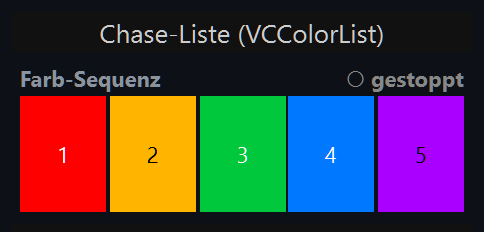
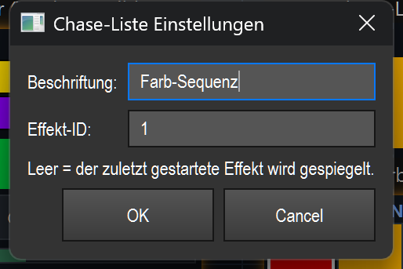

# Chase-Liste (Farb-Sequenz) (`VCColorList`)

> Zeigt die Farb-Sequenz eines Effekts live als nebeneinanderliegende Farbkacheln an und lässt dich einzelne Farben direkt im Betrieb an-/abschalten oder entfernen — gedacht zum Live-Bauen und Kontrollieren eines Farb-Chase.

## Wozu & was es steuert

Beim Live-Aufbau eines Farb-Chase (Farben anhängen, durchschalten) ist sonst nicht sichtbar, welche Farben in welcher Reihenfolge schon enthalten sind und welche gerade läuft. Die Chase-Liste spiegelt genau diese Farb-Sequenz des gebundenen (oder des aktiven) Effekts:

- Alle Farben in ihrer Reihenfolge als Kacheln nebeneinander.
- Die aktuell laufende Farbe wird hervorgehoben (nur wenn der Effekt läuft).
- Deaktivierte Farben werden abgedunkelt und durchgestrichen.
- Oben rechts steht der Status: kein Ziel / läuft / gestoppt.

Das Widget ist nicht nur Anzeige: Du kannst per Klick direkt am Ziel-Effekt Farben an-/abschalten und entfernen. Es aktualisiert sich selbst (4 Mal pro Sekunde); der Refresh-Timer pausiert automatisch, wenn das Widget verdeckt ist (andere Bank/Tab).

## So sieht es aus & Bedienung im Betrieb

Im Screenshot oben steht das Typ-Label `Chase-Liste (VCColorList)`, darunter das eigentliche Element. Das Element selbst besteht aus zwei Bereichen:

**Titelzeile (oberste ca. 18 Pixel):**
- Links die **Beschriftung** (im Bild „Farb-Sequenz").
- Rechts der **Status**:
  - `— kein Ziel —` (grau) — es ist kein Effekt auflösbar.
  - `● läuft` (grün) — der Ziel-Effekt läuft gerade.
  - `○ gestoppt` (grau) — Ziel-Effekt vorhanden, läuft aber nicht (im Bild der Fall).

**Kachel-Bereich (darunter):**
- Jede Farbe der Sequenz ist eine Kachel in Original-Farbe, von links nach rechts in Reihenfolge.
- Sind die Kacheln breit genug (ab ca. 14 px), steht die **Position als Nummer** (1, 2, 3, …) auf der Kachel; die Schriftfarbe (schwarz/weiß) richtet sich nach der Helligkeit der Kachel.
- Die **aktive Farbe** (die gerade gespielt wird) bekommt einen goldgelben Rahmen — aber nur, wenn der Effekt tatsächlich läuft.
- Eine **deaktivierte Farbe** wird zusätzlich dunkel überlagert und rot durchgestrichen.

Statt der Kacheln kann auch ein Hinweistext erscheinen:
- `(leer — Farben anhängen)` — der Effekt hat eine Farbliste, aber noch keine Einträge.
- `(keine Farbliste)` — der Ziel-Effekt führt gar keine Farbliste (kein Farb-Chase).
- `N Schritt(e)` — der Ziel-Effekt ist ein Schritt-Chaser (Szenen statt Farben); dann wird nur die Schrittanzahl angezeigt.

**Klicks im Betrieb** (nur außerhalb des Bearbeiten-Modus, und nur auf eine Kachel im Kachel-Bereich — Klicks in die Titelzeile zählen nicht):

| Geste | Wirkung |
|---|---|
| **Linksklick auf eine Kachel** | Schaltet diese Farbe an/aus (Toggle). Eine ausgeschaltete Farbe wird beim Chase übersprungen und in der Liste durchgestrichen. |
| **Rechtsklick auf eine Kachel** | Entfernt diese Farbe dauerhaft aus der Sequenz. |

Beide Aktionen wirken direkt und sofort am Ziel-Effekt. Ist „Touch-Lock" aktiv, werden Maus/Touch hier ignoriert (reine Anzeige). Im Bearbeiten-Modus gehen Klicks ans Verschieben/Auswählen/Kontextmenü, nicht an die Farben. Doppelklick und Ziehen lösen am Element selbst keine eigene Aktion aus (Doppelklick öffnet wie üblich die Einstellungen; siehe Übersicht (README.md)).

## Einstellungen

| Einstellung | Bedeutung | Werte/Optionen |
|---|---|---|
| **Beschriftung** | Text links in der Titelzeile des Elements. | Beliebiger Text. Leer = bisherige Beschriftung bleibt erhalten. |
| **Effekt-ID** | Funktions-ID des Ziel-Effekts, dessen Farb-Sequenz gespiegelt und bedient wird. | Ganze Zahl = fester Effekt mit dieser ID. **Leer = der zuletzt gestartete (aktive) Effekt** wird gespiegelt. Nicht-numerische Eingaben werden als „leer" gewertet. |

Der Hinweistext im Dialog („Leer = der zuletzt gestartete Effekt wird gespiegelt.") bestätigt das Verhalten der leeren Effekt-ID. Gespeichert wird in der Show-Datei nur die `function_id` (zusätzlich zu den allgemeinen VC-Feldern).

## Bindung an einen Effekt

Die Chase-Liste arbeitet immer auf einem Ziel-Effekt — ohne Effekt zeigt sie nichts Sinnvolles an. Es gibt zwei Wege:

- **Fester Effekt:** In den Einstellungen unter **Effekt-ID** die Funktions-ID des gewünschten Effekts eintragen. Dann spiegelt das Widget genau diesen Effekt.
- **Aktiver Effekt:** Effekt-ID **leer** lassen. Dann folgt das Widget automatisch dem zuletzt gestarteten Effekt.

Ist kein Effekt auflösbar, zeigt die Titelzeile `— kein Ziel —` und der Kachel-Bereich bleibt leer. Die Live-Aktionen (an/aus, entfernen) laufen über die gemeinsame Effekt-Naht `src/core/engine/effect_live.py` (`do_action`) und greifen thread-sicher direkt am Effekt an — dieselbe Bindung, die auch andere effektgebundene Widgets nutzen.

## Tipps & Fallen

- **Anlegen:** Im Bearbeiten-Modus gibt es in der VC-Toolbar einen Knopf „Chase-Liste", der das Widget direkt auf der Canvas anlegt. Alternativ entsteht es per Smart-Drop, indem du einen Effekt aus der Bibliothek auf die Canvas ziehst bzw. über die Widget-Galerie — siehe Übersicht (README.md).
- **Goldener Rahmen nur bei laufendem Effekt:** Die aktive Farbe wird nur markiert, wenn der Effekt wirklich läuft. Bei `○ gestoppt` siehst du die Liste, aber keine Lauf-Markierung.
- **Schmale Kacheln zeigen keine Nummern:** Bei vielen Farben oder kleinem Widget werden die Positionsnummern ausgeblendet (Kachel zu schmal). Mach das Element breiter, wenn du die Nummern brauchst.
- **Rechtsklick entfernt sofort und dauerhaft** — die Farbe ist aus der Sequenz weg, nicht nur deaktiviert. Zum vorübergehenden Überspringen lieber den Linksklick (Toggle) nutzen.
- **„(keine Farbliste)" / „N Schritt(e)":** Bindest du das Widget an einen Effekt ohne Farb-Sequenz (z. B. einen echten Szenen-Chaser), kannst du keine Farben an-/abschalten — das Widget ist dann reine Status-/Schrittanzeige.
- **Verdeckt = ruhig:** Liegt das Widget auf einer nicht sichtbaren Bank/einem anderen Tab, pausiert der Refresh-Timer. Beim Wiedereinblenden läuft er automatisch weiter.
