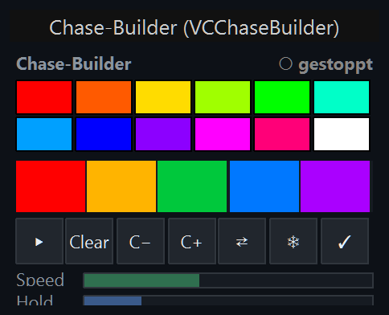
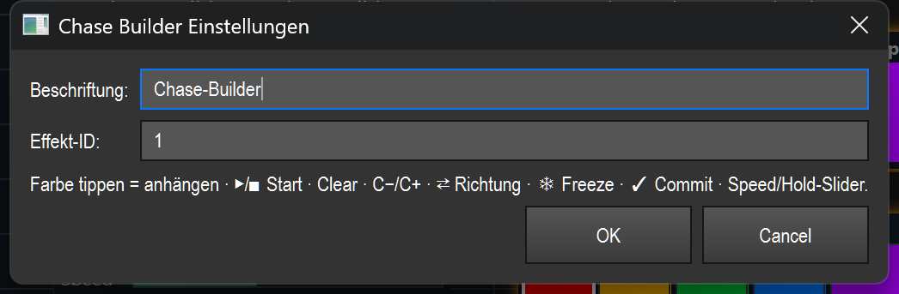

# Chase-Builder (Chase-Baukasten) (`VCChaseBuilder`)

> Ein Alles-in-einem-Bedienelement, mit dem du einen Farb-Chase live zusammenbaust und steuerst: Farben aus einer Palette antippen, abspielen, Reihenfolge bearbeiten und Tempo/Haltezeit einstellen — ohne dafür eine ganze Bank aus Einzelkacheln und -knöpfen zu belegen.

## Wozu & was es steuert

Der Chase-Builder bündelt in einem Widget alles, was man zum Live-Bauen eines Farb-Chase braucht: eine 12er-Farbpalette zum Antippen, eine Liste der bereits gebauten Farbsequenz mit Live-Markierung der aktiven Farbe, eine Knopfzeile (Start/Stopp, Liste leeren, Farbe vor/zurück, Richtung, Freeze, Commit) sowie zwei Schieber für **Speed** (Tempo) und **Hold** (Haltezeit).

Das Widget steuert immer einen **Ziel-Effekt** — eine farbführende Funktion wie ein Color-Fade oder Chaser. Über die Effekt-ID legst du fest, welcher Effekt gemeint ist; ist das Feld leer, wirkt das Widget auf den gerade aktiven Effekt. Die eigentliche Wirkung läuft über die gemeinsame Live-Naht (`effect_live`): Farben werden zur Farbsequenz des Effekts hinzugefügt, Aktionen wirken auf dessen Wiedergabe, und Speed/Hold setzen die zugehörigen Parameter normalisiert (0–100 %). Das Widget aktualisiert sich im Betrieb selbst (alle 250 ms), damit Lauf-Status und aktive Farbe live mitlaufen.

## So sieht es aus & Bedienung im Betrieb

Oben im Screenshot steht das Typ-Label, darunter das eigentliche Element. Innen ist das Widget von oben nach unten so aufgebaut:

- **Kopfzeile:** Links die Beschriftung (im Bild „Chase-Builder"), rechts der Live-Status des Ziel-Effekts:
  - `— kein Ziel —` (grau): Es ist kein Effekt auffindbar/gebunden.
  - `● läuft` (grün): Der Ziel-Effekt läuft.
  - `○ gestoppt` (grau): Der Ziel-Effekt ist gebunden, läuft aber gerade nicht (so im Bild).
- **Farb-Palette (12 Felder, 2 Reihen à 6):** Regenbogen plus Weiß — Rot, Orange, Gelb, Hellgrün, Grün, Türkis / Hellblau, Blau, Violett, Magenta, Pink, Weiß.
- **Gebaute Liste:** Ein waagerechter Streifen, der die Farbsequenz des Effekts in Reihenfolge zeigt (jede Farbe = ein Feld). Ist die Liste leer, steht dort `Liste leer — Farbe tippen`. Ausgeschaltete (deaktivierte) Schritte werden abgedunkelt. Läuft der Effekt, umrandet ein **goldener Rahmen** den gerade aktiven Schritt (Live-Feedback).
- **Knopfzeile (7 Knöpfe):** `▶`/`■`, `Clear`, `C−`, `C+`, `⇄`, `❄`, `✓` (siehe Tabelle unten).
- **Speed-Schieber** und **Hold-Schieber:** Je eine waagerechte Leiste mit Beschriftung links; der gefüllte Teil zeigt den aktuellen Wert (Speed grünlich, Hold blau).

### Was jede Klickzone tut

Alle Aktionen wirken nur im **Betrieb** (Bearbeiten-Modus aus). Ist das Widget per „Touch-Lock" gesperrt, werden Maus/Touch ignoriert (siehe Übersicht (README.md)).

| Zone / Knopf | Geste | Wirkung |
| --- | --- | --- |
| **Palettenfeld** | Antippen / Klick | Hängt diese Farbe hinten an die Farbsequenz des Effekts an (`add_color`). Mehrfach tippen = mehrere Farben aufbauen. |
| **`▶` / `■`** (erster Knopf) | Klick | Start/Stopp des Ziel-Effekts (Umschalter). Läuft er, zeigt der Knopf `■` und ist grün hinterlegt; sonst `▶`. |
| **`Clear`** | Klick | Leert die gebaute Farbliste (`clear_colors`). |
| **`C−`** | Klick | Springt eine Farbe **zurück** / setzt die aktive Farbe einen Schritt zurück (`prev_color`). |
| **`C+`** | Klick | Springt eine Farbe **vor** (`next_color`). |
| **`⇄`** | Klick | Kehrt die Laufrichtung des Chase um (`reverse_direction`). |
| **`❄`** | Klick | Friert den Lauf ein bzw. taut ihn auf (`toggle_freeze`, Umschalter). Bei aktivem Freeze ist der Knopf rötlich hinterlegt. |
| **`✓`** | Klick | Übernimmt den aktuellen Live-Stand fest (`commit_live`). |
| **Speed-Schieber** | Klick / Ziehen | Setzt das Tempo des Effekts auf die Position (0 % links bis 100 % rechts). Beim Klick springt der Wert sofort dorthin; Ziehen verschiebt ihn fließend. |
| **Hold-Schieber** | Klick / Ziehen | Setzt die Haltezeit pro Schritt analog 0–100 %. |

Die gebaute Liste selbst ist **nur Anzeige** — sie reagiert nicht auf Klicks. Die Reihenfolge baust du über die Palette (anhängen) und `Clear` (leeren) auf; navigieren tust du mit `C−`/`C+`.

## Einstellungen

Doppelklick auf das Element (oder Rechtsklick → „Einstellungen…" im Bearbeiten-Modus) öffnet den Dialog. Er hat nur zwei Eingabefelder; darunter steht eine feste Kurz-Hilfe zu den Knöpfen.

| Einstellung | Bedeutung | Werte/Optionen |
| --- | --- | --- |
| **Beschriftung** | Titel, der oben links im Widget angezeigt wird. | Freier Text. Leer = bisheriger Titel bleibt erhalten. |
| **Effekt-ID** | Funktions-ID des Ziel-Effekts (Color-Fade / Chaser), auf den alle Aktionen, Farben und Schieber wirken. | Ganze Zahl = feste Bindung an diesen Effekt. **Leer = aktiver Effekt** (das Widget wirkt jeweils auf den gerade aktiven Effekt). Ungültige/nicht-numerische Eingaben werden als „leer" behandelt. |

Die Hinweiszeile im Dialog fasst die Bedienung zusammen: „Farbe tippen = anhängen · ▶/■ Start · Clear · C−/C+ · ⇄ Richtung · ❄ Freeze · ✓ Commit · Speed/Hold-Slider." Gespeichert werden neben der Beschriftung die **Effekt-ID** sowie die zuletzt eingestellten **Speed-** und **Hold-Werte**.

## Bindung an einen Effekt

Der Chase-Builder funktioniert **nur mit einem Ziel-Effekt** — ohne farbführenden Effekt gibt es nichts zu bauen. Die Bindung speichert ausschließlich die Effekt-ID (Funktions-ID); die Live-Wirkung läuft über die gemeinsame Naht `effect_live` (`add_color` / `do_action` / `set_param_normalized`).

- **Binden:** Im Einstellungs-Dialog die **Effekt-ID** des gewünschten Color-Fade/Chasers eintragen — oder das Feld **leer lassen**, damit das Widget auf den jeweils aktiven Effekt wirkt. Alternativ entsteht ein effektgebundenes Widget direkt, wenn du einen Effekt aus der Bibliothek auf die Canvas ziehst (Smart-Drop, siehe Übersicht (README.md)).
- **Ohne (auffindbares) Ziel:** Findet das Widget keinen passenden Effekt, zeigt der Kopf `— kein Ziel —`, die Liste bleibt leer, und Knöpfe/Schieber haben keine sichtbare Wirkung.
- Dieselbe Bindung würde auch eine MIDI-/Live-Steuerung nutzen — dieses Widget selbst bietet jedoch keine eigene MIDI-/Tasten-Zuweisung (siehe nächster Hinweis).

## MIDI & Tastatur

Der Chase-Builder unterstützt **keine** direkte MIDI- oder Tasten-Zuweisung auf das Widget selbst (`supports_midi_teach` und `supports_key_teach` sind nicht aktiv). Die Einträge „MIDI Teach…" / „Taste zuweisen…" im Kontextmenü bleiben für dieses Element wirkungslos. Steuere es per Maus/Touch; für hardware-gebundene Steuerung des dahinterliegenden Effekts nutze die regulären Effekt-/Playback-Bindungen (siehe Übersicht (README.md)).

## Tipps & Fallen

- **Erst Ziel setzen, dann bauen:** Steht oben `— kein Ziel —`, prüfe die Effekt-ID im Dialog oder ob überhaupt ein passender Color-Fade/Chaser existiert. Ohne Ziel passiert sichtbar nichts.
- **Goldrahmen nur im Lauf:** Die aktive Farbe wird nur markiert, wenn der Effekt tatsächlich läuft (`● läuft`). Im gestoppten Zustand zeigt die Liste die Reihenfolge, aber keine aktive Position.
- **`Clear` ist destruktiv:** Es leert die komplette gebaute Farbliste des Effekts — danach musst du die Farben neu antippen.
- **Speed/Hold sind absolut, nicht relativ:** Ein Klick auf den Schieber springt sofort auf die angeklickte Position. Für Feinkorrekturen lieber ziehen statt klicken.
- **Effekt-ID „leer" ist beweglich:** Mit leerem Feld folgt das Widget immer dem aktiven Effekt — praktisch zum Probieren, aber riskant in einer fertigen Show, weil das Ziel je nach Auswahl wechselt. Für reproduzierbare Shows besser eine feste ID eintragen.
- **Abgedunkelte Listenfelder** sind deaktivierte Schritte — sie laufen im Chase nicht mit, bis sie wieder aktiviert werden.
- **Touch-Lock** sperrt im Betrieb jede Maus-/Touch-Eingabe am Widget; es bleibt reine Anzeige (siehe Übersicht (README.md)).
