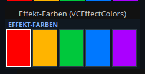
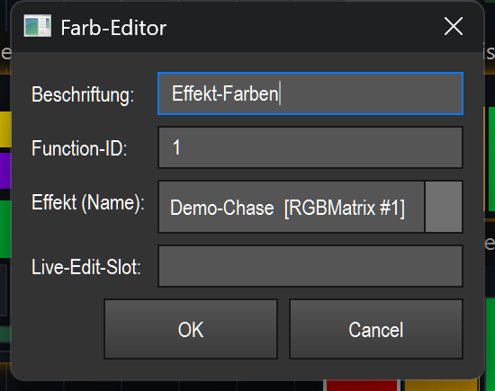

# Effect colors (color editor) (`VCEffectColors`)

> **English version** of [Effekt-Farben (Farb-Editor) (`VCEffectColors`)](11_effekt_farben.md). LightOS itself speaks German: every button, menu and field is quoted here **exactly as it appears on screen**, with an English translation in brackets the first time it shows up. The screenshots are the same as in the German page.

> Shows the color sequence of a (matrix) effect as a row of color tiles and lets you change these colors live during operation and switch them on and off.

## What it is for & what it controls

This element is a live editor for the color list (`ColorSequence`) of an effect. It holds **no colors of its own** but mirrors the color sequence of the bound effect. Each tile (swatch) stands for one color in the sequence, in the order in which the effect runs through them. Changes take effect **immediately** — the renderer reads the sequence in every frame, so the picture changes live.

Typical use: you have a matrix/chase effect running and want to change the colors it cycles through during the show without opening the effect editor — e.g. swap individual colors or briefly take them out of the fade.

## What it looks like & how to use it during operation

At the top left is the **Beschriftung** (label) in capital letters („EFFEKT-FARBEN" (effect colors) in the picture), in blue text. Below it is a row of equally wide color tiles side by side — one per color of the sequence. The dark background is `#101820`.

How the tiles are drawn:
- **Active color:** completely filled in its RGB color, with a thin dark border (`#30404a`).
- **Inactive color:** strongly dimmed (to a quarter of the brightness) and crossed out with a diagonal line from top left to bottom right. The effect fade skips such colors.
- **Currently selected slot** (last touched): additionally highlighted with a thick white border (2 px).

If the element has no valid effect, **„kein Effekt"** (no effect) is shown in the center. If an effect is bound but has no colors, **„keine Farben"** (no colors) is shown.

**Click zones (only during operation, „Bearbeiten" (edit) OFF):**

| Gesture | Zone | Effect |
|---|---|---|
| **Left-click** | on a tile | Opens the color chooser („Farbe wählen" (choose color)) with the current color of this slot. If you confirm a valid color, the slot is set live to this color and marked as the active slot (white border). |
| **Right-click** | on a tile | Toggles the slot between active and inactive. Inactive colors are skipped by the effect fade and appear dimmed + crossed out. |
| Click **next to** the tiles / no effect | empty area | No color action — the click is treated like a normal widget click. |

Which tile was hit is calculated solely from the X position (width ÷ number of colors). There is **no** special double-click function during operation.

In **edit mode** the element behaves like any other VC widget: move, resize, open the properties (see the overview (README.en.md)). The color clicks above only apply during operation.

## Settings

Double-clicking the element (in edit mode) opens the „Farb-Editor" (color editor) dialog:

| Setting | Meaning | Values/options |
|---|---|---|
| **Beschriftung** | Text in the element's header (displayed in capital letters). | Free text. Empty = the previous label is kept. |
| **Function-ID** | Fixed ID of the effect whose colors are edited. This ID takes precedence over the live edit slot. | Integer (effect ID). Empty or a value < 0 = no fixed binding. |
| **Effekt (Name)** (effect (name)) | Select the effect by name from the function list — more convenient than entering the ID. When you select one, the matching function ID is automatically filled in above. | `(nach ID oben)` (by ID above) = select nothing, the „Function-ID" field applies. Otherwise one entry per function with a color list, format `Name [Typ #ID]` (name [type #ID]) (e.g. `Demo-Chase [RGBMatrix #1]`). Only effects that have a color list at all are offered. |
| **Live-Edit-Slot** | Free-text name of a live edit slot. If **no** fixed function ID is set, the colors of the effect that is currently in this slot for editing are edited. | Free text. Empty = no slot. |

Note on saving: only **Function-ID** and **Live-Edit-Slot** are saved (plus the general widget data such as the label). The colors themselves belong to the effect and are **not** saved in the widget.

## Binding to an effect

This element **needs** an effect — without a binding it only shows „kein Effekt" and does not respond to color clicks.

The target is determined like this (in this order):
1. **Fixed function ID** — if it is set, exactly this effect is edited.
2. **Live-Edit-Slot** — if no ID is set but a slot name is entered, the effect that is currently in this edit slot is used.
3. Otherwise no target → „kein Effekt".

Internally the element only stores the `function_id` (or the slot name); the live effect runs through the shared seam `src/core/engine/effect_live.py` (get the color sequence with `get_param("colors", …)`, then `set_color` / `toggle` on the live sequence). Smart-Drop uses the same binding: if you drag a matrix effect onto the canvas and choose „Farben ändern" (change colors), this element is created already bound to the effect.

## Tips & pitfalls

- **Colors belong to the effect, not the widget.** Several „Effekt-Farben" (effect colors) elements on the same effect show the same colors; a change takes effect everywhere at once. When the show is saved, the colors are not stored in the widget but remain part of the effect.
- **Live = immediate.** There is no „Übernehmen" (apply). As soon as you confirm in the color chooser or right-click, the change is visible in the lighting.
- **Inactive ≠ deleted.** A right-click doesn't remove a color from the list but only takes it out of the cycle (crossed out/dimmed). Another right-click brings it back.
- **ID beats slot.** If you enter both a function ID and a live edit slot, the fixed ID always wins. Leave the ID empty if the element should follow the effect that is currently being edited.
- **The effect selection only shows suitable functions.** Only functions with a color list appear in the „Effekt (Name)" drop-down. If your effect is missing there, it has no editable color sequence.
- **Hit zone = X position.** Which tile is hit depends only on the horizontal click position. With a very narrow element or many colors, the tiles get tight — aim more precisely then.
- **During operation**, a left-click opens the color chooser directly; to get to the properties, switch „Bearbeiten" on and use a double-click or the right-click context menu (see the overview (README.en.md)).
