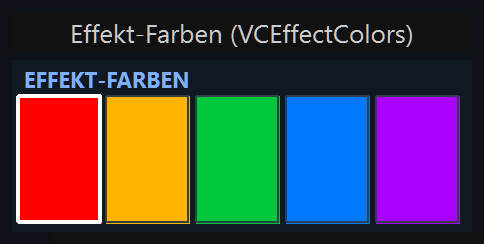
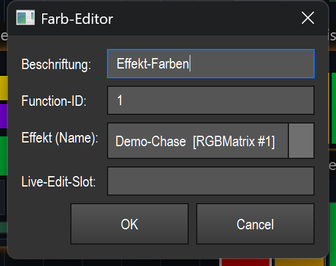

# Effekt-Farben (Farb-Editor) (`VCEffectColors`)

> Zeigt die Farb-Sequenz eines (Matrix-)Effekts als Reihe von Farb-Kacheln an und lässt dich diese Farben im laufenden Betrieb live ändern, ein- und ausschalten.

## Wozu & was es steuert

Dieses Element ist ein Live-Editor für die Farbliste (`ColorSequence`) eines Effekts. Es hält **keine eigenen Farben**, sondern spiegelt die Farb-Sequenz des gebundenen Effekts. Jede Kachel (Swatch) steht für eine Farbe in der Sequenz, in der Reihenfolge, in der der Effekt sie durchläuft. Änderungen wirken **sofort** — der Renderer liest die Sequenz in jedem Frame, das Bild ändert sich also live.

Typischer Einsatz: Du hast einen Matrix-/Chase-Effekt laufen und willst während der Show die durchlaufenen Farben umstellen, ohne den Effekt-Editor zu öffnen — z. B. einzelne Farben tauschen oder kurz aus dem Fade herausnehmen.

## So sieht es aus & Bedienung im Betrieb

Oben links steht die **Beschriftung** in Großbuchstaben (im Bild „EFFEKT-FARBEN"), in blauer Schrift. Darunter liegt nebeneinander eine Reihe gleich breiter Farb-Kacheln — eine pro Farbe der Sequenz. Der dunkle Hintergrund ist `#101820`.

Darstellung der Kacheln:
- **Aktive Farbe:** voll ausgefüllt in ihrer RGB-Farbe, mit dünnem dunklen Rahmen (`#30404a`).
- **Inaktive Farbe:** stark abgedunkelt (auf ein Viertel der Helligkeit) und mit einer diagonalen Linie von oben-links nach unten-rechts durchgestrichen. Der Effekt-Fade überspringt solche Farben.
- **Gerade gewählter Slot** (zuletzt angefasst): zusätzlich mit dickem weißen Rahmen (2 px) hervorgehoben.

Hat das Element keinen gültigen Effekt, steht zentriert **„kein Effekt"**. Ist ein Effekt gebunden, hat aber keine Farben, steht **„keine Farben"**.

**Klickzonen (nur im Betrieb, „Bearbeiten" AUS):**

| Geste | Zone | Wirkung |
|---|---|---|
| **Links-Klick** | auf eine Kachel | Öffnet den Farbwähler („Farbe wählen") mit der aktuellen Farbe dieses Slots. Bestätigst du eine gültige Farbe, wird der Slot live auf diese Farbe gesetzt und als aktiver Slot markiert (weißer Rahmen). |
| **Rechts-Klick** | auf eine Kachel | Schaltet den Slot aktiv/inaktiv um (Toggle). Inaktive Farben werden vom Effekt-Fade übersprungen und erscheinen abgedunkelt + durchgestrichen. |
| Klick **neben** die Kacheln / kein Effekt | leerer Bereich | Keine Farb-Aktion — der Klick wird wie ein normaler Widget-Klick behandelt. |

Welche Kachel getroffen wurde, wird allein aus der X-Position berechnet (Breite ÷ Anzahl Farben). Es gibt **keine** Doppelklick-Sonderfunktion im Betrieb.

Im **Bearbeiten-Modus** verhält sich das Element wie jedes andere VC-Widget: verschieben, skalieren, Eigenschaften öffnen (siehe Übersicht (README.md)). Die Farb-Klicks oben gelten nur im Betrieb.

## Einstellungen

Doppelklick auf das Element (im Bearbeiten-Modus) öffnet den Dialog „Farb-Editor":

| Einstellung | Bedeutung | Werte/Optionen |
|---|---|---|
| **Beschriftung** | Text in der Kopfzeile des Elements (wird in Großbuchstaben angezeigt). | Freitext. Leer = bisherige Beschriftung bleibt erhalten. |
| **Function-ID** | Feste ID des Effekts, dessen Farben bearbeitet werden. Diese ID hat Vorrang vor dem Live-Edit-Slot. | Ganze Zahl (Effekt-ID). Leer oder ein Wert < 0 = keine feste Bindung. |
| **Effekt (Name)** | Auswahl des Effekts per Name aus der Funktionsliste — bequemer als die ID-Eingabe. Beim Auswählen wird die zugehörige Function-ID automatisch oben eingetragen. | `(nach ID oben)` = nichts wählen, das Feld „Function-ID" gilt. Sonst je ein Eintrag pro Funktion mit Farbliste, Format `Name [Typ #ID]` (z. B. `Demo-Chase [RGBMatrix #1]`). Es werden nur Effekte angeboten, die überhaupt eine Farbliste besitzen. |
| **Live-Edit-Slot** | Freitext-Name eines Live-Edit-Slots. Ist **keine** feste Function-ID gesetzt, werden die Farben des Effekts bearbeitet, der gerade in diesem Slot zum Editieren liegt. | Freitext. Leer = kein Slot. |

Hinweis zur Speicherung: Gespeichert werden nur **Function-ID** und **Live-Edit-Slot** (plus die allgemeinen Widget-Daten wie Beschriftung). Die Farben selbst gehören dem Effekt und werden **nicht** im Widget gespeichert.

## Bindung an einen Effekt

Dieses Element **braucht** einen Effekt — ohne Bindung zeigt es nur „kein Effekt" und reagiert nicht auf Farb-Klicks.

So wird das Ziel bestimmt (in dieser Reihenfolge):
1. **Feste Function-ID** — ist sie gesetzt, wird genau dieser Effekt bearbeitet.
2. **Live-Edit-Slot** — ist keine ID gesetzt, aber ein Slot-Name eingetragen, wird der Effekt verwendet, der aktuell in diesem Edit-Slot liegt.
3. Sonst kein Ziel → „kein Effekt".

Das Element speichert intern nur die `function_id` (bzw. den Slot-Namen); die Live-Wirkung läuft über die gemeinsame Naht `src/core/engine/effect_live.py` (Farb-Sequenz holen mit `get_param("colors", …)`, dann `set_color` / `toggle` auf der lebenden Sequenz). Dieselbe Bindung wird auch beim Smart-Drop benutzt: Ziehst du einen Matrix-Effekt auf die Canvas und wählst „Farben ändern", entsteht dieses Element bereits an den Effekt gebunden.

## Tipps & Fallen

- **Farben gehören dem Effekt, nicht dem Widget.** Mehrere „Effekt-Farben"-Elemente auf denselben Effekt zeigen dieselben Farben; eine Änderung wirkt überall gleichzeitig. Beim Speichern der Show werden die Farben nicht im Widget abgelegt, sondern bleiben Teil des Effekts.
- **Live = sofort.** Es gibt kein „Übernehmen". Sobald du im Farbwähler bestätigst oder rechtsklickst, ist die Änderung im Lichtbild sichtbar.
- **Inaktiv ≠ gelöscht.** Rechts-Klick entfernt eine Farbe nicht aus der Liste, sondern nimmt sie nur aus dem Durchlauf (durchgestrichen/abgedunkelt). Ein weiterer Rechts-Klick holt sie zurück.
- **ID schlägt Slot.** Trägst du sowohl eine Function-ID als auch einen Live-Edit-Slot ein, gewinnt immer die feste ID. Lass die ID leer, wenn das Element dem gerade editierten Effekt folgen soll.
- **Effekt-Auswahl zeigt nur passende Funktionen.** Im Klappmenü „Effekt (Name)" erscheinen nur Funktionen mit Farbliste. Fehlt dein Effekt dort, hat er keine bearbeitbare Farb-Sequenz.
- **Treffer-Zone = X-Position.** Welche Kachel getroffen wird, hängt nur von der waagerechten Klickposition ab. Bei sehr schmalem Element oder vielen Farben werden die Kacheln eng — dann genauer zielen.
- Im **Betrieb** öffnet Links-Klick direkt den Farbwähler; um an die Eigenschaften zu kommen, schalte „Bearbeiten" ein und nutze Doppelklick bzw. das Rechtsklick-Kontextmenü (siehe Übersicht (README.md)).
