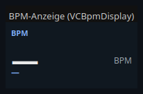
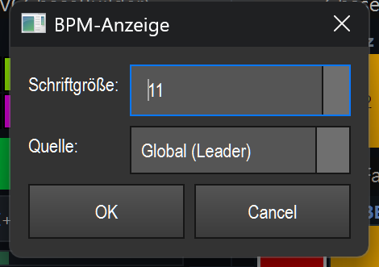

# BPM display (`VCBpmDisplay`)

> **English version** of [BPM-Anzeige (`VCBpmDisplay`)](12_bpm_anzeige.md). LightOS itself speaks German: every button, menu and field is quoted here **exactly as it appears on screen**, with an English translation in brackets the first time it shows up. The screenshots are the same as in the German page.

> A pure live display of the current tempo (large BPM number) plus a short source/mode line — either from the global tempo leader or from a single tempo bus.

## What it is for & what it controls

The BPM display shows you the tempo currently running on the Virtual Console at all times: the beats per minute (BPM) in large type, and below that where this tempo comes from (e.g. automatically from the audio analysis, from OS2L, tapped in with Tap, or set manually).

Important: this element **controls nothing** and is **not clickable** during operation. It is a display. You change the tempo itself elsewhere — via VC buttons (Tap / Nudge / mode switch), the BPM fader or the BPM manager tab. You will find the full tempo editor with all sources and settings under [20_bpm_manager.en.md](20_bpm_manager.en.md).

You can choose which BPM is shown: the **global leader** (default) or the BPM of a single **tempo bus** (A/B/C/D).

## What it looks like & how to use it during operation

The element is a dark box (default size 180 × 96 px) with three lines:

- **Header line (top left, small, blue):** the element's name in capital letters — `BPM` in the picture. This is the freely chosen caption of the widget.
- **Large BPM number (center):** the current tempo, rounded to whole beats (`112` in the picture). It is **green** as long as a valid tempo is running (BPM > 0). If there is no tempo, a dash `—` in light type appears instead. To its right, in subtle grey, the unit `BPM`.
- **Source/mode line (bottom left):** normally shows the short source or mode (`AUTO` in the picture). If the element is set to a tempo bus, this line shows `BUS A` (or B/C/D) instead. The line is **blue** in automatic mode and **orange** when the mode is „manual".

The short labels in the source line mean:

| Label | Meaning |
|---|---|
| `AUTO` | Tempo comes automatically from audio analysis (microphone/input) or from a file |
| `OS2L` | Tempo comes via the OS2L protocol (e.g. from DJ software) |
| `Tap` | Tempo was tapped in with the tap key |
| `Nudge` | Tempo was corrected by nudge (finely up/down) |
| `MANUAL` | Tempo is set by hand |
| `—` | No active tempo source |

**Using it during operation:** Not at all. Click, double-click and drag do nothing on the element itself — there are no buttons and no click zones. The display updates by itself as soon as the tempo changes. (For general VC basics such as edit mode, double-click = settings and the right-click menu: see the overview in [README.en.md](README.en.md).)

## Settings

Double-clicking the element (in edit mode) opens the „BPM-Anzeige" (BPM display) dialog with two fields:

| Setting | Meaning | Values/options |
|---|---|---|
| **Schriftgröße** (font size) | Controls the font size of the whole display. The large BPM number grows with this value (it is calculated from the font size), as do the header line and the source line. | Integer from **7 to 28** (default: 11) |
| **Quelle** (source) | Determines which BPM is shown: the global tempo or a specific tempo bus. | **Global (Leader)** = global BPM leader (default) · **Bus A** · **Bus B** · **Bus C** · **Bus D** = BPM of the respective tempo bus |

Notes on the source:
- **Global (Leader):** The element subscribes to the BPM manager and is updated immediately on every change of tempo or state. The source line shows the matching short label (`AUTO`/`OS2L`/`Tap`/…).
- **Bus A–D:** The element reads the BPM of the selected tempo bus about ten times per second and shows `BUS A` (or B/C/D) in the bottom line. If the bus cannot be resolved, the number is 0 (dash).

The font size (`font_size`) and the selected source (`tempo_bus_id`) are saved with the show; on loading, the element restores these values.

## Tips & pitfalls

- **It is a display, not a control.** If you want to change the tempo, you need Tap/Nudge/mode buttons, the BPM fader or the BPM manager — see [20_bpm_manager.en.md](20_bpm_manager.en.md).
- **Color as quick status info:** Green number = tempo is running. Dash `—` = there is no tempo (e.g. no active source). Orange bottom line = manual mode, blue = automatic.
- **Several displays side by side:** You can set one element to „Global" and others to Bus A/B/C/D to keep an eye on several tempos at once.
- **A bus display shows no source:** In bus mode the bottom line always shows `BUS x`, not `AUTO`/`MANUAL` — the source/mode info only applies to the global leader.
- This element has **no** effect binding, **no** MIDI teach and **no** key teach — it is purely passive.
