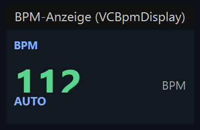
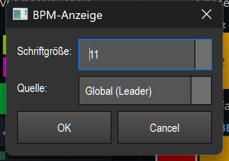

# BPM-Anzeige (`VCBpmDisplay`)

> Eine reine Live-Anzeige des aktuellen Tempos (große BPM-Zahl) plus einer kurzen Quelle/Modus-Zeile — entweder vom globalen Tempo-Leader oder von einem einzelnen Tempo-Bus.

## Wozu & was es steuert

Die BPM-Anzeige zeigt dir auf der Virtuellen Konsole jederzeit das aktuell laufende Tempo an: groß die Schläge pro Minute (BPM) und darunter, woher dieses Tempo kommt (z. B. automatisch aus der Audioanalyse, von OS2L, per Tap getippt oder manuell gesetzt).

Wichtig: Dieses Element **steuert nichts** und ist im Betrieb **nicht anklickbar**. Es ist eine Anzeige. Das Tempo selbst änderst du an anderer Stelle — über VC-Buttons (Tap / Nudge / Modus-Umschalten), den BPM-Fader oder den BPM-Manager-Tab. Den vollständigen Tempo-Editor mit allen Quellen und Einstellungen findest du unter [20_bpm_manager.md](20_bpm_manager.md).

Du kannst wählen, welche BPM angezeigt werden: den **globalen Leader** (Standard) oder die BPM eines einzelnen **Tempo-Bus** (A/B/C/D).

## So sieht es aus & Bedienung im Betrieb

Das Element ist ein dunkles Kästchen (Standardgröße 180 × 96 px) mit drei Zeilen:

- **Kopfzeile (oben links, klein, blau):** der Name des Elements in Großbuchstaben — im Bild `BPM`. Das ist die frei wählbare Beschriftung (Caption) des Widgets.
- **Große BPM-Zahl (Mitte):** das aktuelle Tempo, auf ganze Schläge gerundet (im Bild `112`). Sie ist **grün**, solange ein gültiges Tempo läuft (BPM > 0). Liegt kein Tempo an, steht stattdessen ein Gedankenstrich `—` in heller Schrift. Rechts daneben dezent grau die Einheit `BPM`.
- **Quelle/Modus-Zeile (unten links):** zeigt im Normalfall die kurze Quelle bzw. den Modus (im Bild `AUTO`). Steht das Element auf einen Tempo-Bus, zeigt diese Zeile stattdessen `BUS A` (bzw. B/C/D). Die Zeile ist **blau** im Automatik-Modus und **orange**, wenn der Modus „manual" ist.

Die kurzen Labels der Quelle-Zeile bedeuten:

| Label | Bedeutung |
|---|---|
| `AUTO` | Tempo kommt automatisch aus Audioanalyse (Mikrofon/Eingang) oder Datei |
| `OS2L` | Tempo kommt über das OS2L-Protokoll (z. B. von einer DJ-Software) |
| `Tap` | Tempo wurde per Tap-Taste eingetippt |
| `Nudge` | Tempo wurde per Nudge (fein nach oben/unten) korrigiert |
| `MANUAL` | Tempo ist von Hand fest gesetzt |
| `—` | Keine aktive Tempo-Quelle |

**Bedienung im Betrieb:** Keine. Klick, Doppelklick und Ziehen lösen am Element selbst nichts aus — es gibt keine Knöpfe und keine Klickzonen. Die Anzeige aktualisiert sich von selbst, sobald sich das Tempo ändert. (Allgemeine VC-Grundlagen wie Bearbeiten-Modus, Doppelklick = Einstellungen und Rechtsklick-Menü: siehe Übersicht in der [README.md](README.md).)

## Einstellungen

Doppelklick auf das Element (im Bearbeiten-Modus) öffnet den Dialog „BPM-Anzeige" mit zwei Feldern:

| Einstellung | Bedeutung | Werte/Optionen |
|---|---|---|
| **Schriftgröße** | Steuert die Schriftgröße der gesamten Anzeige. Die große BPM-Zahl wächst mit diesem Wert (sie wird aus der Schriftgröße berechnet), ebenso Kopfzeile und Quelle-Zeile. | Ganzzahl von **7 bis 28** (Standard: 11) |
| **Quelle** | Legt fest, welche BPM angezeigt wird: das globale Tempo oder ein bestimmter Tempo-Bus. | **Global (Leader)** = globaler BPM-Leader (Standard) · **Bus A** · **Bus B** · **Bus C** · **Bus D** = BPM des jeweiligen Tempo-Bus |

Hinweise zur Quelle:
- **Global (Leader):** Das Element abonniert den BPM-Manager und wird bei jeder Tempo- oder Zustandsänderung sofort aktualisiert. Die Quelle-Zeile zeigt das passende Kurz-Label (`AUTO`/`OS2L`/`Tap`/…).
- **Bus A–D:** Das Element liest die BPM des gewählten Tempo-Bus etwa zehnmal pro Sekunde aus und zeigt in der unteren Zeile `BUS A` (bzw. B/C/D). Ist der Bus nicht auflösbar, steht die Zahl auf 0 (Gedankenstrich).

Gespeichert werden Schriftgröße (`font_size`) und gewählte Quelle (`tempo_bus_id`) zusammen mit der Show; beim Laden stellt das Element diese Werte wieder her.

## Tipps & Fallen

- **Es ist eine Anzeige, kein Bedienelement.** Wenn du das Tempo verstellen willst, brauchst du Tap-/Nudge-/Modus-Buttons, den BPM-Fader oder den BPM-Manager — siehe [20_bpm_manager.md](20_bpm_manager.md).
- **Farbe als schnelle Statusinfo:** Grüne Zahl = Tempo läuft. Gedankenstrich `—` = es liegt kein Tempo an (z. B. keine aktive Quelle). Orange untere Zeile = manueller Modus, blau = Automatik.
- **Mehrere Anzeigen nebeneinander:** Du kannst je ein Element auf „Global" und weitere auf Bus A/B/C/D stellen, um mehrere Tempi gleichzeitig im Blick zu behalten.
- **Bus-Anzeige zeigt keine Quelle:** Im Bus-Modus steht in der unteren Zeile immer `BUS x`, nicht `AUTO`/`MANUAL` — die Quelle/Modus-Info gilt nur für den globalen Leader.
- Dieses Element kennt **keine** Effekt-Bindung, **kein** MIDI-Teach und **kein** Tasten-Teach — es ist rein passiv.
