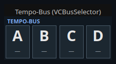
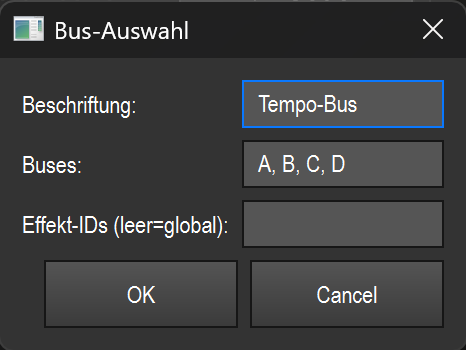

# Tempo bus (bus selection) (`VCBusSelector`)

> **English version** of [Tempo-Bus (Bus-Wahl) (`VCBusSelector`)](13_tempo_bus.md). LightOS itself speaks German: every button, menu and field is quoted here **exactly as it appears on screen**, with an English translation in brackets the first time it shows up. The screenshots are the same as in the German page.

> A row of bus chips (A/B/C/D by default) with which you decide by click during operation which tempo bus is currently "armed" — that is, which bus all tap/sync/tempo widgets without a fixed bus assignment act on.

## What it is for & what it controls

LightOS has several named tempo buses (A, B, C, D by default), each of which can carry its own BPM. Many tempo-related widgets (Tap, Sync, tempo display) have no fixed bus target and instead always act on the **currently active (armed) bus**.

This widget switches exactly that active bus: a click on a chip sets the `armed_bus_id` in the central tempo bus manager. After that, all widgets with an empty bus target act on the newly selected bus. This lets you, for example, tap several buses one after another with a single tap-tempo control, by first arming the target bus here.

The widget does not control any tempo itself; it only selects the target. For display purposes, each chip also shows the current BPM of its bus (a snapshot taken when drawing).

## What it looks like & how to use it during operation

At the top left is the caption in capital letters (`TEMPO-BUS` in the picture). Below it is a horizontal row of equally wide chips — one per bus. The screenshot shows four chips: A, B, C and D.

Each chip shows:

- in the upper half, the **bus letter**, large and bold (A, B, C, D),
- in the lower half, small and subtle, the **current BPM** of this bus. If the bus has no valid BPM yet (0, or the bus does not exist), a dash `—` appears there (in the picture on all four).

The **armed bus** is visually highlighted: light blue background and light border/text. All other chips are dark with a grey border.

Operation:

- **Left-click a chip** (operation): arms this bus. The chip immediately switches to the light highlight, and from then on all widgets with an empty bus target act on this bus. Which letter you hit depends solely on the horizontal click position — the width of the widget is divided evenly among the chips.
- Outside the chips, or with another mouse button, nothing happens.
- If operation is locked by **Touch-Lock**, the widget does not react to clicks (display only); MIDI/APC would stay active as usual.

In edit mode the element behaves like any other VC widget: select, move, resize, context menu. A chip click does **not** arm the bus there (see overview (README.en.md)).

## Settings

Open the „Bus-Auswahl" (bus selection) dialog by double-clicking the widget (or right-click → „Einstellungen…" (settings…)).

| Setting | Meaning | Values/options |
| --- | --- | --- |
| Beschriftung (caption) | Text in the widget's header line (shown in capital letters). | Free text. If you leave it empty, the previous caption is kept. |
| Buses | List of the bus IDs that appear as chips — in this order and number. | Comma-separated list, e.g. `A, B, C, D`. A semicolon `;` is also accepted as a separator; spaces around the entries are removed; empty entries are dropped. If no valid ID is entered, the previous list is kept. Each ID is a free bus name (not limited to A–D). |
| Effekt-IDs (leer = global) (effect IDs, empty = global) | Optionally couples the widget to specific effects. **Empty** = the widget acts **globally** (arms the active bus for all tempo widgets/effects with an empty bus target). If effect IDs are entered, the widget binds exactly these effects to the selected bus. | Comma-separated effect/function IDs (numbers), e.g. `6, 8`. Leave empty for the normal case (global). |

The number and width of the chips follow directly from this list: two IDs give two wide chips, six IDs six narrow ones.

The widget saves the caption (via the shared VC base) and the bus list (`buses`).

## Tips & pitfalls

- **Selection only, no tempo:** This widget does not set the tap tempo. It only selects which bus the other tempo widgets drive. To set a tempo you need a tap/sync/tempo widget.
- **An empty bus target is the key:** The armed bus only acts on widgets whose bus target is **empty** (these follow "armed-or-default"). Widgets with a fixed bus assignment ignore the arming.
- **The BPM is a snapshot:** The small BPM number is read when the chip is drawn. It updates with normal redraws; `—` only means "currently no valid BPM on this bus", not necessarily an error.
- **Bus IDs must match:** If you enter names under „Buses" that don't exist in the tempo bus manager, you can still arm them, but the BPM stays `—` and other widgets may not find the bus. Stick to the bus names actually in use.
- **Order = input order:** The chips appear exactly in the order in which you enter them in the „Buses" field.
