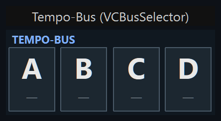
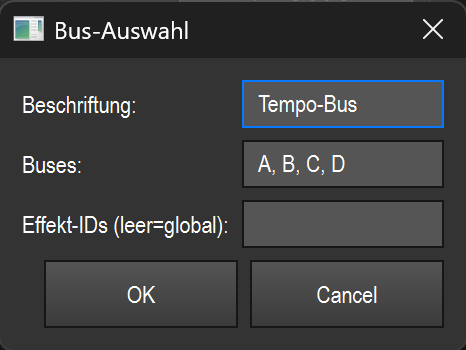

# Tempo-Bus (Bus-Wahl) (`VCBusSelector`)

> Eine Reihe von Bus-Chips (Standard A/B/C/D), mit der du im Betrieb per Klick festlegst, welcher Tempo-Bus gerade „scharf" ist — also auf welchen Bus alle Tap-/Sync-/Tempo-Widgets ohne fest zugewiesenen Bus wirken.

## Wozu & was es steuert

LightOS hat mehrere benannte Tempo-Buses (standardmäßig A, B, C, D), die jeweils eine eigene BPM tragen können. Viele Tempo-bezogene Widgets (Tap, Sync, Tempo-Anzeige) haben kein fest eingestelltes Bus-Ziel und wirken stattdessen immer auf den **gerade aktiven (scharfgeschalteten) Bus**.

Dieses Widget schaltet genau diesen aktiven Bus um: Ein Klick auf einen Chip setzt den `armed_bus_id` im zentralen Tempo-Bus-Manager. Danach wirken alle Widgets mit leerem Bus-Ziel auf den neu gewählten Bus. So kannst du z. B. mit einem einzigen Tap-Tempo-Geber nacheinander verschiedene Buses tappen, indem du vorher hier den Ziel-Bus scharf schaltest.

Das Widget steuert selbst kein Tempo, sondern wählt nur das Ziel. Zur Anzeige blendet jeder Chip zusätzlich die aktuelle BPM seines Bus ein (Schnappschuss beim Zeichnen).

## So sieht es aus & Bedienung im Betrieb

Oben links steht die Beschriftung in Großbuchstaben (im Bild `TEMPO-BUS`). Darunter liegt eine waagrechte Reihe gleich breiter Chips — einer pro Bus. Im Screenshot sind das vier Chips: A, B, C und D.

Jeder Chip zeigt:

- in der oberen Hälfte den **Bus-Buchstaben** groß und fett (A, B, C, D),
- in der unteren Hälfte klein und dezent die **aktuelle BPM** dieses Bus. Hat der Bus noch keine gültige BPM (0 oder Bus existiert nicht), steht dort ein Gedankenstrich `—` (im Bild bei allen vieren).

Der **scharfgeschaltete Bus** ist optisch hervorgehoben: heller blauer Hintergrund und heller Rahmen/Text. Alle anderen Chips sind dunkel mit grauem Rahmen.

Bedienung:

- **Linksklick auf einen Chip** (Betrieb): schaltet diesen Bus scharf. Der Chip springt sofort auf die helle Hervorhebung, alle Widgets mit leerem Bus-Ziel wirken danach auf diesen Bus. Welcher Buchstabe getroffen wird, ergibt sich allein aus der waagrechten Klickposition — die Breite des Widgets wird gleichmäßig auf die Chips aufgeteilt.
- Außerhalb der Chips bzw. mit anderer Maustaste passiert nichts.
- Ist der Betrieb durch **Touch-Lock** gesperrt, reagiert das Widget nicht auf Klicks (reine Anzeige); MIDI/APC bliebe wie üblich aktiv.

Im Bearbeiten-Modus verhält sich das Element wie jedes andere VC-Widget: auswählen, verschieben, skalieren, Kontextmenü. Ein Chip-Klick schaltet dort **nicht** scharf (siehe Übersicht (README.md)).

## Einstellungen

Öffne den Dialog „Bus-Auswahl" per Doppelklick auf das Widget (oder Rechtsklick → „Einstellungen…").

| Einstellung | Bedeutung | Werte/Optionen |
| --- | --- | --- |
| Beschriftung | Text in der Kopfzeile des Widgets (wird in Großbuchstaben gezeigt). | Freitext. Leer eingegeben bleibt die bisherige Beschriftung erhalten. |
| Buses | Liste der Bus-IDs, die als Chips erscheinen — in dieser Reihenfolge und Anzahl. | Komma-getrennte Liste, z. B. `A, B, C, D`. Semikolon `;` wird ebenfalls als Trenner akzeptiert; Leerzeichen um die Einträge werden entfernt; leere Einträge fallen weg. Wird keine gültige ID eingegeben, bleibt die bisherige Liste bestehen. Jede ID ist ein freier Bus-Name (nicht auf A–D beschränkt). |
| Effekt-IDs (leer = global) | Koppelt das Widget optional an bestimmte Effekte. **Leer** = das Widget wirkt **global** (schaltet den aktiven Bus für alle Tempo-Widgets/Effekte mit leerem Bus-Ziel scharf). Sind Effekt-IDs eingetragen, bindet das Widget gezielt diese Effekte an den gewählten Bus. | Komma-getrennte Effekt-/Funktions-IDs (Zahlen), z. B. `6, 8`. Leer lassen für den Normalfall (global). |

Die Chip-Anzahl und -Breite ergeben sich direkt aus dieser Liste: zwei IDs ergeben zwei breite Chips, sechs IDs sechs schmale.

Gespeichert werden mit dem Widget die Beschriftung (über die gemeinsame VC-Basis) und die Bus-Liste (`buses`).

## Tipps & Fallen

- **Nur Auswahl, kein Tempo:** Dieses Widget setzt das Tap-Tempo nicht. Es wählt nur, welcher Bus von den anderen Tempo-Widgets bespielt wird. Zum Tempo-Geben brauchst du ein Tap-/Sync-/Tempo-Widget.
- **Leeres Bus-Ziel ist der Hebel:** Der scharfe Bus wirkt nur auf Widgets, deren Bus-Ziel **leer** ist (diese folgen „armed-or-default"). Widgets mit fest zugewiesenem Bus ignorieren die Scharfschaltung.
- **BPM ist ein Schnappschuss:** Die kleine BPM-Zahl wird beim Zeichnen ausgelesen. Sie aktualisiert sich beim normalen Neuzeichnen; `—` bedeutet nur „aktuell keine gültige BPM auf diesem Bus", nicht zwingend einen Fehler.
- **Bus-IDs müssen passen:** Trägst du unter „Buses" Namen ein, die es im Tempo-Bus-Manager nicht gibt, kannst du sie zwar scharf schalten, aber die BPM bleibt `—` und andere Widgets finden den Bus evtl. nicht. Halte dich an die tatsächlich verwendeten Bus-Namen.
- **Reihenfolge = Eingabereihenfolge:** Die Chips erscheinen exakt in der Reihenfolge, in der du sie im Feld „Buses" einträgst.
