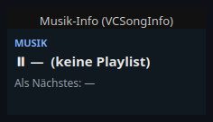
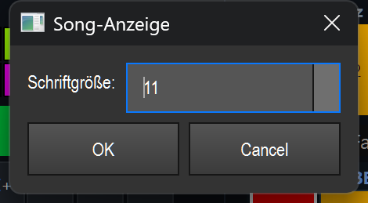

# Music info (`VCSongInfo`)

> **English version** of [Musik-Info (`VCSongInfo`)](14_musik_info.md). LightOS itself speaks German: every button, menu and field is quoted here **exactly as it appears on screen**, with an English translation in brackets the first time it shows up. The screenshots are the same as in the German page.

> A pure display that shows the currently playing song and the next song from the in-app music player on the Virtual Console — handy as a stage monitor to keep track of the song order during a live show.

## What it is for & what it controls

The element automatically shows what is currently playing in the internal music player (the Musik (music) tab) and what comes next. It **controls nothing** — it is non-interactive and only serves as a display. It updates by itself as soon as the track changes, the playlist changes, or playback switches between play and pause.

You do **not** control the actual playback (play, pause, next title, etc.) via this element, but via VC buttons with a media action or directly in the Musik tab.

## What it looks like & how to use it during operation

The element is a dark display panel (default color `#101820`) and consists of three lines of text:

1. **Header line** — the element's caption in capital letters and blue type (in the picture: `MUSIK` (music)). This is the freely chosen caption of the widget.
2. **Current song** — preceded by a symbol:
   - **▶ (green)** while playing,
   - **⏸ (grey/light)** when paused.

   After it comes the title of the current song. If the track has a BPM value, it is added (e.g. `· 128 BPM`). If there is no playlist, this line reads `— (keine Playlist)` (no playlist) (see screenshot).
3. **Next song** — in muted grey: `Als Nächstes: <Titel>` (up next: *title*). If there is no following title, it reads `Als Nächstes: —`.

**Operation:** During operation (edit mode off) the element has **no click, double-click, drag or gesture function** — it reacts to no mouse or touch input and only shows the player state. All changes to the content come exclusively from the music player itself.

In edit mode the usual VC functions apply (move, resize, double-click opens the settings, right-click opens the context menu) — see overview (`README.en.md`).

## Settings

The settings dialog has the title **„Song-Anzeige"** (song display) and contains exactly one field:

| Setting | Meaning | Values/options |
|---|---|---|
| Schriftgröße (font size) | Base size of the font in the display panel. The header line and the „Als Nächstes" line are drawn somewhat smaller relative to it (header line = base size − 3, at least 7; next title = base size − 2). | Integer from **7 to 28** (default: **11**) |

The caption, foreground and background color are not set in this dialog but via the general VC functions or the context menu — see overview (`README.en.md`). Apart from the general widget data, only the `font_size` is saved.

## Tips & pitfalls

- **Does it say „(keine Playlist)"?** That is normal as long as no playlist is loaded or no title is selected in the Musik tab — the element can only show what the player knows.
- **You can't click play/pause here.** The element is a pure display. To control playback, place VC buttons with a media action next to it or use the Musik tab.
- **Element too small for long titles?** Long titles wrap. If text looks cut off, make the element wider/taller or reduce the font size.
- **The BPM is only shown** if the track in question has a BPM value — if it is missing, the line stays without the BPM addition.
- **No MIDI/key teach and no effect binding:** This element can neither be assigned via MIDI or a key nor bound to an effect — there is nothing to control.
