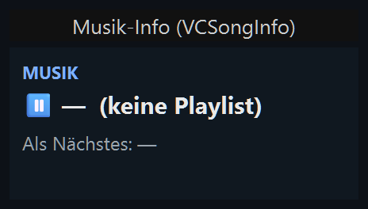
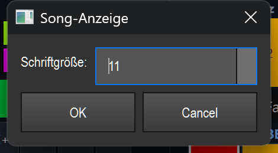

# Musik-Info (`VCSongInfo`)

> Eine reine Anzeige, die in der Virtuellen Konsole das aktuell laufende und das nächste Lied aus dem In-App-Musikplayer zeigt — praktisch als Bühnenmonitor, um beim Live-Betrieb den Song-Verlauf im Blick zu behalten.

## Wozu & was es steuert

Das Element zeigt automatisch an, was im internen Musikplayer (Musik-Tab) gerade läuft und was als Nächstes kommt. Es **steuert nichts** — es ist nicht-interaktiv und dient nur der Anzeige. Es aktualisiert sich von selbst, sobald sich der Track ändert, die Playlist wechselt oder zwischen Wiedergabe und Pause umgeschaltet wird.

Die eigentliche Wiedergabe (Play, Pause, nächster Titel usw.) steuerst du **nicht** über dieses Element, sondern über VC-Tasten mit einer Medien-Aktion oder direkt im Musik-Tab.

## So sieht es aus & Bedienung im Betrieb

Das Element ist ein dunkles Anzeigefeld (Standardfarbe `#101820`) und besteht aus drei Textzeilen:

1. **Kopfzeile** — die Beschriftung des Elements in Großbuchstaben und blauer Schrift (im Bild: `MUSIK`). Das ist die frei wählbare Caption des Widgets.
2. **Aktuelles Lied** — mit vorangestelltem Symbol:
   - **▶ (grün)**, wenn gerade abgespielt wird,
   - **⏸ (grau/hell)**, wenn pausiert.

   Dahinter steht der Titel des aktuellen Liedes. Hat der Track eine BPM-Angabe, wird sie ergänzt (z. B. `· 128 BPM`). Liegt keine Playlist vor, steht hier `— (keine Playlist)` (siehe Screenshot).
3. **Nächstes Lied** — in gedämpftem Grau: `Als Nächstes: <Titel>`. Gibt es keinen Folgetitel, steht dort `Als Nächstes: —`.

**Bedienung:** Im Betrieb (Bearbeiten-Modus aus) hat das Element **keine Klick-, Doppelklick-, Zieh- oder Geste-Funktion** — es reagiert auf keine Maus- oder Touch-Eingabe und zeigt nur den Player-Zustand an. Alle Änderungen am Inhalt kommen ausschließlich vom Musikplayer selbst.

Im Bearbeiten-Modus gelten die üblichen VC-Funktionen (verschieben, skalieren, Doppelklick öffnet die Einstellungen, Rechtsklick öffnet das Kontextmenü) — siehe Übersicht (`README.md`).

## Einstellungen

Der Einstellungs-Dialog trägt den Titel **„Song-Anzeige"** und enthält genau ein Feld:

| Einstellung | Bedeutung | Werte/Optionen |
|---|---|---|
| Schriftgröße | Grundgröße der Schrift im Anzeigefeld. Die Kopfzeile und die „Als Nächstes"-Zeile werden relativ dazu etwas kleiner dargestellt (Kopfzeile = Grundgröße − 3, mindestens 7; Folgetitel = Grundgröße − 2). | Ganzzahl von **7 bis 28** (Standard: **11**) |

Beschriftung (Caption), Vorder- und Hintergrundfarbe werden nicht in diesem Dialog, sondern über die allgemeinen VC-Funktionen bzw. das Kontextmenü gesetzt — siehe Übersicht (`README.md`). Gespeichert wird neben den allgemeinen Widget-Daten nur die `font_size`.

## Tipps & Fallen

- **Steht „(keine Playlist)" da?** Das ist normal, solange im Musik-Tab keine Playlist geladen oder kein Titel ausgewählt ist — das Element kann nur anzeigen, was der Player kennt.
- **Play/Pause lässt sich hier nicht klicken.** Das Element ist reine Anzeige. Zum Steuern der Wiedergabe legst du daneben VC-Tasten mit einer Medien-Aktion an oder bedienst den Musik-Tab.
- **Element zu klein für lange Titel?** Lange Titel werden umgebrochen. Wenn Text abgeschnitten wirkt, mach das Element breiter/höher oder verkleinere die Schriftgröße.
- **BPM wird nur angezeigt**, wenn der jeweilige Track eine BPM-Angabe hat — fehlt sie, bleibt die Zeile ohne BPM-Zusatz.
- **Kein MIDI/Tasten-Teach und keine Effekt-Bindung:** Dieses Element lässt sich weder per MIDI noch per Taste belegen und nicht an einen Effekt binden — es gibt nichts zu steuern.
