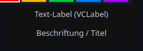
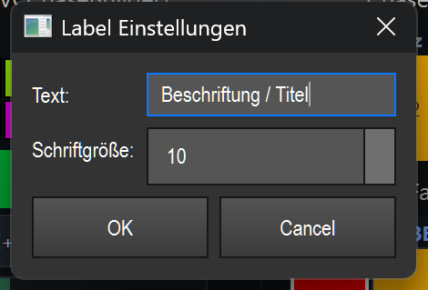

# Text label (`VCLabel`)

> **English version** of [Text-Label (`VCLabel`)](15_text_label.md). LightOS itself speaks German: every button, menu and field is quoted here **exactly as it appears on screen**, with an English translation in brackets the first time it shows up. The screenshots are the same as in the German page.

> A non-interactive caption field that you use to name areas of your Virtual Console or to add headings.

## What it is for & what it controls

The text label controls nothing. It is purely a caption: you put a text on the canvas to group other controls or to give a section a title (e.g. "Front", "Tempo", "Scene 1"). During operation it reacts to no click and triggers no action.

## What it looks like & how to use it during operation

What you see is a rectangular area with a background color (default dark grey `#111111`) and the text centered on it in a light foreground color (default `#cccccc`). The text is centered and wraps automatically if a line is too long (word wrap). The font is "Segoe UI". The default size of the element is 120 × 40 pixels.

During operation (edit mode OFF) the label has **no click zones and no gestures** — no click, double-click or drag triggers anything. It is a pure display.

In edit mode the usual VC actions apply (move, resize, double-click = settings) — see overview (README.en.md).

The foreground and background color can be set via the right-click context menu in edit mode („Vordergrund-/Hintergrund-Farbe" (foreground/background color)).

## Settings

Double-clicking the element (in edit mode) opens the „Label Einstellungen" (label settings) dialog.

| Setting | Meaning | Values/options |
| --- | --- | --- |
| Text | The caption text that is displayed. Shown centered and wrapped if necessary. | Any text (default: „Label") |
| Schriftgröße (font size) | Point size of the font used for the text. | Integer from 6 to 48 (default: 10) |

„OK" applies the text and font size and redraws the element; „Cancel" discards the changes.

Saved (in addition to the shared VC fields) is the font size (`font_size`). The text is stored as the VC's shared caption field.

## Tips & pitfalls

- The label is **passive**: it cannot be bound to an effect and supports **no** MIDI teach and **no** key assignment. Use it only for labeling.
- Keep the text short. If it gets too long, it wraps within the area — enlarge the element or reduce the font size so everything stays readable.
- For good readability you can adapt the foreground and background color to your layout via the right-click menu.
