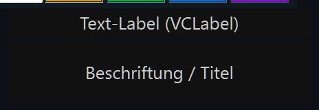
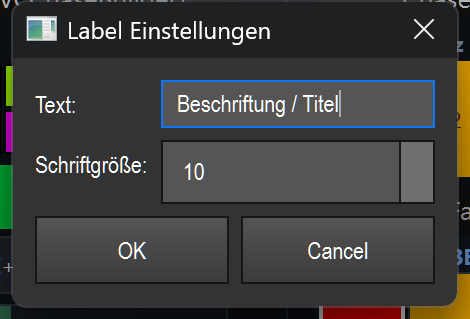

# Text-Label (`VCLabel`)

> Ein nicht-interaktives Beschriftungs-Feld, mit dem du Bereiche deiner Virtuellen Konsole benennst oder Überschriften setzt.

## Wozu & was es steuert

Das Text-Label steuert nichts. Es ist eine reine Beschriftung: Du legst einen Text auf die Canvas, um andere Bedien-Elemente zu gruppieren oder einen Abschnitt zu betiteln (z. B. „Front", „Tempo", „Szene 1"). Im Betrieb reagiert es auf keinen Klick und löst keine Aktion aus.

## So sieht es aus & Bedienung im Betrieb

Sichtbar ist eine rechteckige Fläche mit einer Hintergrundfarbe (Standard dunkelgrau `#111111`) und dem Text zentriert darauf in einer hellen Vordergrundfarbe (Standard `#cccccc`). Der Text wird mittig ausgerichtet und bei zu langer Zeile automatisch umgebrochen (Wort-Umbruch). Schriftart ist „Segoe UI". Die Standardgröße des Elements beträgt 120 × 40 Pixel.

Im Betrieb (Bearbeiten AUS) hat das Label **keine Klickzonen und keine Gesten** — kein Klick, kein Doppelklick, kein Ziehen löst etwas aus. Es ist eine reine Anzeige.

Im Bearbeiten-Modus gelten die gewohnten VC-Aktionen (Verschieben, Skalieren, Doppelklick = Einstellungen) — siehe Übersicht (README.md).

Vorder- und Hintergrundfarbe lassen sich über das Rechtsklick-Kontextmenü im Bearbeiten-Modus setzen („Vordergrund-/Hintergrund-Farbe").

## Einstellungen

Doppelklick auf das Element (im Bearbeiten-Modus) öffnet den Dialog „Label Einstellungen".

| Einstellung | Bedeutung | Werte/Optionen |
| --- | --- | --- |
| Text | Der angezeigte Beschriftungstext. Wird zentriert dargestellt und bei Bedarf umgebrochen. | Beliebiger Text (Standard: „Label") |
| Schriftgröße | Punktgröße der Schrift für den Text. | Ganzzahl von 6 bis 48 (Standard: 10) |

Mit „OK" werden Text und Schriftgröße übernommen und das Element neu gezeichnet; „Cancel" verwirft die Änderungen.

Gespeichert werden (zusätzlich zu den gemeinsamen VC-Feldern) die Schriftgröße (`font_size`). Der Text wird als gemeinsames Caption-Feld der VC gesichert.

## Tipps & Fallen

- Das Label ist **passiv**: Es kann nicht an einen Effekt gebunden werden und unterstützt **kein** MIDI-Teach und **keine** Tastenzuweisung. Nutze es nur zur Beschriftung.
- Halte den Text kurz. Wird er zu lang, bricht er innerhalb der Fläche um — vergrößere das Element oder reduziere die Schriftgröße, damit alles lesbar bleibt.
- Für gute Lesbarkeit kannst du Vorder- und Hintergrundfarbe über das Rechtsklick-Menü an dein Layout anpassen.
