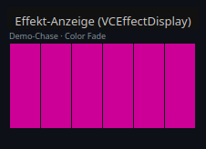
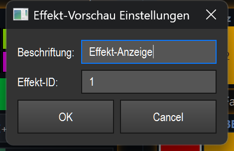

# Effect display (live preview) (`VCEffectDisplay`)

> **English version** of [Effekt-Anzeige (Live-Vorschau) (`VCEffectDisplay`)](16_effekt_anzeige.md). LightOS itself speaks German: every button, menu and field is quoted here **exactly as it appears on screen**, with an English translation in brackets the first time it shows up. The screenshots are the same as in the German page.

> A pure display tile that renders the bound effect live — for matrix effects as a real pixel image — so that you can see on the console at any time what the effect is currently outputting.

## What it is for & what it controls

The effect display is a **monitor, not a control**. It shows the live state of the effect bound to it: for RGB matrices, the individual pixels are shown in a grid (exactly the image the effect is currently putting on the matrix), including gaps in the grid. Non-matrix effects (EFX, chaser, etc.) have no pixel model — for them a placeholder text appears instead.

The display updates about 16 times per second, but only runs while the element is visible. If it is on a hidden bank or covered, the timer switches off and causes no CPU load.

Important: you control **nothing** with this element — it does not trigger an effect, does not change any parameters and does not react to clicks during operation. It only mirrors the state that the engine calculates anyway. (For general VC basics, see the overview in `README.en.md`.)

## What it looks like & how to use it during operation

The element is a compact dark tile (default size 180 × 110 pixels):

- **Header line (top left, small, grey):** name of the bound effect. If an algorithm is known, it is appended — in the screenshot e.g. `Demo-Chase · Color Fade`. Without a binding, the element's caption appears here (default: „Effekt" (effect)).
- **Preview area (center):** the actual live image.
  - **Matrix effect:** a grid of colored boxes — one box per pixel, filled with the effect's current color (in the screenshot, six blue columns of a chase). **Gaps in the grid** (unoccupied cells) are not filled but drawn as a grey dotted frame.
  - **No pixel model available:** centered text **„keine Pixel-Vorschau"** (no pixel preview) (e.g. for EFX/chaser).
  - **No effect bound:** centered text **„Effekt zuweisen (Drag)"** (assign effect (drag)).
- **Running indicator (top right):** a small green square appears exactly when an effect is bound **and** that effect is currently running. If the green square is missing, the effect is not running (draft/stopped) — the preview then keeps the effect turning by itself for demonstration.

**Click / double-click / drag:** During operation the element has **no operating function of its own** — it consumes no mouse gestures and does not react to a click. Only the general VC rules apply: in **edit mode** you move/resize the tile; a **double-click** opens the settings; a **right-click** opens the standard context menu (see overview/`README.en.md`). The bottom edge of the tile is kept free for the resize handle.

## Settings

Double-clicking (in edit mode) opens the **„Effekt-Vorschau Einstellungen"** (effect preview settings) dialog. It has exactly two fields:

| Setting | Meaning | Values/options |
| --- | --- | --- |
| **Beschriftung** (caption) | Display name of the element. Only used in the header line as long as **no** effect is bound; as soon as an effect is bound, the header line shows its name. | Free text. If the field stays empty, the tile keeps its previous caption. |
| **Effekt-ID** (effect ID) | Function ID of the effect to display. Determines which effect is rendered live. | Integer (e.g. `1`). Empty or not a valid number = **no binding** (placeholder „Effekt zuweisen (Drag)"). Alternatively bind by drag (see below). |

## Binding to an effect

The effect display only shows an image if it is bound to an effect. What gets bound is the **function ID** (effect ID) — the element stores only this ID and uses it to read the effect's state live.

How to bind:

- **By drag (recommended):** drag an effect from the library onto the tile (Smart-Drop). The tile itself is usually created via Smart-Drop / the widget gallery anyway — it has **no toolbar button of its own**.
- **By dialog:** enter the **Effekt-ID** in the settings dialog.

Without a binding, the area shows the hint **„Effekt zuweisen (Drag)"** and no preview runs. The live link runs through the same shared interface as for all effect-bound elements (`src/core/engine/effect_live.py`); the effect display, however, only uses its **reading** part (querying pixels/state) — it writes no parameters and triggers no actions.

## Tips & pitfalls

- **Display only:** Don't expect any control. If you want to start the effect or change parameters, you need a different VC element for that (e.g. effect pad, fader, effect editor box) — the effect display only shows the result.
- **No image despite a binding?** Non-matrix effects (EFX, chaser …) have no pixel model — then **„keine Pixel-Vorschau"** appears permanently. That is not an error.
- **Green square = running:** If it is missing, the bound effect is not running. The preview still moves because it keeps a stopped draft turning by itself — that is only a preview animation, not the real live output.
- **Dotted boxes:** Grey dotted fields in the grid are **gaps in the grid** (unoccupied matrix cells), not "black" pixels.
- **Bank/visibility saves CPU:** If the tile is on an inactive bank or covered, the preview pauses automatically. So feel free to add live previews — invisible ones cost no computing time.
- **MIDI/keyboard:** The effect display supports **no** MIDI or key assignment (it cannot be operated). „MIDI Teach…" / „Taste zuweisen…" (assign key…) have no function for this element.
