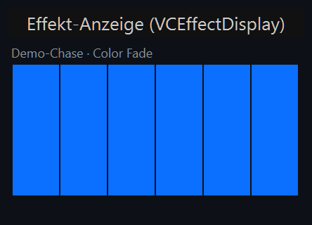
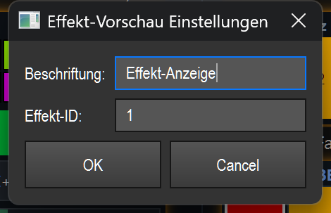

# Effekt-Anzeige (Live-Vorschau) (`VCEffectDisplay`)

> Eine reine Anzeige-Kachel, die den gebundenen Effekt live rendert — bei Matrix-Effekten als echtes Pixel-Bild — damit du auf der Konsole jederzeit siehst, was der Effekt gerade ausgibt.

## Wozu & was es steuert

Die Effekt-Anzeige ist ein **Monitor, kein Bedienelement**. Sie zeigt den Live-Zustand des an sie gebundenen Effekts: Für RGB-Matrizen werden die einzelnen Pixel in einem Raster dargestellt (genau das Bild, das der Effekt aktuell auf die Matrix legt), inklusive Lücken im Grid. Für Nicht-Matrix-Effekte (EFX, Chaser usw.) gibt es kein Pixel-Modell — dort erscheint stattdessen ein Platzhalter-Text.

Die Anzeige aktualisiert sich rund 16-mal pro Sekunde, läuft aber nur, solange das Element sichtbar ist. Liegt es auf einer ausgeblendeten Bank oder ist verdeckt, schaltet der Timer ab und erzeugt keine CPU-Last.

Wichtig: Du steuerst über dieses Element **nichts** — es löst keinen Effekt aus, ändert keine Parameter und reagiert im Betrieb nicht auf Klicks. Es spiegelt nur den Zustand wider, den die Engine ohnehin berechnet. (Allgemeine VC-Grundlagen siehe Übersicht in der `README.md`.)

## So sieht es aus & Bedienung im Betrieb

Das Element ist eine kompakte dunkle Kachel (Standardgröße 180 × 110 Pixel):

- **Kopfzeile (oben links, klein, grau):** Name des gebundenen Effekts. Ist ein Algorithmus bekannt, wird er angehängt — im Screenshot z. B. `Demo-Chase · Color Fade`. Ohne Bindung steht hier die Beschriftung des Elements (Standard: „Effekt").
- **Vorschau-Fläche (Mitte):** das eigentliche Live-Bild.
  - **Matrix-Effekt:** ein Raster aus farbigen Kästchen — ein Kästchen pro Pixel, eingefärbt mit der aktuellen Farbe des Effekts (im Screenshot sechs blaue Spalten eines Chase-Lauflichts). **Lücken im Grid** (nicht belegte Zellen) werden nicht gefüllt, sondern als grau gepunkteter Rahmen gezeichnet.
  - **Kein Pixel-Modell vorhanden:** zentrierter Text **„keine Pixel-Vorschau"** (z. B. bei EFX/Chaser).
  - **Kein Effekt gebunden:** zentrierter Text **„Effekt zuweisen (Drag)"**.
- **Läuft-Indikator (oben rechts):** ein kleines grünes Quadrat erscheint genau dann, wenn ein Effekt gebunden ist **und** dieser gerade läuft. Fehlt das grüne Quadrat, läuft der Effekt nicht (Entwurf/gestoppt) — die Vorschau dreht den Effekt dann zur Demonstration selbst weiter.

**Klick / Doppelklick / Ziehen:** Im laufenden Betrieb hat das Element **keine eigene Bedienfunktion** — es konsumiert keine Maus-Gesten und reagiert auf einen Klick nicht. Es gelten nur die allgemeinen VC-Regeln: Im **Bearbeiten-Modus** verschiebst/skalierst du die Kachel; ein **Doppelklick** öffnet die Einstellungen; ein **Rechtsklick** öffnet das Standard-Kontextmenü (siehe Übersicht/`README.md`). Der untere Rand der Kachel bleibt für den Resize-Griff frei.

## Einstellungen

Doppelklick (im Bearbeiten-Modus) öffnet den Dialog **„Effekt-Vorschau Einstellungen"**. Er hat genau zwei Felder:

| Einstellung | Bedeutung | Werte/Optionen |
| --- | --- | --- |
| **Beschriftung** | Anzeigename des Elements. Wird nur in der Kopfzeile verwendet, solange **kein** Effekt gebunden ist; sobald ein Effekt gebunden ist, zeigt die Kopfzeile dessen Namen. | Freier Text. Bleibt leer das Feld, behält die Kachel ihre bisherige Beschriftung. |
| **Effekt-ID** | Funktions-ID des anzuzeigenden Effekts. Bestimmt, welcher Effekt live gerendert wird. | Ganze Zahl (z. B. `1`). Leer oder keine gültige Zahl = **keine Bindung** (Platzhalter „Effekt zuweisen (Drag)"). Alternativ per Drag binden (siehe unten). |

## Bindung an einen Effekt

Die Effekt-Anzeige zeigt nur dann ein Bild, wenn sie an einen Effekt gebunden ist. Gebunden wird die **Funktions-ID** (Effekt-ID) — das Element speichert ausschließlich diese ID und liest darüber live den Zustand des Effekts.

So bindest du:

- **Per Drag (empfohlen):** Effekt aus der Bibliothek auf die Kachel ziehen (Smart-Drop). Die Kachel selbst entsteht ohnehin meist über Smart-Drop / Widget-Galerie — sie hat **keinen eigenen Toolbar-Knopf**.
- **Per Dialog:** im Einstellungs-Dialog die **Effekt-ID** eintragen.

Ohne Bindung zeigt die Fläche den Hinweis **„Effekt zuweisen (Drag)"** und es läuft keine Vorschau. Die Live-Wirkung läuft über dieselbe gemeinsame Naht wie bei allen effektgebundenen Elementen (`src/core/engine/effect_live.py`); die Effekt-Anzeige nutzt davon aber nur den **lesenden** Teil (Pixel/Zustand abfragen) — sie schreibt keine Parameter und löst keine Aktionen aus.

## Tipps & Fallen

- **Reine Anzeige:** Erwarte keine Steuerung. Wenn du den Effekt starten oder Parameter ändern willst, brauchst du dafür ein anderes VC-Element (z. B. Effekt-Pad, Fader, Effekt-Editor-Box) — die Effekt-Anzeige zeigt das Ergebnis nur an.
- **Kein Bild trotz Bindung?** Bei Nicht-Matrix-Effekten (EFX, Chaser …) gibt es kein Pixel-Modell — dann erscheint dauerhaft **„keine Pixel-Vorschau"**. Das ist kein Fehler.
- **Grünes Quadrat = läuft:** Fehlt es, läuft der gebundene Effekt nicht. Die Vorschau bewegt sich trotzdem, weil sie einen gestoppten Entwurf selbst weiterdreht — das ist nur eine Vorschau-Animation, nicht der echte Live-Ausgang.
- **Gepunktete Kästchen:** Grau gepunktete Felder im Raster sind **Lücken im Grid** (nicht belegte Matrix-Zellen), keine „schwarzen" Pixel.
- **Bank/Sichtbarkeit spart CPU:** Liegt die Kachel auf einer inaktiven Bank oder ist verdeckt, pausiert die Vorschau automatisch. Lege Live-Vorschauen also bedenkenlos an — unsichtbare kosten keine Rechenzeit.
- **MIDI/Tastatur:** Die Effekt-Anzeige unterstützt **keine** MIDI- oder Tastenzuweisung (sie ist nicht bedienbar). „MIDI Teach…" / „Taste zuweisen…" sind für dieses Element ohne Funktion.
