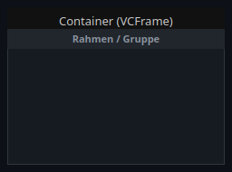
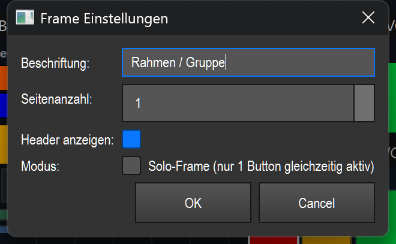

# Container (frame/group) (`VCFrame`)

> **English version** of [Container (Rahmen/Gruppe) (`VCFrame`)](17_container.md). LightOS itself speaks German: every button, menu and field is quoted here **exactly as it appears on screen**, with an English translation in brackets the first time it shows up. The screenshots are the same as in the German page.

> A rectangular holder for other VC elements — for grouping, visually separating and (via pages/tabs) switching whole groups of elements page by page.

## What it is for & what it controls

The container does not control any light itself. It is a **holder**: you put any other VC elements (buttons, sliders, color tiles, etc.) into it and can then treat them as a group that belongs together.

Three functions make it useful:

- **Grouping & separating** — a set-off frame with a header line (header) keeps related controls visually together.
- **Pages / tabs** — the container can have up to 10 pages. Each child element belongs to one page; with the tabs in the header line you show only the elements of one page at a time. This gives you several sets of elements in the same space.
- **Solo mode** — makes sure that only **one** button inside the container is ever active at a time; when you press a button, the others are switched off automatically (classic radio/solo logic).

## What it looks like & how to use it during operation

What you see is a filled rectangle (default background dark, `#161b22`) with a thin border. At the top — if enabled — sits a **header line (header)** 22 px high (`#21262d`). In the screenshot it carries the caption „Rahmen / Gruppe" (frame / group). Below it is the **content area** where the child elements are placed.

What the header line looks like depends on the number of pages:

- **1 page** → the header line shows the container's **caption**, centered (bold).
- **Several pages** → the header line shows **tabs** side by side, labeled `P1`, `P2`, … The active tab has a blue background (`#0d4f8b`) and light text; the others are grey.

Click zones and gestures:

- **Click on a tab** (in the header line, only with more than one page) → switches to that page. All child elements of the selected page are shown, those of the other pages are hidden. Switching pages works **in edit mode too**, so that you can edit the elements of every page.
- **Solo mode active** → if you press a button inside the container during operation, the container automatically switches off all other currently active (pressed) buttons in the same box. So only one button ever stays active. If the frame is in solo mode, it is also drawn with a **red border** (`#e63946`, 2 px) instead of the normal grey one.
- **Effect highlight (group as a unit)** → if the container or one of its elements belongs to a selected/tapped effect, the whole container lights up as a unit with an **amber border** (`#ff9500`, 3 px). This is only a visual highlight.

In **edit mode** you add content:

- **Right-click** inside the container opens the context menu with the submenu **„Widget hinzufügen"** (add widget) (a list of all VC element types except the container itself — a container cannot be placed inside a container). The chosen element is placed in the middle of the content area of the **current page**.
- **Snap-in / snap-out** — if you drag an existing element onto the container in edit mode, it becomes a **child** of the container (snap-in): from then on it sits on the current page and moves together with the container; deleting it is also handed over to the container. If you drag it out again, it goes back onto the canvas (snap-out). If the container is empty, it shows the hint **„Rechtsklick → Widget hinzufügen"** (right-click → add widget) in edit mode.
- **Double-click** on the container (not on a child) → opens the settings.

## Settings

The „Frame Einstellungen" (frame settings) dialog contains exactly these fields:

| Setting | Meaning | Values/options |
| --- | --- | --- |
| Beschriftung (caption) | Text shown centered in the header line when there is **one** page. With several pages, the tabs carry fixed names `P1…Pn` instead. | free text (empty = the previous caption is kept) |
| Seitenanzahl (number of pages) | Number of pages/tabs of the container. With `1` the header line shows the caption; from `2` on, switchable tabs appear. | Integer 1–10 (default 1) |
| Header anzeigen (show header) | Shows or hides the top header line (with caption or tabs). Without a header the content area starts at the very top — and then there are **no tabs** for switching pages any more. | On / off (default on) |
| Modus → Solo-Frame (mode → solo frame) | „Solo-Frame (nur 1 Button gleichzeitig aktiv)" (solo frame, only 1 button active at a time): when a button is pressed, the other active buttons in the container are switched off automatically. When active, you can recognize it by the red border. | On / off (default off) |

You don't set the container's background and foreground color in this dialog but via the right-click context menu („Vordergrund-Farbe" (foreground color) / „Hintergrund-Farbe" (background color)).

Saved are the number of pages, header visibility, solo mode and all contained child elements together with their page assignment (each child remembers which page it is on). On loading, only the current page is shown.

## Tips & pitfalls

- **Header off = no tabs:** If you switch off „Header anzeigen", the tabs disappear too. You can still have several pages, but during operation you can **no longer switch between them** (there is no click zone for it). So several pages need a visible header.
- **No container inside a container:** The „Widget hinzufügen" submenu deliberately lists no further container — containers cannot be nested.
- **Mind the page when inserting:** With „Widget hinzufügen" and with snap-in, an element always lands on the **currently visible page**. If you want it on another page, first switch there by tab (also works in edit mode), then insert it.
- **Solo only affects buttons in the container:** The solo logic only switches pressed **buttons** within the same container off against each other — other element types (sliders, color tiles, etc.) are not affected.
- **Deletion is handled by the container:** If you delete an element inside the container (context menu „Löschen" (delete)), the container takes care of removing it. This can be undone with the canvas undo function (Strg+Z, where **Strg** = Ctrl).
- The container itself **cannot** be bound to an effect and supports **no** MIDI/key teach — it is purely a holder. For general VC operation (edit mode, creating elements, context menu, banks), see the overview (README.en.md).
