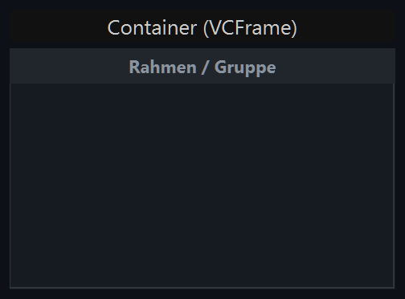
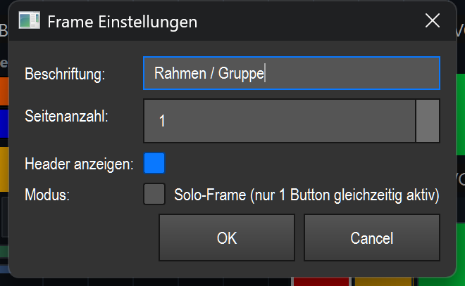

# Container (Rahmen/Gruppe) (`VCFrame`)

> Ein rechteckiger Behälter, der andere VC-Elemente aufnimmt — zum Gruppieren, optisch Abtrennen und (über Seiten/Tabs) seitenweisen Umschalten ganzer Element-Gruppen.

## Wozu & was es steuert

Der Container steuert selbst kein Licht. Er ist ein **Behälter**: Du legst beliebige andere VC-Elemente (Buttons, Slider, Farb-Kacheln usw.) hinein und behandelst sie damit als zusammengehörige Gruppe.

Drei Funktionen machen ihn nützlich:

- **Gruppieren & abgrenzen** — ein abgesetzter Rahmen mit Kopfzeile (Header) hält zusammengehörige Bedienelemente optisch beisammen.
- **Seiten / Tabs** — der Container kann bis zu 10 Seiten haben. Jedes Kind-Element gehört zu einer Seite; über die Tabs in der Kopfzeile blendest du jeweils nur die Elemente einer Seite ein. So bekommst du mehrere Element-Sätze auf demselben Platz.
- **Solo-Modus** — sorgt dafür, dass innerhalb des Containers immer nur **ein** Button gleichzeitig aktiv ist; beim Drücken eines Buttons werden die anderen automatisch ausgeschaltet (klassische Radio-/Solo-Logik).

## So sieht es aus & Bedienung im Betrieb

Sichtbar ist ein gefülltes Rechteck (Standard-Hintergrund dunkel, `#161b22`) mit dünnem Rahmen. Oben sitzt — wenn aktiviert — eine **Kopfzeile (Header)** mit Höhe 22 px (`#21262d`). Im Screenshot trägt sie die Beschriftung „Rahmen / Gruppe". Darunter liegt der **Inhaltsbereich**, in dem die Kind-Elemente platziert werden.

Wie die Kopfzeile aussieht, hängt von der Seitenanzahl ab:

- **1 Seite** → in der Kopfzeile steht zentriert die **Beschriftung** des Containers (fett).
- **Mehrere Seiten** → die Kopfzeile zeigt nebeneinander **Tabs** mit den Beschriftungen `P1`, `P2`, … Der aktive Tab ist blau hinterlegt (`#0d4f8b`) und hell beschriftet, die übrigen sind grau.

Klickzonen und Gesten:

- **Klick auf einen Tab** (in der Kopfzeile, nur bei mehr als einer Seite) → wechselt auf die zugehörige Seite. Alle Kind-Elemente der gewählten Seite werden eingeblendet, die der anderen Seiten ausgeblendet. Der Seitenwechsel funktioniert **auch im Bearbeiten-Modus**, damit du die Elemente jeder Seite bearbeiten kannst.
- **Solo-Modus aktiv** → drückst du im Betrieb einen Button innerhalb des Containers, schaltet der Container alle anderen gerade aktiven (gedrückten) Buttons in derselben Box automatisch aus. Es bleibt also immer nur ein Button aktiv. Ist der Rahmen im Solo-Modus, wird er zusätzlich mit einem **roten Rahmen** (`#e63946`, 2 px) gezeichnet statt mit dem normalen grauen.
- **Effekt-Highlight (Gruppe als Einheit)** → gehört der Container bzw. eines seiner Elemente zu einem ausgewählten/angetippten Effekt, leuchtet der ganze Container als Einheit mit einem **amberfarbenen Rahmen** (`#ff9500`, 3 px) auf. Das ist nur eine optische Hervorhebung.

Im **Bearbeiten-Modus** fügst du Inhalte hinzu:

- **Rechtsklick** im Container öffnet das Kontextmenü mit dem Untermenü **„Widget hinzufügen"** (Liste aller VC-Elementtypen außer dem Container selbst — ein Container lässt sich nicht in einen Container legen). Das gewählte Element wird mittig im Inhaltsbereich der **aktuellen Seite** abgelegt.
- **Snap-in / Snap-out** — ziehst du im Bearbeiten-Modus ein bestehendes Element auf den Container, wird es zum **Kind** des Containers (Snap-in): Es liegt fortan auf der aktuellen Seite und wird gemeinsam mit dem Container verschoben; auch das Löschen wird an den Container übergeben. Ziehst du es wieder heraus, landet es zurück auf der Canvas (Snap-out). Ist der Container leer, zeigt er im Bearbeiten-Modus den Hinweis **„Rechtsklick → Widget hinzufügen"**.
- **Doppelklick** auf den Container (nicht auf ein Kind) → öffnet die Einstellungen.

## Einstellungen

Der Dialog „Frame Einstellungen" enthält genau diese Felder:

| Einstellung | Bedeutung | Werte/Optionen |
| --- | --- | --- |
| Beschriftung | Text, der bei **einer** Seite in der Kopfzeile zentriert angezeigt wird. Bei mehreren Seiten tragen die Tabs stattdessen feste Namen `P1…Pn`. | freier Text (leer = bisherige Beschriftung bleibt erhalten) |
| Seitenanzahl | Anzahl der Seiten/Tabs des Containers. Bei `1` zeigt die Kopfzeile die Beschriftung; ab `2` erscheinen umschaltbare Tabs. | Ganzzahl 1–10 (Standard 1) |
| Header anzeigen | Blendet die obere Kopfzeile (mit Beschriftung bzw. Tabs) ein oder aus. Ohne Header beginnt der Inhaltsbereich ganz oben — dann gibt es **keine Tabs** zum Seitenwechsel mehr. | An / Aus (Standard An) |
| Modus → Solo-Frame | „Solo-Frame (nur 1 Button gleichzeitig aktiv)": Schaltet beim Drücken eines Buttons die übrigen aktiven Buttons im Container automatisch aus. Aktiv erkennbar am roten Rahmen. | An / Aus (Standard Aus) |

Hintergrund- und Vordergrundfarbe des Containers stellst du nicht in diesem Dialog ein, sondern über das Rechtsklick-Kontextmenü („Vordergrund-Farbe" / „Hintergrund-Farbe").

Gespeichert werden Seitenanzahl, Header-Sichtbarkeit, Solo-Modus sowie alle enthaltenen Kind-Elemente samt ihrer Seitenzuordnung (jedes Kind merkt sich, auf welcher Seite es liegt). Beim Laden wird nur die aktuelle Seite eingeblendet.

## Tipps & Fallen

- **Header aus = keine Tabs:** Schaltest du „Header anzeigen" ab, verschwinden auch die Tabs. Du kannst dann zwar mehrere Seiten haben, aber im Betrieb **nicht mehr zwischen ihnen umschalten** (es gibt keine Klickzone dafür). Mehrere Seiten brauchen also einen sichtbaren Header.
- **Kein Container im Container:** Das Untermenü „Widget hinzufügen" listet bewusst keinen weiteren Container — Container lassen sich nicht verschachteln.
- **Seite beachten beim Einfügen:** Per „Widget hinzufügen" und per Snap-in landet ein Element immer auf der **aktuell sichtbaren Seite**. Willst du es auf eine andere Seite legen, erst per Tab dorthin wechseln (geht auch im Bearbeiten-Modus), dann einfügen.
- **Solo wirkt nur auf Buttons im Container:** Die Solo-Logik schaltet nur die gedrückten **Buttons** innerhalb desselben Containers gegeneinander aus — andere Elementtypen (Slider, Farb-Kacheln usw.) sind davon nicht betroffen.
- **Löschen geht mit:** Löschst du ein Element im Container (Kontextmenü „Löschen"), übernimmt der Container das Entfernen. Das ist über die Canvas-Undo-Funktion (Strg+Z) rückgängig zu machen.
- Der Container selbst lässt sich **nicht** an einen Effekt binden und unterstützt **kein** MIDI-/Tasten-Teach — er ist reiner Behälter. Allgemeine VC-Bedienung (Bearbeiten-Modus, Anlegen, Kontextmenü, Banks) siehe Übersicht (README.md).
