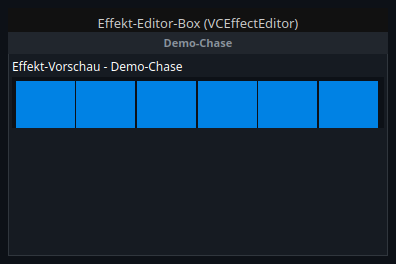
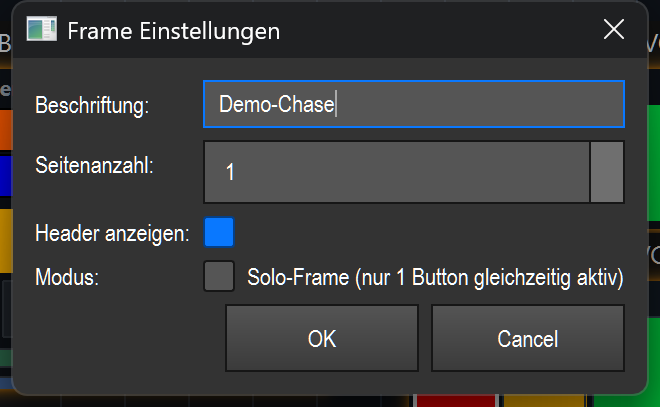

# Effect editor box (`VCEffectEditor`)

> **English version** of [Effekt-Editor-Box (`VCEffectEditor`)](18_effekt_editor.md). LightOS itself speaks German: every button, menu and field is quoted here **exactly as it appears on screen**, with an English translation in brackets the first time it shows up. The screenshots are the same as in the German page.

> A movable box that shows a live miniature preview of an effect and, below it, provides the controls you pick from the effect's controllable aspects — the "strip" for a single effect.

## What it is for & what it controls

The effect editor box bundles everything you need for **one** effect in a single movable box:

- **top:** a small **live preview** of the effect in the real fixture geometry (columns × rows as in the bound effect) — you see the running pattern without looking at the stage.
- **below:** the **controls** that you select from the effect's controllable aspects when creating the box (tempo/brightness/colors/movement/individual parameters/actions) — depending on the aspect as a fader, knob, selection or XY field. They act immediately on the running effect.

You use the box when you don't just want to start an effect but **fine-tune it during the show** (faster/slower, brighter/darker, bigger/smaller), with a preview to check it at the same time.

Important: the box is a specialized variant of the frame container (see the overview in README.en.md). It is created **only** for effects with real live parameters — typically **matrix/EFX effects**. For types without live parameters (e.g. a plain scene/chaser) no editor strip is built.

## What it looks like & how to use it during operation

From top to bottom, the box has three areas:

1. **Header bar (top):** a dark bar with the **effect name** as its caption („Demo-Chase“ in the picture). The name is taken over from the effect automatically when binding. With several pages, the header shows the page tabs `P1`, `P2` … instead; with only one page, the centered name.
2. **Preview strip (middle):** labeled „**Effekt-Vorschau – <Name>**“ (effect preview – *name*). It shows the running effect pattern as a grid of tiles in the effect's real column/row geometry (six cells glowing green in the picture). The preview is a pure display — it only animates while the box is visible (on another bank/page the animation timer stops, which saves CPU).
3. **Control area (bottom):** the faders/buttons you chose (two faders in the picture, each with a percentage readout „62 %“ on top). Each element controls one live aspect of the effect.

**Using it during operation (edit mode OFF):**

| Zone / gesture | What happens |
|---|---|
| **Drag a fader** (vertically) | Sets the associated effect parameter absolutely (0–100 %). The result is visible immediately, because the effect reads the fresh value every frame. |
| **Click a page tab** `P1/P2…` | Switches the box's page (only if several pages are configured). |
| **Click in the preview strip** | No function — display only. |
| **Click in the header / an empty area** | No control function during operation. |

**In edit mode (ON):** You can freely **move** the box and **resize** it at the bottom right corner; the faders scale with the box height. You can drag the box into/out of other frames (snap-in/snap-out). Double-click opens the settings; right-click opens the context menu (see README.en.md).

> Note: The box has **no toolbar button of its own**. It is created via **Smart-Drop** — you drag an effect from the library onto the canvas, and for suitable effects LightOS automatically creates this box with its preview and immediately opens the control selection.

## Settings

Double-click (or right-click → „Einstellungen…“ (settings…)) opens the **„Frame Einstellungen“** (frame settings) dialog — the box inherits it from the frame base class.

| Setting | Meaning | Values/options |
|---|---|---|
| **Beschriftung** (caption) | Text in the header. When an effect is bound it is set to the effect name automatically; you can override it here. | free text („Demo-Chase“ in the picture) |
| **Seitenanzahl** (number of pages) | Number of pages/tabs of the box. With more than 1, tabs `P1…Pn` appear at the top that you page through; each child widget belongs to one page. | Integer **1–10** (default 1) |
| **Header anzeigen** (show header) | Shows or hides the top title/tab bar. When hidden, the content moves up. | On / off (default: on) |
| **Modus** (mode) | „**Solo-Frame**“: only **one** button in this box can be active at a time — when a button is pressed, the others in the box are deactivated automatically. Irrelevant for faders only. | Checkbox „Solo-Frame (nur 1 Button gleichzeitig aktiv)“ (solo frame, only 1 button active at a time) (default: off) |

> The dialog controls the **container** (caption, pages, header, solo). The actual effect binding and the preview are set via Smart-Drop when the box is created and are saved/loaded along with it (see next section). You set the **live parameters** of the individual faders on each fader itself, not in this dialog.

## Binding to an effect

The box itself stores the **effect ID** (`effect_id`) and builds its content from it:

- **Binding:** You don't bind by hand — the binding is created automatically on **Smart-Drop** (dragging an effect from the library onto the canvas). LightOS checks the target effect: only effects with an **algorithm and live parameters** (matrix/EFX) get the box with preview and control selection.
- **What happens on binding:** The header takes over the effect name; the preview is set to the effect's real geometry (columns/rows, colors, speed). **No** fixed controls are built automatically — instead a **selection card** opens (the same checkbox card as with Smart-Drop, available again later at any time via the **⚙ button** in the header). Filtered to the effect's capabilities, it shows the live-controllable **aspects** (tempo/brightness/colors/movement/individual parameters/actions) as checkboxes; each checked aspect is built into the box as a matching control (fader/knob/selection/XY field).
- **Without a usable binding:** For effects without live parameters (e.g. scene/chaser) **no** preview strip and **no** control selection are built — the box stays empty or is not created as an editor in the first place.
- **Live link:** The controls act through the shared effect interface (`src/core/engine/effect_live.py`): a fader value (0–100 %) is mapped linearly onto the parameter's real value range and applied immediately. Only the effect ID is saved — the controls always act on the currently bound effect.

Deeper live access (additional parameters/actions) is not on the box itself but on the **bound child fader**, via its context menu („⚡ Live-Parameter…“ (live parameters…), „↔ Widget ändern…“ (change widget…) — see README.en.md).

## Tips & pitfalls

- **No toolbar button:** The box only exists via Smart-Drop. If you don't want a box but just a single fader or knob, choose that element when dropping or build it by hand.
- **The preview only runs while visible:** If the box is on an inactive bank/page, the preview freezes (timer off). That is intended and saves computing time — the **control** via the faders is not affected.
- **You choose the controls yourself:** When creating the box (and later via the **⚙ button**) you tick in the selection card which aspects you want to control live — there is no fixed "just three faders" automatism. You can reach further parameters/actions via the context menu of the individual child elements („⚡ Live-Parameter…“).
- **Solo only affects buttons:** Solo mode acts on buttons in the box, not on faders. In a box with only faders it has no effect.
- **Hiding the header saves height:** If you need no title/tabs, switch off „Header anzeigen“ — the preview then moves right to the top.
- **Resizing changes the fader height:** When you enlarge/shrink the box, the faders grow/shrink with it. Make the box tall enough for the faders to stay easy to use.
- **MIDI/keyboard:** The box as a whole offers **no** MIDI teach and **no** key assignment. Assign the individual **faders** instead (their effect binding uses the same interface for MIDI too) — see the fader documentation and README.en.md.
